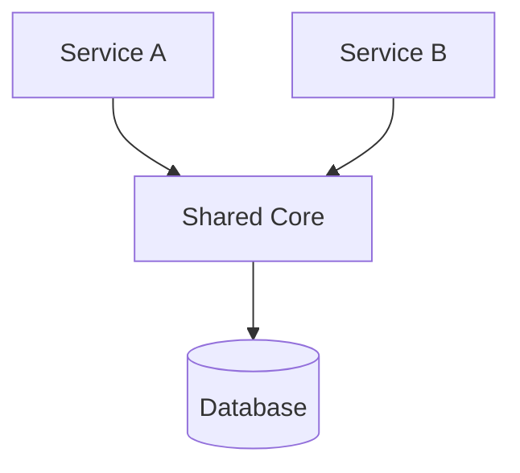
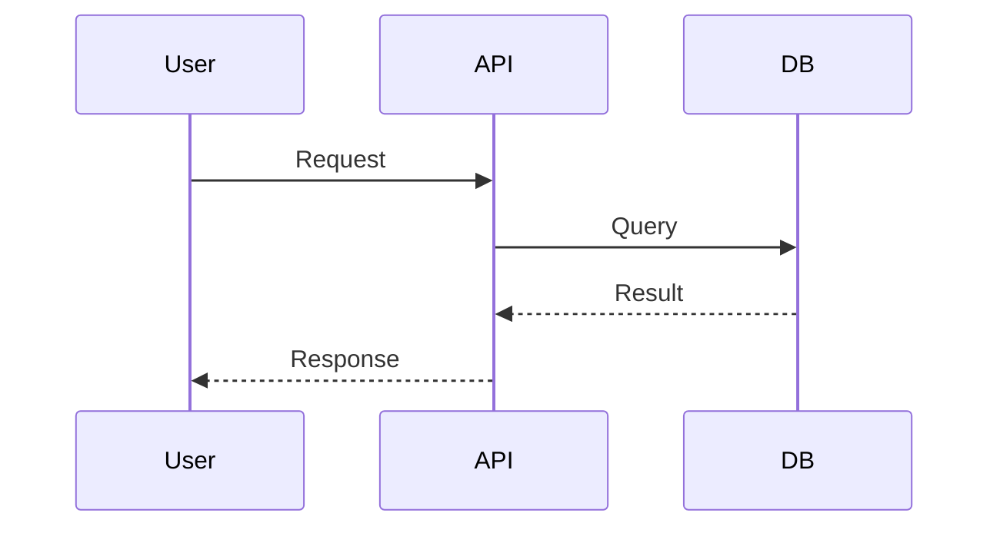

# Documentation Standards

This skill defines the mandatory documentation patterns for the TraceData project. All documents (ADRs, Architecture Overviews, Guides) must follow these principles to ensure production-grade clarity and maintainability.

## 1. Technical Tone & Voice
Documentation should be written from the perspective of a **Senior Software Architect**.
- **Tone**: Formal, declarative, and precise.
- **Conciseness**: Avoid fluff. Use bullet points for lists and short, clear sentences.
- **Self-Explanatory**: Definitions and patterns should be understandable by a mid-level engineer without external context.
- **NO Informal Elements**: 
    - No smileys or emojis (e.g., ✅, 🚀, ⚠️).
    - No informal abbreviations.
    - No horizontal rulers (`---`) for section separation (use Markdown headers `##`, `###` instead).

## 2. Visual Explanation (MermaidJS)
Complex concepts, data flows, and architectures **MUST** be explained using diagrams where applicable.
- **Syntax**: Use **MermaidJS** within Markdown fenced code blocks.
- **Placement**: Place diagrams immediately following the problem statement or preceding the technical deep-dive.

### Example: Component Diagram

### Example: Sequence Diagram

## 3. Structure & Formatting
- **Hierarchy**: Use clear H1 and H2 headers. Avoid H3 unless necessary for sub-components.
- **Tables**: Use tables for comparisons (e.g., Tradeoffs, Tooling alternatives).
- **Code Blocks**: Always specify the language (e.g., `python`, `mermaid`, `sql`).
- **Standard Header**: All ADRs and Design Docs should include:
    - **Status** (Draft, Accepted, Deprecated)
    - **Context** (The Problem)
    - **Decision** (The Solution)
    - **Rationale** (The Why)

## 4. Maintenance
- Documentation is code. Update diagrams and text in the same PR as the functional changes.
- Ensure all internal links are relative and verified.
