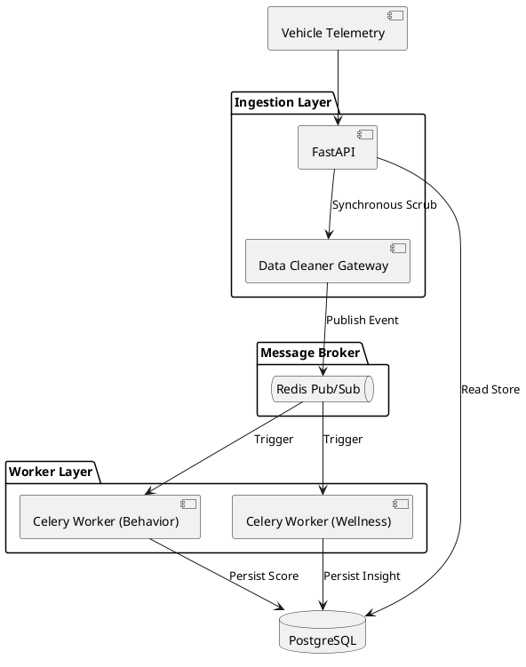
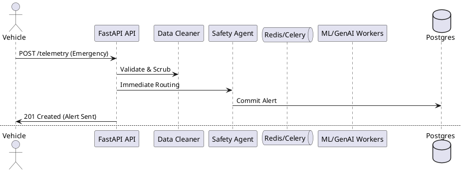

# TraceData Architecture Constraints

This module defines the core stack, data pipelines, and architectural boundaries for the TraceData project.

## Core Stack

- **Backend**: Python (FastAPI + LangGraph) — Agentic AI Middleware Monolith
- **Frontend**: **Next.js 16 (App Router)**
- **Styling**: **Tailwind CSS v4** + **Shadcn UI**
- **Language**: **TypeScript 5** (Strict mode)
- **Data Logic**: **TanStack Table (v8)** for data-heavy views, **Recharts** for telemetry charts
- **Database**: PostgreSQL with pgvector (semantic search)
- **Messaging**: Redis 7 (Pub/Sub) + Celery (Async Task Queue)
- **Real-time**: WebSocket (Critical safety alerts)

### High-Level Architecture



## Monorepo & Service Isolation

TraceData is structured as a **Monorepo** managed by `uv` workspaces:

- **Root Directory**: Contains the workspace definition (`pyproject.toml`) and the consolidated lockfile (`uv.lock`).
- **Backend Service**: `backend/` (formerly `ai-agents/`)
  - Follows a strict **package-first modular monolith** structure.
  - Service Entry: Always exposed via `app.main:app`.
  - Shared Modules: Internal logic split into `agents/`, `api/`, `models/`, `schemas/`, and `services/`.
- **Frontend Service**: `frontend/` (Next.js Application)

## Multi-Tenancy (MANDATORY)

Every data layer must include and enforce `tenant_id`:

- **Telematics Data**: GPS, speed, RPM pings tagged with tenant
- **Driver Profiles**: Isolated per tenant
- **Trip Logs**: Segregated by tenant_id
- **Frontend Data Flow**: Verify `tenant_id` on every API call; never process data without it

**In API routes:**

```typescript
// src/pages/api/drivers.ts
const tenantId = req.headers["x-tenant-id"] || getUserTenant(token);
if (!tenantId)
  return res.status(403).json({ error: "Tenant context required" });
// Query with WHERE tenant_id = tenantId
```

### Telematics (Event-Driven Architecture)

TraceData uses a **Redis-backed EDA** for decoupling and asynchronous processing:

1.  **Ingestion (FastAPI)**: 
    - Telemetry is POSTed to `/api/v1/telemetry`.
    - **Data Cleaner Gateway** (Agent 1) synchronously validates and scrubs PII (ACL pattern).
2.  **Event Handoff**:
    - FastAPI publishes an event (e.g., `TripEnded`) to **Redis**.
    - FastAPI returns `HTTP 202 Accepted` immediately (Asynchronous Request-Reply).
3.  **Background Processing (Celery)**:
    - **Behavior Evaluation Agent** (Agent 4) and **Driver Wellness Analyst** (Agent 5) consume events.
    - Heavy ML (XGBoost) and Generative AI tasks run in background workers.
4.  **Persistence**:
    - All agents write final enriched state (Trip Scores, Coaching) to PostgreSQL.

**Execution Paths:**

- **Background Path**: Routine telemetry processed via Redis/Celery queue.
- **Safety Fast-Path**: Critical events (Emergency Pings) bypass the queue for direct execution by the **Safety Agent**.

### Ingestion Sequence (Fast-Path vs Background)



**Optimized 5-Agent Architecture**

| Agent | Responsibility | DDD Context |
| :--- | :--- | :--- |
| **Data Cleaner Gateway** | Schema validation, PII scrubbing | Anti-Corruption Layer (ACL) |
| **Deterministic Orchestrator** | Event routing & state management | LangGraph State Machine |
| **Safety Agent** | Real-time accident/emergency response | Fast-Path (Low Latency) |
| **Behavior Evaluation Agent** | XGBoost scoring, AIF360 fairness | `TripScore` Bounded Context |
| **Driver Wellness Analyst** | GenAI coaching & sentiment analysis | Driver Profile Context |

### Unstructured Driver Input

- **Source**: Driver app (free-text reviews, feedback, formal appeals)
- **Routing**: Goes through Ingestion Quality Agent
- **Storage**: PostgreSQL with pgvector for semantic search

### Frontend Integration

- Never assume data is immediately available; handle async loading states
- Telematics batches arrive every 4–10 minutes; refresh metrics accordingly
- Safety-critical alerts come via WebSocket from Kafka; display immediately with sub-500ms latency

## Context Enrichment (MCP)

- **Input**: Raw GPS coordinates, timestamps
- **Output**: Rich geographic data (Place Name, Topology, Weather, Traffic)
- **Tool Service**: Returns in < 2 seconds; used by Behavior, Safety, Orchestrator agents
- **Frontend Use**: Display location context and weather conditions in trip details, driver profiles

## Safety Intervention (Multi-Level)

Evaluated by Safety Agent on Critical Events:

- **Level 1 (Minor)**: App notification / in-cab reminder
- **Level 2 (Moderate)**: Formal message logged and sent to driver
- **Level 3 (Serious)**: Escalation/call to Fleet Manager

**Frontend**: Display safety levels with corresponding urgency (red for Level 3, orange for Level 2, yellow for Level 1)

## Driver Encouragement & Profiling

- **Objective**: The system must go beyond penalization to build an encouragement profile. Raw telemetry points must be aggregated to detect positive driving patterns.
- **Reasoning**: The AI (Orchestrator or Coaching Agent) uses these aggregated data points and contextual anomalies to reason autonomously, deciding when to boost encouragement scores.

## Internal State & Persistence

- **PostgreSQL (`pgvector`)**: Mandatory for semantic search against historical profiles and text submissions.
- **Table Segregation**: Each processing agent writes its outputs to distinct tables, correlated by `trip_id` and isolated by `tenant_id`.

## AI Security & Guardrails

- **LLM Rate Limiting**: Strict per-driver/per-tenant token quotas
- **Prompt Sanitization**: Explicit templating; sanitize all user input before passing to agents
- **Fairness Monitoring**: Track Statistical Parity Difference (SPD); alert if drift > 0.2
- **Data Privacy**: RBAC (JWT) for auth, AES-256 encryption for driver feedback
