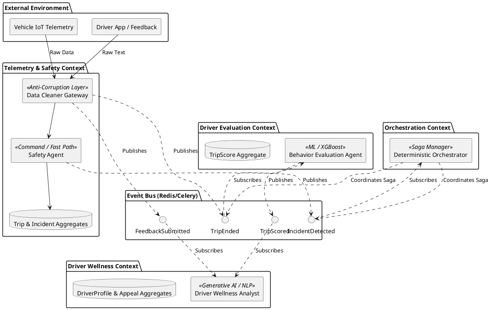
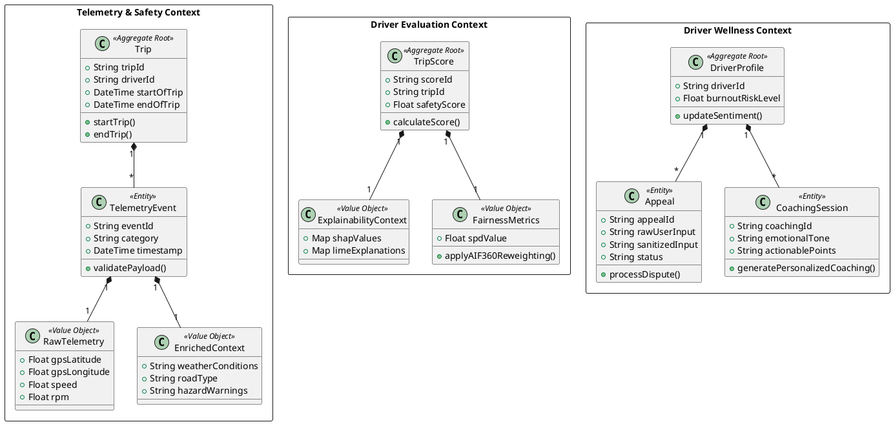

# TraceData Domain-Driven Design (DDD)

This document details the strategic and tactical DDD patterns applied to the TraceData system, ensuring clear boundaries, robust aggregates, and scalable event-driven choreography.

## Strategic Design: Context Map

The TraceData system is divided into four primary Bounded Contexts, coordinated via an asynchronous event bus and managed by a deterministic orchestrator.

### Context Map Diagram

### Strategic Patterns Applied

1.  **Bounded Contexts**:
    - **Telemetry & Safety**: Real-time ingestion and critical alerting.
    - **Driver Evaluation**: ML fairness and predictive scoring.
    - **Driver Support & Wellness**: Generative AI/NLP for coaching and appeals.
2.  **Anti-Corruption Layer (ACL)**: The **Data Cleaner Gateway** sanitizes external input before it reaches the core domain.
3.  **Domain Events (Choreography)**: Decoupled communication via `TripEnded`, `TripScored`, etc.
4.  **Saga Management**: The **Deterministic Orchestrator** manages complex, multi-step workflows (e.g., severe safety escalations) using compensations where necessary.

---

## Tactical Design: Domain Schema

Tactical DDD focuses on the internal structure of each context, defining the lifecycle of data through Aggregates, Entities, and Value Objects.

### Tactical Schema Diagram

### Tactical Patterns Applied

1.  **Aggregate Roots**:
    - `Trip`: Controls the telemetry lifecycle.
    - `TripScore`: Separates heavy ML scoring from ingestion to prevent database lock contention.
    - `DriverProfile`: Central hub for historical driver state and sentiment.
2.  **Entities**: Objects with identity and state transitions (e.g., `Appeal`, `TelemetryEvent`).
3.  **Value Objects**: Immutable attributes attached to entities (e.g., `RawTelemetry`, `FairnessMetrics`).
