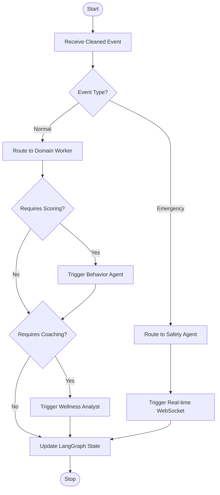

# TraceData Implementation Patterns

This module defines the project structure, component standards, and integration patterns for AI agents.

```
d:/learning-projects/tracedata-ai-monorepo/
├── pyproject.toml                   # Root Workspace Manifest (uv)
├── uv.lock                          # Consolidated Workspace Lockfile
├── backend/                         # Agentic AI Middleware (formerly ai-agents)
│   ├── app/                         # CORE PACKAGE
│   ├── core/                        # Engine & Config (DB)
│   ├── domains/                     # Bounded Contexts (Fleet, Safety, etc.)
│   └── scripts/                     # Tooling (Simulator, Seeding)
└── frontend/                        # Next.js Application
```

## Dependency Management (uv Workspace)

TraceData uses **uv workspaces** for lightning-fast, monorepo-wide dependency management.

1.  **Unified Locking**: The `uv.lock` at the **root** is the single source of truth for the entire monorepo. Never maintain separate lockfiles in sub-services.
2.  **Explicit Scopes**: Manage dependencies from the root using `uv add --package <name>`.
3.  **CI Synchronization**: Always use `uv sync --frozen` in CI to ensure bit-perfect environment reproduction.

## Database Seeding (Nuke & Pave)

To maintain a clean state during development, we use the **Nuke & Pave** pattern:

1.  **Idempotency**: Seeding scripts must check `if count == 0` for all tables.
2.  **RESET_DB Toggle**: Controlled via environment variable. 
    - `RESET_DB=true`: Drops the schema and re-seeds from `seed_data.json`.
    - `RESET_DB=false`: Skips seeding if data exists (Safe for prod).
3.  **External Data**: All mock data must reside in JSON files, never hardcoded in Python logic.

Every Python module in the `app/` package must follow the self-documenting pattern:

1. **Module Docstrings**: Clear explanation of the file's purpose at the top.
2. **Standard Docstrings**: All classes and functions must have Google-style docstrings (`Args`, `Returns`).
3. **Pydantic Field Metadata**: Use `Field(..., description="...")` for all API-facing schemas.

```python
# Example: app/schemas/telemetry.py
class Telemetry(BaseModel):
    """Schema for vehicle telemetry ingestion."""
    event_id: str = Field(..., description="UUID for the event")
```

## Component Anatomy

Every component should follow this structure:

```typescript
'use client';

import { FC, ReactNode } from 'react';
import { cn } from '@/lib/utils';

interface Props {
  title: string;
  className?: string;
}

export const Component: FC<Props> = ({ title, className }) => {
  return (
    <div className={cn('p-4', className)}>
      <h2>{title}</h2>
    </div>
  );
};
```

## Key Principles

- Use `'use client'` explicitly for interactivity.
- Document all code with JSDoc-style technical comments.
- Use TypeScript strict mode; no `any`.
- Use `cn()` utility for Tailwind merging.

## Agent-Aware Components

Components interacting with agents must have clear boundaries.

```typescript
// Example: useAgentQuery for Orchestrator Agent
const { data, loading } = useAgentQuery('/api/agent-query');
```

## Event-Driven Architecture (Redis + Celery)

TraceData implements a decoupled, asynchronous EDA pattern for heavy AI workloads.

1.  **Publisher (FastAPI)**: 
    - Validates data through the **Data Cleaner Gateway**.
    - Dispatches tasks: `behavior_evaluation_task.delay(trip_data)`.
2.  **Broker (Redis)**: Manages task queues and delivery.
3.  **Consumer (Celery Workers)**: 
    - Isolated agents (Behavior, Wellness) execute complex models.
    - Write results directly to PostgreSQL `Score` and `Insight` aggregates.

## Deterministic Orchestration (LangGraph)

Routing is handled via **LangGraph State Machines** rather than open-ended LLM reasoning:



- **Phase 1**: In-graph decision tree routes to appropriate tools or workers.
- **Phase 2**: Conditional edges monitor state transitions (e.g., `if safety_risk -> notify_manager`).
- **Benefit**: Reduces latency by 200-500ms and eliminates redundant token costs.

## Anti-Corruption Layer (ACL)

The **Data Cleaner Gateway** acts as an ACL between external telemetry and the core domain:
- **Sanitization**: Regex-based PII masking.
- **Contract Enforcement**: Enforces Pydantic schema before internal processing.
- **Independence**: Downstream agents can assume clean, trusted data.

## CI & Linting Standards

To maintain a green pipeline, every contribution must satisfy:

1.  **Zero Unused Imports (F401)**: Ruff strictly enforces unused import removal.
2.  **Missing Component Safety (F821)**: Ensure all active dependencies (like SQLAlchemy `Text`) are imported.
3.  **Variable Shadowing (Frontend)**: In API fetch hooks/effects, avoid using the generic variable name `data`. Use `response` to prevent shadowing with Pydantic-mapped props or local state.

```typescript
// ✅ RECOMMENDED: Clear naming
const response = await entitiesApi.getFleet();
setFleet(response.items);
```

4.  **Type Safety**: Mandatory MyPy and TypeScript strict checks. No `any`.
