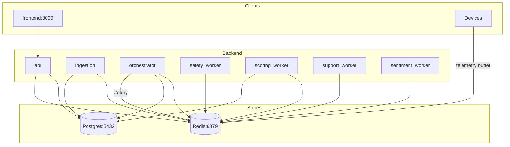
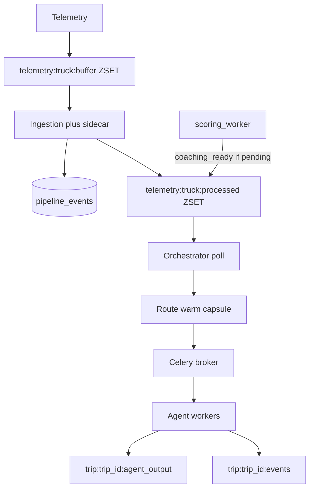
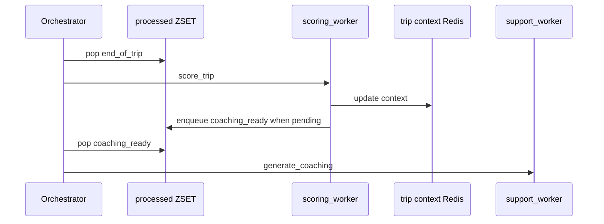

# TraceData AI Monorepo

Real-time fleet telemetry → PostgreSQL → orchestrator → Celery agent workers (Safety, Sentiment, Scoring, Support), backed by Redis for buffers, queues, and trip context.

## Quick Start

**Requires:** Docker Compose, Git.

```bash
git clone <repo-url> && cd tracedata-ai-monorepo
docker compose up -d
docker compose exec -T api python -m scripts.setup_db
docker compose exec -T api python -m scripts.seed_telemetry_batch --count 50
```

- **API / docs:** http://localhost:8000 and http://localhost:8000/docs  
- **Sanity:** `docker compose exec -T db psql -U postgres -d tracedata -c "SELECT COUNT(*) FROM pipeline_events;"`  
- Expect ~10 containers (api, ingestion, orchestrator, workers, db, redis, frontend).

---

## Architecture (diagrams)

### 1. Stack (Docker Compose)

Celery broker and backend share **the same Redis** as telemetry and trip keys (see `docker-compose.yml`).



### 2. Data and dispatch pipeline

Buffers and **processed** queues are Redis **sorted sets**. Orchestrator **polls** processed ZSETs, acquires DB lease, routes via LLM + EventMatrix, **warms** `trips:{trip_id}:{agent}:*`, **send_task** to `td:agent:*`. Workers write `trip:{trip_id}:{agent}_output` and publish completions on `trip:{trip_id}:events`.



### 3. Post-trip coaching handoff (`coaching_ready`)

On **`end_of_trip`**, support is **not** dispatched in that wave; after scoring, **`schedule_coaching_ready_if_pending`** may push **`coaching_ready`** back onto the truck’s **processed** queue so **support_worker** runs with post-scoring context. **`sentiment_ready`** behaves similarly after sentiment.



---

## Runtime checklist (short)

1. `telemetry:{truck_id}:buffer` ← raw; ingestion → `pipeline_events` + `telemetry:{truck_id}:processed`.
2. Orchestrator: lock → route → warm → Celery.
3. Workers: capsule reads; writes `*_output`; `trip:{trip_id}:events` completions.
4. Follow-ups: `sentiment_ready` / `coaching_ready` → support when applicable.
5. `trip:{trip_id}:context` holds rolling flags and latest agent summaries.

| Component | Reads (summary) | Writes (summary) |
|-----------|-----------------|------------------|
| ingestion | buffer ZSET | processed ZSET, `pipeline_events` |
| orchestrator | processed, `trip:events`, DB | Celery `td:agent:*`, warmed keys, `trip:context` |
| workers | queues + scoped trip keys | `trip:*_output`, schema tables, completions |

Full matrix: see [TDATA-49-architecture](docs/01-project-documents/TDATA-49-architecture.md) or agent docs below.

| Service | Port |
|---------|------|
| api | 8000 |
| frontend | 3000 |
| db | 5432 |
| redis | 6379 |
| ingestion, orchestrator, safety/scoring/support/sentiment workers | internal |

## Common commands

```bash
docker compose logs orchestrator -f
docker compose exec -T db psql -U postgres -d tracedata
docker compose exec -T redis redis-cli SCAN 0 MATCH "telemetry:*:buffer" COUNT 100
```

## Documentation

- [Architecture & Design](docs/01-project-documents/TDATA-49-architecture.md)
- [Git Workflow](docs/02-guides/02-git-workflow.md)
- [Troubleshooting](docs/02-guides/10_troubleshooting_guide.md)
- [Agent Details](docs/03-agents/)
