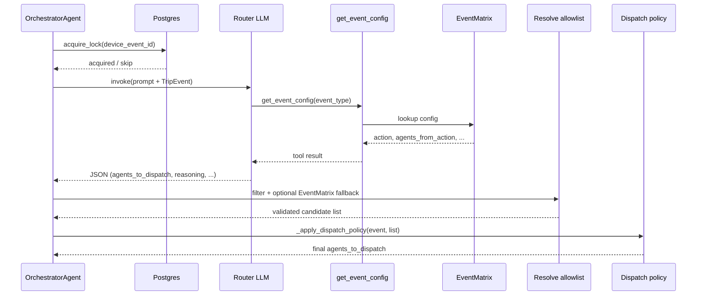
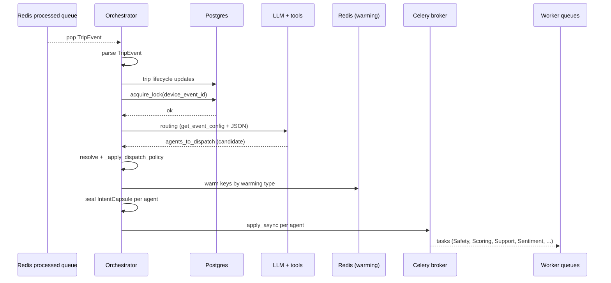
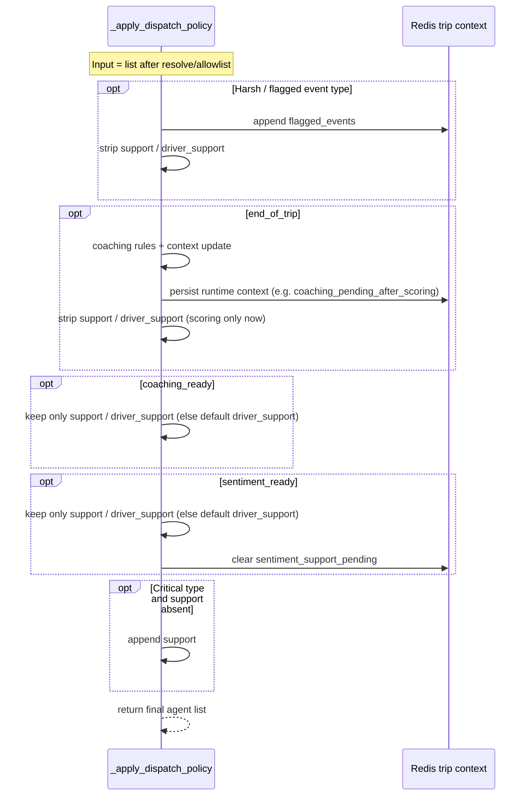
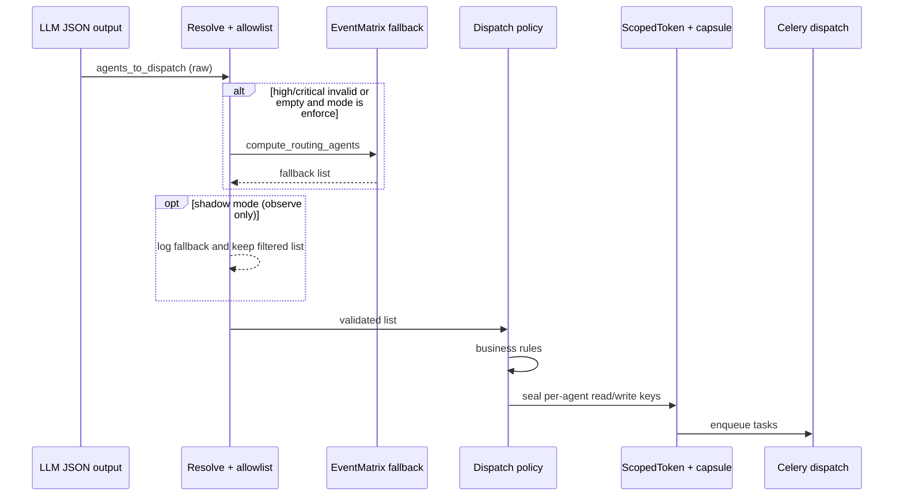
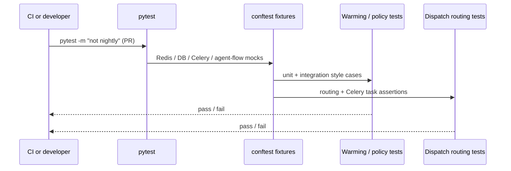
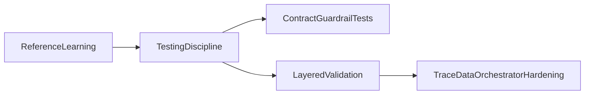

# Orchestrator Agent Specification

The Orchestrator Agent is the traffic controller of TraceData.  
It does not score a trip and it does not write coaching text.  
Its job is to decide **which worker agents should run**, warm the right Redis keys, and dispatch tasks safely.

It answers two questions:

1. "For this incoming event, which agents should run now?"
2. "Can I dispatch safely with lock, cache, and scoped token constraints?"

---

## Why this agent exists

TraceData receives many event types (`collision`, `harsh_brake`, `end_of_trip`, `driver_feedback`, etc.).  
The orchestrator provides one consistent path from event ingestion to worker dispatch with policy guardrails.

---

## Hybrid routing architecture (LLM + deterministic code)

If you are new to this codebase, the important idea is: **the LLM does not silently invent routing by itself**.  
Routing is **hybrid**: a language model **proposes** who should run, while **structured configuration and Python code** own the truth and the final say.

### Two different kinds of “routing”

| Piece | Role | Where it lives (conceptually) |
|--------|------|-------------------------------|
| **EventMatrix** | Canonical map from `event_type` → priority, action, and which agents *should* handle that event. Same input should yield the same baseline agent list. | `common/config/events.py` (exposed to the LLM via `get_event_config` in orchestrator tools) |
| **LLM router** | Reads the live `TripEvent`, calls **`get_event_config(event_type)`**, and returns **JSON** (`agents_to_dispatch`, etc.). It adds flexible “glue” (tool use + structured reply) but is expected to follow the tool output, not guess agent names. | `OrchestratorAgent` + `ORCHESTRATOR_TOOLS` + prompts in `backend/agents/orchestrator/` |
| **Resolve / validate** | Drops unknown agent strings, and (when configured) **replaces broken high/critical routing** with the same EventMatrix-derived list the tool would have had—so bad model output does not strand critical events. | `_resolve_agents_for_dispatch` in `agent.py` (`orchestrator_routing_fallback_mode`: `off` / `shadow` / `enforce`) |
| **Dispatch policy** | **Business rules** that reshape the list for timing and safety: defer Support on harsh/flagged events, Scoring-only on `end_of_trip`, Support-only on `coaching_ready` / `sentiment_ready`, force Support on critical types, etc. | `_apply_dispatch_policy` in `agent.py` |

Everything **after** the policy (cache warming by `get_warming_type`, sealing `IntentCapsule` / `ScopedToken`, Celery dispatch) is also **deterministic**: it uses the final agent list and EventMatrix warming hints, not the LLM.

### Read this as a pipeline (mental model)

Think in order:

1. **Lock and lifecycle** — Postgres lease and trip state updates are deterministic.
2. **LLM step** — Produces a routing **candidate** by consulting EventMatrix through the tool (ideal path: copy `agents_from_action` into `agents_to_dispatch`).
3. **Code steps** — Allowlist + optional EventMatrix fallback, then policy. **The list that actually gets dispatched is always the post-policy list.**

So: **EventMatrix defines the baseline; the LLM operationalizes it; validation and policy enforce safety and product rules.**

**Routing decision (tool + validation + policy)** — time order:

If the lock is **not** acquired, the orchestrator stops before calling the LLM (no duplicate dispatch on the same `device_event_id`).

### Why we use an LLM here (not “the model decides everything”)

- **Tool-grounded routing** — The orchestrator prompt instructs the model to call `get_event_config(event_type)` and treat the tool as the source of truth, then return **strict JSON** (`agents_to_dispatch`, `trip_id`, `event_type`, etc.). The model is a **structured controller** that should **copy** `agents_from_action` from the tool, not invent agent names.
- **Evolution without exploding `if` chains** — Prompts and tools can grow (richer messages, future tools) without every branch becoming new Python routing code on day one—while **hard guarantees** stay in resolver + policy + lock.
- **Debuggability** — The reply can include `reasoning` and structured fields for logs, even when **allowed outcomes** are constrained by the tool and code.

### How the LLM is wired in code (happy path)

1. **`_acquire_and_dispatch`** in `agent.py` acquires the DB lease, then calls **`_get_routing_decision(event)`**.
2. **`_get_routing_decision`** builds the user message (`build_orchestrator_routing_user_message`), calls **`self.llm_agent.invoke(...)`** with **`ORCHESTRATOR_TOOLS`** (includes `get_event_config`).
3. The last assistant message is parsed as JSON; **`agents_to_dispatch`** is the routing **candidate**.
4. **`_resolve_agents_for_dispatch`** allowlists names and optionally replaces bad/empty **high/critical** output using EventMatrix (`orchestrator_routing_fallback_mode`).
5. **`_apply_dispatch_policy`** applies timing and safety rules; **warming, capsules, and Celery** use only this **final** list.

Prompt and tool contract: `backend/agents/orchestrator/prompts.py`, `backend/agents/orchestrator/tools.py`.

### Why this is still safe if the model misbehaves

- **Unknown agent strings** are dropped by the allowlist in `_resolve_agents_for_dispatch`.
- **Empty or malformed lists on high/critical events** can trigger an EventMatrix-backed list when fallback is `enforce` (or be logged in `shadow`).
- **Product rules** (defer Support on harsh events, Scoring-only on `end_of_trip`, etc.) run in **`_apply_dispatch_policy`** after the model—so timing and safety do not depend on LLM fidelity.

### Why bother with an LLM if EventMatrix already exists?

In practice the model is there to **reliably follow a tool-based workflow** (look up config, return strict JSON) and to leave room for **richer prompts and future tools** without rewriting every branch in code.  
**Correctness under failure** still comes from: allowlists, optional fallback to EventMatrix for high/critical events, and `_apply_dispatch_policy` running **after** the model.

---

## Companion agents

- Safety Agent
- Scoring Agent
- Support Agent
- Sentiment Agent

---

## Core features (simple view)

- Reads processed trip events from Redis per truck queue
- Creates/updates trip lifecycle state in Postgres
- Acquires DB lease lock (`device_event_id`) before dispatch
- Uses LLM + EventMatrix tool to propose routing
- Applies deterministic policy to enforce business rules
- Warms Redis keys required by target agents
- Seals `IntentCapsule` + `ScopedToken` with scoped read/write keys
- Dispatches Celery tasks to per-agent queues
- Publishes agent-flow events for UI/observability

For a **time-ordered** view of one event from queue to workers, see the sequence diagram under [Orchestrator workflow (step-by-step)](#orchestrator-workflow-step-by-step).

---

## Tools and inputs used

- `get_event_config(event_type)` tool via orchestrator routing tools
- EventMatrix from `common/config/events.py` (single source of routing truth)
- DB manager for lock and trip lifecycle methods
- Redis client for queue pop, context read/write, key warming
- Celery app for asynchronous worker dispatch

---

## Postgres usage

Primary tables touched by orchestrator:

- `pipeline_events`: lock lifecycle (`acquire_lock`, `release_lock`, `fail_event`)
- `pipeline_trips`: trip state transitions (`start_of_trip`, `end_of_trip`, `coaching_ready`)

Typical lifecycle writes:

- `start_of_trip` -> create trip row
- `end_of_trip` -> mark `scoring_pending`
- `coaching_ready` -> mark `coaching_pending`

---

## Redis key patterns (important)

### Input queue
- `telemetry:{truck_id}:processed` (pop processed `TripEvent`)

### Runtime trip context
- `trip:{trip_id}:context` (`flagged_events`, coaching flags, sentiment follow-up flags)

### Warming keys (examples)
- `trips:{trip_id}:{agent}:current_event`
- `trips:{trip_id}:{agent}:trip_context`
- `trips:{trip_id}:scoring:all_pings`
- `trips:{trip_id}:scoring:historical_avg`
- `trips:{trip_id}:support:coaching_history`

### Agent outputs/channels
- `trip:{trip_id}:{agent}_output`
- `trip:{trip_id}:events`

---

## Orchestrator workflow (step-by-step)

1. Pop one processed event from a truck queue.
2. Parse to `TripEvent`.
3. Update trip lifecycle state (if needed).
4. Acquire lock by `device_event_id`.
5. Ask LLM router for `agents_to_dispatch`.
6. Resolve/validate agents (allowlist + optional fallback mode).
7. Apply deterministic policy (`_apply_dispatch_policy`).
8. Warm cache by warming type.
9. Seal capsule per agent.
10. Dispatch per-agent Celery tasks.

**End-to-end sequence (one event, happy path):**

---

## Deterministic policy rules (critical behavior)

- Harsh/flagged events: append runtime flagged list and defer Support
- `end_of_trip`: dispatch Scoring only; Support follows later via `coaching_ready`
- `coaching_ready`: normalize to Support only
- `sentiment_ready`: normalize to Support only; clear pending flag
- Critical events (`collision`, `rollover`, `driver_sos`): force immediate Support if missing

**Policy application** (after resolve; rules run **in order** in code — see `_apply_dispatch_policy`):

---

## Security and defense in depth

- DB lease lock before dispatch prevents duplicate active handling
- Scoped capsule token restricts each worker's Redis read/write keys
- Agent allowlist filters unknown LLM agent names
- EventMatrix-driven routing constraints reduce freeform LLM drift
- Deterministic policy always runs after LLM decision
- Configurable routing fallback mode:
  - `off` (default, no behavior change)
  - `shadow` (log fallback candidate only)
  - `enforce` (apply deterministic fallback for invalid/unsafe routing)

**Defense in depth (layered, in order):**

---

## Guardrails and red-team style scenarios

Guardrails implemented/tested:

- Unknown agent names are filtered out
- High/critical unsafe routing can fall back (when `enforce`)
- `off` mode preserves current production behavior
- `shadow` mode enables safe observability before enforcement

Adversarial scenarios covered by tests:

- malformed `agents_to_dispatch` type
- empty high/critical dispatch in enforce mode
- poisoned mixed-type/unknown agent lists
- low-risk event with empty dispatch remains allowed

---

## Testing status (what is covered)

Relevant test files:

- `backend/tests/core/test_orchestrator_warming_and_tasks.py`
- `backend/tests/agents/test_orchestrator_event_routing.py`
- `backend/tests/conftest.py`

Coverage themes:

- cache warming behavior by warming strategy
- dispatch policy behavior across lifecycle/internal events
- capsule composition
- queue/task routing correctness
- fallback mode behavior (`off`, `shadow`, `enforce`)
- unknown agent filtering and fallback safety paths
- burst stability (repeated harsh_brake / end_of_trip policy)

**CI:** Pull requests run `pytest -m "not nightly"` (see repo `.github/workflows/ci-backend-api.yaml`).  
Scheduled **`main`** eval including all `nightly`-marked tests: `.github/workflows/ci-backend-eval-nightly.yaml`.

**How tests plug in** (fixtures supply mocks; tests assert policy and dispatch):

---

## Work informed by a reference project (orchestrator-focused)

External reference for *discipline* (testing, layered controls, CI patterns), not a drop-in architecture:  
[reference repo](https://github.com/sree-r-one/project_ec_analyst).

### What we actually implemented (orchestrator-focused)

- **Discipline over architecture** — Kept the hybrid router (LLM + EventMatrix + policy); did **not** replace it with a single StateGraph-style orchestrator like the reference app.
- **Defense in depth** — Allowlisted agent names; optional routing fallback (`off` / `shadow` / `enforce`) tied to EventMatrix via `settings.orchestrator_routing_fallback_mode`, always still followed by `_apply_dispatch_policy`.
- **Contract / “red team” tests** — Invalid LLM-shaped `agents_to_dispatch`, empty critical routing, unknown agents, burst policy stability, dispatch tests unskipped with Redis/Celery/agent-flow mocks fixed.
- **Docs** — This README specifies behavior, guardrails, testing, and what we adopt from the reference vs what we do not.
- **CI shape (repo-wide, not orchestrator-only)** — PRs run `pytest -m "not nightly"` in `ci-backend-api`; **`main`** has a scheduled full eval workflow (`ci-backend-eval-nightly`) — same *idea* as fast PR vs heavier eval, scoped to this monorepo.

### Principles we kept (lesson, not a clone)

- Do not copy architecture blindly; copy **testing and control discipline**.
- Keep the hybrid model (LLM + deterministic policy).
- Strengthen contract-style routing tests and treat orchestrator behavior as a **safety contract**, not just implementation detail.

---

## Limitations of this agent

- Does not compute trip score (Scoring Agent responsibility)
- Does not generate coaching content (Support Agent responsibility)
- Does not perform sentiment analysis (Sentiment Agent responsibility)
- LLM decision quality still depends on model/tool reliability
- Uses Redis key discovery pattern that may need scaling refinement at high volume

---

## Key source files

- `backend/agents/orchestrator/agent.py`
- `backend/agents/orchestrator/db_manager.py`
- `backend/agents/orchestrator/tools.py`
- `backend/agents/orchestrator/prompts.py`
- `backend/common/config/events.py`
- `backend/common/config/settings.py`
- `backend/tests/core/test_orchestrator_warming_and_tasks.py`
- `backend/tests/agents/test_orchestrator_event_routing.py`
