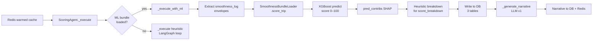
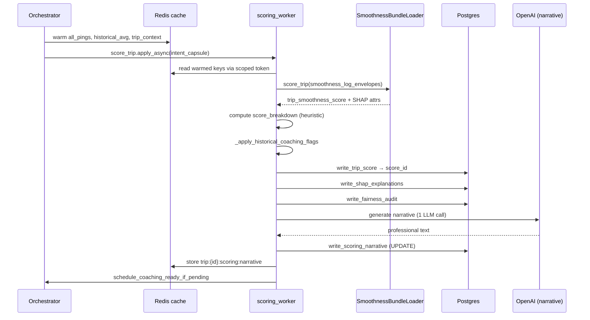
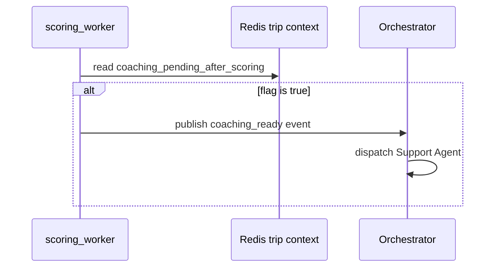
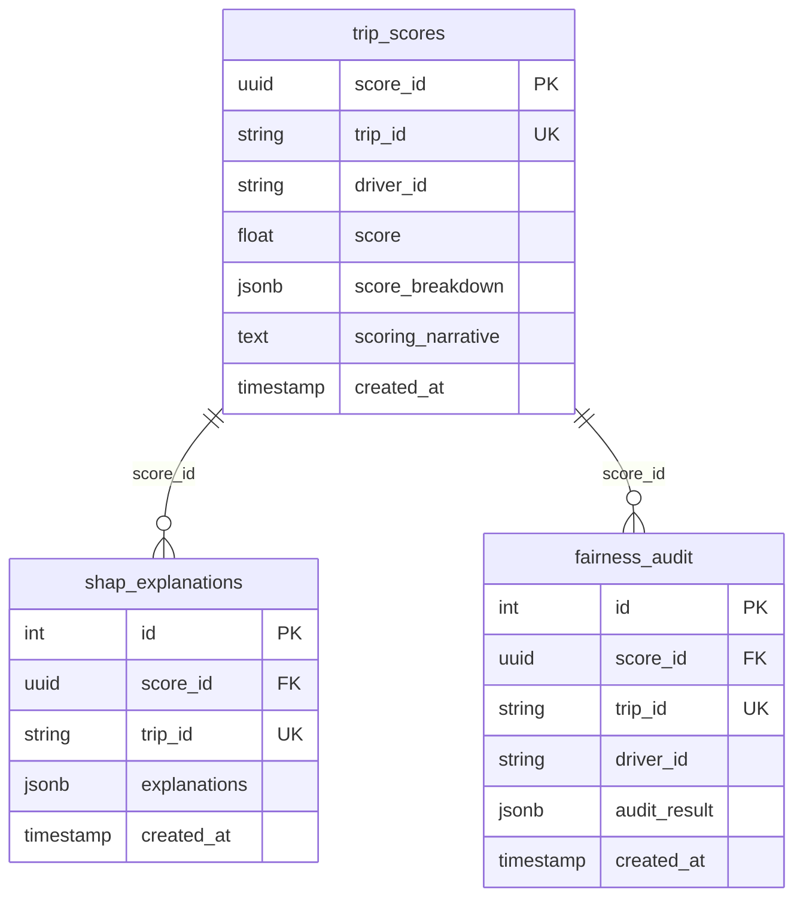

# Scoring Agent Specification

The Scoring Agent evaluates completed trips and produces a **behaviour score**, **SHAP attributions**, a **fairness audit**, and a **human-readable narrative**.  
It does not route events and it does not generate coaching content — those are the Orchestrator and Support Agent's responsibilities.

It answers one question:

> "Given all the telemetry pings for this trip, how well did this driver perform, and why?"

---

## Why this agent exists

Trip-level driver scoring requires aggregating many telemetry events across the full trip window.  
The Scoring Agent provides one consistent path from pre-warmed Redis cache → ML inference (or deterministic heuristic) → DB persistence → narrative generation.

---

## Two scoring paths

The agent chooses between two paths at startup based on whether the ML bundle is present on disk.

| Path | When used | LLM calls | Latency |
|------|-----------|-----------|---------|
| **ML fast path** | `model.joblib` + serving files found on disk | 1 (narrative only) | ~1–2 s |
| **Heuristic path** | No bundle on disk | 3–5 (LangGraph tool loop) | 15–20 s |

The ML path is strongly preferred — it uses a trained XGBoost model (real SHAP) and avoids the LangGraph loop entirely.

---

## ML fast path (primary)



### Feature derivation

The ML model contract requires 3 ping-window features. Since the pipeline stores pre-aggregated `smoothness_log` envelopes (not raw pings), the loader derives them:

```
accel_fluidity        = clip(1 − jerk_mean × 10,             0, 1)
driving_consistency   = clip(1 − speed_std / 30,              0, 1)
comfort_zone_percent  = clip(1 − lat_mean/0.3 − jerk_max/5,  0, 1)
```

### Trip score aggregation

Each 10-minute window gets a score. The trip score is the **duration-weighted mean**:

```
trip_score = Σ(window_score × window_seconds) / Σ(window_seconds)   clipped to [0, 100]
```

### SHAP attributions

The loader calls XGBoost `pred_contribs` (true tree SHAP) via `get_booster().predict(dm, pred_contribs=True)`.  
If that fails, it falls back to deterministic heuristic coefficients.

---

## Heuristic path (fallback)

Used only when no ML bundle is present. A LangGraph `StateGraph` (chatbot + `ToolNode`) invokes 5 tools:

| Tool | Purpose |
|------|---------|
| `get_trip_context_json` | Trip metadata from warmed cache |
| `get_historical_avg_json` | Rolling driver average |
| `extract_smoothness_features_json` | Jerk, speed, lateral, engine aggregates |
| `compute_behaviour_score_from_features` | Deterministic score + breakdown |
| `score_with_ml_model` | Runs ML scorer if bundle available (preferred) |

The LLM calls tools in sequence, then returns strict JSON. Falls back to deterministic payload if JSON parsing fails.

---

## Inputs and outputs

### Inputs (from Redis warmed cache)

Orchestrator uses **aggregation-driven warming** (1hr TTL) before `end_of_trip`:

| Redis key | Contents |
|-----------|---------|
| `trip:{id}:scoring:all_pings` | All telemetry pings for the trip |
| `trip:{id}:scoring:historical_avg` | Driver's rolling average score |
| `trip:{id}:scoring:trip_context` | Trip metadata (driver_id, truck_id, …) |

### Outputs (written to DB + Redis)

| Destination | Schema | Contents |
|------------|--------|---------|
| Postgres | `scoring_schema.trip_scores` | score, score_breakdown, scoring_narrative |
| Postgres | `scoring_schema.shap_explanations` | SHAP top features, method, narrative |
| Postgres | `scoring_schema.fairness_audit` | demographic_parity, equalized_odds, bias_detected |
| Redis | `trip:{id}:scoring:narrative` | LLM narrative for downstream consumers |

---

## End-to-end sequence (ML fast path)



---

## Narrative generation

After DB writes, the agent calls the LLM **once** to produce a professional 2–3 sentence summary.

**Inputs to LLM:** score label, top 3 SHAP features, coaching flag, coaching reason.  
**Fallback:** if LLM fails (rate limit, timeout), narrative becomes `"Trip completed with a {label} rating."` — task still succeeds.

Example:
> *"The driver's trip performance is rated as poor, primarily due to issues with comfort zone percentage, acceleration fluidity, and driving consistency. Given the detection of harsh events, coaching is recommended to address these areas."*

---

## Historical coaching flags

After scoring, the agent checks if the trip dropped significantly vs historical average:

```
if trip_score < historical_avg − 10.0:
    → append coaching reason
    → set coaching_required = True
```

Flags single-trip performance drops without changing the score.

---

## Driver score blending

The agent returns both trip-level and driver-level scores:

```
driver_score = 0.7 × trip_score + 0.3 × historical_avg_score
```

If no historical average exists, `driver_score = trip_score`.

---

## Coaching followup trigger

After successful run, the agent calls `schedule_coaching_ready_if_pending`.  
If orchestrator set `coaching_pending_after_scoring = true` in trip context, this publishes a `coaching_ready` event — triggering Support Agent.



---

## DB schema



---

## Error handling and retries

Celery task: `max_retries=3`, exponential backoff (`2^retry_count` seconds).

| Exception | Behaviour |
|-----------|-----------|
| `RateLimitError` (RPD — daily quota) | No retry — raises immediately |
| `RateLimitError` (RPM — per-minute) | 1 retry after 60 s |
| Any other exception | Retry up to 3× with exponential backoff |
| Narrative LLM failure | Caught silently — fallback text used |

---

## ML model bundle

The model lives in `tracedata-ai/tracedata-ai-ml` repo. Download before building:

```bash
python -m scripts.fetch_model_release \
  --repo tracedata-ai/tracedata-ai-ml \
  --tag v.2.0.0.2026155.2
```

Required files under `agents/scoring/model_bundle/`:

| File | Purpose |
|------|---------|
| `model.joblib` | Serialised XGBRegressor |
| `serving/model_contract.json` | Feature column order + contract version |
| `serving/background_features.json` | SHAP background distribution |

Settings (`common/config/settings.py`):
```python
smoothness_model_path        = "agents/scoring/model_bundle/model.joblib"
smoothness_model_serving_dir = "agents/scoring/model_bundle/serving"
smoothness_model_release_tag = "v.2.0.0.2026155.2"
```

The `Dockerfile` picks up the bundle via `COPY agents/ agents/` — automatic.

---

## Limitations

- Only triggered on `end_of_trip` — does not score mid-trip
- ML model scores smoothness only; other risk dimensions are Safety Agent territory
- Narrative falls back to plain text when OpenAI daily quota exhausted
- SHAP attributions use approximated features (pre-aggregated envelopes, not raw pings)

---

## Key source files

- `backend/agents/scoring/agent.py` — main lifecycle, ML fast path, narrative
- `backend/agents/scoring/model/loader.py` — `SmoothnessBundleLoader`, SHAP, feature derivation
- `backend/agents/scoring/features.py` — deterministic feature extraction
- `backend/agents/scoring/tools.py` — LangGraph tools (heuristic path)
- `backend/agents/scoring/prompts.py` — system prompts + narrative prompt
- `backend/tasks/scoring_tasks.py` — Celery task, retry/rate-limit policy
- `backend/common/db/repositories/scoring_repo.py` — DB writes
- `backend/scripts/fetch_model_release.py` — model bundle download
