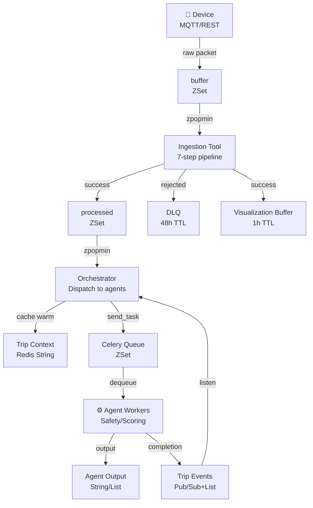

# Redis Client & Event System

Quick reference for Redis operations in TraceData. All Redis interactions go through `RedisClient` — **never connect directly**.

**Files:**
- `client.py` — `RedisClient` class with all Redis operations
- `keys.py` — `RedisSchema` with canonical key patterns & TTL constants
- `__init__.py` — exports for easy imports

## Quick Start

### Import & Initialize

```python
from common.redis.client import RedisClient
from common.redis.keys import RedisSchema

# Create client (async)
redis = RedisClient()

# Use it
await redis.push_to_buffer(key, payload, score)
await redis.close()  # Always close when done
```

### Common Pattern

```python
async def my_function():
    redis = RedisClient()
    try:
        # Do work
        await redis.push_to_buffer(...)
    finally:
        await redis.close()  # Ensures cleanup
```

---

## 📊 Data Flow Diagram



## API Reference by Use Case

### Pipeline Queues (Ingestion → Orchestrator)

**Use:** Raw events → clean events → agent routing

```python
# PUSH (Writer: Device/Ingestion)
await redis.push_to_buffer(
    key="telemetry:TRUCK-SG-1234:buffer",
    payload=json.dumps(packet),
    score=0  # 0=CRITICAL, 3=HIGH, 6=MEDIUM, 9=LOW
)

# POP (Reader: Ingestion/Orchestrator)
event = await redis.pop_from_buffer("telemetry:TRUCK-SG-1234:buffer")
# Returns: dict or None

# REJECT (Writer: Ingestion on failure)
await redis.push_to_rejected(
    key="telemetry:TRUCK-SG-1234:rejected",
    payload=json.dumps(packet),
    score=6,
    ttl=172800  # 48h
)
```

**Helper Keys:**
```python
# Use RedisSchema instead of hardcoding strings
from common.redis.keys import RedisSchema

buffer_key = RedisSchema.Telemetry.buffer(truck_id="TRUCK-SG-1234")
processed_key = RedisSchema.Telemetry.processed(truck_id="TRUCK-SG-1234")
rejected_key = RedisSchema.Telemetry.rejected(truck_id="TRUCK-SG-1234")
```

### Agent Working Cache (Context & Outputs)

**Use:** Orchestrator pre-loads context → agents read/write → orchestrator consumes

**Context (Shared data for all agents):**
```python
# WRITE (Orchestrator: warm cache before dispatch)
context = TripContext(
    trip_id="TRIP-001",
    driver_id="DRV-123",
    truck_id="TRUCK-SG-1234",
    priority=3,
    historical_avg_score=78.5,
    event=event_obj
)
key = RedisSchema.Trip.context("TRIP-001")
ttl = RedisSchema.Trip.ttl_for_priority(3)  # ← auto TTL by priority

await redis.store_trip_context(key, context.model_dump(), ttl)

# READ (Agent: hydrate at startup)
context_dict = await redis.get_trip_context(key)
print(context_dict["driver_id"])
```

**Agent Outputs:**
```python
# WRITE (Agent: after result computed)
result = SafetyResult(flagged=True, severity="high")
output_key = RedisSchema.Trip.output("TRIP-001", "safety")
await redis.store_agent_output(output_key, result.model_dump(), ttl=600)

# READ (Orchestrator: after agent publishes CompletionEvent)
result = await redis.get_agent_output(output_key)
print(result["flagged"])  # True
```

**Smoothness Logs (Accumulate during trip):**
```python
# WRITE (Ingestion: on smoothness_log event)
log = {"window": 1, "smoothness": 0.85, "speed": 60}
logs_key = RedisSchema.Trip.smoothness_logs("TRIP-001")
await redis.push_smoothness_log(logs_key, log, ttl=600)

# READ (Scoring Agent: at end-of-trip, get ALL)
all_logs = await redis.get_all_smoothness_logs(logs_key)
# Returns: list of dicts, newest first
```

### Completion Signalling (Agent → Orchestrator)

**Use:** Agent finishes → notifies Orchestrator to read output & decide next step

**Pattern: Dual-write (Pub/Sub + List for durability)**

```python
# WRITE (Agent: after storing output)
completion = {
    "trip_id": "TRIP-001",
    "agent": "safety",
    "status": "done",
    "priority": 3,
    "final": False  # ← False = more agents to run
}
channel = RedisSchema.Trip.events_channel("TRIP-001")
ttl = RedisSchema.Trip.ttl_for_priority(3)

await redis.publish_completion(channel, completion, ttl)

# LISTEN (Orchestrator: subscribes to trip channels)
pubsub = await redis.subscribe_to_trip(channel)
# (Orchestrator handles async message receiver in event loop)
```

### Visualization Buffer (Observability)

**Use:** Monitor recent events without impacting pipeline

```python
# WRITE (Ingestion: after successful processing)
await redis.push_to_visualization_buffer(
    payload=json.dumps(processed_packet),
    ttl=3600  # 60 minutes auto-cleanup
)
# ✓ O(1) non-blocking
# ✓ Wrapped in try/catch (doesn't block pipeline if Redis fails)

# READ (Dashboard/debugging)
recent = await redis.get_recent_visualization_events(limit=50)
for event in recent:
    print(f"{event['event']['event_type']} from {event['event']['truck_id']}")
```

### System Signals (Pub/Sub Channels)

**Use:** Security alerts, cache anomalies, HITL escalations

```python
# PUBLISH (Component: on event)
await redis._client.publish(
    "tracedata:security:critical-alerts",
    json.dumps({
        "trip_id": "TRIP-001",
        "violation_type": "hmac_mismatch",
        "timestamp": "2026-03-28T..."
    })
)

# SUBSCRIBE (System component)
pubsub = await redis._client.pubsub()
await pubsub.subscribe("tracedata:security:critical-alerts")

# Receive (in event loop)
async for message in pubsub.listen():
    if message["type"] == "message":
        data = json.loads(message["data"])
        print(f"⚠️  Security Alert: {data['violation_type']}")
```

## Key Schema Reference

| Key | Type | TTL | Writer | Reader |
|---|---|---|---|---|
| `telemetry:{truck_id}:buffer` | ZSet | — | Device/App | Ingestion |
| `telemetry:{truck_id}:processed` | ZSet | — | Ingestion | Orchestrator |
| `telemetry:{truck_id}:rejected` | ZSet | 48h | Ingestion | Admin |
| `trip:{trip_id}:context` | String | 48h/10m | Orchestrator | All agents |
| `trip:{trip_id}:smoothness_logs` | List | 48h/10m | Ingestion | Scoring |
| `trip:{trip_id}:{agent}_output` | String | 48h/10m | Agent | Orchestrator |
| `trip:{trip_id}:events` | Pub/Sub+List | 48h/10m | Agent | Orchestrator |
| `td:visualization:recent_events` | List | 1h | Ingestion | Dashboard |

**Use `RedisSchema` for all keys:**
```python
from common.redis.keys import RedisSchema

# Don't hardcode strings!
key = RedisSchema.Trip.context("TRIP-001")
key = RedisSchema.Telemetry.buffer(truck_id="TRUCK-SG-1234")
```

## Common Patterns

### Pattern 1: Read → Process → Write

```python
async def process_and_store():
    redis = RedisClient()
    try:
        # Read
        data = await redis.get_trip_context(RedisSchema.Trip.context("TRIP-001"))
        
        # Process
        result = compute_something(data)
        
        # Write
        await redis.store_agent_output(
            RedisSchema.Trip.output("TRIP-001", "safety"),
            result,
            ttl=600
        )
    finally:
        await redis.close()
```

### Pattern 2: Batch Push (with Priority)

```python
from common.config.events import PRIORITY_MAP

async def seed_events():
    redis = RedisClient()
    try:
        for event in events_list:
            score = PRIORITY_MAP.get(event["priority"], 9)
            await redis.push_to_buffer(
                key=f"telemetry:{event['truck_id']}:buffer",
                payload=json.dumps(event),
                score=score
            )
    finally:
        await redis.close()
```

### Pattern 3: Priority Queue Consumer

```python
async def consume_highest_priority():
    redis = RedisClient()
    try:
        # zpopmin returns LOWEST score first (CRITICAL=0)
        event = await redis.pop_from_buffer("telemetry:TRUCK-SG-1234:buffer")
        if event:
            print(f"Processing {event['event_type']} (priority={event.get('priority')})")
    finally:
        await redis.close()
```

## Error Handling

```python
async def safe_redis_operation():
    redis = RedisClient()
    try:
        result = await redis.get_trip_context(key)
        if result is None:
            print("⚠️  Cache miss — context not found")
            # Implement fallback (e.g., reload from DB)
            
    except Exception as e:
        logger.error(f"Redis error: {e}")
        # Don't crash — continue with degraded mode
        
    finally:
        await redis.close()  # Always cleanup
```

## Files You Might Need

- **[keys.py](keys.py)** — All key patterns & TTL constants
- **[client.py](client.py)** — `RedisClient` implementation
- **[../../references/.../02-1-redis-event.md](../../../../references/04-technical-documentation/02-1-redis-event.md)** — Full Redis architecture

---

## Checklist for New Code

- ✓ Use `RedisSchema` — never hardcode strings
- ✓ Call `redis.close()` in finally block
- ✓ Handle `None` returns (cache miss)
- ✓ Use priority scores (0–9) where needed
- ✓ Check TTL for context: 48h (CRITICAL/HIGH) vs 10min (others)
- ✓ Wrap observability operations in try/catch
- ✓ Log what you're doing (`logger.info(...)`)

---

**Questions?** See [Redis Event Registry](../../../../references/04-technical-documentation/02-1-redis-event.md) for full system design.
