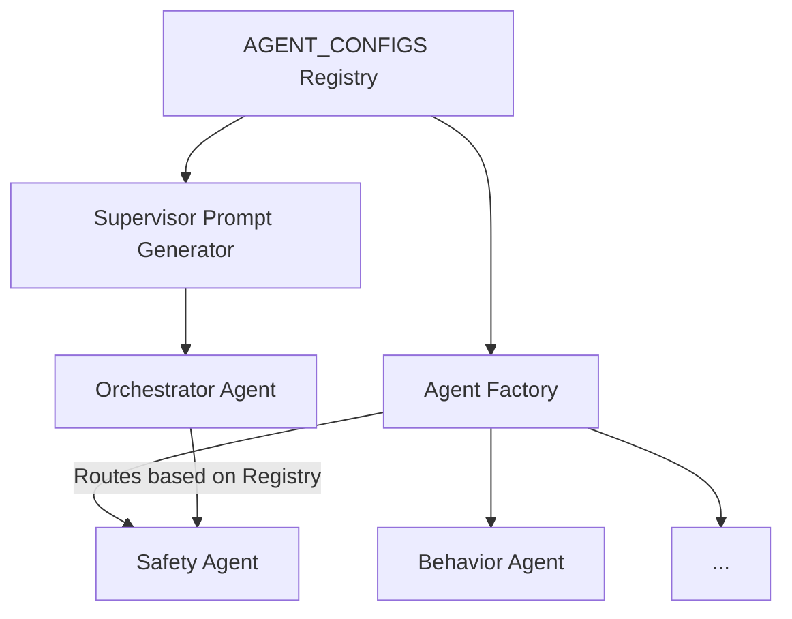

# Workshop Analysis & Technical Roadmap: TraceData AI Alignment with SWE5008

This document provides a comprehensive technical roadmap for implementing TraceData AI using the patterns and tools taught in the **SWE5008 Architecting Agentic AI Solutions** workshop.

---

## 1. Executive Summary: The "Taught vs. Project" Mapping

| Classroom Concept | TraceData Project Application | Benefit |
| :--- | :--- | :--- |
| **Agent Registry Pattern** | `Orchestrator Agent` (Router) | Configuration-driven scaling of the 8 agents. |
| **Cafe Processor (JSON Extraction)** | `Ingestion Agency` & `Appeals Processing` | Standardizing unstructured driver text into actionable data. |
| **LangGraph Cyclical Flows** | `Safety Agent` Interventions | Feedback loops for multi-level alerting (Level 1 $\rightarrow$ 3). |
| **Model Context Protocol (MCP)** | `Context Enrichment Agent` | Low-latency weather/traffic data retrieval ($<$ 2 sec). |
| **Memory/Profile persistence** | `Driver Encouragement Profiles` | Personalized sentiment and coaching history. |

---

## 2. Core Architectural Patterns

### 2.1 The Agent Registry (Orchestrator Foundation)
**Reference:** [agent_registry_pattern.md](file:///d:/learning-projects/tracedata-ai-monorepo/refs/swe5008_archaais/day-2/agent_registry_pattern.md)

In TraceData, we have 8 agents. Instead of hardcoding their roles in the Orchestrator's prompt, we will use the **Registry Pattern**.

**Implementation Step:** Define `AgentConfig` for all 8 agents (Safety, Fairness, Context, etc.) in a central `registry.py`.

### 2.2 Model Context Protocol (MCP) for Enrichment
**Reference:** [d2l-mcp-demo-stdio.ipynb](file:///d:/learning-projects/tracedata-ai-monorepo/refs/swe5008_archaais/day3-workshop/d2l-mcp-demo-stdio.ipynb)

The `Context Enrichment Agent` must fetch weather data for Singapore. Use an MCP Server to wrap standard weather/traffic APIs.

**Blueprint:**
1. Create a local MCP server (`mcp_geo_server.py`).
2. Implement tools: `get_weather(lat, lon)`, `get_traffic_density(route_id)`.
3. The `Context Agent` calls these tools via the `StdioServerParameters` pattern.

### 2.3 Hierarchical Memory (Driver Context)
**Reference:** [day-3-exercise-explained.md](file:///d:/learning-projects/tracedata-ai-monorepo/refs/swe5008_archaais/day-3/day-3-exercise-explained.md)

Just like the Carbon agent remembers "Allowed Regions", TraceData must remember "Driver Emotional State".

**Blueprint:**
- **Persistent Layer:** `PostgreSQL` stores historical scores.
- **Short-term memory:** `Redis` stores the current trip's sentiment trajectory.
- **Preference memory:** `JSON/Profile` stores driver-specific coaching tones (e.g., "formal" vs "encouraging").

---

## 3. Per-Agent Implementation Manifest

### 3.1 Ingestion Quality Agent (Agent 1)
*   **Workshop Connection:** [Day 1: Cafe Processor](file:///d:/learning-projects/tracedata-ai-monorepo/refs/swe5008_archaais/day-1/cafe_processor.md)
*   **Idea:** Use **Structured Extraction** for Driver Appeals.
*   **Implementation:** 
    *   Extract: `incident_id`, `reason_category`, `weather_context`, and `PII` using Pydantic schemas.
    *   **Tool:** `PIIScrubberTool` using regex + small LLM to mask sensitive data.

### 3.2 Orchestrator Agent (Agent 2)
*   **Workshop Connection:** [Day 2: Agent Registry](file:///d:/learning-projects/tracedata-ai-monorepo/refs/swe5008_archaais/day-2/agent_registry_pattern.md)
*   **Idea:** Use the **Configuration-Driven Registry** to manage the 7 specialist agents.
*   **Implementation:** Initialize a `StateGraph` where the Orchestrator acts as the central router for both deterministic and semantic tasks.

### 3.3 Behavior Agent (Agent 3)
*   **Workshop Connection:** [Day 1: LLM Reasoning](file:///d:/learning-projects/tracedata-ai-monorepo/refs/swe5008_archaais/day-1/hello_world_llm.ipynb)
*   **Idea:** Use LLMs to "Humanize" ML outputs.
*   **Implementation:** Translate SHAP values from XGBoost into clear, fair explanations for drivers.

### 3.4 Feedback & Advocacy Agent (Agent 4)
*   **Workshop Connection:** [Day 1: Embeddings Demo](file:///d:/learning-projects/tracedata-ai-monorepo/refs/swe5008_archaais/day-1/SWE5008_ARCHAAS_Week1_Course_Materials_ArchitectingAgenticAISolutionsDay1-EmbeddingsDemo-v1.1.0.ipynb)
*   **Idea:** Use **Vector Search** to ensure consistency in appeals.
*   **Implementation:** Embed and search past resolved cases in `pgvector` to suggest unbiased resolutions.

### 3.5 Sentiment Agent (Agent 5)
*   **Workshop Connection:** [Day 3: Memory Patterns](file:///d:/learning-projects/tracedata-ai-monorepo/refs/swe5008_archaais/day-3/day-3-exercise-explained.md)
*   **Idea:** **Hierarchical Memory** for Burnout Detection.
*   **Implementation:** Track daily sentiment scores in `driver_state.json` and trigger alerts on significant drops.

### 3.6 Coaching Agent (Agent 6)
*   **Workshop Connection:** [Day 3: smolagents Demo](file:///d:/learning-projects/tracedata-ai-monorepo/refs/swe5008_archaais/day3-workshop/d3-smolagents-demo.ipynb)
*   **Idea:** Use **smolagents** for lightweight, localized coaching.
*   **Implementation:** Deploy localized "Coach" instances to minimize feedback latency.

### 3.7 Safety Agent (Agent 7)
*   **Workshop Connection:** [Day 2: LangGraph Cycles](file:///d:/learning-projects/tracedata-ai-monorepo/refs/swe5008_archaais/day-2/2_multi_agent_travel.md)
*   **Idea:** **Cyclical Intervention Logic**.
*   **Implementation:** Multi-level escalation (App $\rightarrow$ Message $\rightarrow$ Call) using LangGraph cycles.

### 3.8 Context Enrichment Agent (Agent 8)
*   **Workshop Connection:** [Day 3: MCP Demo](file:///d:/learning-projects/tracedata-ai-monorepo/refs/swe5008_archaais/day3-workshop/d2l-mcp-demo-stdio.ipynb)
*   **Idea:** **MCP as the "Universal Tool"**.
*   **Implementation:** Build an MCP Server for Singapore-specific traffic and parking data.

---

## 4. Recommended Implementation Order

### Phase 1: Foundation (Based on Day 1 & 2)
1. **Orchestrator Registry:** Spin up the LangGraph supervisor with the Registry pattern.
2. **Ingestion Quality Agent:** Implement the "Cafe Processor" pattern for validation and PII scrubbing.

### Phase 2: Core Intelligence (Based on Day 2)
1. **Behavior Agent:** Integration of XGBoost with SHAP/LIME for explainability.
2. **Feedback & Advocacy:** Build the semantic search loop for historical appeals.

### Phase 3: Advanced Orchestration (Based on Day 3)
1. **Safety Agent:** Implement the LangGraph "Critical Bypass" node with cyclical escalation.
2. **Context Agent (MCP):** Build the local MCP server for weather/traffic tool access.

---

### Summary Checklist for Implementation

- [ ] **Registry:** Create `agents/registry.py`.
- [ ] **Extraction:** Create `agents/ingestion/parser.py` using Pydantic.
- [ ] **Context:** Create `tools/mcp_server.py`.
- [ ] **Memory:** Setup `redis` for sentient-state tracking.

> [!IMPORTANT]
> The **MCP integration** is the most critical technical leap from the classroom to the project. It ensures that Agent 8 (Context) can scale without clogging the LLM's context window.
