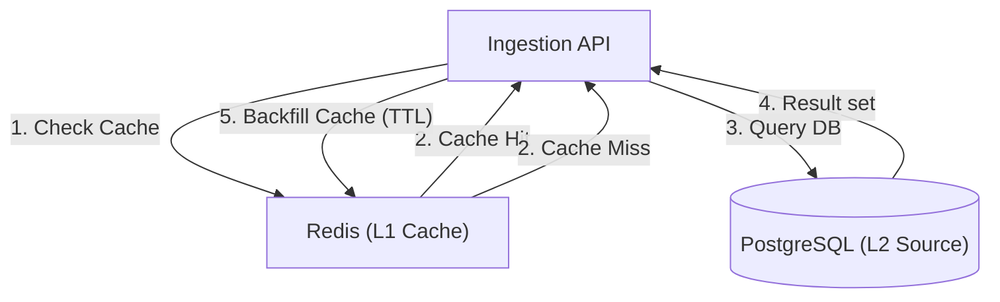

# Caching Strategy & Implementation Guide

**Status:** Draft / Architectural Standard
**Pattern:** Cache-Aside (Look-Aside)

## 1. Abstract
Caching is used in TraceData to decouple high-volume **Telemetry Ingestion** from **Database Read Latency**. It is an **Implementation-Specific** architectural pattern: while we currently use **Redis**, the strategy of "Source of Truth Sync" remains valid regardless of the specific tool.

---

## 2. Architecture: Cache-Aside Pattern (MermaidJS)



---

## 3. Consistency Strategy (Stale Data Management)

To solve the "Stale Data" problem, TraceData follows a **Strict Invalidation** policy.

### A. Manual Invalidation (Delete-on-Update)
Every "Write" operation in the application (Update, Delete, Patch) **MUST** invalidate the corresponding Redis key.
*   **Why?** Ensures the next read is forced to fetch the fresh Source of Truth from PostgreSQL.
*   **Code Example:**
    ```python
    await db.commit()  # Step 1: Commit to Source of Truth
    await redis.delete(f"vehicle:{vehicle_id}")  # Step 2: Clear old cache
    ```

### B. Time-To-Live (TTL) Safety Net
Every key stored in Redis **MUST** have an expiration (TTL). 
*   **Default TTL:** 60 minutes.
*   **Critical TTL:** 5 minutes (for fast-moving data like active trip states).
*   **Why?** Acting as a guardrail if the `delete` command fails due to network jitter.

---

## 4. What to Cache vs. What NOT to Cache

| Category | Cache? | Strategy |
| :--- | :--- | :--- |
| **Lookup Data** (Tenants, Vehicles) | **YES** | Long TTL (1hr), Manual Invalidation on Edit. |
| **Auth State** (Session, JWT) | **YES** | TTL based on Session expiry. |
| **Telemetry History** (G-Force, GPS) | **NO** | High volume, Low revisit rate. Straight to DB. |
| **Active Trip Summaries** | **YES** | Short TTL (5m). Critical for Agent dashboards. |

---

## 5. Tool-Specific Implementation (Redis)
While the pattern is general, our tool is **Redis**. 
-   **Data Structure:** Primarily `STRING` (JSON serialized).
-   **Command:** `SET vehicle:123 "{data}" EX 3600`
-   **Atomicity:** We use **Pipelining** or **Lua Scripts** to ensure high-speed bulk invalidations.

---
## References
- [Architecture Overview](./TDATA-49-architecture.md)
- [ADR-003: Shared Core Package](../adr/ADR-003-shared-core-package.md)
