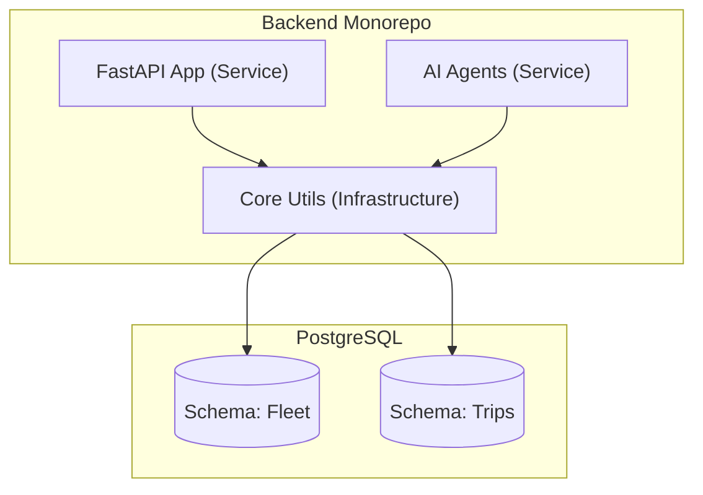
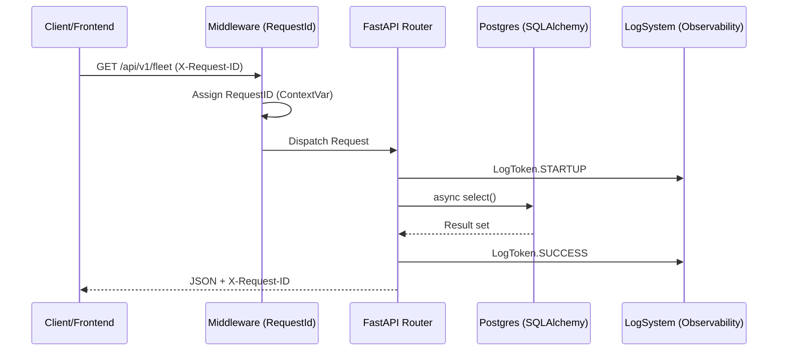

# TDATA-49: Backend Foundation & Architecture Overview

**Branch:** `develop/TDATA-49-Backend-API-and-Agent-folder-setup`
**Status:** Locked & Documented

---

## 1. Problem Statement
The platform required a robust foundation to support high-volume telematics and multi-agent coordination. The primary challenge was designing a structure that allowed the **REST API** and **AI Agents** to coexist while sharing critical infrastructure without tight coupling.

## 2. Theoretical Background: Modular Monolith
We chose a **Modular Monolith** to maintain ACID transactions across the Fleet and Booking modules during the MVP phase, while using **Schema-per-Module** database design to ensure future microservice readiness.

---

## 3. Architecture Overview (MermaidJS)

---

## 4. Design Standards & Accomplishments

### A. Observability (Typed Log Tokens)
We standardized all logging to use machine-parsable tokens. This ensures that automated monitoring (Datadog/ELK) can parse events with 100% reliability.

**Standard Tokens Reference:**
- `[STARTUP]` - System initialization
- `[DATABASE_INIT]` - Database schema verification
- `[SEED_SUCCESS]` - Data population completed
- `[FAIL]` - Retriable failure
- `[ERROR]` - Critical system failure

### B. Tactical DDD Patterns
- **`UUIDPrimaryKeyMixin`**: Guarantees non-sequential, globally unique IDs for all entities.
- **`TimestampMixin`**: Provides automated audit trails for every row creation and update.
- **`get_db()`**: Injected dependency that automatically manages transaction lifecycles (commit on success, rollback on error).

### C. Sequence Flow: Request Lifecycle (MermaidJS)

---

## 6. Project References
- [ADR-002: Shared Core Package](../adr/002-shared-core-package.md)
- [ADR-001: Messaging Layer](../adr/adr-001-kafka-to-redis-celery.md)
