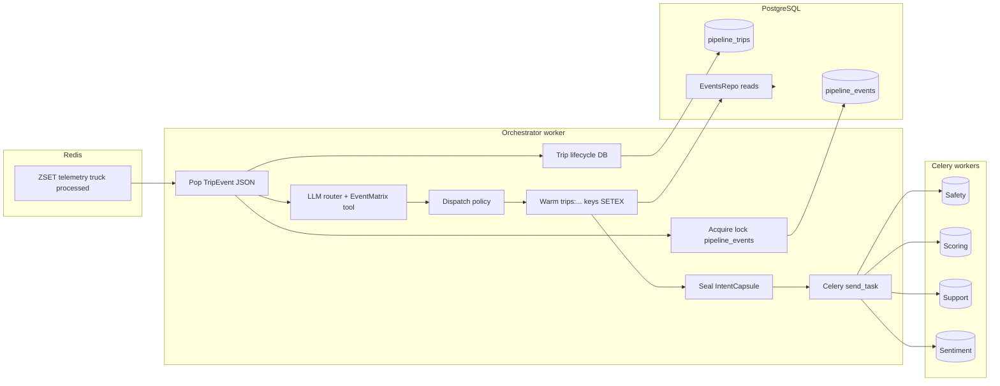
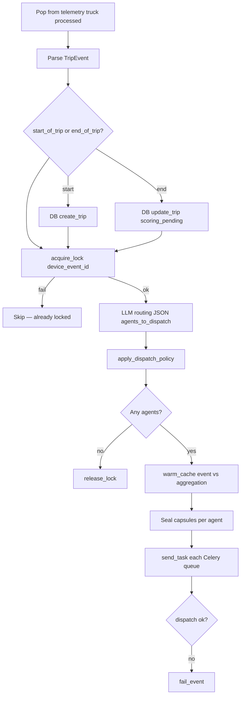
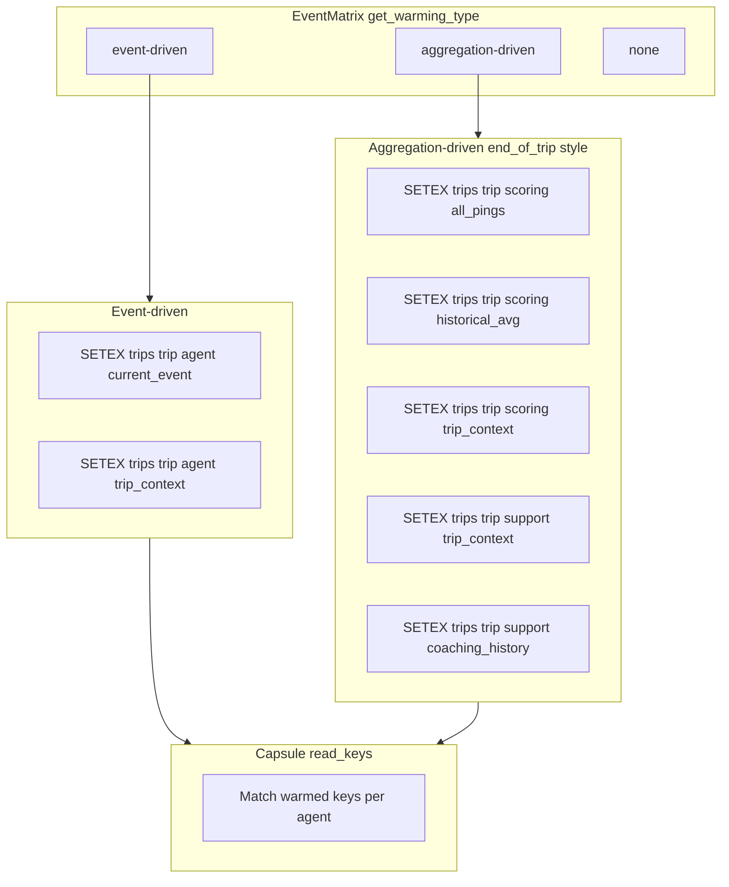
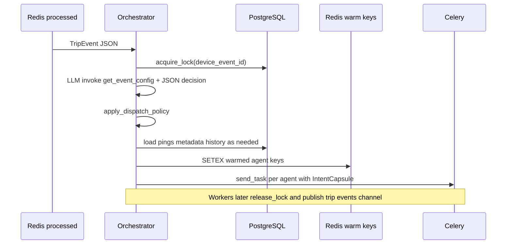

# Orchestrator Agent

The **Orchestrator** is TraceData’s **central router and dispatcher**. It does **not** score trips or author coaching copy. It:

1. **Consumes** clean **`Trip_event`** JSON from Redis **processed** queues per truck.
2. Owns **trip lifecycle** side effects in Postgres (**`pipeline_trips`**: create on `start_of_trip`, mark **scoring_pending** on `end_of_trip`).
3. **Acquires a DB lease** on the event (`device_event_id`) **before** dispatching work.
4. Asks a **LangGraph ReAct-style LLM router** (with **EventMatrix** via tools) **which agents** should run.
5. Applies **deterministic dispatch policy** (e.g. defer support on harsh events until after scoring; **never** dispatch Support on the same `end_of_trip` event as Scoring; **force** immediate Support on critical types).
6. **Warms Redis** with scoped keys per agent (`trips:{trip_id}:{agent}:{...}`).
7. Builds **`IntentCapsule`** + **`ScopedToken`** (`read_keys` / `write_keys`) and **sends Celery tasks** to worker queues.

Workers (**Safety**, **Scoring**, **Support**, **Sentiment**) execute asynchronously; each **releases its lock** and **publishes completion** when done (see `TDAgentBase`).

---

## Product role vs worker agents

| Concern | Owner |
|--------|--------|
| **Which agents run for this event?** | Orchestrator (LLM + EventMatrix + policy). |
| **Trip score 0–100** | Scoring Agent (after warmup). |
| **Harsh-event enrichment / safety classification** | Safety Agent. |
| **Coaching narrative / recommendations** | Support Agent — for normal end-of-trip coaching, **after** Scoring (see `coaching_ready` chain below). |

**End-of-trip coaching chain (implemented):** On **`end_of_trip`**, the orchestrator only dispatches **Scoring** and persists **`coaching_pending_after_scoring`** on **`trip:{trip_id}:context`** when **`_should_dispatch_coaching`** is true (preflight heuristic; not the final LLM score). After Scoring **succeeds**, **`schedule_coaching_ready_if_pending`** inserts a synthetic **`pipeline_events`** row and enqueues an internal **`coaching_ready`** `TripEvent` onto **`telemetry:{truck_id}:processed`**. The orchestrator then warms Support with **`trips:…:support:trip_context`** that embeds **`scoring_output`** (from **`trip:{id}:scoring_output`**) and **`safety_output`** (latest **`trip:{id}:safety_output`** from mid-trip Safety runs — not a full trip aggregation yet), then dispatches Support only.

**Heuristic vs scored coaching:** Decide whether to enqueue the second wave still uses **`_estimate_trip_score`** / flagged counts at trip end; converging that gate with the **actual** score returned by Scoring is a reasonable follow-up (e.g. re-evaluate after scoring before enqueueing `coaching_ready`).

---

## Runtime stack

| Piece | Implementation |
|-------|------------------|
| **LLM router** | `agents.base.agent.Agent` + `create_react_agent` pattern (`build_react_graph`), tools from `agents/orchestrator/tools.py`, system prompt in `OrchestratorAgent`. |
| **Truth for routing** | **`EVENT_MATRIX`** in `common/config/events.py` — exposed via **`get_event_config`** tool. |
| **DB lease / trips** | **`DBManager`** (`agents/orchestrator/db_manager.py`) → **`EventsRepo`** / **`TripsRepo`**. |
| **Redis** | **`RedisClient`** — pop processed, SETEX warm keys, trip runtime context. |
| **Workers** | **Celery** `send_task` with `intent_capsule` kwarg. |

---

## Main loop (high level)

1. **Discover trucks** — `KEYS telemetry:*:processed` (dynamic; no fixed truck list required).
2. For each truck, **ZPOP**-style pop from **`telemetry:{truck_id}:processed`** (`pop_from_processed`).
3. **`_handle_event`**: parse **`TripEvent`** → **`_handle_trip_lifecycle`** → **`_acquire_and_dispatch`**.

---

## `_acquire_and_dispatch` sequence

1. **`acquire_lock(device_event_id)`** — if fail, skip (another consumer holds the row).
2. **`_get_routing_decision`** — LLM **`invoke`** with `get_event_config` tool; expect JSON with **`agents_to_dispatch`**, **`action`**, etc.
3. **`_apply_dispatch_policy`** — adjust list:
   - **Flagged harsh types** (`harsh_brake`, …): append to **`trip:{trip_id}:context`** (`flagged_events`); **strip Support** from this event’s dispatch (Support deferred toward trip completion).
   - **`end_of_trip`**: set **`coaching_pending_after_scoring`** on **`trip:{trip_id}:context`** when **`_should_dispatch_coaching`**; **always strip** Support (second wave only).
   - **`coaching_ready`**: normalize dispatch list to **Support** only.
   - **Critical types** (`collision`, `rollover`, `driver_sos`): ensure **Support** present (immediate path unchanged).
4. If no agents → **release lock** and return.
5. **`_warm_cache`** — event-driven, aggregation-driven, or **`post_scoring_support`** for **`coaching_ready`** (`get_warming_type` from Event Matrix).
6. **`_seal_capsule`** per agent — **read_keys** match warmed keys.
7. **`_dispatch`** — **`celery.send_task`** per agent with **`capsule.model_dump()`**.
8. If dispatch fails → **`fail_event`**.

---

## Cache warming strategies

| Strategy | When (`get_warming_type`) | Data loaded | Typical TTL |
|----------|---------------------------|-------------|-------------|
| **Event-driven** | Safety-style / single-event paths | Current event row + trip metadata from Postgres → per-agent **`current_event`**, **`trip_context`** | ~300s |
| **Aggregation-driven** | `end_of_trip` (Scoring only on that event) | **All pings** for trip, rolling avg, trip metadata | 3600s for aggregation keys |
| **post_scoring_support** | Internal **`coaching_ready`** | Trip metadata, **`flagged_events`**, coaching history, plus **`trip:{trip_id}:scoring_output`** and **`trip:{trip_id}:safety_output`** merged into **`trips:{trip_id}:support:trip_context`** | 3600s |

**Scoring** on **`end_of_trip`**: `trips:{trip_id}:scoring:all_pings`, `historical_avg`, `trip_context`.

**Support** on **`coaching_ready`**: `trips:{trip_id}:support:trip_context` (includes embedded scoring + safety snapshots), `coaching_history`.

---

## Redis keys the orchestrator uses

### Reads / pops

| Key | Structure | Role |
|-----|-----------|------|
| `telemetry:{truck_id}:processed` | ZSET | **Input** — members are **`TripEvent` JSON** strings (post-ingestion). |

### Writes (warming)

| Key pattern | Typical TTL | Role |
|-------------|-------------|------|
| `trips:{trip_id}:{agent}:current_event` | 300s | Event-driven — current DB event snapshot. |
| `trips:{trip_id}:{agent}:trip_context` | 300s / 3600s | Metadata (and merged fields for scoring/support). |
| `trips:{trip_id}:scoring:all_pings` | 3600s | All trip pings JSON list. |
| `trips:{trip_id}:scoring:historical_avg` | 3600s | e.g. `rolling_avg_score`. |
| `trips:{trip_id}:support:coaching_history` | 3600s | Recent coaching rows. |

### Trip runtime context (flagged events for EOT)

| Key | Role |
|-----|------|
| `trip:{trip_id}:context` | **STRING** JSON — **`flagged_events`**, optional **`historical_avg_score`**, merged via `_load_trip_runtime_context` / `_save_trip_runtime_context` (TTL **CONTEXT_TTL_HIGH** when saved). |

Capsule **fallback** read_keys (no warming) may reference **`trip:{trip_id}:context`** and **`trip:{trip_id}:smoothness_logs`** — not the primary path when Event Matrix supplies a warming type.

---

## PostgreSQL (orchestrator reads / writes)

| Table | Typical use |
|-------|-------------|
| **`pipeline_events`** | Lock columns (`status`, `locked_by`, …); ingestion already inserted the row. |
| **`pipeline_trips`** | **Insert** on `start_of_trip` — **Update** on `end_of_trip` (`scoring_pending`, …). |
| **Read via `EventsRepo`** | **`get_event_by_id`**, **`get_trip_metadata`**, **`get_all_pings_for_trip`**, **`get_rolling_average_score`**, **`get_coaching_history`**. |

The orchestrator **does not** write **`scoring_schema`** tables.

---

## Celery dispatch map

| Agent name in capsule | Queue (settings) | Task |
|----------------------|------------------|------|
| `safety` | `td:agent:safety` | `tasks.safety_tasks.analyse_event` |
| `scoring` | `td:agent:scoring` | `tasks.scoring_tasks.score_trip` |
| `support` / `driver_support` | `td:agent:support` | `tasks.support_tasks.generate_coaching` |
| `sentiment` | `td:agent:sentiment` | `tasks.sentiment_tasks.analyse_feedback` |

Unknown agent names → log **`unknown_agent`**, skip.

---

## Tools (LLM)

Primary tool: **`get_event_config(event_type)`** — returns EventMatrix slice + **`agents_from_action`** mapping.

(Optional / future tools may live in the same module; see `agents/orchestrator/tools.py`.)

---

## Diagrams (Mermaid)

GitHub renders these in the preview.

### 1. Position in the pipeline

### 2. One event through the orchestrator

### 3. Cache warming vs capsule read_keys

### 4. Sequence — lock, route, warm, dispatch

---

## Limitations and operational notes

- **Requires** `OPENAI_API_KEY` or `ANTHROPIC_API_KEY` for routing (same as scoring LLM dependency for workers).
- **LLM JSON parse failure** → empty dispatch, lock released when policy yields no agents.
- **Truck discovery** via `KEYS` — fine for dev; at scale consider **SCAN** or an index set of active trucks.
- **Multiple agents** on one event each get **their own** Celery task and **same** `device_event_id` for lock semantics; first successful worker path depends on product rules (typically one lock row per orchestrated event — verify if parallel workers conflict).

---

## Key source files

| Area | Path |
|------|------|
| Orchestrator | `backend/agents/orchestrator/agent.py` |
| Post-scoring → Support enqueue | `backend/agents/orchestrator/coaching_followup.py` |
| DB facade | `backend/agents/orchestrator/db_manager.py` |
| Router tools | `backend/agents/orchestrator/tools.py` |
| Event Matrix | `backend/common/config/events.py` |
| Redis schema | `backend/common/redis/keys.py` |
| Capsule models | `backend/common/models/security.py` |
| Celery app | `backend/celery_app.py` |
| LLM Agent helper | `backend/agents/base/agent.py` (`Agent`, `build_react_graph`) |

---

## Related docs

- **[Scoring Agent](./5_scoring_agent.md)** — consumes orchestrator-warmed **`trips:…:scoring:*`** keys.
- **[Input data](./0_input_data.md)** — telemetry shapes into ingestion.
