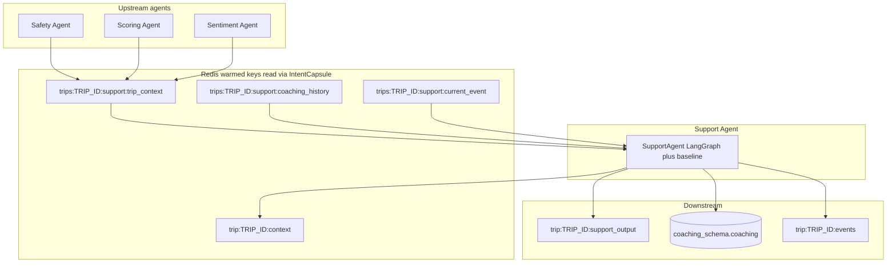
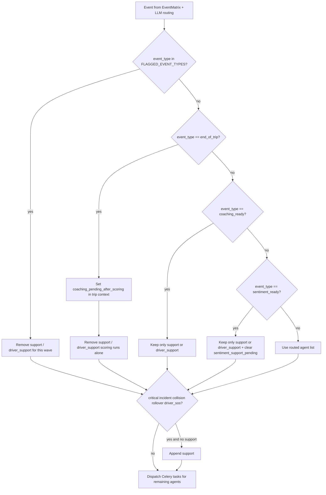
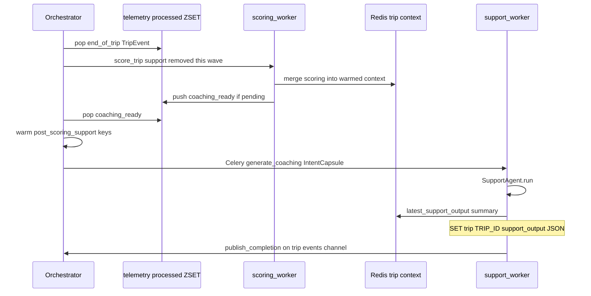
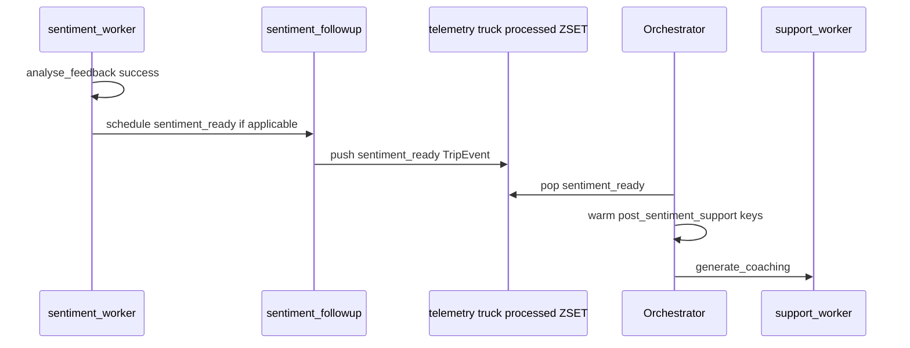
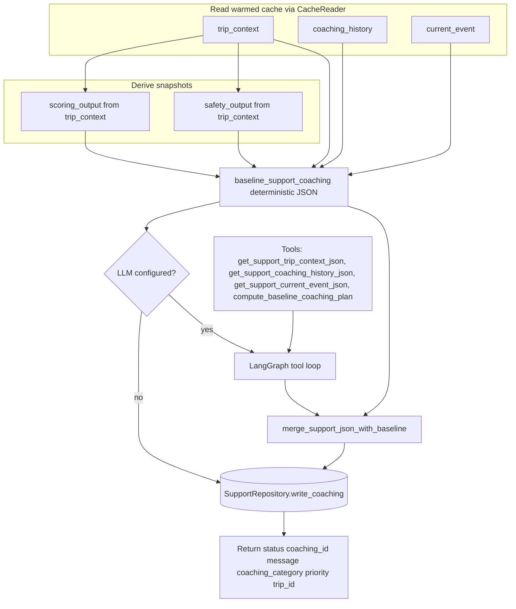

# Support Agent (Driver Coaching & Improvement)

## Scope

The Support Agent is the human-centric coaching layer in TraceData. It turns warmed **trip context** (including **scoring** and **safety** snapshots when present), **coaching history**, and optional **current event** data into a short, actionable coaching message and persists it to **`coaching_schema`**.

It answers:

> How can this driver improve safety and efficiency based on what happened during this trip?

**Implementation:** `backend/agents/driver_support/agent.py` (`SupportAgent`), invoked by Celery task `tasks.support_tasks.generate_coaching` on queue `td:agent:support` (`backend/agents/driver_support/tasks.py`).

---

## Use cases (as implemented)

| Conceptual use case | How it is triggered in code |
|---------------------|-----------------------------|
| **Post-trip coaching** | Orchestrator strips `support` from the **`end_of_trip`** wave; after **`ScoringAgent`** succeeds, `schedule_coaching_ready_if_pending` may push a **`coaching_ready`** `TripEvent` onto `telemetry:{truck_id}:processed`. Orchestrator then dispatches **support** only (warming: `post_scoring_support`). |
| **After driver feedback sentiment** | **`sentiment_ready`** internal event (from `agents.orchestrator.sentiment_followup`) is enqueued the same way; orchestrator dispatches support with `post_sentiment_support` warming. |
| **Same-wave coaching (non–end-of-trip)** | EventMatrix **`Coaching`** action can include `support` with `scoring` **unless** orchestrator policy removes it: all **`FLAGGED_EVENT_TYPES`** (`harsh_brake`, `hard_accel`, `harsh_corner`, `speeding`) drop support for that event; **`end_of_trip`** always drops support for that event. |
| **Critical incidents** | For `collision`, `rollover`, `driver_sos`, policy **appends** `support` if missing (`CRITICAL_IMMEDIATE_SUPPORT_TYPES` in `agents/orchestrator/agent.py`). |

---

## Where the Support Agent sits



Warming types from `get_warming_type()` in `common/config/events.py`:

- **`post_scoring_support`** — `coaching_ready`
- **`post_sentiment_support`** — `sentiment_ready`
- **`aggregation-driven`** / **`event-driven`** — other routes that still dispatch `support` (see orchestrator policy below)

Capsule **read keys** are built in `OrchestratorAgent._seal_capsule()` and point at the `trips:{trip_id}:support:…` keys above (not raw `trip:{id}:context` for those follow-up paths).

---

## Orchestrator dispatch policy (simplified)



Routing still uses **`compute_routing_agents()`**, which maps `AgentType.DRIVER_SUPPORT` to the short dispatch id **`support`** (see `common/config/events.py`). The Redis output key uses **`capsule.agent`**, so it is normally **`trip:{trip_id}:support_output`**. If a capsule ever used `driver_support`, the key would be `trip:{trip_id}:driver_support_output` (fallback branch in `_apply_dispatch_policy`).

---

## Sequence: post-scoring coaching (`coaching_ready`)



Details: `agents/orchestrator/coaching_followup.py` enqueues **`coaching_ready`**; synthetic row in `pipeline_events` uses `device_event_id` prefix `cr-`.

---

## Sequence: post-sentiment support (`sentiment_ready`)



---

## Internal execution: `SupportAgent._execute`



**Final model JSON** (from the LLM, merged with baseline) is:

- `coaching_category`: `follow_up` | `event_based` | `post_trip` | `general`
- `message`: short coaching text
- `priority`: `high` | `normal` | `low`

Prompts: `backend/agents/driver_support/prompts.py` (`SUPPORT_SYSTEM_PROMPT`).

Default model: **`gpt-4o-mini`** via `load_llm(OpenAIModel.GPT_4O_MINI)` when the API key is available; if not, the agent uses **baseline only**.

---

## Outputs (actual persistence)

### Redis

| Key | Role |
|-----|------|
| `trip:{trip_id}:support_output` | JSON string: result of `SupportAgent._execute` after successful run (`status`, `coaching_id`, `message`, `coaching_category`, `priority`, `trip_id`). Written in `TDAgentBase.run` using `capsule.agent` in the key name. |
| `trip:{trip_id}:context` | Updated with `latest_support_output` subset after success (`SupportAgent._update_trip_context_with_support_output`). TTL: `RedisSchema.Trip.CONTEXT_TTL_HIGH` (48h) on store. |
| `trip:{trip_id}:events` | Celery task **`_generate_coaching_async`** publishes completion (pub/sub + list) with `"agent": "driver_support"` in the payload (`agents/driver_support/tasks.py`). |

### PostgreSQL

- **`coaching_schema.coaching`** — `SupportRepository.write_coaching` (category, message, priority, `trip_id`, `driver_id`).

### Example: `trip:{trip_id}:support_output` payload

```json
{
  "status": "success",
  "coaching_id": "<uuid>",
  "message": "Post-trip coaching using your score and latest safety summary. Trip score: 72.",
  "coaching_category": "post_trip",
  "priority": "normal",
  "trip_id": "TRIP-..."
}
```

The richer “feedback_content / recommended_learning” shape in older docs is **not** what the worker writes today; the LLM is instructed to keep themes inside `message`.

---

## Companion agents

- **Scoring Agent** — Produces data that ends up in **`trip_context.scoring_output`** (rates, scores, coaching flags) for the support tool loop.
- **Safety Agent** — Produces **`trip_context.safety_output`** for context-aware tone (hazards, triage).
- **Sentiment Agent** — Feeds follow-up **`sentiment_ready`** so support can run with sentiment context in trip context.

---

## Limitations (implementation-aligned)

- Does **not** mutate scoring rows or trip scores; it **reads** snapshots from warmed context.
- **No support** on the same orchestrator wave as **`end_of_trip`**; coaching is **deferred** via **`coaching_ready`** when `coaching_pending_after_scoring` is set and scoring succeeds.
- **No support** on the same wave for **`FLAGGED_EVENT_TYPES`** harsh events (support is stripped for that event).
- Requires **DB** access in the worker (`generate_coaching` uses `create_async_engine` + `SupportRepository`).
- **Asynchronous** via Celery; latency depends on queue depth and LLM latency.

---

## System prompt

The production system prompt is **`SUPPORT_SYSTEM_PROMPT`** in `backend/agents/driver_support/prompts.py` (Fleet Management / driver coaching objectives, JSON-only final output).

For a **standalone OpenAI smoke test** (no Celery/Redis), see `backend/scripts/fleet_support_agent_demo.py`.

---

## Expected input shape (documentation / demo)

The worker does **not** consume a standalone “fleet JSON” file; it consumes an **IntentCapsule** and **JSON blobs** at Redis keys. The following is a useful **logical** shape for demos and product docs:

```json
{
  "event_id": "string",
  "driver_id": "string",
  "trip_metadata": {
    "timestamp": "ISO8601",
    "location": { "lat": 0, "long": 0 },
    "telemetry_incident": "string"
  },
  "driver_input": {
    "text": "string",
    "category": "string"
  }
}
```

---

## Running the agent

### Production

The Support Agent runs as **`support_worker`** in Docker Compose (see root [README](../../README.md)): orchestrator dispatches **`tasks.support_tasks.generate_coaching`** after internal events such as **`coaching_ready`** / **`sentiment_ready`** (and other routed cases per policy above).

### Local LLM smoke test (optional)

1. Prerequisites: Python 3.11+, OpenAI API key, backend dependencies (`uv sync` or a venv under `backend/`).
2. Set **`OPENAI_API_KEY`** (and optionally **`OPENAI_MODEL`**, default `gpt-4o-mini` in the demo). Use `.env` at repo root or `backend/`.
3. Run:

```bash
cd backend
python -m scripts.fleet_support_agent_demo
```

4. Adjust the example payload in `backend/scripts/fleet_support_agent_demo.py` as needed.
