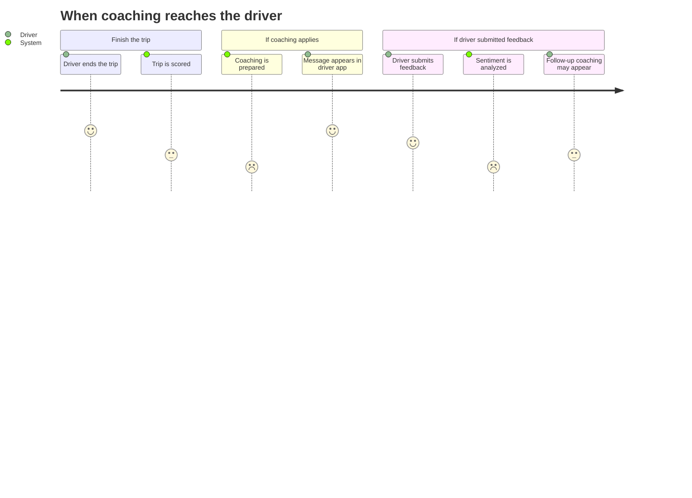
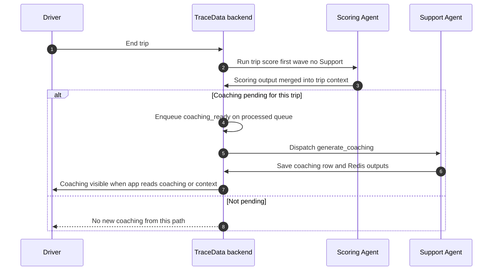
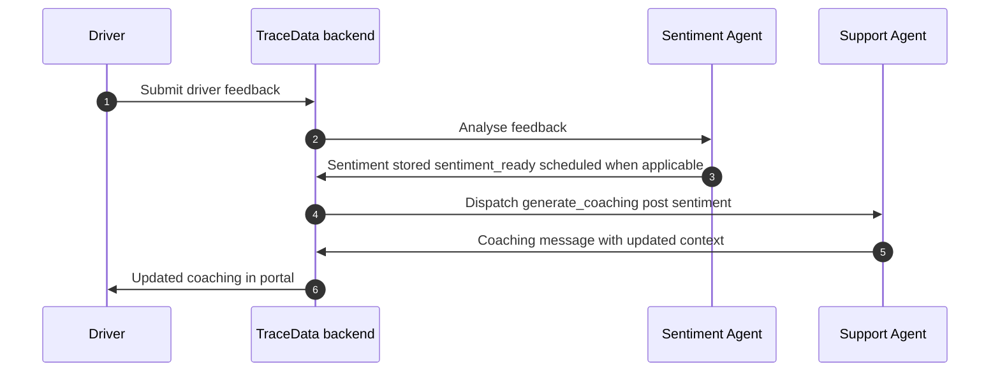
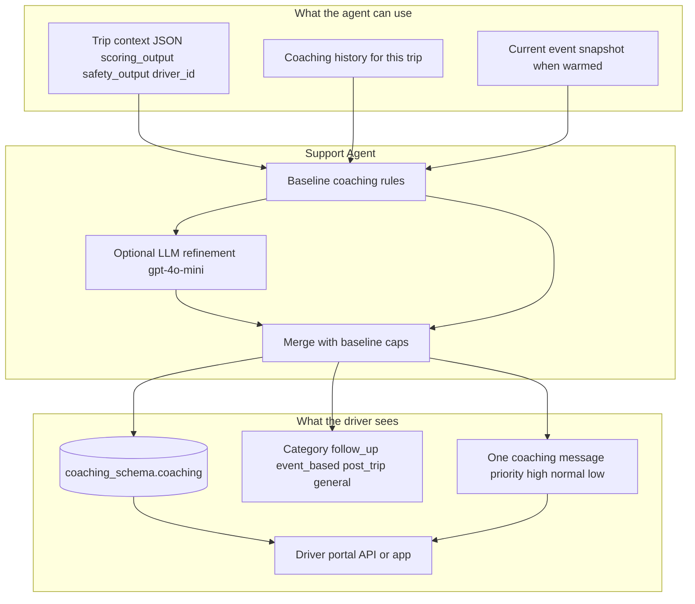

# Support Agent Specification

## Purpose

The **driver** receives **short, constructive coaching** in the driver app — not a new score and not a penalty decision. The Support Agent reads what already happened on the trip (including **safety context** and **trip scoring** when available), adds **prior coaching on the same trip** if any, and writes a **single coaching message** the driver can act on.

It does **not** replace the **fleet manager** on emergencies. It **does not** change the **driver’s** score; the Scoring Agent owns the number.


## Use cases

### UC1: End-of-trip coaching (main path)

**Who it is for:** The **driver** has finished a trip and the **system** decided coaching may help (rules combine trip signals and flagged events; see orchestrator `coaching_pending_after_scoring` after `end_of_trip`).

**What the driver sees:** Coaching appears **after** the trip ends and **after** scoring has run—not in the same moment as every harsh brake ping.

**Flow (plain language):** Driver ends trip → **system** scores the trip → if coaching is pending, a follow-up job runs → Support Agent reads warmed trip context (including scoring and safety summaries) → generates coaching → **driver** sees a message in the driver portal.

**Delayed by design:** Routine harsh events (`harsh_brake`, `hard_accel`, `harsh_corner`, `speeding`) do **not** trigger Support in that same event wave; coaching for those patterns is meant to land **with end-of-trip context**, not as a separate ping per event.

**Example:** The **driver** had several hard brakes during a congested merge. After the trip, the **driver** sees coaching that references **trip score** and **safety context**, with tips on anticipation and following distance—not a generic “drive better.”


### UC2: Coaching after driver left feedback

**Who it is for:** The **driver** submitted **driver feedback** (e.g. note or appeal) that went through the Sentiment Agent.

**What the driver sees:** After sentiment analysis completes, the **system** can queue a **follow-up coaching** pass that takes that feedback context into account.

**Flow:** Driver feedback → Sentiment Agent → internal `sentiment_ready` event → Orchestrator dispatches Support with **post-sentiment** warmed keys → coaching message updated or added for that trip context.

**Example:** The **driver** explained a harsh brake as avoiding a cut-in. Sentiment is captured; the next coaching message can acknowledge stress while still reinforcing safe habits.


### UC3: Serious incident—supportive check-in (parallel to fleet action)

**Who it is for:** **Critical** events such as **collision**, **rollover**, or **driver SOS** (priority CRITICAL).

**What the driver sees:** The **fleet manager** and safety workflows handle the emergency. The orchestrator may still **add Support** to the dispatch list so the **driver** can receive a **supportive, operational coaching-style check-in** in addition—not instead of escalation.

**Flow:** Critical event routed → Safety (and other agents as configured) → policy ensures `support` is included if missing → Support may run with event-driven context where warmed.

**Example:** A collision is logged. While the **fleet** coordinates response, the **driver** may still see a short, careful message in-app (tone constrained by prompts; no legal or regulatory claims).


### UC4: Same-trip follow-up coaching

**Who it is for:** The **driver** already received coaching on this trip and another Support run is triggered (e.g. additional internal event).

**What the driver sees:** The next message may be labeled as **follow-up** and reference that earlier coaching exists on the trip.

**Flow:** Warmed **coaching history** for the trip is non-empty → baseline logic prefers `follow_up` category.

**Example:** “Continuing coaching—prior notes on this trip. Keep applying prior guidance and drive safely.”


## Diagrams 

### 1. Driver journey — `journey`



### 2. UC1 — Post-trip coaching pipeline — `sequenceDiagram`



### 3. UC2 — Feedback then coaching — `sequenceDiagram`



### 4. What shapes the coaching message — `flowchart`




## Tools used (implementation names)

These are **LangChain tools** exposed to the model inside `SupportAgent` (`backend/agents/driver_support/tools.py`). They return **JSON strings** built from Redis-warmed data the orchestrator already placed for this run.

| Tool | What it gives the model (driver-facing meaning) |
|------|---------------------------------------------|
| `get_support_trip_context_json()` | Trip-wide picture: may include **scoring** and **safety** snapshots merged for this trip. |
| `get_support_coaching_history_json()` | Earlier coaching touches on **this trip** so the message can feel continuous. |
| `get_support_current_event_json()` | The **current event** snapshot when this run is event-driven (often empty on pure post-trip coaching). |
| `compute_baseline_coaching_plan()` | A **deterministic** first draft: category, short message, priority—always available even if the LLM is off. |

---

## DB tables

**Schema:** `coaching_schema`

| Table | Purpose |
|-------|---------|
| `coaching` | **Primary Support write:** `trip_id`, `driver_id`, `coaching_category`, `message`, `priority`, `created_at`, returns `coaching_id`. |
| `driver_feedback` | Stores driver feedback rows (written through `SupportRepository.write_driver_feedback` when used by ingestion/API paths—not the main `_execute` coaching insert). |


## Redis

| Key pattern | Operation | Driver / fleet meaning |
|-------------|-----------|------------------|
| `trips:{trip_id}:support:trip_context` | GET (via capsule) | Packaged trip story for this coaching run (includes scoring/safety blobs when warmed). |
| `trips:{trip_id}:support:coaching_history` | GET | Prior coaching list for this trip. |
| `trips:{trip_id}:support:current_event` | GET | Event snapshot when relevant. |
| `trip:{trip_id}:support_output` | SET | Latest **structured result** JSON from the agent run (key uses capsule agent id, usually `support`). |
| `trip:{trip_id}:context` | GET/SET | Trip runtime context; after success, **`latest_support_output`** summary is merged in for other services. |
| `trip:{trip_id}:events` | PUBLISH + list | Completion notifications; Celery completion payload uses `"agent": "driver_support"`. |

Queue: Celery task `tasks.support_tasks.generate_coaching` on **`td:agent:support`**.


## Workflow

**ST-SUP-01-01 Receive job**  
Orchestrator sends an **IntentCapsule** after routing (e.g. `coaching_ready`, `sentiment_ready`, or other allowed routes). Worker task `generate_coaching` starts.

**ST-SUP-01-02 Load warmed data**  
Read only keys allowed on the capsule; build `trip_context`, `coaching_history`, optional `current_event`.

**ST-SUP-01-03 Derive snapshots**  
From `trip_context`, take **scoring** and **safety** embedded outputs when present.

**ST-SUP-01-04 Baseline plan**  
`baseline_support_coaching(...)` chooses category and default message (follow-up vs event vs post-trip vs general).

**ST-SUP-01-05 Optional LLM pass**  
If OpenAI is configured, LangGraph runs the tool loop, then parses **one JSON object** from the assistant: `coaching_category`, `message`, `priority`.

**ST-SUP-01-06 Merge and validate**  
`merge_support_json_with_baseline` keeps allowed enums only.

**ST-SUP-01-07 Persist and signal**  
Insert **`coaching_schema.coaching`**; base class writes **`trip:{trip_id}:support_output`**; `SupportAgent` updates **`trip:{trip_id}:context`** `latest_support_output`; task publishes **completion** on **`trip:{trip_id}:events`**.


## Coaching result JSON (stored on `trip:{trip_id}:support_output`)

Shape matches **`SupportAgent._execute`** success return (see `backend/agents/driver_support/agent.py`). This is what downstream services read from Redis; the **full sentence the driver reads** is in `message` and in the `coaching` table.

```json
{
  "status": "success",
  "coaching_id": "550e8400-e29b-41d4-a716-446655440000",
  "message": "Post-trip coaching using the trip score and latest safety summary. Trip score: 72.",
  "coaching_category": "post_trip",
  "priority": "normal",
  "trip_id": "TRP-2026-a1b2c3d4-e5f6-47g8-h9i0-j1k2l3m4n5o6"
}
```

Allowed values:

- `coaching_category`: `follow_up` | `event_based` | `post_trip` | `general`
- `priority`: `high` | `normal` | `low`


## Limitations

- **Does not change** trip or driver scores; it **reads** scoring output from context only.
- **Does not** run on the **same orchestrator wave** as **`end_of_trip`**; post-trip coaching uses the **`coaching_ready`** follow-up after scoring when pending.
- **Does not** run for **routine harsh events** in that harsh event’s wave—Support is **stripped** for `harsh_brake`, `hard_accel`, `harsh_corner`, `speeding` on that event so coaching stays **trip-level** for UC1.
- **Needs** warmed Redis context prepared by the orchestrator; empty or stale context produces weaker or generic baseline coaching.
- **LLM optional:** if the model is unavailable, the **driver** still receives **baseline** coaching text, not silence.
- **Requires** DB connectivity in the worker to insert **`coaching_schema.coaching`**.
- **No legal or regulatory claims**; prompts keep guidance operational.


## Running and references

- **Production:** `support_worker` in Docker Compose; see root [README](../../README.md).
- **Code:** `backend/agents/driver_support/agent.py`, `tasks.py`, `prompts.py`, `tools.py`.
- **Optional local demo (OpenAI only):** `python -m scripts.fleet_support_agent_demo` from `backend/` (does not exercise Redis/Celery).
