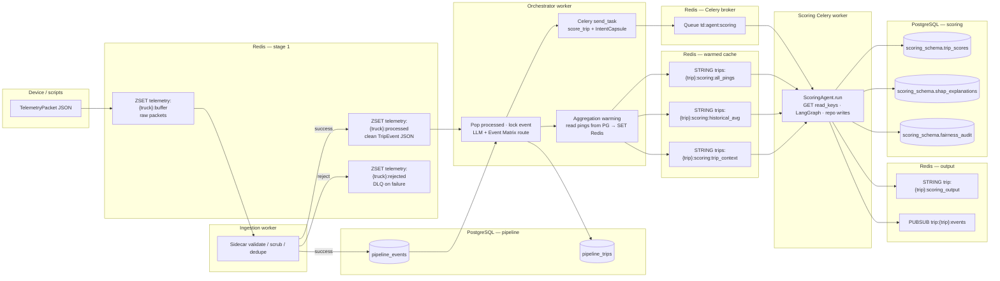
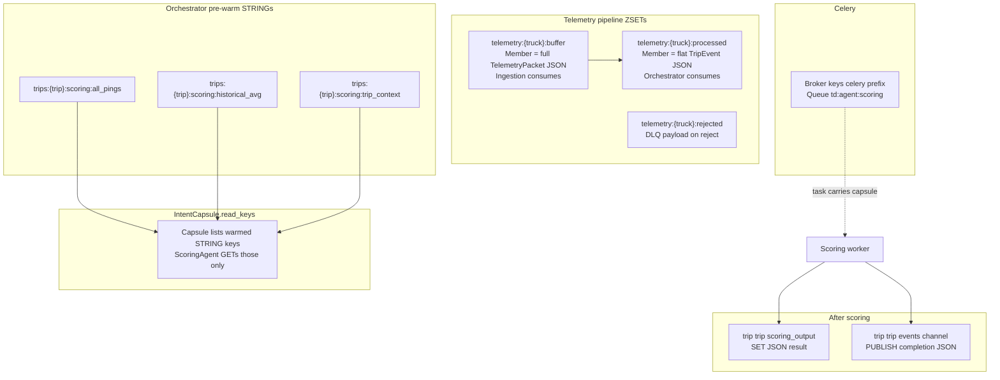
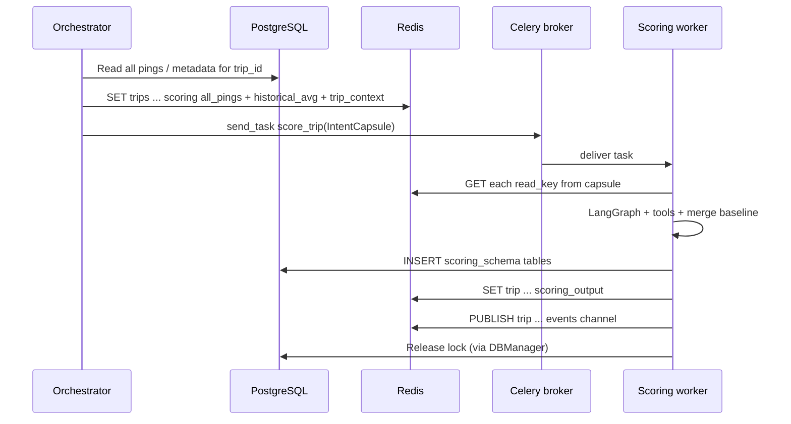
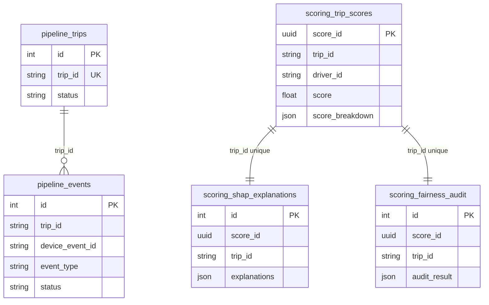
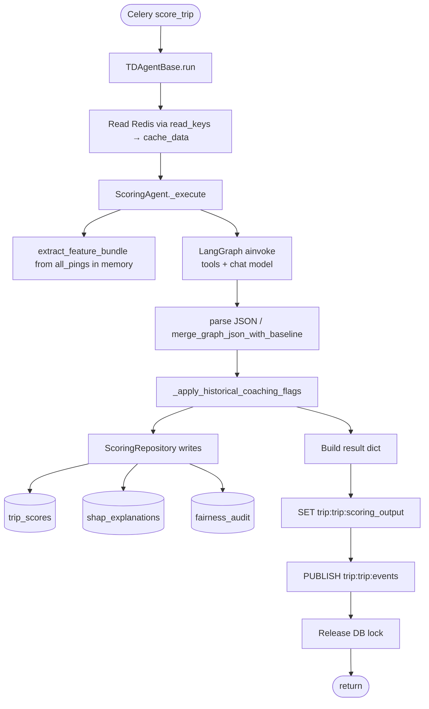

# Scoring Agent

The Scoring Agent is TraceData’s **trip-level analytical engine**. It runs **once per trip** when the pipeline has processed an **`end_of_trip`** (driver or fleet marks the trip complete in the telemetry flow). The orchestrator dispatches it; the agent does not subscribe to raw buffers.

It answers two product questions (outputs are intentionally separable in the design):

1. **“How smooth was this driver on this trip?”** → **Trip score (0–100)** from **smoothness signals only**.
2. **“How does this trip compare to history?”** → Uses **orchestrator-warmed `historical_avg`** to compute and emit **`driver_score`** (currently a deterministic blend of trip score + rolling baseline). This keeps the output contract stable while allowing an ML model swap later.

---

## Product principles

- **Reward smooth control.** The numeric score is built from **smoothness aggregates** (jerk, speed consistency, lateral behaviour, engine/idle), not from “how many harsh events happened.”
- **Harsh events → help, not punishment.** Harsh driving (and in-window harsh counts on `smoothness_log` batches) contribute to **coaching signals** (`coaching_required`, `coaching_reasons`). They **do not** reduce the heuristic component sum that forms the baseline trip score. Deliberately avoiding “protect the score, not the road” incentives.
- **Safety enrichment** (hazard context on harsh events) is owned by the **Safety Agent** and may feed **Support**; the Scoring Agent today consumes **warmed `all_pings`** and does not call Safety APIs directly.
- **`smoothness_log` in `EVENT_MATRIX`** carries **ML weight −0.2** as a **reward bonus**, not a penalty on the trip score formula.

---

## Runtime architecture

| Layer | Responsibility |
|--------|----------------|
| **Celery** | `tasks.scoring_tasks.score_trip` invokes `ScoringAgent.run(IntentCapsule)`. |
| **`TDAgentBase`** | Scoped Redis reads (`read_keys`), then `_execute`; on success stores **`trip:{trip_id}:scoring_output`**, releases DB lock, **PUBLISH**es completion on **`trip:{trip_id}:events`**. |
| **LangGraph** | `build_tool_loop_graph`: chat model + **ToolNode** + `tools_condition` (no ad-hoc `llm.invoke` as the sole “brain”). |
| **`ScoringRepository`** | **Writes only** to **`scoring_schema`** (trip score, SHAP blob, fairness audit). |

The agent **does not** query Postgres for **scoring inputs**; inputs arrive via **Redis keys** listed on the capsule after **orchestrator cache warming**.

---

## Trigger and upstream flow

1. Ingestion writes **`pipeline_events`** and enqueues clean events to **`telemetry:{truck_id}:processed`**.
2. Orchestrator consumes processed events, acquires a **DB lock**, routes via LLM + **Event Matrix**, and for **`end_of_trip`** with scoring in the dispatch set performs **aggregation-driven warming**.
3. Warming loads trip data from **Postgres** (e.g. all pings for the trip) into Redis under **`trips:{trip_id}:scoring:*`**, builds an **`IntentCapsule`** with **`read_keys`** pointing at those keys, and sends **`tasks.scoring_tasks.score_trip`**.

---

## Diagrams (Mermaid)

These render on **GitHub** and in most Markdown previewers that support Mermaid.

### 1. End-to-end data flow (buffer → scoring)

High-level path from raw telemetry to the Scoring Agent and its outputs. `{truck}` and `{trip}` are placeholders.

### 2. Redis queues and keys (reference)

What lives in Redis for this pipeline (names are patterns; `{truck}` / `{trip}` vary per id).

### 3. Sequence — `end_of_trip` to scoring completion

Time order for the scoring slice (simplified; lock/device_event_id details omitted).

### 4. PostgreSQL tables the pipeline touches

Scoring **writes** only `scoring_schema` tables. It **does not SELECT** them for inputs. Orchestrator and ingestion use **`public`** pipeline tables for warming and lifecycle.

Note: Physical schema names are **`public.pipeline_events`**, **`public.pipeline_trips`**, and **`scoring_schema.trip_scores`** (etc.). The diagram shortens labels for readability.

### 5. Inside the Scoring Agent (one run)

---

## Redis (as implemented)

### Warmed input (orchestrator → capsule `read_keys`)

Typical pattern (exact keys are whatever the orchestrator attaches to the capsule):

| Key pattern | Role |
|-------------|------|
| `trips:{trip_id}:scoring:all_pings` | JSON list of trip events / pings (includes **`smoothness_log`** rows and any other stored event shapes). |
| `trips:{trip_id}:scoring:historical_avg` | JSON object (e.g. rolling / historical averages for coaching hints). |
| `trips:{trip_id}:scoring:trip_context` | JSON trip metadata (e.g. `driver_id`). |

The agent **does not** read legacy keys **`trip:{trip_id}:context`** or **`trip:{trip_id}:smoothness_logs`** unless they are explicitly included on the capsule (today the primary path is **`trips:…:scoring:*`**).

### Output and completion

| Key / channel | Operation | Notes |
|---------------|-----------|--------|
| `trip:{trip_id}:scoring_output` | **SET** (JSON) | Result dict from `TDAgentBase.run` after `_execute` succeeds. **No TTL** in current code (not `SETEX`). |
| `trip:{trip_id}:events` | **PUBLISH** | Completion payload (JSON). **No `LPUSH`** in the current base implementation. |

---

## Tools (LangGraph)

Built per run via **`build_scoring_tools(all_pings, trip_context, historical_avg)`** in `agents/scoring/tools.py`:

| Tool | Purpose |
|------|---------|
| `get_trip_context_json` | Returns warmed **trip context** JSON. |
| `get_historical_avg_json` | Returns warmed **historical_avg** JSON. |
| `extract_smoothness_features_json` | Runs **`extract_feature_bundle(all_pings)`** (smoothness + harsh metadata). |
| `compute_behaviour_score_from_features` | Deterministic **score + breakdown + placeholders** from the features JSON. |

**DB writes are not tools**; **`ScoringRepository`** is called from **`ScoringAgent._execute`** after the graph returns and the payload is merged/clamped.

---

## Deterministic score (baseline)

Implemented in **`agents/scoring/features.py`** (`compute_components_and_baseline`):

- **Jerk (0–40):** function of **`jerk_mean_avg`** and **`jerk_max_peak`** (not a plain average of `jerk.mean` alone).
- **Speed (0–25):** from **`speed_std_avg`**.
- **Lateral (0–20):** from **`mean_lateral_g_avg`** and **`max_lateral_g_peak`**.
- **Engine / idle (0–15):** RPM distance from a nominal band and **`idle_ratio`** (derived from idle seconds vs trip window duration when batch `window_seconds` is present).

**Baseline sum** is clamped into **[0, 100]** at the payload level where applicable. The LLM may propose a score; **`merge_graph_json_with_baseline`** clamps the final **`behaviour_score`** against this baseline.

**Coaching (non-score):**

- **`harsh_event_count`** includes separate harsh event pings plus **in-window** harsh counts from nested **`smoothness_log`** `details`.
- **High idle ratio** (e.g. **`idle_ratio` > 0.25**) adds a coaching reason; this is **not** the same as a fixed “idle_seconds > 300” rule in code.

---

## PostgreSQL

**Schema:** `scoring_schema`

| Table | Written by | Content (conceptual) |
|-------|------------|----------------------|
| `trip_scores` | `ScoringRepository.write_trip_score` | Trip id, driver id, numeric score, JSON breakdown; **upsert on `trip_id`**. |
| `shap_explanations` | `write_shap_explanations` | Explanations JSON; **upsert on `trip_id`**. |
| `fairness_audit` | `write_fairness_audit` | Audit JSON; **upsert on `trip_id`**. |

---

## Current vs target result shape

**Today**, the object stored on **`trip:{trip_id}:scoring_output`** is a compact dict including `status`, `score`, `trip_score`, `driver_score`, `score_id`, `trip_id`, `score_label`, `score_breakdown`, `fairness_audit`, and optional `suggested_coaching`.

**Target** (product / API contract) may include richer fields such as **`extracted_features`**, structured **`coaching_flags`** (rates per 100 km, incident locations), **`peer_group_avg`**, and richer **`fairness_flags`**. Those should be tracked as schema evolution work; this document describes **behaviour as implemented** unless noted as roadmap.

---

## Limitations (agent boundary)

- Does **not** read scoring inputs from **Postgres** directly (only via warmed Redis).
- Does **not** read **S3** / raw compliance logs (dispute / deep SHAP on raw traces is out of band).
- Does **not** receive **demographic** fields unless explicitly added to **ScopedToken** / cache (privacy by design).
- Does **not** reduce trip score from **harsh event counts** in the deterministic baseline.
- Does **not** author long-form **coaching tips** (Driver Support Agent).
- Does **not** run before **`end_of_trip`** dispatch for the standard scoring path.

---

## Key source files

| Area | Path |
|------|------|
| Agent | `backend/agents/scoring/agent.py` |
| Features / baseline | `backend/agents/scoring/features.py` |
| Tools | `backend/agents/scoring/tools.py` |
| Prompts | `backend/agents/scoring/prompts.py` |
| Celery task | `backend/tasks/scoring_tasks.py` |
| DB writes | `backend/common/db/repositories/scoring_repo.py` |
| Base lifecycle / Redis | `backend/agents/base/agent.py` |
| Redis key helpers | `backend/common/redis/keys.py` |
| Reference smoothness payload | `backend/common/samples/smoothness_batch.py` |

---

## Local testing helpers

- **`backend/scripts/play_workflow.py`** — push a validated multi-event trip (see **`backend/docs/workflow_testing.md`**).
- **`backend/scripts/push_smoothness_to_buffer.py`** — enqueue a single **`smoothness_log`** only (ingestion input).
- **`backend/scripts/clean_datastores.py`** — **FLUSHALL** Redis + recreate ORM tables (dev only).

For an **end-to-end** scoring run you still need a full trip lifecycle (**`start_of_trip`**, pings, **`end_of_trip`**) so the orchestrator can warm **`all_pings`** and dispatch scoring; a lone smoothness ping is useful for **ingestion / processed** debugging only.
