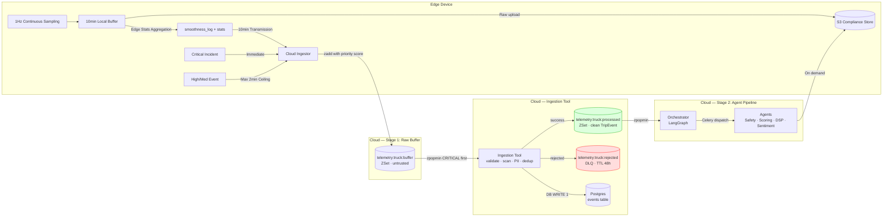

# TraceData — Input Data Architecture
## Complete Event Structure with Sample Payloads

**High-Availability Ingestion and Priority-Aware Event Processing**

SWE5008 Capstone | Phase 3 Data Engineering Record | March 2026

---

## 1. Executive Summary

This document establishes the architectural standards for the TraceData ingestion boundary. The architecture is designed to address a common industry friction point — traditional telematics systems that prioritise punitive monitoring over driver support. TraceData corrects this by building a unified, intelligence-ready event pipeline that gives equal weight to positive driving behaviour.

Four key engineering decisions underpin this architecture:

- **Generic Flat Schema** — all events share one structure, enabling consistent SHAP/LIME feature ranking across all event types
- **Two-Minute Priority Ceiling** — any event above LOW priority must reach the cloud within 120 seconds regardless of batch windows
- **1Hz Smoothness Sampling with Edge Aggregation** — device computes statistical profiles from 600 points per window and sends compact JSON; Scoring Agent applies the intelligence formula; raw points stored in S3 for compliance and dispute resolution
- **Universal Spatio-Temporal Anchor** — every ping carries `offset_seconds`, `trip_meter_km`, and `odometer_km` so every event can be precisely located in time, trip distance, and vehicle lifetime

---

## 2. Data Sources

TraceData receives data from two distinct sources. Both write into the same Redis priority buffer and flow through the same ingestion pipeline. Routing is driven entirely by `event_type` and `priority` — not by source.

| Source | Transport | Entry Point | Examples |
|---|---|---|---|
| Telematics Device | MQTT over UDP | Redis Sorted Set | collision, harsh_brake, speeding, smoothness_log |
| Driver Application | REST API (FastAPI) | Redis Sorted Set (same) | driver_sos, driver_dispute, driver_feedback |

> **Design Decision:** Source is recorded as metadata for audit trail only. No downstream agent branches on source.

---

## 3. Universal Spatio-Temporal Reference Fields

Every ping — regardless of type or source — carries four reference fields that anchor the event precisely in time, trip distance, and vehicle lifetime.

```
timestamp         → absolute UTC time of event           (ISO8601)
offset_seconds    → seconds elapsed since trip start     (relative time)
trip_meter_km     → kilometres driven since trip start   (relative distance)
odometer_km       → lifetime vehicle distance            (absolute distance)
```

### Why Trip Meter Matters For Fairness

```
Driver A — 3 harsh braking events in 8km  urban delivery  → 0.375 events/km
Driver B — 3 harsh braking events in 120km highway run    → 0.025 events/km

Without distance normalisation both look identical.
With trip_meter_km the Scoring Agent normalises correctly.
```

| Ping Type | offset_seconds | trip_meter_km | odometer_km |
|---|---|---|---|
| Emergency Ping | present | present | present |
| High-Speed Send | present | present | present |
| Medium-Speed Send | present | present | present |
| Batch Ping | present | present | present |
| Start-of-Trip | 0 | 0.0 | baseline reading |
| End-of-Trip | total trip seconds | total trip km | final reading |
| Driver App Feedback | None | None | None |

---

## 4. Priority-Based Transmission Framework

| Transmission Type | Trigger | Max Window | Sampling Rate | Priority | Purpose |
|---|---|---|---|---|---|
| Emergency Ping | Airbag / G-force > 2.5 / SOS | Immediate | 100Hz burst | CRITICAL | Life-safety, 911 dispatch |
| High-Speed Send | Harsh event detected | 30 seconds | 10Hz event | HIGH | Real-time alert and coaching |
| Medium-Speed Send | Compliance event | 2 minutes | 1Hz log | MEDIUM | Compliance monitoring |
| Batch Ping | 10-minute timer | 10 minutes | 1Hz continuous | LOW | Smoothness metrics and rewards |
| Start / End of Trip | Trip boundary | Immediate | N/A | LOW | Trip metadata, ML scoring |
| Driver App Feedback | Driver submits | Immediate | N/A | HIGH / MEDIUM / LOW | Dispute, complaint, comment |

### The Two-Minute Priority Ceiling

```
CRITICAL  → transmitted immediately              (<2 seconds)
HIGH      → transmitted within 30-second window
MEDIUM    → transmitted within 2-minute window   ← THE CEILING
LOW       → held until 10-minute batch ping
```

### Device-Side Deduplication

```
T+0s    collision detected  → Emergency Ping sent immediately
T+5s    harsh_brake before collision (captured in edge buffer)
T+30s   harsh_brake transmitted in HIGH window → associated via trip_id
        NOT included in the 10-minute batch

10-min batch contains: smoothness_log events only
                     + any failed retries from earlier windows
```

---

## 5. Generic Event Schema

All events conform to one schema regardless of source, ping type, or priority.

```json
{
  "event_id":        "<globally unique UUID>",
  "device_event_id": "<id stamped by device at detection>",
  "trip_id":         "<trip identifier>",
  "driver_id":       "<driver identifier>",
  "truck_id":        "<vehicle identifier>",
  "event_type":      "<must exist in EVENT_MATRIX>",
  "category":        "<auto-resolved from EVENT_MATRIX>",
  "priority":        "<auto-validated against EVENT_MATRIX>",
  "timestamp":       "<ISO8601 UTC>",
  "offset_seconds":  "<seconds from trip start>",
  "trip_meter_km":   "<km from trip start>",
  "odometer_km":     "<lifetime vehicle km>",
  "location":        { "lat": float, "lon": float },
  "schema_version":  "event_v1",
  "details":         { }
}
```

---

## 6. EVENT_MATRIX — Governance Engine

| Event Type | Category | Priority | ML Weight | Systemic Action |
|---|---|---|---|---|
| `collision` | critical | CRITICAL | 1.0 | Immediate Emergency Alert & 911 Dispatch |
| `rollover` | critical | CRITICAL | 1.0 | Immediate Emergency Alert & 911 Dispatch |
| `vehicle_offline` | critical | HIGH | 0.3 | Fleet Manager Alert |
| `harsh_brake` | harsh_events | HIGH | 0.7 | Real-time Coaching Sequence |
| `hard_accel` | harsh_events | HIGH | 0.7 | Real-time Coaching Sequence |
| `harsh_corner` | harsh_events | HIGH | 0.6 | Real-time Coaching Sequence |
| `speeding` | speed_compliance | MEDIUM | 0.5 | Documentation for Regulatory Review |
| `excessive_idle` | idle_fuel | LOW | 0.2 | Coaching |
| `smoothness_log` | normal_operation | LOW | -0.2 | Driver Reward Bonus Applied |
| `normal_operation` | normal_operation | LOW | 0.0 | Analytics Baseline |
| `start_of_trip` | trip_lifecycle | LOW | — | Trip Logging |
| `end_of_trip` | trip_lifecycle | LOW | — | Triggers ML Scoring |
| `driver_sos` | critical | CRITICAL | — | Emergency Dispatch |
| `driver_dispute` | driver_feedback | HIGH | 0.0 | Driver Support Agent — HITL Review |
| `driver_complaint` | driver_feedback | HIGH | — | Driver Support Agent |
| `driver_feedback` | driver_feedback | MEDIUM | — | Sentiment Agent |
| `driver_comment` | driver_feedback | LOW | — | Sentiment Agent |

**ML weight notes:**
- Positive weights → penalty contribution to driver score
- `smoothness_log` carries **-0.2** → reward bonus, not a penalty
- Driver-generated events carry no ML weight — do not feed the XGBoost behaviour score
- `ml_weight` stored now, consumed in Sprint 3

---

## 7. Complete Event Payloads With Sample Data

This section provides the full `TelemetryPacket` structure for every event type in the EVENT_MATRIX. Each payload shows the complete outer wrapper and the event-specific `details` block.

---

### 7.1 `collision` — CRITICAL

**Trigger:** Airbag deployment, G-force magnitude > 2.5, or severe impact detected on CAN bus.
**Ping type:** `emergency` — sent immediately, bypasses all batching.
**Agent:** Safety Agent → Driver Support Agent (emergency response).

```json
{
  "batch_id":     "EMERGENCY-T12345-2026-03-07-08-44-23",
  "ping_type":    "emergency",
  "source":       "telematics_device",
  "is_emergency": true,
  "event": {
    "event_id":        "EV-EMERGENCY-T12345-001",
    "device_event_id": "DEV-COL-001",
    "trip_id":         "TRIP-T12345-2026-03-07-08:00",
    "driver_id":       "D6789",
    "truck_id":        "T12345",
    "event_type":      "collision",
    "category":        "critical",
    "priority":        "critical",
    "timestamp":       "2026-03-07T08:44:23Z",
    "offset_seconds":  2963,
    "trip_meter_km":   34.2,
    "odometer_km":     180234.2,
    "location":        { "lat": 1.2863, "lon": 104.0115 },
    "schema_version":  "event_v1",
    "details": {
      "g_force_magnitude":        2.3,
      "confidence":               0.99,
      "airbag_triggered":         true,
      "impact_direction":         "front_left",
      "speed_kmh":                48,
      "injury_severity_estimate": "moderate"
    }
  },
  "evidence": {
    "video_url":              "s3://tracedata-clips/EMERGENCY-T12345-2026-03-07.mp4",
    "video_duration_seconds": 30,
    "capture_offset_seconds": -15,
    "video_codec":            "h264",
    "video_resolution":       "1280x720",
    "voice_url":              "s3://tracedata-voice/EMERGENCY-T12345-2026-03-07.wav",
    "voice_duration_seconds": 30,
    "sensor_dump_url":        "s3://tracedata-sensors/EMERGENCY-T12345-2026-03-07.bin",
    "sensor_dump_size_bytes": 5242880
  }
}
```

**Details fields explained:**

| Field | Type | Description |
|---|---|---|
| `g_force_magnitude` | float | Combined G-force at impact. > 2.0 = severe. |
| `confidence` | float (0–1) | Sensor confidence in collision classification |
| `airbag_triggered` | bool | CAN bus airbag signal — highest severity indicator |
| `impact_direction` | string | Quadrant of impact: front_left, rear_right, etc. |
| `speed_kmh` | float | Vehicle speed at moment of impact |
| `injury_severity_estimate` | string | none / minor / moderate / severe |

---

### 7.2 `rollover` — CRITICAL

**Trigger:** Vehicle orientation sensor detects > 45° roll.
**Ping type:** `emergency` — sent immediately.
**Agent:** Safety Agent → Driver Support Agent (emergency response).

```json
{
  "batch_id":     "EMERGENCY-T12345-2026-03-08-14-22-10",
  "ping_type":    "emergency",
  "source":       "telematics_device",
  "is_emergency": true,
  "event": {
    "event_id":        "EV-ROLLOVER-T12345-001",
    "device_event_id": "DEV-ROL-001",
    "trip_id":         "TRIP-T12345-2026-03-08-14:00",
    "driver_id":       "D6789",
    "truck_id":        "T12345",
    "event_type":      "rollover",
    "category":        "critical",
    "priority":        "critical",
    "timestamp":       "2026-03-08T14:22:10Z",
    "offset_seconds":  1330,
    "trip_meter_km":   18.7,
    "odometer_km":     180419.7,
    "location":        { "lat": 1.3412, "lon": 103.9021 },
    "schema_version":  "event_v1",
    "details": {
      "g_force_magnitude":  3.1,
      "impact_direction":   "right_side",
      "roll_angle_degrees": 67,
      "confidence":         0.97
    }
  },
  "evidence": {
    "video_url":              "s3://tracedata-clips/ROLLOVER-T12345-2026-03-08.mp4",
    "video_duration_seconds": 30,
    "capture_offset_seconds": -15,
    "video_codec":            "h264",
    "video_resolution":       "1280x720",
    "sensor_dump_url":        "s3://tracedata-sensors/ROLLOVER-T12345-2026-03-08.bin",
    "sensor_dump_size_bytes": 5242880
  }
}
```

---

### 7.3 `harsh_brake` — HIGH

**Trigger:** Deceleration G-force < -0.7g sustained for > 1 second.
**Ping type:** `high_speed` — transmitted within 30 seconds of detection.
**Agent:** Safety Agent for flagging; Driver Support Agent for coaching.

The device is always recording via dashcam. When a harsh event is detected, a 30-second clip is saved to S3: 15 seconds before the event + 15 seconds after (immediate aftermath). This clip is for fleet manager reference only — it is never processed by ML models.

```json
{
  "batch_id":     "HIGH-T12345-2026-03-07-09-10-00",
  "ping_type":    "high_speed",
  "source":       "telematics_device",
  "is_emergency": false,
  "event": {
    "event_id":        "EV-HB-T12345-002",
    "device_event_id": "DEV-HB-002",
    "trip_id":         "TRIP-T12345-2026-03-07-08:00",
    "driver_id":       "D6789",
    "truck_id":        "T12345",
    "event_type":      "harsh_brake",
    "category":        "harsh_events",
    "priority":        "high",
    "timestamp":       "2026-03-07T09:10:00Z",
    "offset_seconds":  4200,
    "trip_meter_km":   48.7,
    "odometer_km":     180248.7,
    "location":        { "lat": 1.3000, "lon": 103.8500 },
    "schema_version":  "event_v1",
    "details": {
      "g_force_x":        -0.92,
      "speed_kmh":        88,
      "duration_seconds": 2,
      "confidence":       0.95
    }
  },
  "evidence": {
    "video_url":              "s3://tracedata-clips/HIGH-T12345-2026-03-07-09-10-00.mp4",
    "video_duration_seconds": 30,
    "capture_offset_seconds": -15,
    "video_codec":            "h264",
    "video_resolution":       "1280x720"
  }
}
```

**Details fields explained:**

| Field | Type | Description |
|---|---|---|
| `g_force_x` | float (negative) | Longitudinal deceleration. Threshold: -0.7g |
| `speed_kmh` | float | Speed at event start — context for severity |
| `duration_seconds` | int | How long the harsh event lasted |
| `confidence` | float (0–1) | Sensor confidence in event classification |

**Evidence fields explained:**

| Field | Type | Description |
|---|---|---|
| `video_url` | string | S3 link to dashcam clip |
| `video_duration_seconds` | int | Always 30 — 15s before + 15s after event |
| `capture_offset_seconds` | int | Always -15 — clip starts 15 seconds before detection |
| `video_codec` | string | h264 — standard dashcam output |
| `video_resolution` | string | 1280×720 — standard dashcam resolution |

---

### 7.4 `hard_accel` — HIGH

**Trigger:** Acceleration G-force > 0.75g sustained for > 1 second.
**Ping type:** `high_speed` — transmitted within 30 seconds.

Same dashcam evidence pattern as `harsh_brake` — 30-second clip saved on detection (15s before, 15s after). For fleet manager reference only.

```json
{
  "batch_id":     "HIGH-T12345-2026-03-07-09-35-00",
  "ping_type":    "high_speed",
  "source":       "telematics_device",
  "is_emergency": false,
  "event": {
    "event_id":        "EV-HA-T12345-003",
    "device_event_id": "DEV-HA-003",
    "trip_id":         "TRIP-T12345-2026-03-07-08:00",
    "driver_id":       "D6789",
    "truck_id":        "T12345",
    "event_type":      "hard_accel",
    "category":        "harsh_events",
    "priority":        "high",
    "timestamp":       "2026-03-07T09:35:00Z",
    "offset_seconds":  5700,
    "trip_meter_km":   56.1,
    "odometer_km":     180256.1,
    "location":        { "lat": 1.3100, "lon": 103.8600 },
    "schema_version":  "event_v1",
    "details": {
      "g_force_x":        0.82,
      "speed_kmh":        42,
      "duration_seconds": 3,
      "confidence":       0.91
    }
  },
  "evidence": {
    "video_url":              "s3://tracedata-clips/HIGH-T12345-2026-03-07-09-35-00.mp4",
    "video_duration_seconds": 30,
    "capture_offset_seconds": -15,
    "video_codec":            "h264",
    "video_resolution":       "1280x720"
  }
}
```

---

### 7.5 `harsh_corner` — HIGH

**Trigger:** Lateral G-force > 0.8g sustained for > 1 second.
**Ping type:** `high_speed` — transmitted within 30 seconds.

Same dashcam evidence pattern — 30-second clip saved on detection. For fleet manager reference only.

```json
{
  "batch_id":     "HIGH-T12345-2026-03-07-10-05-00",
  "ping_type":    "high_speed",
  "source":       "telematics_device",
  "is_emergency": false,
  "event": {
    "event_id":        "EV-HC-T12345-004",
    "device_event_id": "DEV-HC-004",
    "trip_id":         "TRIP-T12345-2026-03-07-08:00",
    "driver_id":       "D6789",
    "truck_id":        "T12345",
    "event_type":      "harsh_corner",
    "category":        "harsh_events",
    "priority":        "high",
    "timestamp":       "2026-03-07T10:05:00Z",
    "offset_seconds":  7500,
    "trip_meter_km":   63.4,
    "odometer_km":     180263.4,
    "location":        { "lat": 1.3180, "lon": 103.8680 },
    "schema_version":  "event_v1",
    "details": {
      "g_force_y":        0.87,
      "speed_kmh":        65,
      "duration_seconds": 2,
      "confidence":       0.88,
      "direction":        "left"
    }
  },
  "evidence": {
    "video_url":              "s3://tracedata-clips/HIGH-T12345-2026-03-07-10-05-00.mp4",
    "video_duration_seconds": 30,
    "capture_offset_seconds": -15,
    "video_codec":            "h264",
    "video_resolution":       "1280x720"
  }
}
```

---

### 7.6 `vehicle_offline` — HIGH

**Trigger:** No GPS signal received for > 60 seconds during active trip.
**Ping type:** `high_speed` — device sends when connectivity restored.

```json
{
  "batch_id":     "HIGH-T12345-2026-03-07-10-15-00",
  "ping_type":    "high_speed",
  "source":       "telematics_device",
  "is_emergency": false,
  "event": {
    "event_id":        "EV-OFFLINE-T12345-005",
    "device_event_id": "DEV-OFFLINE-005",
    "trip_id":         "TRIP-T12345-2026-03-07-08:00",
    "driver_id":       "D6789",
    "truck_id":        "T12345",
    "event_type":      "vehicle_offline",
    "category":        "critical",
    "priority":        "high",
    "timestamp":       "2026-03-07T10:15:00Z",
    "offset_seconds":  8100,
    "trip_meter_km":   66.2,
    "odometer_km":     180266.2,
    "location":        { "lat": 1.3220, "lon": 103.8720 },
    "schema_version":  "event_v1",
    "details": {
      "offline_duration_seconds": 142,
      "last_known_speed_kmh":     72,
      "reconnect_timestamp":      "2026-03-07T10:17:22Z"
    }
  },
  "evidence": null
}
```

---

### 7.7 `speeding` — MEDIUM

**Trigger:** Vehicle speed exceeds posted limit for > 30 seconds.
**Ping type:** `medium_speed` — transmitted within 2 minutes of detection.
**Agent:** Safety Agent flags; Driver Support Agent coaches on compliance.

```json
{
  "batch_id":     "MEDIUM-T12345-2026-03-07-10-00-00",
  "ping_type":    "medium_speed",
  "source":       "telematics_device",
  "is_emergency": false,
  "event": {
    "event_id":        "EV-SPD-T12345-006",
    "device_event_id": "DEV-SPD-006",
    "trip_id":         "TRIP-T12345-2026-03-07-08:00",
    "driver_id":       "D6789",
    "truck_id":        "T12345",
    "event_type":      "speeding",
    "category":        "speed_compliance",
    "priority":        "medium",
    "timestamp":       "2026-03-07T10:00:00Z",
    "offset_seconds":  7200,
    "trip_meter_km":   62.4,
    "odometer_km":     180262.4,
    "location":        { "lat": 1.3200, "lon": 103.8700 },
    "schema_version":  "event_v1",
    "details": {
      "speed_kmh":        112,
      "speed_limit_kmh":  90,
      "duration_seconds": 45,
      "confidence":       0.97
    }
  },
  "evidence": null
}
```

**Details fields explained:**

| Field | Type | Description |
|---|---|---|
| `speed_kmh` | float | Recorded vehicle speed |
| `speed_limit_kmh` | float | Posted speed limit at location |
| `duration_seconds` | int | How long speeding persisted — must exceed 30s to trigger |
| `confidence` | float (0–1) | GPS speed reading confidence |

---

### 7.8 `excessive_idle` — LOW

**Trigger:** Engine running with no movement for > 300 seconds continuously.
**Ping type:** `batch` — included in next 10-minute batch ping.
**Agent:** Driver Support Agent for fuel efficiency coaching.

```json
{
  "batch_id":     "BATCH-T12345-2026-03-07-10-10-00",
  "ping_type":    "batch",
  "source":       "telematics_device",
  "is_emergency": false,
  "event": {
    "event_id":        "EV-IDLE-T12345-007",
    "device_event_id": "DEV-IDLE-007",
    "trip_id":         "TRIP-T12345-2026-03-07-08:00",
    "driver_id":       "D6789",
    "truck_id":        "T12345",
    "event_type":      "excessive_idle",
    "category":        "idle_fuel",
    "priority":        "low",
    "timestamp":       "2026-03-07T10:08:00Z",
    "offset_seconds":  7680,
    "trip_meter_km":   64.0,
    "odometer_km":     180264.0,
    "location":        { "lat": 1.3210, "lon": 103.8710 },
    "schema_version":  "event_v1",
    "details": {
      "idle_duration_seconds": 342,
      "fuel_wasted_estimate_litres": 0.046,
      "engine_rpm_during_idle":     820
    }
  },
  "evidence": null
}
```

---

### 7.9 `smoothness_log` — LOW (Reward Event)

**Trigger:** 10-minute batch timer fires. Device computes stats from 600 1Hz samples.
**Ping type:** `batch` — core content of the 10-minute batch ping.
**ML Weight:** **-0.2 (negative = reward bonus, not penalty)**
**Agent:** Scoring Agent — this is the primary input for smoothness_score computation.

```json
{
  "batch_id":     "BATCH-T12345-2026-03-07-10-10-00",
  "ping_type":    "batch",
  "source":       "telematics_device",
  "is_emergency": false,
  "event": {
    "event_id":        "EV-SMOOTH-T12345-008",
    "device_event_id": "DEV-SMOOTH-008",
    "trip_id":         "TRIP-T12345-2026-03-07-08:00",
    "driver_id":       "D6789",
    "truck_id":        "T12345",
    "event_type":      "smoothness_log",
    "category":        "normal_operation",
    "priority":        "low",
    "timestamp":       "2026-03-07T10:10:00Z",
    "offset_seconds":  7800,
    "trip_meter_km":   68.1,
    "odometer_km":     180268.1,
    "location":        { "lat": 1.3250, "lon": 103.8750 },
    "schema_version":  "event_v1",
    "details": {
      "sample_count":    600,
      "window_seconds":  600,
      "speed": {
        "mean_kmh":  72.3,
        "std_dev":   8.1,
        "max_kmh":   94.0,
        "variance":  65.6
      },
      "longitudinal": {
        "mean_accel_g":      0.04,
        "std_dev":           0.12,
        "max_decel_g":      -0.31,
        "harsh_brake_count": 0,
        "harsh_accel_count": 0
      },
      "lateral": {
        "mean_lateral_g":     0.02,
        "max_lateral_g":      0.18,
        "harsh_corner_count": 0
      },
      "jerk": {
        "mean":    0.008,
        "max":     0.041,
        "std_dev": 0.006
      },
      "engine": {
        "mean_rpm":             1820,
        "max_rpm":              2340,
        "idle_seconds":         45,
        "idle_events":          1,
        "longest_idle_seconds": 38,
        "over_rev_count":       0,
        "over_rev_seconds":     0
      },
      "incident_event_ids": ["DEV-HB-002", "DEV-SPD-006"],
      "raw_log_url": "s3://tracedata-sensors/T12345-batch-20260307-1010.bin"
    }
  },
  "evidence": null
}
```

**Details fields explained:**

| Field | Type | Description |
|---|---|---|
| `sample_count` | int | Should always be 600 for a full 10-min window |
| `speed.std_dev` | float | Speed consistency — lower = smoother |
| `jerk.mean` | float | Mean rate of acceleration change (m/s³) — key smoothness metric |
| `jerk.std_dev` | float | Jerk consistency — lower = more predictable driving |
| `longitudinal.harsh_brake_count` | int | Count in THIS window only — for coaching context |
| `incident_event_ids` | list[str] | `device_event_id` of harsh events in this window — already sent separately, IDs only for correlation |
| `raw_log_url` | string | S3 link to compressed 600-point binary — fetched only for disputes or SHAP |

> **Why incident_event_ids and not the events themselves?** Events were already transmitted in their HIGH/MEDIUM windows before the batch fires. Including full events again would be duplication. The IDs allow the Scoring Agent to join them from Postgres by `device_event_id` when richer context is needed.

---

### 7.10 `normal_operation` — LOW

**Trigger:** 30-second checkpoint with no incident detected in that period.
**Ping type:** `batch` — included alongside smoothness_log in the 10-minute batch.
**ML Weight:** 0.0 (no penalty, but counts as safe baseline for fairness calculations).

```json
{
  "batch_id":     "BATCH-T12345-2026-03-07-10-10-00",
  "ping_type":    "batch",
  "source":       "telematics_device",
  "is_emergency": false,
  "event": {
    "event_id":        "EV-SAFE-T12345-009",
    "device_event_id": "DEV-SAFE-009",
    "trip_id":         "TRIP-T12345-2026-03-07-08:00",
    "driver_id":       "D6789",
    "truck_id":        "T12345",
    "event_type":      "normal_operation",
    "category":        "normal_operation",
    "priority":        "low",
    "timestamp":       "2026-03-07T10:04:00Z",
    "offset_seconds":  7440,
    "trip_meter_km":   65.3,
    "odometer_km":     180265.3,
    "location":        { "lat": 1.3230, "lon": 103.8730 },
    "schema_version":  "event_v1",
    "details": {
      "checkpoint_number":    18,
      "distance_km":          0.7,
      "violations_in_period": 0
    }
  },
  "evidence": null
}
```

---

### 7.11 `start_of_trip` — LOW

**Trigger:** Driver confirms trip start in app, or ignition on + device connected.
**Ping type:** `start_of_trip` — sent immediately, baseline readings captured.

```json
{
  "batch_id":     "SOT-T12345-2026-03-07-08-00-00",
  "ping_type":    "start_of_trip",
  "source":       "driver_app",
  "is_emergency": false,
  "event": {
    "event_id":        "EV-SOT-T12345-010",
    "device_event_id": "APP-SOT-010",
    "trip_id":         "TRIP-T12345-2026-03-07-08:00",
    "driver_id":       "D6789",
    "truck_id":        "T12345",
    "event_type":      "start_of_trip",
    "category":        "trip_lifecycle",
    "priority":        "low",
    "timestamp":       "2026-03-07T08:00:00Z",
    "offset_seconds":  0,
    "trip_meter_km":   0.0,
    "odometer_km":     180200.0,
    "location":        { "lat": 1.3456, "lon": 103.8301 },
    "schema_version":  "event_v1",
    "details": {
      "odometer_km":             180200.0,
      "fuel_level_litres":       45,
      "vehicle_status":          "ready",
      "driver_confirmation":     true,
      "intended_destination":    "Port of Singapore",
      "estimated_distance_km":   78
    }
  },
  "evidence": null
}
```

---

### 7.12 `end_of_trip` — LOW

**Trigger:** Driver confirms trip end in app, or ignition off + idle > 200 seconds.
**Ping type:** `end_of_trip` — sent immediately. Triggers ML scoring pipeline.
**Agent:** Scoring Agent is dispatched on receipt of this event.

```json
{
  "batch_id":     "EOT-T12345-2026-03-07-10-45-32",
  "ping_type":    "end_of_trip",
  "source":       "driver_app",
  "is_emergency": false,
  "event": {
    "event_id":        "EV-EOT-T12345-011",
    "device_event_id": "APP-EOT-011",
    "trip_id":         "TRIP-T12345-2026-03-07-08:00",
    "driver_id":       "D6789",
    "truck_id":        "T12345",
    "event_type":      "end_of_trip",
    "category":        "trip_lifecycle",
    "priority":        "low",
    "timestamp":       "2026-03-07T10:45:32Z",
    "offset_seconds":  9932,
    "trip_meter_km":   78.3,
    "odometer_km":     180278.3,
    "location":        { "lat": 1.2900, "lon": 103.8500 },
    "schema_version":  "event_v1",
    "details": {
      "duration_minutes":           165,
      "distance_km":                78.3,
      "harsh_events_total":         8,
      "speeding_events":            2,
      "safe_operation_checkpoints": 28,
      "total_checkpoints":          38,
      "safety_percentage":          73.7,
      "fuel_consumed_litres":       9.8,
      "avg_speed_kmh":              28.5,
      "max_speed_kmh":              112
    }
  },
  "evidence": null
}
```

**Details fields explained:**

| Field | Type | Description |
|---|---|---|
| `safe_operation_checkpoints` | int | Count of 30-second periods with zero incidents |
| `total_checkpoints` | int | Total 30-second periods in trip |
| `safety_percentage` | float | safe / total × 100 — fairness baseline metric |
| `harsh_events_total` | int | Total harsh events — used for coaching flag, NOT for smoothness score |

---

### 7.13 `driver_sos` — CRITICAL (Driver Generated)

**Source:** Driver App — manual SOS button press.
**Ping type:** `emergency` — sent immediately via REST API.
**Agent:** Safety Agent → Driver Support Agent (emergency response).

```json
{
  "batch_id":     "SOS-D6789-2026-03-07-09-00-00",
  "ping_type":    "emergency",
  "source":       "driver_app",
  "is_emergency": true,
  "event": {
    "event_id":        "EV-SOS-D6789-012",
    "device_event_id": "APP-SOS-012",
    "trip_id":         "TRIP-T12345-2026-03-07-08:00",
    "driver_id":       "D6789",
    "truck_id":        "T12345",
    "event_type":      "driver_sos",
    "category":        "critical",
    "priority":        "critical",
    "timestamp":       "2026-03-07T09:00:00Z",
    "offset_seconds":  3600,
    "trip_meter_km":   null,
    "odometer_km":     null,
    "location":        { "lat": 1.2900, "lon": 104.0200 },
    "schema_version":  "event_v1",
    "details": {
      "message": "Vehicle has broken down. Need roadside assistance.",
      "sos_type": "breakdown"
    }
  },
  "evidence": null
}
```

> **Note:** `trip_meter_km` and `odometer_km` are null for driver app events — the app does not have access to device odometer readings.

---

### 7.14 `driver_dispute` — HIGH (Driver Generated)

**Source:** Driver App — driver contests a scored event.
**Ping type:** `high_speed` — sent immediately via REST API.
**ML Weight:** 0.0 — does not affect XGBoost score.
**Agent:** Driver Support Agent — HITL review workflow.

```json
{
  "batch_id":     "DISPUTE-D6789-2026-03-07-09-30-00",
  "ping_type":    "high_speed",
  "source":       "driver_app",
  "is_emergency": false,
  "event": {
    "event_id":        "EV-DISPUTE-D6789-013",
    "device_event_id": "APP-DISPUTE-013",
    "trip_id":         "TRIP-T12345-2026-03-07-08:00",
    "driver_id":       "D6789",
    "truck_id":        "T12345",
    "event_type":      "driver_dispute",
    "category":        "driver_feedback",
    "priority":        "high",
    "timestamp":       "2026-03-07T09:30:00Z",
    "offset_seconds":  null,
    "trip_meter_km":   null,
    "odometer_km":     null,
    "location":        null,
    "schema_version":  "event_v1",
    "details": {
      "disputed_event_id": "DEV-HB-002",
      "disputed_event_type": "harsh_brake",
      "reason": "A car cut in front of me suddenly. I had to brake hard to avoid a collision. This was a defensive manoeuvre, not reckless driving.",
      "supporting_note": "Check dashcam footage at 09:10 on AYE"
    }
  },
  "evidence": null
}
```

**Details fields explained:**

| Field | Type | Description |
|---|---|---|
| `disputed_event_id` | string | `device_event_id` of the event being contested |
| `disputed_event_type` | string | Event type for quick routing |
| `reason` | string | Free-text driver explanation — sanitised before LLM ingestion |
| `supporting_note` | string | Optional — driver can reference dashcam, witnesses etc. |

---

### 7.15 `driver_feedback` — MEDIUM (Driver Generated)

**Source:** Driver App — post-trip rating and qualitative comment.
**Ping type:** `medium_speed` — sent via REST API after trip ends.
**Agent:** Sentiment Agent — analyses for wellbeing and coaching needs.

```json
{
  "batch_id":     "FEEDBACK-D6789-2026-03-07-11-00-00",
  "ping_type":    "medium_speed",
  "source":       "driver_app",
  "is_emergency": false,
  "event": {
    "event_id":        "EV-FB-D6789-014",
    "device_event_id": "APP-FB-014",
    "trip_id":         "TRIP-T12345-2026-03-07-08:00",
    "driver_id":       "D6789",
    "truck_id":        "T12345",
    "event_type":      "driver_feedback",
    "category":        "driver_feedback",
    "priority":        "medium",
    "timestamp":       "2026-03-07T11:00:00Z",
    "offset_seconds":  null,
    "trip_meter_km":   null,
    "odometer_km":     null,
    "location":        null,
    "schema_version":  "event_v1",
    "details": {
      "trip_rating":    4,
      "message":        "Long trip today but manageable. Traffic on AYE was bad around 9am. Feeling a bit tired but okay overall.",
      "fatigue_self_report": "mild"
    }
  },
  "evidence": null
}
```

---

## 8. TelemetryPacket Outer Wrapper — Reference

Every event above is wrapped in a `TelemetryPacket` before being written to Redis. The outer wrapper carries routing metadata that the Ingestion Tool needs before it processes the inner event.

```json
{
  "batch_id":     "<unique batch identifier>",
  "ping_type":    "<emergency|high_speed|medium_speed|batch|start_of_trip|end_of_trip>",
  "source":       "<telematics_device|driver_app|system>",
  "is_emergency": "<true|false>",
  "event":        { /* TelemetryEvent as shown in sections 7.1–7.15 */ },
  "evidence":     { /* S3 links or null */ }
}
```

**`evidence` structure — two types:**

**Harsh Event Dashcam Clip (harsh_brake, hard_accel, harsh_corner):**

The device is always recording. When a harsh event threshold is crossed, the device saves a 30-second window to S3: 15 seconds before detection + 15 seconds of aftermath. This clip is for fleet manager reference only — it is never processed by ML models.

```json
"evidence": {
  "video_url":              "s3://tracedata-clips/<batch_id>.mp4",
  "video_duration_seconds": 30,
  "capture_offset_seconds": -15,
  "video_codec":            "h264",
  "video_resolution":       "1280x720"
}
```

| Field | Value | Description |
|---|---|---|
| `video_duration_seconds` | 30 | Fixed — 15s before + 15s after event detection |
| `capture_offset_seconds` | -15 | Clip starts 15 seconds before the detected event |
| `video_codec` | h264 | Standard dashcam output format |
| `video_resolution` | 1280×720 | Standard dashcam resolution |

**Emergency Evidence Bundle (collision, rollover, driver_sos):**

Emergency pings carry additional evidence — voice recording from the cabin and raw sensor binary dump in addition to the dashcam clip.

```json
"evidence": {
  "video_url":              "s3://tracedata-clips/<batch_id>.mp4",
  "video_duration_seconds": 30,
  "capture_offset_seconds": -15,
  "video_codec":            "h264",
  "video_resolution":       "1280x720",
  "voice_url":              "s3://tracedata-voice/<batch_id>.wav",
  "voice_duration_seconds": 30,
  "sensor_dump_url":        "s3://tracedata-sensors/<batch_id>.bin",
  "sensor_dump_size_bytes": 5242880
}
```

**Evidence presence by event type:**

| Event Type | Dashcam Clip | Voice Recording | Sensor Dump |
|---|---|---|---|
| collision | ✅ | ✅ | ✅ |
| rollover | ✅ | ✅ | ✅ |
| driver_sos | ✅ | ✅ | ❌ |
| harsh_brake | ✅ | ❌ | ❌ |
| hard_accel | ✅ | ❌ | ❌ |
| harsh_corner | ✅ | ❌ | ❌ |
| vehicle_offline | ❌ | ❌ | ❌ |
| speeding | ❌ | ❌ | ❌ |
| smoothness_log | ❌ | ❌ | ❌ |
| driver events | ❌ | ❌ | ❌ |

---

## 9. Redis Buffer Entry

When the Ingestion Tool writes to Redis, the full `TelemetryPacket` is serialised to JSON and stored as a Sorted Set member. The priority score (0, 3, 6, or 9) determines processing order.

```
KEY:   telemetry:{truck_id}:buffer
TYPE:  ZSet (Sorted Set)

MEMBER SCORE MAPPING:
  CRITICAL events (collision, rollover, driver_sos)  → score = 0
  HIGH events     (harsh_brake, speeding, dispute)   → score = 3
  MEDIUM events   (speeding, driver_feedback)        → score = 6
  LOW events      (smoothness_log, end_of_trip)      → score = 9

zpopmin → always returns lowest score (highest priority) first
```

**Example buffer state after seeding all event types:**

```
telemetry:T12345:buffer (ZSet)
  score 0 → {"batch_id": "EMERGENCY-T12345...", "event_type": "collision"}
  score 0 → {"batch_id": "SOS-D6789...",        "event_type": "driver_sos"}
  score 3 → {"batch_id": "HIGH-T12345...",      "event_type": "harsh_brake"}
  score 3 → {"batch_id": "DISPUTE-D6789...",    "event_type": "driver_dispute"}
  score 6 → {"batch_id": "MEDIUM-T12345...",    "event_type": "speeding"}
  score 9 → {"batch_id": "BATCH-T12345...",     "event_type": "smoothness_log"}
  score 9 → {"batch_id": "EOT-T12345...",       "event_type": "end_of_trip"}
```

---

## 10. Ingestion Tool — From TelemetryPacket to TripEvent

The Ingestion Tool is an **independent worker** — it runs in its own container, continuously polling the raw buffer. It transforms untrusted `TelemetryPacket` events into clean `TripEvent` records and routes them to the processed queue. The Orchestrator reads only from the processed queue — it never sees raw data.

```
Raw Buffer (telemetry:{truck_id}:buffer)
        ↓  Ingestion Tool polls (zpopmin — CRITICAL first)
           1. validate schema via Pydantic
           2. check EVENT_MATRIX — event_type must exist, priority governed
           3. injection scan — prompt, SQL, HTML, control chars (OWASP LLM01)
           4. PII scrub — anonymise driver_id, round GPS (OWASP LLM02)
           5. idempotency check — device_event_id already in Postgres?
           6. DB WRITE 1 — INSERT into events table, status=received
           7a. SUCCESS → push clean TripEvent to processed queue
           7b. FAILURE → push raw packet + reason to DLQ (TTL 48h)
        ↓
Processed Queue (telemetry:{truck_id}:processed)
        ↓
Orchestrator reads clean TripEvent
```

**TripEvent after transformation (collision example):**

```json
{
  "batch_id":      "EMERGENCY-T12345-2026-03-07-08-44-23",
  "trip_id":       "TRIP-T12345-2026-03-07-08:00",
  "driver_id":     "DRV-ANON-7829",
  "truck_id":      "T12345",
  "timestamp":     "2026-03-07T08:44:23Z",
  "event_type":    "collision",
  "category":      "critical",
  "priority":      0,
  "is_emergency":  true,
  "ping_type":     "emergency",
  "source":        "telematics_device",
  "offset_seconds": 2963,
  "trip_meter_km": 34.2,
  "odometer_km":   180234.2,
  "location":      { "lat": 1.2863, "lon": 104.0115 },
  "details": {
    "g_force_magnitude":        2.3,
    "confidence":               0.99,
    "airbag_triggered":         true,
    "impact_direction":         "front_left",
    "speed_kmh":                48,
    "injury_severity_estimate": "moderate"
  },
  "evidence": {
    "video_url":  "s3://tracedata-clips/EMERGENCY-T12345-2026-03-07.mp4",
    "voice_url":  "s3://tracedata-voice/EMERGENCY-T12345-2026-03-07.wav"
  }
}
```

Note: `driver_id` is now `DRV-ANON-7829` — real identity scrubbed at boundary.

---

## 11. Operational Flow



---

## 12. Pydantic Schema Stack

| File | Contents |
|---|---|
| `models/enums.py` | Priority, Queue, AgentName, PingType, Source |
| `models/config.py` | EventConfig, EVENT_MATRIX, THRESHOLDS, SMOOTHNESS_LOG_DETAILS |
| `models/schemas.py` | TelemetryPacket, TripEvent, TripContext, SafetyResult, CompletionEvent, Location, Evidence, TelemetryEvent |
| `models/__init__.py` | Re-exports everything — single import point |

---

## 13. Engine Thresholds

```python
THRESHOLDS = {
    "idle": {
        "acceptable_seconds":        120,
        "warning_seconds":           300,
        "excessive_seconds":         300,
    },
    "rpm": {
        "normal_max":                1800,
        "acceptable_max":            2500,
        "over_rev_threshold":        2500,
        "over_rev_duration_seconds": 5,
    },
    "acceleration": {
        "harsh_brake_g":            -0.7,
        "harsh_accel_g":             0.75,
        "harsh_corner_g":            0.8,
    },
    "jerk": {
        "smooth_threshold":          0.05,
    },
}
```

---

## 14. What Is Not In Scope

| Concern | Deferred To | Notes |
|---|---|---|
| ~~Postgres persistence of raw events~~ | ✅ Done | Fully implemented in Phase 3 |
| ~~Idempotency check against Postgres~~ | ✅ Done | device_event_id dedup wired |
| Driver history in TripContext | Sprint 3 | Agents only see current event for now |
| XGBoost scoring with ml_weight | Sprint 3 | Stored but not consumed yet |
| Kafka replacement for Redis buffer | Production | Redis is proof-of-concept stand-in |
| Multi-event batch processing | Phase 8 | One event per ingestion call for now |
| S3 raw log fetch for SHAP | Sprint 3 | Referenced in smoothness_log but not fetched yet |
| DLQ monitoring dashboard | Sprint 3 | Fleet admin API endpoint for rejected events |
| NER-based PII detection | Sprint 3 | Hash-based only in Phase 3 |

---

## Design Principles Summary

- **One unified event schema** — device and driver events treated identically after ingestion boundary
- **Universal spatio-temporal anchor** — every event carries timestamp, offset_seconds, trip_meter_km, odometer_km
- **EVENT_MATRIX is the governance engine** — priority, category, and ML weight never hardcoded
- **Externalised thresholds** — idle and RPM thresholds configurable without firmware updates
- **Two-minute priority ceiling** — no HIGH or MEDIUM event waits longer than 120 seconds
- **Edge aggregation, cloud intelligence** — device computes stats, Scoring Agent applies formula
- **1Hz smoothness with negative ML weight** — system rewards positive behaviour, not only penalises negative
- **Resolution-as-Fairness** — data resolution enables context-aware scoring across driver types
- **Distance normalisation** — trip_meter_km enables fair comparison across urban and highway drivers
- **Priority-aware Sorted Set** — critical events always jump the queue
- **Device-side deduplication** — each event transmitted exactly once
- **Idempotent ingestion** — duplicate arrivals are safe, silently discarded
- **Ingestion as security boundary** — invalid and poisoned payloads rejected before reaching agents