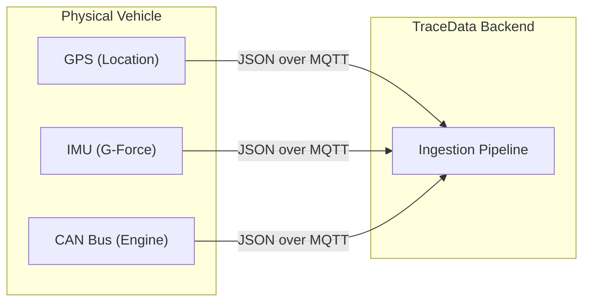
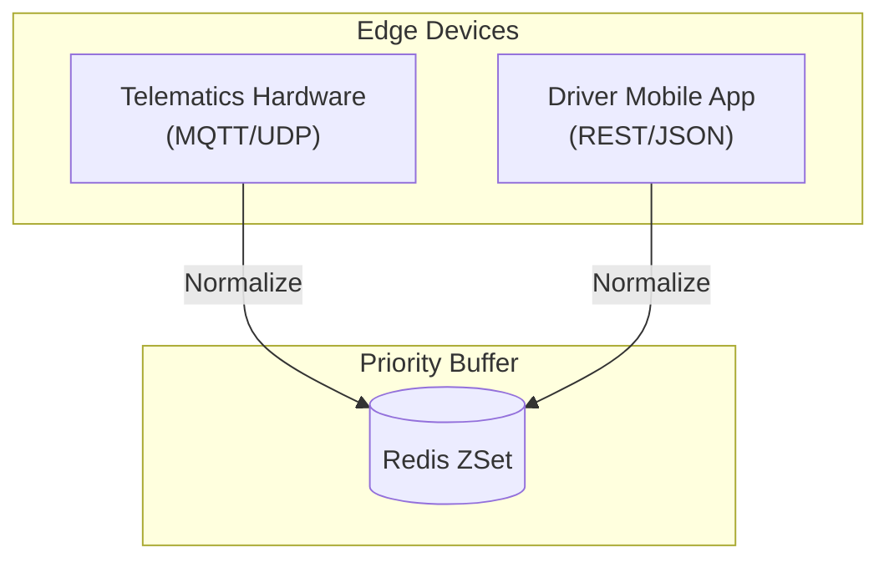
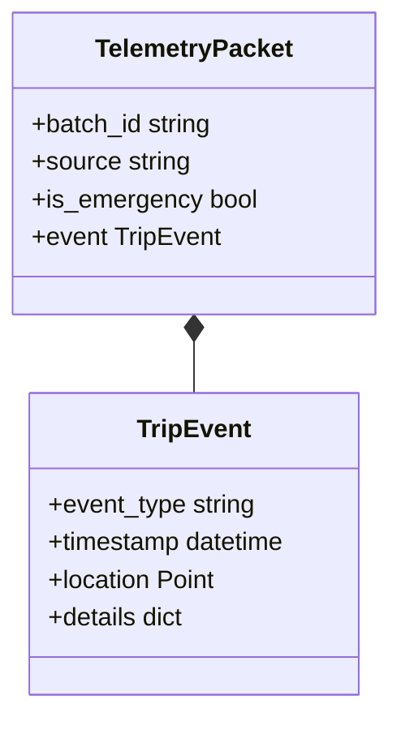

# 30,000 ft — The Sensor Stream
Input data in TraceData is the "Sensor Stream" — a continuous digital twin of the vehicle's physical state.

Imagine the dashboard of a heavy-duty truck. It has dials for speed, engine RPM, and fuel, but also hidden sensors for G-force, roll angle, and GPS location. In software terms, this is our **telemetry**. Every time something interesting happens (a harsh brake, a long idle, or a collision), the truck "pings" our backend. This data is the raw fuel for our AI agents.

### Diagram: The Truck as a Data Source


| Mistake | Why people make it | What to do instead |
|---|---|---|
| Trusting device time | Clocks drift or are set wrong | Always use a `received_at` server timestamp alongside the device's `timestamp`. |
| Ignoring units | Metric vs Imperial confusion | Enforce SI units (km, km/h, g) at the schema level. |
| Missing metadata | Sending just "brake" | Always include context: `speed_at_moment`, `g_force`, and `location`. |

**Learning Checkpoint:** If you can explain why a "Smoothness Log" is just as important as a "Collision" for a fair driver score, you are ready to descend.

---

# 20,000 ft — The Ingestion Ecosystem
TraceData accepts data from two distinct, decoupled sources: the **Telematics Device** and the **Driver App**.

Regardless of how it arrives (MQTT for hardware, REST for the app), all data is normalized into a common format. This relates to the TraceData stack by ensuring our analytical agents (Safety, Scoring, etc.) don't care about the hardware vendor — they only care about the **Event Type**.

### Diagram: Ingestion Ecosystem


---

# 10,000 ft — Envelope vs. Letter
The core insight is the distinction between the **TelemetryPacket** (the envelope) and the **TripEvent** (the letter).

-   **TelemetryPacket**: Contains transport metadata (batch ID, ping type, source).
-   **TripEvent**: Contains the actual business logic (event type, coordinates, metrics).

This separation allows us to change our hardware (the envelope) without breaking our AI models (which only read the letter).

### Diagram: Packet Structure


---

# 5,000 ft — Universal Anchors
Every event carries three "Universal Anchors" that allow us to place it precisely in the vehicle's history.

1.  **Time Anchor**: `timestamp` (Absolute UTC).
2.  **Trip Anchor**: `trip_meter_km` (Distance from start of THIS trip).
3.  **Vehicle Anchor**: `odometer_km` (Distance from start of THIS truck's life).

**Why this matters**: If we have two harsh brakes, knowing one happened at km 5 and the other at km 150 of the same trip allows our Scoring Agent to calculate the "frequency" of bad driving correctly.

---

# 2,000 ft — Precision and Edge Cases
The details that protect against data corruption.

-   **Timezones**: Data is *strictly* ISO8601 UTC. Any local time conversion happens only at the UI layer.
-   **Missing Fields**: If a device loses GPS, the `location` object becomes `null`, but the `odometer_km` must still be sent (it's pulled from the vehicle's internal computer).
-   **Floating Point Errors**: We use 4 decimal places for GPS (approx. 11m precision) and 2 for distance (10m precision).

---

# 1,000 ft — The Schema in Code
The `events.py` models define the contract.

```python
# common/models/events.py

class TripEvent(BaseModel):
    event_id: str
    trip_id: str
    truck_id: str
    event_type: str  # e.g., "harsh_brake"
    timestamp: datetime
    location: dict | None
    trip_meter_km: float
    odometer_km: float
    details: dict    # Event-specific metrics (e.g., g_force)

class TelemetryPacket(BaseModel):
    source: str
    is_emergency: bool = False
    event: TripEvent
```

---

# Ground — A Collision Event in Motion
**Scenario**: A truck hits a barrier.

**The Raw Data (The "Letter"):**
-   **Type**: `collision`
-   **Force**: `3.2g`
-   **Speed**: `45 km/h`
-   **Odometer**: `124,560.12 km`

**The Complete TelemetryPacket:**
```json
{
  "source": "telematics_device_v4",
  "is_emergency": true,
  "event": {
    "event_id": "EV-99B1-882",
    "trip_id": "TRIP-2026-03-A",
    "truck_id": "TRUCK-401",
    "event_type": "collision",
    "timestamp": "2026-03-27T10:45:00.000Z",
    "location": {"lat": 1.2863, "lon": 103.8519},
    "trip_meter_km": 14.2,
    "odometer_km": 124560.12,
    "details": {
      "g_force": 3.2,
      "airbag_deployed": true,
      "impact_direction": "front"
    }
  }
}
```

---

# What This Connects To
-   **Ingestion Tool**: The logic that parses this JSON and moves it to Redis.
-   **Redis Architecture**: Defines where these packets are stored (Stage 1 vs Stage 2).
-   **Safety Agent**: Subscribes to packets where `is_emergency=true`.
-   **SWE5008 Rubric**: Directly maps to **Data Engineering** and **Schema Governance** requirements.