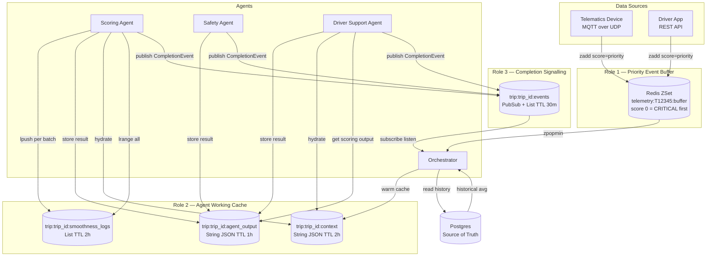
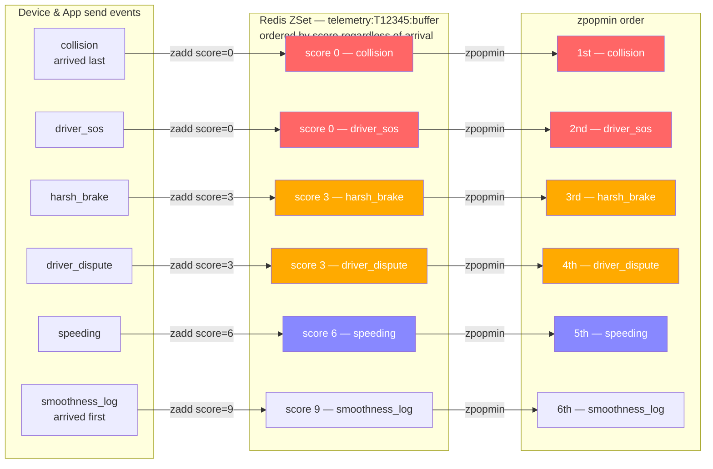
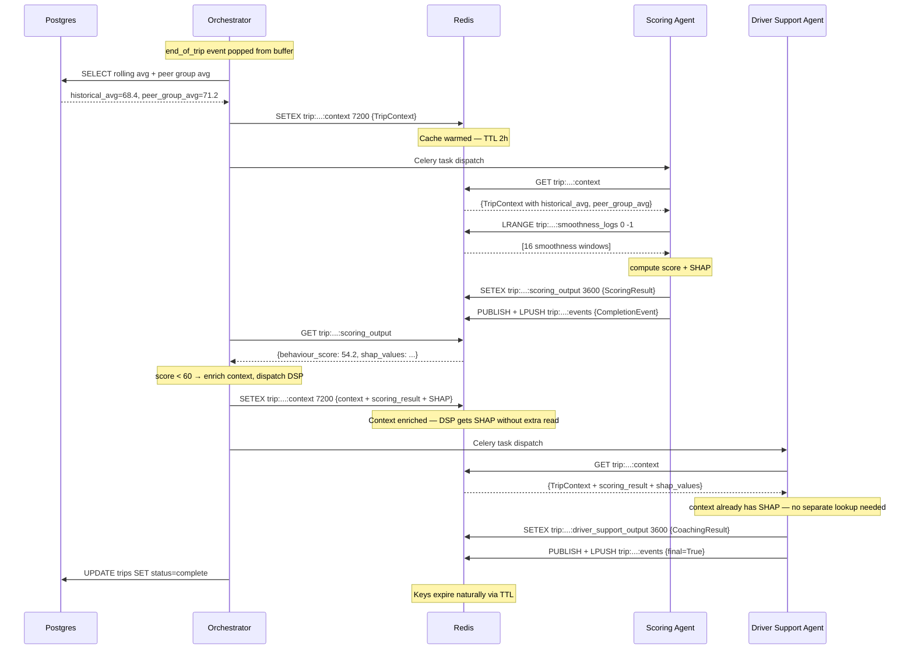
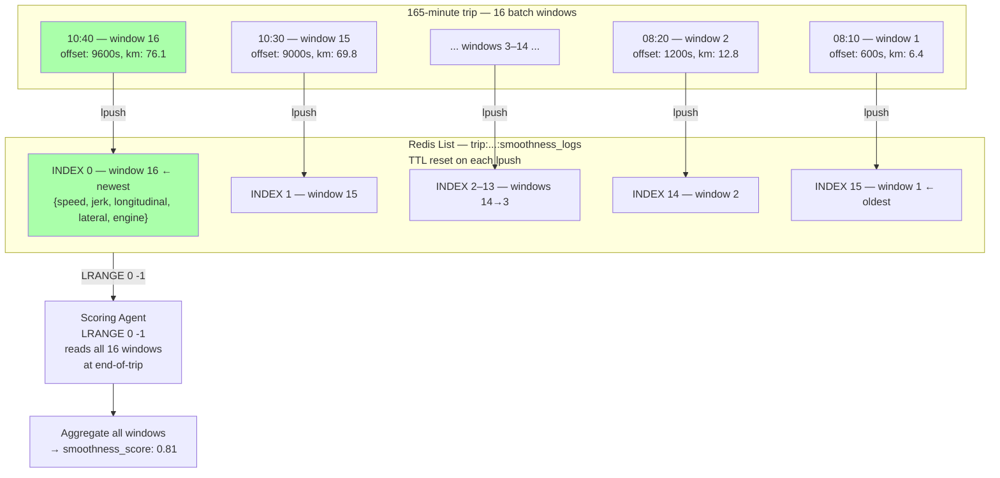
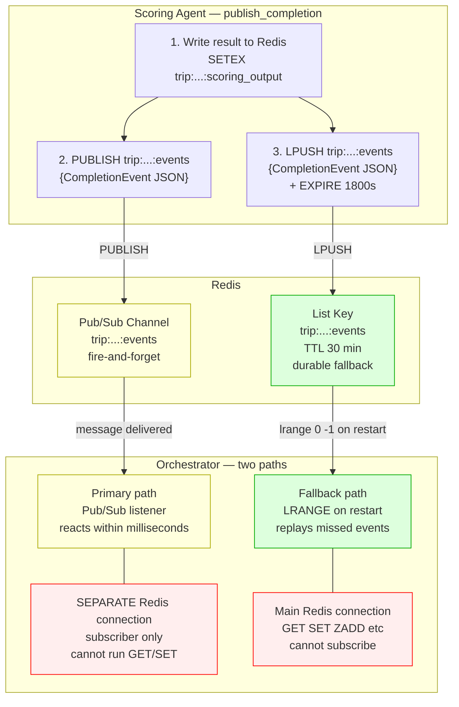
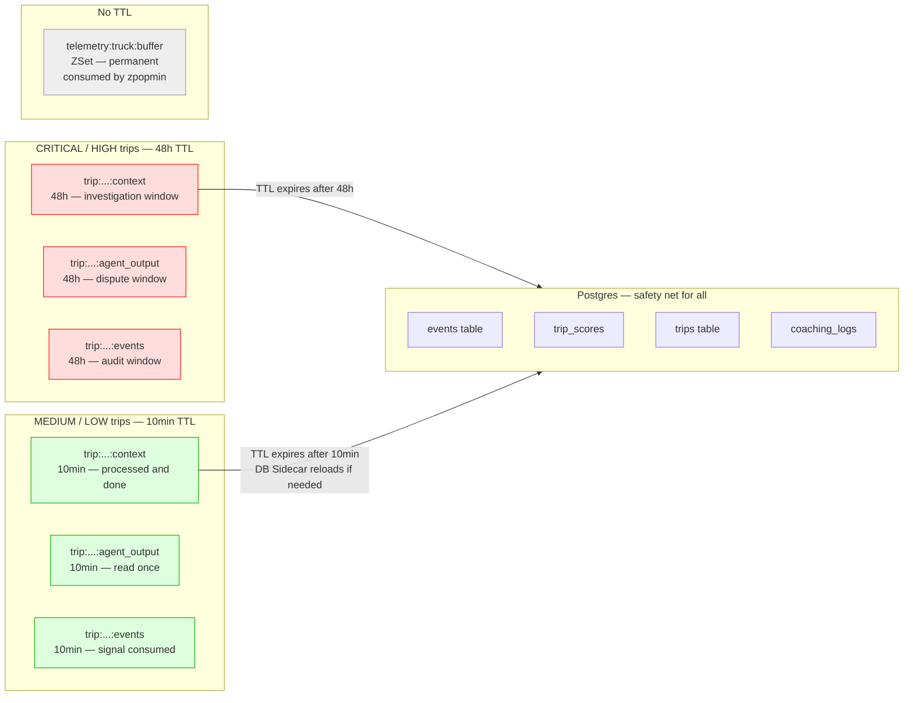
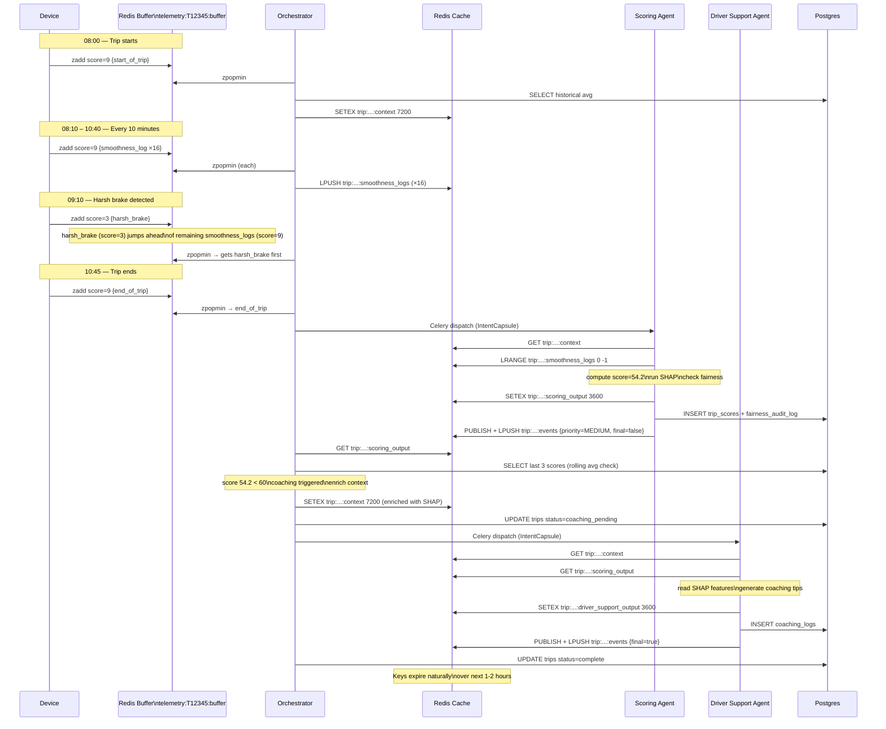

# TraceData — Redis Architecture
## Two-Stage Pipeline, Agent Cache, Pub/Sub, and Dead Letter Queue

SWE5008 Capstone | Phase 3 Data Engineering Record | March 2026

---

## 1. What Redis Does In TraceData

Redis serves four distinct roles. Each role uses a different Redis data structure for a specific reason:

```
Role 1a — Raw Event Buffer  (Stage 1)
  What:  Holds untrusted TelemetryPackets from device/app
  Why:   Ingestion Tool pops from here — Orchestrator never sees raw data
  How:   Redis Sorted Set (ZSet) — ordered by priority score
  Key:   telemetry:{truck_id}:buffer

Role 1b — Processed Queue  (Stage 2)
  What:  Holds clean TripEvents after Ingestion Tool pipeline
  Why:   Orchestrator reads only clean, validated, PII-scrubbed events
  How:   Redis Sorted Set (ZSet) — same priority ordering
  Key:   telemetry:{truck_id}:processed

Role 1c — Dead Letter Queue
  What:  Holds rejected events with rejection reason
  Why:   Fleet admin can inspect injection attempts, schema failures,
         duplicates — nothing is silently lost
  How:   Redis Sorted Set (ZSet) — ordered by priority score
  Key:   telemetry:{truck_id}:rejected
  TTL:   48 hours — inspection window

Role 2 — Agent Working Cache
  What:  Holds context and results for the current trip
  Why:   Agents need fast shared access without hitting Postgres
  How:   Redis String (JSON) + Redis List
  Keys:  trip:{trip_id}:context
         trip:{trip_id}:smoothness_logs
         trip:{trip_id}:{agent}_output

Role 3 — Completion Signalling
  What:  Agents signal Orchestrator when they finish a task
  Why:   Orchestrator reacts immediately when an agent is done
  How:   Redis Pub/Sub (fire-and-forget) + Redis List (durable fallback)
  Key:   trip:{trip_id}:events
```



---

## 2. Redis Data Structures — Why Each One Was Chosen

### 2.1 Sorted Set (ZSet) — for the event buffer

```
A set where every member has a numeric score.
Members are always ordered by score, lowest first.

Key operations:
  zadd key score member   → add an event with a priority score
  zpopmin key             → remove and return lowest-score member
  zrange key 0 N          → peek at top N members without removing
  zcard key               → count how many events are waiting

Why not a List?
  A list (lpush/rpop) is FIFO — first in, first out.
  If 100 smoothness_log events arrive then one collision event,
  the collision would be processed last.
  ZSet ensures collision is ALWAYS first regardless of arrival order.
```

### 2.2 String (JSON) — for TripContext and agent outputs

```
The simplest Redis structure — a key mapped to a value.
TraceData stores JSON strings here (serialised Python dicts).

Key operations:
  setex key ttl value   → store with TTL (expires automatically)
  get key               → retrieve the value
  exists key            → check if key is present

Why not Hash?
  Redis Hash stores field:value pairs inside one key.
  Works well for flat data but TripContext has nested JSON.
  String (JSON) gives full nested structure with one get/set.
```

### 2.3 List — for smoothness logs

```
An ordered list. TraceData uses it as an append-only log.
New entries are prepended (lpush) — newest at front.

Key operations:
  lpush key value       → prepend new entry
  lrange key 0 -1       → read ALL entries (for Scoring Agent)
  llen key              → count entries

Why not ZSet?
  Smoothness logs are not prioritised — all equally important.
  They need to be read as a full sequence at end-of-trip.
  List append is simpler and cheaper than ZSet for this use case.
```

### 2.4 Pub/Sub + List (dual pattern) — for completion events

```
Pub/Sub: publisher sends to a channel, all subscribers receive instantly.
Fire-and-forget — if the subscriber misses it, the message is gone.

Problem with Pub/Sub alone:
  If Orchestrator restarts between an agent publishing and
  receiving the message, that message is lost forever.

Solution — dual write:
  1. PUBLISH to Pub/Sub channel    → immediate delivery
  2. LPUSH to same key as a List   → durable fallback

Orchestrator listens on Pub/Sub for immediate response.
If it misses a message, it replays from the List on startup.
```

---

## 3. Key Schema

Every Redis key follows a structured naming convention defined in `keys.py`.

```
── PIPELINE QUEUES (per truck, all ZSets) ──────────────────────

telemetry:{truck_id}:buffer
  Stage 1 — raw TelemetryPacket from device/app
  Written by: device (MQTT) or driver app (REST)
  Read by:    Ingestion Tool (zpopmin)
  TTL:        None — consumed not expired

telemetry:{truck_id}:processed
  Stage 2 — clean TripEvent after Ingestion Tool pipeline
  Written by: Ingestion Tool (on success)
  Read by:    Orchestrator (zpopmin)
  TTL:        None — consumed not expired

telemetry:{truck_id}:rejected
  Dead Letter Queue — failed events with rejection reason
  Written by: Ingestion Tool (on any rejection)
  Read by:    Fleet admin / monitoring dashboard
  TTL:        48 hours — inspection window

── AGENT WORKING CACHE (per trip) ──────────────────────────────

trip:{trip_id}:context
  Shared TripContext — written by Orchestrator, read by all agents

trip:{trip_id}:smoothness_logs
  Accumulating smoothness windows — lpush per batch ping

trip:{trip_id}:scoring_output
  Scoring Agent result (score + SHAP + fairness flags)

trip:{trip_id}:safety_output
  Safety Agent result

trip:{trip_id}:driver_support_output
  Driver Support Agent result (coaching tips)

trip:{trip_id}:events
  Completion event channel (Pub/Sub + List dual write)

trip:{trip_id}:context:rebuilding
  SETNX lock — held by Redis Health Monitor during cache rebuild
```

### Key Schema In Code (keys.py)

```python
class RedisSchema:

    class Telemetry:
        DLQ_TTL: int = 172800   # 48 hours

        @staticmethod
        def buffer(truck_id: str) -> str:
            """Stage 1 — raw TelemetryPacket."""
            return f"telemetry:{truck_id}:buffer"

        @staticmethod
        def processed(truck_id: str) -> str:
            """Stage 2 — clean TripEvent."""
            return f"telemetry:{truck_id}:processed"

        @staticmethod
        def rejected(truck_id: str) -> str:
            """Dead Letter Queue."""
            return f"telemetry:{truck_id}:rejected"

    class Trip:
        CONTEXT_TTL_HIGH: int = 172800   # 48 hours — CRITICAL/HIGH
        CONTEXT_TTL_LOW:  int = 600      # 10 minutes — MEDIUM/LOW
        OUTPUT_TTL:       int = 600      # 10 minutes
        EVENT_TTL:        int = 600      # 10 minutes

        @staticmethod
        def context(trip_id: str) -> str:
            return f"trip:{trip_id}:context"

        @staticmethod
        def smoothness_logs(trip_id: str) -> str:
            return f"trip:{trip_id}:smoothness_logs"

        @staticmethod
        def output(trip_id: str, agent: AgentName) -> str:
            return f"trip:{trip_id}:{agent.value}_output"

        @staticmethod
        def events_channel(trip_id: str) -> str:
            return f"trip:{trip_id}:events"

        @staticmethod
        def context_rebuilding_lock(trip_id: str) -> str:
            return f"trip:{trip_id}:context:rebuilding"
        def output(trip_id: str, agent: AgentName) -> str:
            return f"trip:{trip_id}:{agent.value}_output"

        @staticmethod
        def events_channel(trip_id: str) -> str:
            return f"trip:{trip_id}:events"
```

---

## 4. Role 1 — Priority Event Buffer

### 4.1 How It Works

The buffer is the entry point for all telemetry. Every event is written into this buffer before any processing. The Sorted Set orders events by priority score — the Orchestrator always pops the lowest score first.

```
CRITICAL = score 0  → processed first (always)
HIGH     = score 3
MEDIUM   = score 6
LOW      = score 9  → processed last
```

### 4.2 Adding Events To The Buffer

```python
# From seed_events.py — how events enter the buffer

def seed_events(client: RedisClient) -> None:
    for raw in EVENTS:

        # 1. Validate packet shape via Pydantic
        packet = TelemetryPacket(**raw)

        # 2. Build Redis key for this truck's buffer
        key = RedisSchema.Telemetry.buffer(packet.event.truck_id)
        # → "telemetry:T12345:buffer"

        # 3. Read priority from EVENT_MATRIX — not from the device
        #    EVENT_MATRIX is the governance enforcement point
        priority_str   = EVENT_MATRIX[packet.event.event_type].priority
        priority_score = int(PRIORITY_MAP[priority_str])

        # 4. Push to buffer
        client.push_to_buffer(key, packet.model_dump_json(), priority_score)
```

```python
# push_to_buffer in redis_client.py

def push_to_buffer(self, key: str, payload: str, priority: int) -> None:
    self.client.zadd(key, {payload: priority})
    # ZADD "telemetry:T12345:buffer" 0 "{...collision JSON...}"
    # ZADD "telemetry:T12345:buffer" 9 "{...smoothness_log JSON...}"
```

### 4.3 What The Buffer Looks Like After All Six Seed Events

```
KEY:  telemetry:T12345:buffer
TYPE: ZSet

Members ordered by score (lowest = highest priority):

  score 0 → collision event      ← zpopmin returns this first
  score 0 → driver_sos event
  score 3 → harsh_brake event
  score 3 → driver_dispute event
  score 6 → speeding event
  score 9 → smoothness_log event ← zpopmin returns this last

Even if smoothness_log arrived first, collision is ALWAYS processed first.
```



### 4.4 The Orchestrator Consuming Events

```python
def process_next_event(client: RedisClient, truck_id: str) -> None:
    key = RedisSchema.Telemetry.buffer(truck_id)

    # zpopmin — atomically removes and returns highest priority event
    packet = client.pop_from_buffer(key)

    if packet is None:
        return  # buffer empty

    event_type = packet["event"]["event_type"]
    print(f"Processing: {event_type}")
    dispatch_to_agent(packet)
```

```python
# pop_from_buffer in redis_client.py

def pop_from_buffer(self, key: str) -> dict | None:
    result = self.client.zpopmin(key, count=1)
    if not result:
        return None
    raw_json, score = result[0]
    return json.loads(raw_json)
    # Returns collision first, then harsh_brake, etc.
```

### 4.5 Why The Buffer Has No TTL

```
The buffer has no TTL because the truck keeps sending events
throughout its entire operational lifetime — across many trips.

Individual event members are consumed (removed) by zpopmin.
If the Orchestrator crashes before popping, events stay in the
buffer and are processed when it restarts.

This is natural crash recovery — no events are lost.
```

---

## 5. Role 2 — Agent Working Cache

### 5.1 Cache Strategy — Warm Once, Read Many

```
Postgres (cold)                Redis (hot)
───────────────                ───────────────────────────
authoritative                  ephemeral — expires via TTL
permanent                      fast — sub-millisecond reads
agents do NOT query directly   agents read everything from here

Flow:
  1. Orchestrator reads historical data from Postgres
  2. Orchestrator writes TripContext to Redis  ← cache warm
  3. All agents read from Redis only
  4. Agents write results to Redis
  5. Orchestrator persists results to Postgres
```



### 5.2 How The Orchestrator Warms The Cache

```python
def warm_cache_for_trip(client: RedisClient, packet: dict, pg) -> None:

    trip_id   = packet["event"]["trip_id"]
    driver_id = packet["event"]["driver_id"]

    # 1. Load historical data from Postgres
    #    Agents cannot query Postgres directly
    historical_avg = pg.fetch_rolling_average(driver_id, n=3)
    peer_group_avg = pg.fetch_peer_group_average(driver_id)

    # 2. Anonymise driver_id before it enters agent pipeline
    anon_driver_id = anonymise(driver_id)   # → "DRV-ANON-7829"

    # 3. Build TripContext
    context = {
        "trip_id":              trip_id,
        "driver_id":            anon_driver_id,
        "truck_id":             packet["event"]["truck_id"],
        "priority":             resolve_priority(packet),
        "historical_avg_score": historical_avg,
        "peer_group_avg":       peer_group_avg,
        "event":                packet["event"],
    }

    # 4. Write to Redis with TTL
    client.store_trip_context(trip_id, context)
    # → SETEX "trip:TRIP-T12345...:context" 7200 "{...json...}"
```

**TripContext in Redis:**

```
KEY:   trip:TRIP-T12345-2026-03-07-08:00:context
TYPE:  String (JSON)
TTL:   7200 seconds

VALUE: {
  "trip_id":              "TRIP-T12345-2026-03-07-08:00",
  "driver_id":            "DRV-ANON-7829",
  "truck_id":             "T12345",
  "priority":             9,
  "historical_avg_score": 68.4,
  "peer_group_avg":       71.2,
  "event": {
    "event_type":      "end_of_trip",
    "timestamp":       "2026-03-07T10:45:32Z",
    "trip_meter_km":   78.3,
    "details":         { ... }
  }
}
```

### 5.3 How Agents Hydrate From The Cache

```python
# Inside any agent's execute() method

def execute(self, task_payload: dict) -> dict:

    trip_id = task_payload["intent_capsule"]["trip_id"]

    # Hydrate from Redis
    context = self.redis.get_trip_context(trip_id)
    # → GET "trip:TRIP-T12345...:context"

    if context is None:
        # TTL expired — reload from Postgres
        context = self.postgres.reload_trip_context(trip_id)

    # Agent now has full working context
    historical_avg = context["historical_avg_score"]  # 68.4
    peer_group_avg = context["peer_group_avg"]         # 71.2
    event_details  = context["event"]["details"]
```

### 5.4 Smoothness Logs — The Accumulating Cache

Every 10-minute batch ping appends one entry to the smoothness log List. The Scoring Agent reads all entries at end-of-trip.



```python
# Ingestion Tool — called on every smoothness_log event

def store_smoothness_log(client: RedisClient, trip_id: str, entry: dict):
    key      = RedisSchema.Trip.smoothness_logs(trip_id)
    entry_json = json.dumps(entry)

    client.client.lpush(key, entry_json)    # prepend — newest at front
    client.client.expire(key, 7200)         # reset TTL on each push
    # → keeps the list alive for the full 2-3 hour trip duration
```

**The List during a 165-minute trip:**

```
KEY:  trip:TRIP-T12345-2026-03-07-08:00:smoothness_logs
TYPE: List
TTL:  7200 seconds (reset on each lpush)
LEN:  ~16 entries

INDEX 0 (newest): { "timestamp": "2026-03-07T10:40:00Z", ... }
INDEX 1:          { "timestamp": "2026-03-07T10:30:00Z", ... }
...
INDEX 15 (oldest):{ "timestamp": "2026-03-07T08:10:00Z", ... }
```

**Scoring Agent reads all entries at end-of-trip:**

```python
def get_all_smoothness_logs(self, trip_id: str) -> list[dict]:
    key = RedisSchema.Trip.smoothness_logs(trip_id)

    raw_entries = self.redis.client.lrange(key, 0, -1)
    # LRANGE 0 -1 → returns all 16 entries

    return [json.loads(e) for e in raw_entries]
    # → Scoring Agent aggregates all windows to compute smoothness_score
```

### 5.5 Agent Output — Writing Results Back

```python
# Inside Scoring Agent — after computing score + SHAP

scoring_result = {
    "trip_id":          trip_id,
    "agent":            "scoring",
    "behaviour_score":  54.2,
    "smoothness_score": 0.81,
    "shap_values":      { "harsh_brake_count": 0.34, ... },
    "shap_explanation": "Harsh braking was the biggest factor...",
    "fairness_flags":   { "below_peer_avg": True, ... },
}

self.redis.store_agent_output(trip_id, AgentName.SCORING, scoring_result)
# → SETEX "trip:TRIP-T12345...:scoring_output" 3600 "{...}"
```

**Orchestrator reads the result:**

```python
result = client.get_agent_output(trip_id, AgentName.SCORING)
# → GET "trip:TRIP-T12345...:scoring_output"

behaviour_score = result["behaviour_score"]   # 54.2

if behaviour_score < 60:
    dispatch_driver_support_agent(trip_id)
```

### 5.6 Context Enrichment Between Steps

After reading the Scoring Agent result, the Orchestrator enriches the shared TripContext before dispatching the next agent. This way the Driver Support Agent gets the full picture without a separate Redis read.

```python
# Orchestrator — between Scoring Agent and Driver Support Agent

def enrich_context(client: RedisClient, trip_id: str, scoring_result: dict):
    context = client.get_trip_context(trip_id)

    # Append scoring result and coaching trigger reason
    context["scoring_result"]   = scoring_result
    context["coaching_trigger"] = {
        "rules_triggered": ["absolute_floor"],
        "reason":   "score 54.2 below threshold 60",
        "priority": 6,
        "action_sla": "3_days",
    }

    # Overwrite with enriched version — reset TTL
    client.store_trip_context(trip_id, context)
    # → SETEX "trip:TRIP-T12345...:context" 7200 "{...enriched...}"

# Driver Support Agent now reads the enriched context —
# it already contains the SHAP values without a separate lookup
```

---

## 6. Role 3 — Completion Signalling (Pub/Sub + Durable Fallback)

### 6.1 Why Pub/Sub Instead Of Polling

```
Without Pub/Sub — polling:
  while True:
      result = get_agent_output(trip_id, SCORING)
      if result: break
      time.sleep(1)

  Problems:
    → CPU wasted on empty checks
    → 1-second delay between completion and reaction
    → scales poorly with many concurrent trips

With Pub/Sub — event-driven:
  Orchestrator reacts within milliseconds of agent completing.
  Zero wasted CPU while waiting.
  Scales cleanly — one subscription per active trip.
```



### 6.2 How An Agent Publishes A Completion Event

```python
# Inside Scoring Agent — called after writing output to Redis

completion = CompletionEvent(
    trip_id    = trip_id,
    agent      = AgentName.SCORING,
    status     = "done",
    priority   = Priority.MEDIUM,   # escalated from LOW
    action_sla = "3_days",
    escalated  = True,
    final      = False,             # more agents still to run
)

self.redis.publish_completion(trip_id, completion)
```

**What `publish_completion` does under the hood:**

```python
def publish_completion(self, trip_id: str, event: CompletionEvent) -> None:

    channel    = RedisSchema.Trip.events_channel(trip_id)
    event_json = event.model_dump_json()

    # 1. Fire-and-forget Pub/Sub
    self.client.publish(channel, event_json)
    # → Orchestrator receives this instantly if subscribed

    # 2. Durable fallback List
    self.client.lpush(channel, event_json)
    self.client.expire(channel, RedisSchema.Trip.EVENT_TTL)
    # → Survives Orchestrator restart for 30 minutes
```

**What the completion event looks like in Redis:**

```
PUBSUB CHANNEL: trip:TRIP-T12345-2026-03-07-08:00:events
  Delivered instantly to all subscribers

KEY:   trip:TRIP-T12345-2026-03-07-08:00:events
TYPE:  List (durable fallback)
TTL:   1800 seconds

INDEX 0: {
  "trip_id":    "TRIP-T12345-2026-03-07-08:00",
  "agent":      "scoring",
  "status":     "done",
  "priority":   6,
  "action_sla": "3_days",
  "escalated":  true,
  "final":      false
}
```

### 6.3 How The Orchestrator Listens

**Primary path — Pub/Sub:**

```python
def listen_for_completions(client: RedisClient, trip_id: str):

    # IMPORTANT: subscriber must use a SEPARATE Redis connection
    # A subscribed connection cannot send regular commands
    subscriber = RedisClient()
    pubsub     = subscriber.subscribe_to_trip(trip_id)

    for message in pubsub.listen():
        if message["type"] != "message":
            continue  # skip subscription confirmation

        event = CompletionEvent.model_validate_json(message["data"])
        handle_completion(event)

        if event.final:
            pubsub.unsubscribe()
            break
```

**Fallback path — list replay on restart:**

```python
def replay_missed_completions(client: RedisClient, trip_id: str):
    key = RedisSchema.Trip.events_channel(trip_id)

    # Read all completion events from the durable List
    raw_events = client.client.lrange(key, 0, -1)

    for raw in raw_events:
        event = CompletionEvent.model_validate_json(raw)
        handle_completion(event)
```

### 6.4 The Two-Client Rule

```
RULE: a Redis connection that has SUBSCRIBE cannot also send
      regular GET/SET/ZADD commands.

CONSEQUENCE: Orchestrator must maintain TWO Redis connections:

  self.redis      = RedisClient()   ← for GET, SET, ZADD, LPUSH
  self.subscriber = RedisClient()   ← for SUBSCRIBE and LISTEN only

These must be separate instances — never share one connection
between command and subscriber roles.
```

---

## 7. TTL Strategy — How Redis Cleans Itself Up

All keys expire automatically. No manual deletion needed.

### Priority-Aware TTL

TraceData uses a two-tier TTL strategy based on event priority. CRITICAL and HIGH trips may be investigated hours or days later. MEDIUM and LOW trips are processed and done.

| Key | CRITICAL / HIGH | MEDIUM / LOW | Reasoning |
|---|---|---|---|
| `telemetry:{truck_id}:buffer` | No TTL | No TTL | Permanent — consumed not expired |
| `trip:{trip_id}:context` | 48h | 10min | Investigation window vs done |
| `trip:{trip_id}:smoothness_logs` | 48h | 10min | Reset on each lpush |
| `trip:{trip_id}:scoring_output` | 48h | 10min | Dispute/review window |
| `trip:{trip_id}:safety_output` | 48h | N/A | Safety events always HIGH+ |
| `trip:{trip_id}:driver_support_output` | 48h | 10min | Appeals window |
| `trip:{trip_id}:events` | 48h | 10min | Completion signals |

```
Rule: if the trip could be investigated after the fact → 48 hours
      if the trip is processed and done               → 10 minutes
```

**Why 48h for CRITICAL/HIGH:**
```
T+0h   → collision processed
T+2h   → driver submits dispute        → hits Redis cache ✅
T+4h   → fleet manager reviews dashcam → hits Redis cache ✅
T+24h  → compliance officer audits     → hits Redis cache ✅

Without 48h TTL every one is a Postgres query via DB Sidecar.
With 48h TTL all follow-up queries are sub-millisecond.
```

**Why 10min for MEDIUM/LOW:**
```
Speeding flagged → compliance record written → nothing else queries Redis
End-of-trip scored → DSP runs → all results in Postgres permanently
10 minutes is more than enough for the processing window.
```

**In code (config.py):**
```python
CONTEXT_TTL: dict[str, int] = {
    "critical": 172800,   # 48 hours
    "high":     172800,   # 48 hours
    "medium":   600,      # 10 minutes
    "low":      600,      # 10 minutes
}
```



**TTL expiry is always recoverable:**
```
All data written to Postgres BEFORE agents read Redis.
On cache miss → DB Sidecar reloads from Postgres → re-warms Redis.
Agents retry via get_context_with_retry() — never fail on cache miss.
```

---

## 8. The Complete Redis Lifecycle For One Trip

```mermaid
gantt
    title Redis Key Lifecycle — TRIP-T12345-2026-03-07-08:00
    dateFormat HH:mm
    axisFormat %H:%M

    section Event Buffer
    telemetry:T12345:buffer (ZSet, no TTL)     :active, buf, 08:00, 10:46

    section Agent Cache
    trip:...:context (String, TTL 2h)           :ctx, 08:00, 10:00
    trip:...:smoothness_logs (List, TTL 2h)     :sml, 08:10, 10:40
    trip:...:safety_output (String, TTL 1h)     :saf, 08:44, 09:44
    trip:...:scoring_output (String, TTL 1h)    :sco, 10:46, 11:46
    trip:...:driver_support_output (TTL 1h)     :dsp, 10:52, 11:52

    section Completion Events
    trip:...:events (List+PubSub, TTL 30m)      :evt, 08:44, 11:16
```

Putting it all together — here is the full lifecycle of Redis state for Trip TRIP-T12345-2026-03-07-08:00.



08:10 through 10:40 — Every 10 minutes
  smoothness_log → buffer score=9
  Ingestion Tool pops → appends to trip:...:smoothness_logs
  TTL reset on each append

09:10 — Harsh brake event arrives
  harsh_brake → buffer score=3
  Processed BEFORE any remaining smoothness_logs (score 9)
  Safety Agent dispatched → writes trip:...:safety_output TTL:3600s
  CompletionEvent published → trip:...:events
  Orchestrator reacts → dispatches Driver Support Agent

10:45 — Trip ends
  end_of_trip → buffer score=9
  Scoring Agent dispatched
    reads:  trip:...:context        (historical avg, peer group avg)
    reads:  trip:...:smoothness_logs (all 16 windows via LRANGE 0 -1)
    writes: trip:...:scoring_output  TTL:3600s
    publishes: trip:...:events

  Orchestrator receives completion event
    reads: trip:...:scoring_output
    enriches: trip:...:context (appends scoring_result + SHAP)
    dispatches Driver Support Agent

  Driver Support Agent
    reads: trip:...:context         (now contains scoring_result)
    reads: trip:...:scoring_output  (for SHAP feature list)
    writes: trip:...:driver_support_output  TTL:3600s
    publishes: trip:...:events (final=True)

  Orchestrator receives final=True
    updates Postgres: trips table status=complete
    Redis keys expire naturally over next 1-2 hours
```

---

## 9. Redis Configuration

### 9.1 Docker Compose

```yaml
services:
  redis:
    image: redis:7-alpine
    container_name: tracedata_redis
    ports:
      - "6379:6379"
    command: >
      redis-server
      --maxmemory 256mb
      --maxmemory-policy allkeys-lru
      --appendonly yes
      --appendfsync everysec
    volumes:
      - redis_data:/data
    healthcheck:
      test: ["CMD", "redis-cli", "ping"]
      interval: 10s
      timeout: 5s
      retries: 3

  redis-insight:
    image: redis/redisinsight:latest
    ports:
      - "8001:5540"
    depends_on:
      - redis

volumes:
  redis_data:
```

### 9.2 Key Configuration Decisions

```
maxmemory 256mb
  → memory ceiling — prevents Redis consuming all RAM

maxmemory-policy allkeys-lru
  → when full, evict least recently used keys
  → old trip context evicted before active trip context
  → safe because all persistent data is in Postgres

appendonly yes + appendfsync everysec
  → writes logged to disk every second (AOF persistence)
  → on restart, Redis replays log to restore state
  → protects event buffer from total loss on container crash
```

### 9.3 Connection Setup

```python
class RedisClient:
    def __init__(
        self,
        host: str = os.getenv("REDIS_HOST", "localhost"),
        port: int = int(os.getenv("REDIS_PORT", "6379")),
    ) -> None:
        self.client = redis.Redis(
            host             = host,
            port             = port,
            decode_responses = True,   # always return str not bytes
            socket_timeout   = 5,      # fail fast if Redis unreachable
            retry_on_timeout = True,   # auto-retry on timeout
        )
```

---

## 10. Debugging Redis State

```bash
# Connect
redis-cli -h localhost -p 6379

# See what is in the event buffer
ZRANGE telemetry:T12345:buffer 0 -1 WITHSCORES

# How many events waiting
ZCARD telemetry:T12345:buffer

# Read TripContext
GET "trip:TRIP-T12345-2026-03-07-08:00:context"

# Read Scoring Agent output
GET "trip:TRIP-T12345-2026-03-07-08:00:scoring_output"

# Count smoothness logs accumulated so far
LLEN "trip:TRIP-T12345-2026-03-07-08:00:smoothness_logs"

# Read all smoothness logs
LRANGE "trip:TRIP-T12345-2026-03-07-08:00:smoothness_logs" 0 -1

# Check TTL remaining on a key
TTL "trip:TRIP-T12345-2026-03-07-08:00:context"

# Subscribe manually to a trip's completion channel
SUBSCRIBE "trip:TRIP-T12345-2026-03-07-08:00:events"

# Scan all keys for a specific trip
SCAN 0 MATCH "trip:TRIP-T12345-2026-03-07-08:00:*"
```

---

## 11. Phase 3 Stubs

| Concern | Phase 3 | Full Implementation |
|---|---|---|
| ScopedToken enforcement in RedisClient | Not enforced — any key readable | Phase 6 |
| HMAC verification on context reads | Not implemented | Phase 6 |
| Per-key access logging | Not implemented | Phase 6 |
| Redis Cluster for high availability | Single instance | Phase 8 |
| Redis Sentinel for failover | Not configured | Phase 8 |
| Encrypted connections (TLS) | Plain TCP | Phase 8 |
| Buffer backpressure (max queue depth) | Not implemented | Phase 8 |
| Dead-letter queue for failed events | Not implemented | Phase 8 |