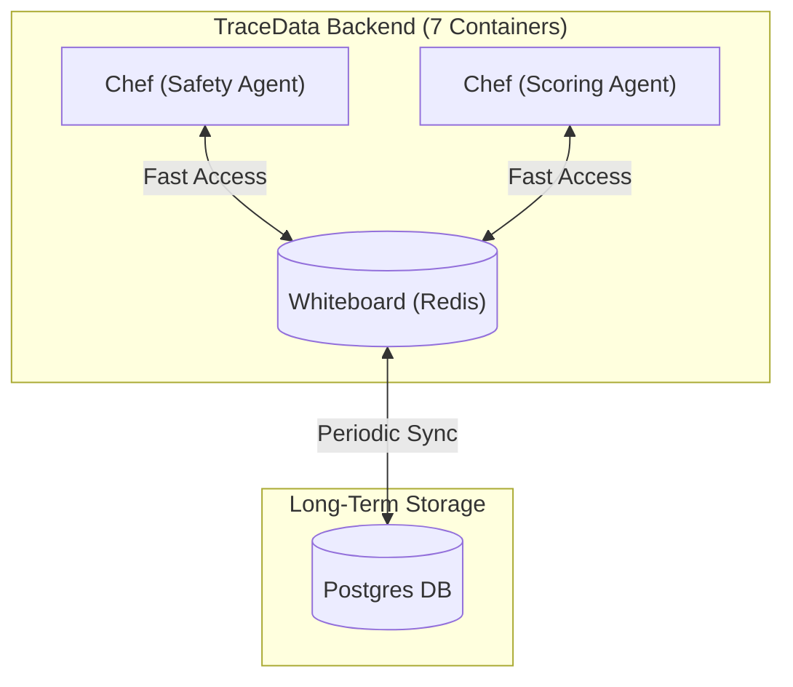
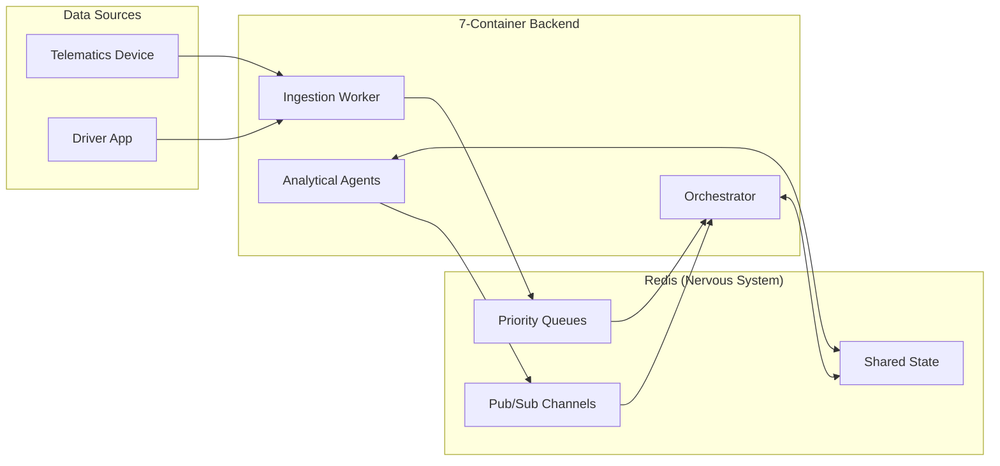
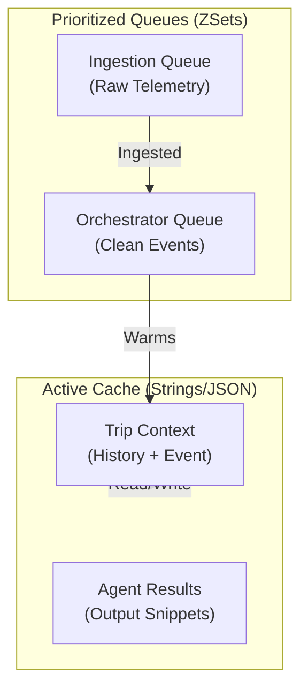
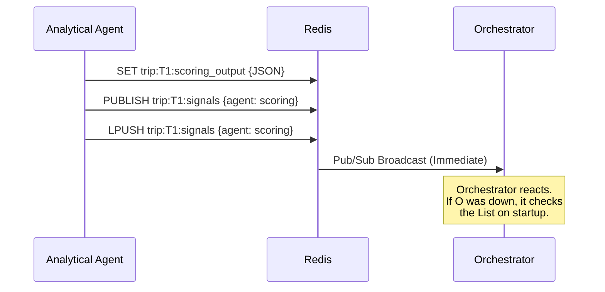
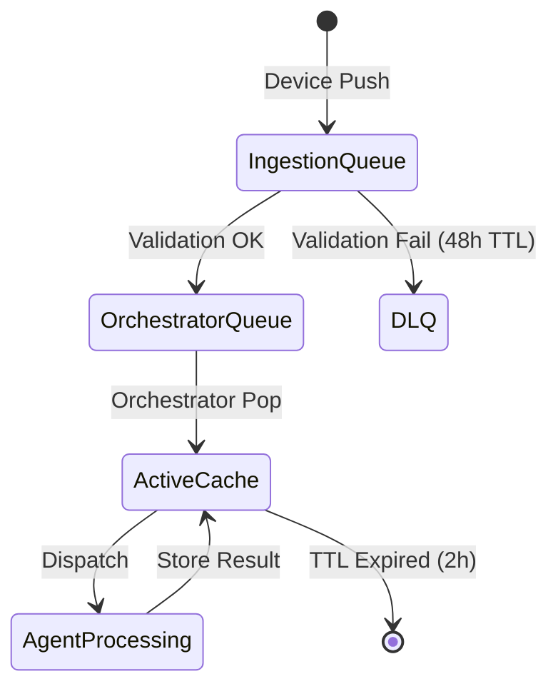

# 30,000 ft — The Short-Term Memory (Cortex)
Redis is the "Short-Term Memory" of the TraceData architecture, providing sub-millisecond access to active trip state.

Imagine a busy commercial kitchen (the 7-container backend). The chefs (agents) need to know what’s happening *right now* without leaving their stations to check the deep freezer (the Postgres database). Redis is the **whiteboard** in the middle of the kitchen. It holds the current orders (event queues), the prep status (trip context), and signals when a dish is ready (completion events). It is fast, ephemeral, and visible to everyone.

### Diagram: The Whiteboard Analogy


| Mistake | Why people make it | What to do instead |
|---|---|---|
| Using it as a DB | It feels fast and easy to just "set and forget". | Only store ephemeral state; always persist the "truth" to Postgres. |
| Forgetting TTLs | Data is "small" so it doesn't seem like an issue now. | Always set a TTL (e.g., 2h) to prevent Redis from filling up with old trips. |
| Single Connection | One connection for both commands and Pub/Sub. | Use separate connections for regular commands and Pub/Sub subscriptions. |

**Learning Checkpoint:** If you can explain why we use Redis instead of just querying Postgres for every agent step (latency vs. durability), you are ready to descend.

---

# 20,000 ft — The Shared Nervous System
Redis acts as the shared state layer that connects all 7 independent containers via a common event matrix.

In our 7-container architecture, each agent (Safety, Scoring, etc.) is a separate process. They don't share memory. Redis is the nervous system that carries signals between them. It provides **Prioritized Queuing** (ZSets), **Shared State** (TripContext), and **Real-time Signalling** (Pub/Sub). It relates to the TraceData stack by being the "glue" that allows the Orchestrator to coordinate between the Ingestion worker and the various analytical agents.

### Diagram: Context Diagram


**Learning Checkpoint:** If you understand that Redis is the *only* way these 7 containers talk to each other without knowing each other's IP addresses, you are ready to descend.

---

# 10,000 ft — Hierarchical State Management
The core idea is the **Two-Stage Pipeline** + **Hierarchical Trip Context**.

1.  **Stage 1 (Raw/Dirty)**: Raw telemetry waits in `td:ingestion:events`.
2.  **Stage 2 (Validated/Clean)**: Ingested events wait in `td:orchestrator:events`.
3.  **Active Trip Context**: A single source of truth at `td:trip:{trip_id}:context` providing the "God View" for agents.

**Key Insight**: We use **Sorted Sets (ZSets)** for queues to ensure that a "Collision" event (Priority 0) always jumps ahead of a "Smoothness Log" (Priority 9), regardless of arrival time.

### Diagram: Core Mechanism


**Learning Checkpoint:** Why do we use a ZSet for the queue instead of a simple List? (Hint: Think about how an ambulance moves through traffic compared to a bus).

---

# 5,000 ft — Data Structures & Mechanics
TraceData uses specific Redis structures to manage the flow of events and state sequentially.

1.  **Sorted Sets (ZSets)**: Used for event buffers. Score = Priority (0 = Critical, 9 = Low).
2.  **Strings (JSON)**: Used for `TripContext`. We store a serialized Pydantic model here.
3.  **Lists**: Used for `smoothness_logs`. Newest windows are `LPUSH`ed for efficient end-of-trip aggregation.
4.  **Pub/Sub + List (Durable Signalling)**: When an agent finishes, it **PUBLISHES** a notification and **LPUSHES** the completion event. This ensures the Orchestrator receives the event even if it was restarting during the broadcast.

### Diagram: Signalling Sequence


---

# 2,000 ft — TTLs and Failure Modes
The details that prevent memory leaks and handle race conditions.

-   **TTL Strategy**:
    -   `TripContext`: 2 Hours (Reset on every event write). If a trip is silent for 2 hours, we assume it's abandoned/finished and clear the memory.
    -   `Agent Results`: 1 Hour.
    -   `Queues`: No TTL. Items are removed by `ZPOPMAX` / `BLPOP`.
-   **Atomic Ownership**: We use `ZPOPMIN` to ensure exactly one worker picks up an event.
-   **Dead Letter Queue (DLQ)**: Failed events go to `td:rejected:events` with a 48h TTL. This allows an admin to see *why* an event failed without it clogging the main pipeline.
-   **Redis Health Monitor**: A background thread in the Orchestrator that checks if the Redis connection is alive and handles reconnection logic.

### Diagram: State Diagram for Event Lifecycle


---

# 1,000 ft — Implementation Details
The `RedisSchema` and `RedisClient` provide the actual code interface.

```python
# common/redis/keys.py
class RedisSchema:
    # ── Queues ─────────────────────────────────────────────────────────────
    INGESTION_QUEUE = "td:ingestion:events"    # Raw bytes/JSON
    ORCHESTRATOR_QUEUE = "td:orchestrator:events" # Validated TripEvents

    # ── Trip State ─────────────────────────────────────────────────────────
    @staticmethod
    def trip_context(trip_id: str) -> str:
        return f"td:trip:{trip_id}:context"  # TTL: 7200s

    @staticmethod
    def smoothness_logs(trip_id: str) -> str:
        return f"td:trip:{trip_id}:smoothness"

    # ── Completion Signals ─────────────────────────────────────────────────
    @staticmethod
    def signal_channel(trip_id: str) -> str:
        return f"td:trip:{trip_id}:signals"
```

```python
# agents/base/agent.py (Simplified)
async def run(self):
    while True:
        # Blocking wait for event
        event = await self.redis.zpopmin(self.queue_key)
        if event:
             result = await self.process_event(event)
             await self.publish_result(result)
```

---

# Ground — Complete Worked Example
**Scenario**: A "Harsh Brake" event (Priority: HIGH/3) arrives during an active trip.

1.  **Ingestion (0ms)**:
    - Device pushes `{"speed": 85, "g_force": 0.45, "truck_id": "T-101"}` to `td:ingestion:events` with `score=3`.
2.  **Validation (15ms)**:
    - Ingestion worker pops the event.
    - Matches against `event_matrix.json`: `harsh_brake` = Valid.
    - Pushes `TripEvent(trip_id="TRIP-99", type="harsh_brake", ...)` to `td:orchestrator:events` with `score=3`.
3.  **Orchestrator (25ms)**:
    - Orchestrator pops the clean event.
    - Checks `td:trip:TRIP-99:context`. It exists (TTL had 1:15:00 remaining).
    - Enriches context with the new braking data.
4.  **Processing (150ms)**:
    - Orchestrator dispatches to `Scoring Agent`.
    - Scoring Agent reads full context + `td:trip:TRIP-99:smoothness` (List of last 10 windows).
    - Recomputes score.
5.  **Completion (170ms)**:
    - Scoring Agent writes `{"score": 72, "change": -5}` to `td:trip:TRIP-99:scoring_output`.
    - `PUBLISH`es signal to `td:trip:TRIP-99:signals`.
    - Orchestrator catches signal, updates Postgres `trips` table, and waits for next event.

---

# What This Connects To
- **Celery Architecture**: Redis serves as the task broker for long-running agent reasoning.
- **Input Data Architecture**: Defines the exact binary/JSON structure of the ZSet members described here.
- **Orchestrator Agent**: Relies on the hierarchical memory (TripContext) to maintain state between tool calls.
- **SWE5008 Rubric**: Directly addresses the **Scalability** and **Component Decoupling** dimensions.