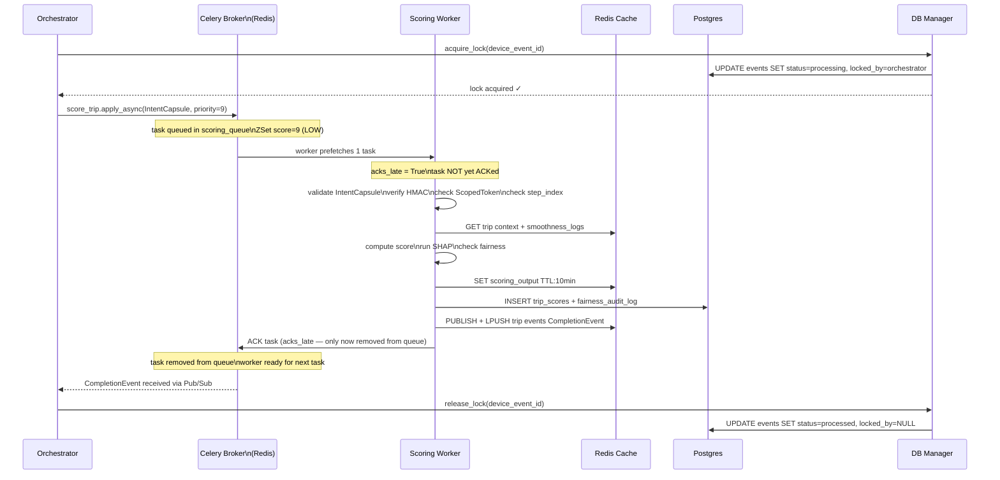
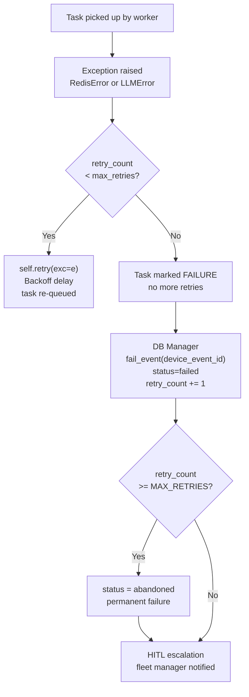
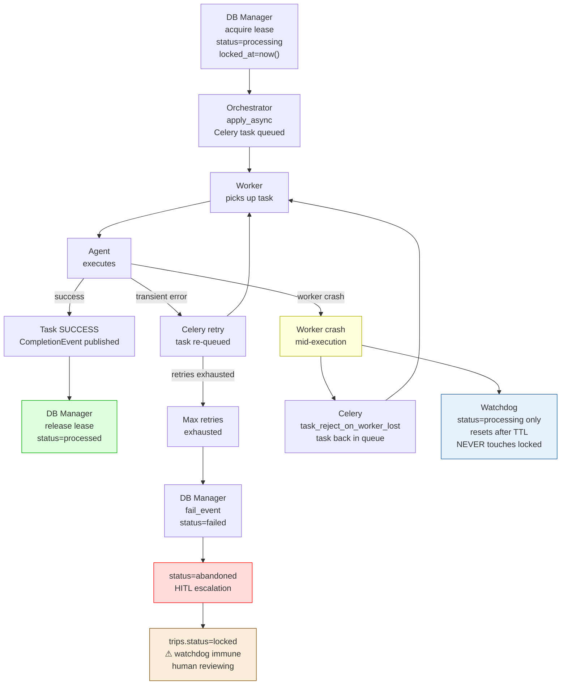
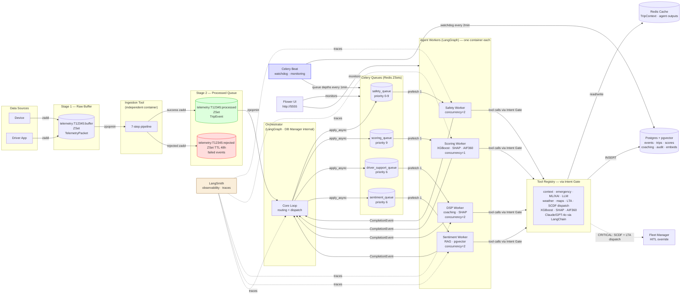

# TraceData — Celery Task Queue Architecture
## Priority Queues, Agent Workers, Task Lifecycle, and Two-Phase Commit Integration

SWE5008 Capstone | Phase 3 Architecture Record | March 2026

**Related Documents:**
- Redis Architecture — broker configuration and key schema
- Orchestrator Agent — dispatch logic and DB Manager integration
- FL-SCO-01 — End-of-Trip Scoring Flow (Steps 4–7)

---

## 1. What Celery Does In TraceData

Celery is the task queue that decouples the Orchestrator from agent execution. All agents are implemented as **LangGraph** graphs — Celery workers host these LangGraph instances and run them asynchronously.

```
Without Celery:
  Orchestrator calls Safety Agent directly
  Orchestrator blocks waiting for Safety Agent to finish
  If Safety Agent takes 30 seconds → Orchestrator is frozen
  Cannot process other events during that time

With Celery:
  Orchestrator enqueues task → returns immediately
  Safety Agent LangGraph worker picks up task independently
  Orchestrator continues processing other events
  Agent publishes CompletionEvent when done
  Orchestrator reacts via Pub/Sub
```

Redis serves dual purpose here — it is both the Celery **broker** (task queue) and the **result backend** (agent outputs stored in Redis cache).

**Observability — LangSmith** is wired across all agent workers. Every LangGraph node execution, every LLM call, and every tool invocation is traced automatically. This gives full visibility into agent decision paths without additional instrumentation.

```
LangSmith captures per agent task:
  → node-by-node execution trace
  → LLM prompt + response (with token counts)
  → tool call inputs and outputs
  → latency per step
  → error traces on failure
```

---

## 2. Queue Design — One Queue Per Agent

Each agent has its own dedicated Celery queue. This gives independent priority control, independent scaling, and clear observability per agent type.

```
Queue               Worker              Priority    Processing SLA
────────────────    ──────────────────  ────────    ──────────────
safety_queue        safety_worker       CRITICAL→LOW   5s / 30s
scoring_queue       scoring_worker      LOW            1 hour
driver_support_queue driver_support_w   MEDIUM         10 minutes
sentiment_queue     sentiment_worker    MEDIUM/LOW     10 minutes
```

### Why Not One Shared Queue?

```
Shared queue problem:
  100 smoothness_log scoring tasks queued (LOW)
  One collision safety task arrives
  Collision task waits behind 100 LOW tasks
  → fleet manager not alerted for 100 × processing time

Per-queue solution:
  safety_queue has collision task → processed in 5 seconds
  scoring_queue has 100 smoothness tasks → takes 1 hour
  Completely independent — no interference
```

### Priority Within Each Queue

Within each queue, Celery uses Redis ZSet scores for ordering. The Orchestrator sets the priority when dispatching:

```python
# CRITICAL collision → safety_queue, priority 0
score_trip.apply_async(
    queue    = "safety_queue",
    priority = 0,    # CRITICAL — processed first within queue
)

# LOW end_of_trip → scoring_queue, priority 9
score_trip.apply_async(
    queue    = "scoring_queue",
    priority = 9,    # LOW — processed last within queue
)
```

---

## 3. Celery Configuration

```python
# celery_app.py

from celery import Celery
import os

REDIS_URL = (
    f"redis://{os.getenv('REDIS_HOST', 'localhost')}:"
    f"{os.getenv('REDIS_PORT', '6379')}/0"
)

app = Celery("tracedata", broker=REDIS_URL, backend=REDIS_URL)

app.conf.update(

    # ── Queue configuration ────────────────────────────────────
    task_queues = {
        "safety_queue":        {"exchange": "safety_queue",        "routing_key": "safety"},
        "scoring_queue":       {"exchange": "scoring_queue",       "routing_key": "scoring"},
        "driver_support_queue":{"exchange": "driver_support_queue","routing_key": "driver_support"},
        "sentiment_queue":     {"exchange": "sentiment_queue",     "routing_key": "sentiment"},
    },

    # ── Task routing — each task type goes to its dedicated queue ──
    task_routes = {
        "tracedata.safety.analyse_event":    {"queue": "safety_queue"},
        "tracedata.scoring.score_trip":      {"queue": "scoring_queue"},
        "tracedata.support.generate_coaching":{"queue": "driver_support_queue"},
        "tracedata.sentiment.analyse_text":  {"queue": "sentiment_queue"},
    },

    # ── Serialisation ──────────────────────────────────────────
    task_serializer   = "json",
    result_serializer = "json",
    accept_content    = ["json"],

    # ── Reliability ────────────────────────────────────────────
    task_acks_late          = True,     # ACK only after task completes
    task_reject_on_worker_lost = True,  # re-queue if worker dies mid-task
    worker_prefetch_multiplier  = 1,    # one task at a time per worker
                                        # prevents priority starvation

    # ── Timeouts ───────────────────────────────────────────────
    task_soft_time_limit = 3600,    # 1 hour soft limit (SIGTERM)
    task_time_limit      = 3660,    # 1 hour hard limit (SIGKILL)

    # ── Result backend ─────────────────────────────────────────
    result_expires = 3600,          # results expire after 1 hour
    task_ignore_result = False,     # store results for retry logic

    # ── Monitoring ─────────────────────────────────────────────
    worker_send_task_events = True,  # enables Flower monitoring
    task_send_sent_event    = True,
)
```

### Why `task_acks_late = True`

```
Default (acks_early):
  Worker receives task → immediately ACKs → removes from queue
  Worker crashes mid-execution → task is LOST
  No retry possible

acks_late:
  Worker receives task → does NOT ACK yet
  Worker finishes task → ACKs → removed from queue
  Worker crashes mid-execution → task stays in queue
  Another worker picks it up and retries

Critical for TraceData:
  A Safety Agent processing a collision cannot be lost mid-execution
  acks_late ensures crash recovery at the Celery layer
```

### Why `worker_prefetch_multiplier = 1`

```
Default prefetch = 4:
  Worker grabs 4 tasks at once
  CRITICAL task arrives → must wait for worker to finish
  current 4 LOW tasks before touching CRITICAL task

Prefetch = 1:
  Worker grabs exactly 1 task at a time
  Finishes → grabs next → CRITICAL gets picked up immediately
  Correct priority ordering is preserved
```

---

## 4. Task Definitions

### 4.1 Safety Agent Task

```python
# tasks/safety.py

from celery_app import app
from models import IntentCapsule, SafetyResult
import logging

logger = logging.getLogger(__name__)


@app.task(
    name    = "tracedata.safety.analyse_event",
    bind    = True,
    max_retries    = 3,
    default_retry_delay = 5,    # 5 seconds between retries
)
def analyse_event(self, intent_capsule: dict) -> dict:
    """
    Safety Agent task.
    Validates IntentCapsule, analyses the event, returns SafetyResult.

    Retry policy:
      - Max 3 retries on transient failures (Redis timeout, LLM error)
      - No retry on security violations (capsule invalid, HMAC mismatch)
      - No retry on validation failures (bad output from LLM)
    """
    from agents.safety_agent import SafetyAgent

    try:
        capsule = IntentCapsule(**intent_capsule)
        agent   = SafetyAgent()
        result  = agent.execute(capsule)
        return result.model_dump()

    except SecurityViolation as e:
        # Do not retry security violations
        logger.error({
            "action":  "security_violation",
            "task_id": self.request.id,
            "error":   str(e),
        })
        raise  # marks task as FAILURE, no retry

    except (RedisError, LLMError) as e:
        # Transient failures — retry with backoff
        logger.warning({
            "action":      "transient_failure_retry",
            "task_id":     self.request.id,
            "retry_count": self.request.retries,
            "error":       str(e),
        })
        raise self.retry(exc=e)
```

### 4.2 Scoring Agent Task

```python
# tasks/scoring.py

@app.task(
    name    = "tracedata.scoring.score_trip",
    bind    = True,
    max_retries    = 2,
    default_retry_delay = 30,   # 30 seconds — scoring is slow
)
def score_trip(self, intent_capsule: dict) -> dict:
    """
    Scoring Agent task.
    Validates capsule, computes trip score, runs SHAP, checks fairness.
    """
    from agents.scoring_agent import ScoringAgent

    try:
        capsule = IntentCapsule(**intent_capsule)
        agent   = ScoringAgent()
        result  = agent.execute(capsule)
        return result.model_dump()

    except SecurityViolation as e:
        logger.error({"action": "security_violation", "task_id": self.request.id})
        raise

    except (RedisError, XGBoostError, LLMError) as e:
        raise self.retry(exc=e)
```

### 4.3 Driver Support Agent Task

```python
# tasks/driver_support.py

@app.task(
    name    = "tracedata.support.generate_coaching",
    bind    = True,
    max_retries    = 2,
    default_retry_delay = 60,
)
def generate_coaching(self, intent_capsule: dict) -> dict:
    from agents.driver_support_agent import DriverSupportAgent

    try:
        capsule = IntentCapsule(**intent_capsule)
        agent   = DriverSupportAgent()
        result  = agent.execute(capsule)
        return result.model_dump()

    except SecurityViolation as e:
        logger.error({"action": "security_violation", "task_id": self.request.id})
        raise

    except (RedisError, LLMError) as e:
        raise self.retry(exc=e)
```

---

## 5. Task Lifecycle — Happy Path



---

## 6. Task Lifecycle — Failure Paths

### 6.1 Transient Failure (Redis timeout, LLM error)



### 6.2 Worker Crash Mid-Execution

```
Worker picks up task (acks_late — not yet ACKed)
Worker process crashes (OOM, SIGKILL, container restart)

Celery layer:
  task_reject_on_worker_lost = True
  → task REJECTED back to the queue
  → NOT lost — returns to scoring_queue
  → another worker picks it up

DB Manager watchdog (runs every 2 minutes):
  → finds rows WHERE status = 'processing'    ← ONLY 'processing'
                AND locked_at < now() - LOCK_TTL
  → resets: status='received', locked_by=NULL, locked_at=NULL
  → event re-pushed to processed queue for reprocessing

  WATCHDOG NEVER TOUCHES status = 'locked':
    'processing' = agent crashed or is still running
                   watchdog can safely reset after TTL
    'locked'     = fleet manager is actively reviewing (HITL)
                   human review takes unpredictable time
                   resetting it would abort an active review session
                   only a fleet manager UI action can exit 'locked'

Two-layer crash recovery:
  Celery layer: task back in queue automatically
  DB layer:     event row reset by watchdog
  Both must agree: prevents duplicate processing

Lock TTL must be >= 2x maximum agent runtime:
  Safety Agent:  30s max  → minimum TTL: 2 minutes
  DSP Agent:     10m max  → minimum TTL: 20 minutes
  Scoring Agent: 1hr max  → minimum TTL: 2 hours
  TraceData default TTL: 10 minutes
  Scoring Agent uses extended TTL set via IntentCapsule.ttl
```

**Why lease-based locking is better than strict 2PC for TraceData:**

```
Strict 2PC:
  Phase 1 coordinator asks ALL participants to prepare
  ALL must respond before proceeding
  DB lock held for the ENTIRE duration of agent execution
  Scoring Agent takes 1 hour → DB locked for 1 hour
  Any crash = coordinator stuck = manual intervention

Lease-based locking (what TraceData uses):
  Lock acquisition = one SQL UPDATE (milliseconds)
  Agent runs asynchronously — DB is completely free
  Lock expires automatically via TTL — self-healing
  HITL uses a separate status = 'locked' that never expires
  No distributed coordinator required

The tradeoff:
  2PC gives stronger consistency guarantees
  Lease gives better resilience and HITL compatibility
  At TraceData's scale (300 trucks) lease is correct choice
  2PC overhead only makes sense at high-concurrency DB systems
```

### 6.3 Security Violation

```
Worker picks up task
IntentCapsule validation fails (HMAC mismatch, expired token)

Worker:
  → captures ForensicSnapshot to Postgres task_execution_logs
  → publishes to critical-security-alerts Pub/Sub channel
  → raises SecurityViolation (NOT retried)
  → task marked FAILURE

Orchestrator:
  → receives security alert
  → calls DB Manager: update_trip_status(trip_id, 'locked')
  → locks mission — no further agent dispatch
  → HITL escalation: fleet manager must manually override

Why no retry on security violations:
  A HMAC mismatch means the capsule was tampered with
  Retrying would execute the same compromised task again
  Fail-fast is the only safe response
```

---

## 7. Retry Policy Per Agent

| Agent | Max Retries | Delay | Retry On | Never Retry |
|---|---|---|---|---|
| Safety Agent | 3 | 5s | Redis timeout, LLM error | SecurityViolation, ValidationError |
| Scoring Agent | 2 | 30s | Redis timeout, XGBoost error, LLM error | SecurityViolation, null score |
| Driver Support | 2 | 60s | Redis timeout, LLM error | SecurityViolation, Pydantic failure |
| Sentiment | 2 | 30s | Redis timeout, LLM error | SecurityViolation |

**Why Safety Agent gets more retries:**
```
Safety Agent handles CRITICAL events (collision, SOS).
A failed Safety Agent means emergency response may not trigger.
3 retries with 5s delay = 15 seconds of recovery window.
After 3 failures → HITL — human takes over.
```

---

## 8. Lease-Based Locking — Not Strict 2PC

TraceData uses **optimistic locking with TTL** (also called a lease) — not strict Two-Phase Commit. The pattern is named "Prepare / Commit" to describe the intent, but the mechanism is a timestamp-based lease. This distinction matters.

### Why Lease, Not Strict 2PC

```
Strict 2PC for TraceData would mean:
  Orchestrator acquires DB lock
  Waits for ALL participants (Celery + agent + Redis) to confirm
  DB lock held for entire agent execution duration
  Scoring Agent takes 1 hour → DB locked for 1 hour
  Any participant crash = coordinator stuck forever = manual fix

Lease (what TraceData actually uses):
  Lock acquisition = one SQL UPDATE (milliseconds)
  Orchestrator walks away — DB immediately free
  Agent runs fully asynchronously
  Lock expires via TTL — self-healing on crash
  HITL uses status='locked' which never expires automatically
  No distributed coordinator, no blocking protocol
```

### The Locking Protocol

```
PREPARE (Orchestrator before dispatch)
  DB Manager:
    UPDATE events
    SET    status    = 'processing',
           locked_by = 'orchestrator',
           locked_at = now()            ← timestamp, not expiry
    WHERE  device_event_id = ?
    AND    status    = 'received'
    AND    locked_by IS NULL

  Order matters — lock BEFORE Celery dispatch:
    Lock succeeds, dispatch fails → release lock, event retried ✅
    Dispatch succeeds, lock fails → task runs with no record ❌

COMMIT (on CompletionEvent received)
  DB Manager:
    status = 'processed', locked_by = NULL,
    locked_at = NULL, processed_at = now()

ROLLBACK (on agent failure after max retries)
  DB Manager:
    status = 'failed', locked_by = NULL,
    locked_at = NULL, retry_count += 1
  If retry_count >= MAX → status = 'abandoned' → HITL

CRASH RECOVERY (watchdog)
  Watchdog finds: status = 'processing'    ← ONLY this status
                  locked_at < now() - TTL
  Resets: status = 'received', locked_by = NULL, locked_at = NULL
  NEVER resets: status = 'locked'
                (fleet manager is actively reviewing — do not interrupt)
```



---

## 9. Celery Beat — Scheduled Tasks

Celery Beat runs the watchdog and any other periodic jobs:

```python
# celery_app.py — beat schedule

from celery.schedules import crontab

app.conf.beat_schedule = {

    # DB Manager watchdog — finds and recovers stuck events
    "watchdog-stuck-events": {
        "task":     "tracedata.db.watchdog_stuck_events",
        "schedule": 120.0,    # every 2 minutes
        "options":  {"queue": "default_queue"},
    },

    # Queue depth monitoring — logs depths for alerting
    "monitor-queue-depths": {
        "task":     "tracedata.monitoring.log_queue_depths",
        "schedule": 60.0,     # every 1 minute
        "options":  {"queue": "default_queue"},
    },
}
```

---

## 10. Docker Compose — Worker Configuration

Each agent runs as its own container with a dedicated Celery worker:

```yaml
# docker-compose.yml additions

  orchestrator:
    build: .
    container_name: tracedata_orchestrator
    command: python -m tracedata.orchestrator
    environment:
      - REDIS_HOST=redis
      - POSTGRES_HOST=postgres
    depends_on:
      redis:
        condition: service_healthy
      postgres:
        condition: service_healthy

  ingestion_worker:
    build: .
    container_name: tracedata_ingestion
    command: python run_ingestion.py
    environment:
      - REDIS_HOST=redis
      - POSTGRES_HOST=postgres
    depends_on:
      - redis
      - postgres

  safety_worker:
    build: .
    container_name: tracedata_safety_worker
    command: >
      celery -A celery_app worker
      --queues safety_queue
      --concurrency 2
      --loglevel info
      --hostname safety@%h
    environment:
      - REDIS_HOST=redis
      - POSTGRES_HOST=postgres
    depends_on:
      - redis

  scoring_worker:
    build: .
    container_name: tracedata_scoring_worker
    command: >
      celery -A celery_app worker
      --queues scoring_queue
      --concurrency 1
      --loglevel info
      --hostname scoring@%h
    environment:
      - REDIS_HOST=redis
      - POSTGRES_HOST=postgres
    depends_on:
      - redis

  driver_support_worker:
    build: .
    container_name: tracedata_dsp_worker
    command: >
      celery -A celery_app worker
      --queues driver_support_queue
      --concurrency 2
      --loglevel info
      --hostname dsp@%h
    environment:
      - REDIS_HOST=redis
      - POSTGRES_HOST=postgres
    depends_on:
      - redis

  celery_beat:
    build: .
    container_name: tracedata_beat
    command: celery -A celery_app beat --loglevel info
    environment:
      - REDIS_HOST=redis
      - POSTGRES_HOST=postgres
    depends_on:
      - redis

  flower:
    image: mher/flower:2.0
    container_name: tracedata_flower
    command: celery flower --broker=redis://redis:6379/0
    ports:
      - "5555:5555"
    depends_on:
      - redis
```

### Why Different Concurrency Per Worker

```
safety_worker  --concurrency 2
  Two simultaneous safety analyses.
  CRITICAL events need fast processing.
  Two workers = two collisions handled in parallel.

scoring_worker --concurrency 1
  XGBoost inference is CPU-bound.
  Running two models simultaneously on same container
  would cause CPU contention and slow both down.
  One at a time is faster overall.

dsp_worker     --concurrency 2
  LLM calls are I/O bound (waiting for API response).
  Two workers = two coaching generations in parallel.
  No CPU contention — both waiting on network.
```

---

## 11. Monitoring — Flower Dashboard

Flower is the Celery monitoring UI. Available at `http://localhost:5555`.

```
What Flower shows:
  Active tasks per queue — how many currently running
  Queue depths — how many tasks waiting
  Worker status — which workers are alive
  Task history — recent successes and failures
  Retry counts — which tasks are struggling
  Processing time — average duration per task type

Key metrics to watch:
  safety_queue depth > 0 for > 30s  → alert (SLA breach)
  scoring_worker failures > 3        → alert (model problem)
  watchdog not running               → alert (beat scheduler down)
```

---

## 12. Full Queue Flow Diagram



---

## 13. Phase 3 Stubs

| Concern | Phase 3 | Full Implementation |
|---|---|---|
| task_acks_late | Configured | Working from Sprint 2 |
| Per-agent queue routing | Configured | Working from Sprint 2 |
| Retry policy | Configured | Working from Sprint 2 |
| worker_prefetch_multiplier=1 | Configured | Working from Sprint 2 |
| SecurityViolation no-retry | Stub class | Phase 6 |
| DB Manager lock in dispatch | Logged only | Phase 8 |
| Celery Beat watchdog | Configured | Phase 8 |
| Flower monitoring | Running locally | Sprint 2 |
| task_reject_on_worker_lost | Configured | Working from Sprint 2 |
| LangSmith tracing on workers | Not wired | Sprint 3 |
| Emergency Dispatch tool | Stub — logs only | Sprint 2 |
| Intent Gate on tool calls | Stub — logs only | Phase 6 |
| Tool Registry wired | Manual calls | Sprint 3 |