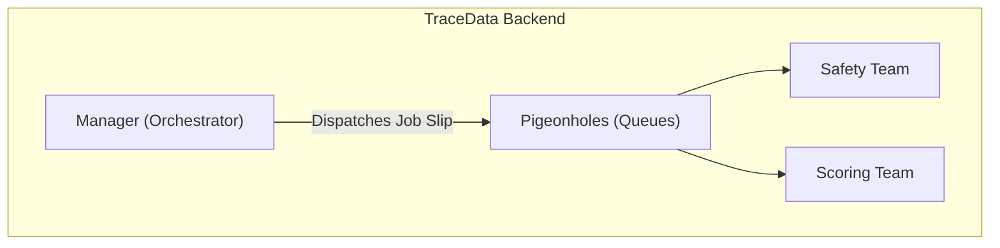
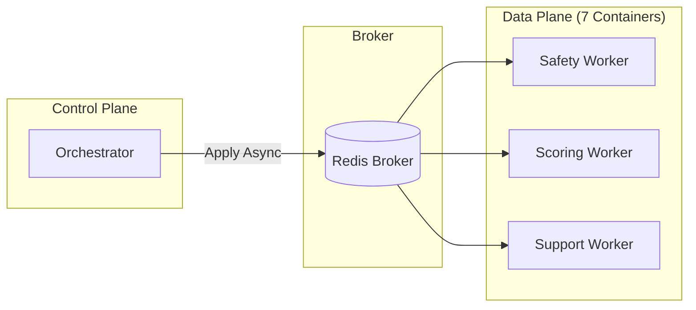
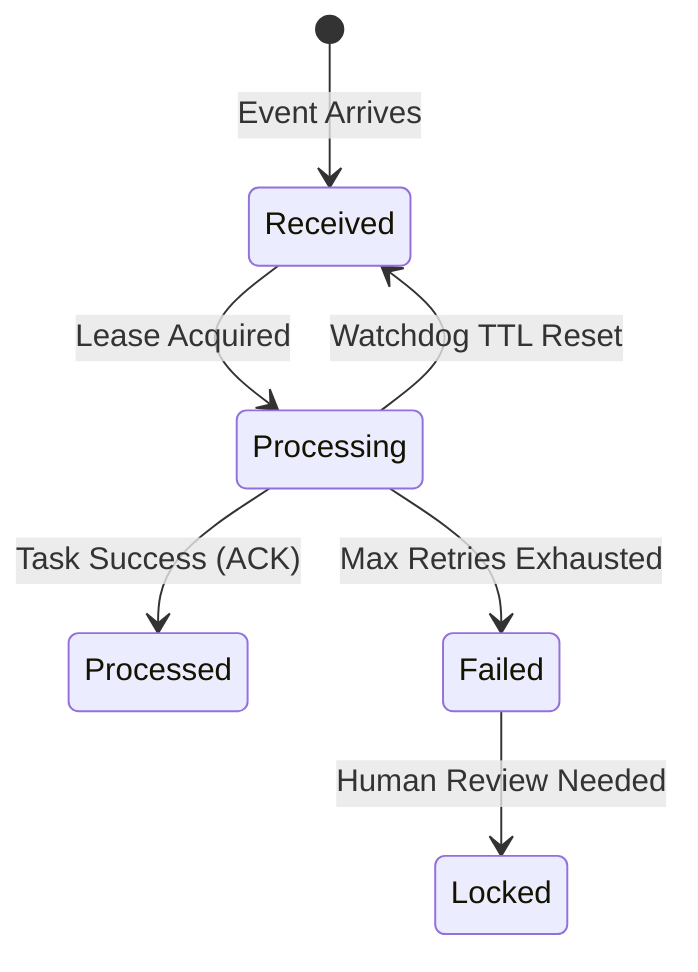

# 30,000 ft — The Logistics Dispatcher
Celery is the "Logistics Dispatcher" of the TraceData backend, responsible for distributing specialized work to the right agent containers.

Imagine a major truck terminal in Singapore. The **Orchestrator** is the terminal manager. When a truck returns with a data packet, the manager doesn't do the inspection or the paperwork himself. Instead, he writes a "Job Slip" (a Celery Task) and puts it in the appropriate pigeonhole (a Queue). The specialized teams—Safety Inspectors (Safety Agent), Accountants (Scoring Agent), and Support Staff (Support Agent)—pick up their slips and do the work independently. This allows the manager to keep handling new arrivals without getting bogged down in one single task.

### Diagram: The Dispatcher Analogy


| Mistake | Why people make it | What to do instead |
|---|---|---|
| One Giant Queue | It's easier to set up a single "default" queue. | Use one queue per agent so a slow Scoring task doesn't block a critical Safety alert. |
| Forgetting Retries | Assuming the LLM or DB will always be "up". | Always implement retries with exponential backoff for transient network/API failures. |
| Ignoring Timeouts | Some agents (like Scoring) can be very slow. | Set explicit `soft_time_limit` and `time_limit` per task type. |

**Learning Checkpoint:** If you can explain why the "Manager" (Orchestrator) should never do the "Inspector's" (Agent) work directly, you are ready to descend.

---

# 20,000 ft — The Worker Ecosystem
Celery connects our 7-container backend by providing an asynchronous, event-driven execution environment.

In the TraceData stack, Celery sits between the **Orchestrator API** and the **Analytical Workers**. It uses Redis as a "Broker" to hold tasks while workers are busy. This relates directly to our scalability goals: if we suddenly have 1,000 trucks active, we can simply spin up more "Scoring Worker" containers to handle the load without changing a single line of code.

### Diagram: Component Hierarchy


---

# 10,000 ft — The Intent-Driven Task
The core insight is that every Celery task is an **Intent**.

When the Orchestrator dispatches a task, it doesn't just send raw data. it sends an `IntentCapsule`. This capsule is a cryptographically signed instruction that tells the worker:
1.  **What** to do (e.g., "Score this trip").
2.  **Why** it's authorized (the Scoped Token).
3.  **Where** to find the context (the Trip ID).

**Key Insight**: Because the task is an *intent*, if a worker crashes, we can safely re-queue that same intent. The worker will pick it up, read the `TripContext` from Redis again, and resume work without missing a beat.

---

# 5,000 ft — Mechanism & Queues
TraceData uses hardware-tailored concurrency and queue separation.

1.  **Safety Queue**: Optimized for **Latency**. `concurrency=2` (high-priority, fast response).
2.  **Scoring Queue**: Optimized for **Throughput**. `concurrency=1` (CPU-bound XGBoost models prefer single-process execution to avoid cache thrashing).
3.  **Support Queue**: Optimized for **I/O**. `concurrency=2` (waiting on LLM API responses).
4.  **Acks Late**: We set `task_acks_late=True`. This means the task is only removed from the queue *after* it succeeds. If a container vanishes mid-task, the job "bubbles back up" and is picked up by another worker.

---

# 2,000 ft — Reliability & The Lease
Details that handle the "unhappy paths" of distributed systems.

-   **Wait and Retry**: We use `max_retries=3` with a 5s delay for Safety agents. If the LLM is rate-limiting us, we wait and try again automatically.
-   **Lease-Based Locking**: Before the Orchestrator sends a task to Celery, it marks the event as `processing` in Postgres with a `locked_at` timestamp.
-   **The Watchdog**: A periodic Celery Beat task (the "Watchdog") scans for events stuck in `processing` for too long. If it finds one, it assumes the worker died and resets it to `received` so it can be dispatched again.

### Diagram: Failure Recovery State


---

# 1,000 ft — The Code Contract
The `celery_app.py` defines the network layout for all 7 containers.

```python
# common/config/celery_app.py
app = Celery("tracedata", broker=REDIS_URL, backend=REDIS_URL)

app.conf.task_queues = {
    "safety_queue": {"routing_key": "safety"},
    "scoring_queue": {"routing_key": "scoring"},
}

# The Base Agent Task Wrapper
@app.task(bind=True, acks_late=True, max_retries=3)
def agent_task_wrapper(self, capsule: dict):
    # Inside each agent's container
    agent = self.get_agent_instance()
    return agent.handle(capsule)
```

---

# Ground — A Driver Dispute in Transit
**Scenario**: A driver disputes a "Harsh Cornering" event in the app.

1.  **Submit (0s)**: Driver hits "Dispute" on their phone.
2.  **Orchestrate (2ms)**:
    - API receives request.
    - Orchestrator prepares `IntentCapsule` for the `Support Agent`.
    - `POSTGRES`: Event `EV-102` marked as `processing`.
3.  **Dispatch (5ms)**:
    - Orchestrator calls `support_agent.apply_async(capsule, queue="support_queue")`.
    - Task sits in `support_queue` inside Redis.
4.  **Pickup (10ms)**:
    - The `support_worker` container picks up the task.
    - It validates the HMAC signature on the capsule.
5.  **Reasoning (1.5s)**:
    - Agent calls LLM to analyze the cornering G-force vs. the road curvature (fetched from Google Maps).
    - Result: "Dispute valid; road is a sharp 90-degree turn, 0.8g is expected."
6.  **Resolve (1.7s)**:
    - Agent writes result to `td:trip:T1:support_output`.
    - `PUBLISH`es signal to Orchestrator.
    - Task is `ACK`ed and removed from Celery.

---

# What This Connects To
- **Redis Architecture**: Redis act as the "Job Slip" pigeonhole (Broker).
- **Safety Agent**: Inherits the reliability patterns (Acks Late, Retries) documented here.
- **Orchestrator Agent**: Relies on Celery to clear its "inbox" without blocking.
- **SWE5008 Rubric**: Directly maps to **System Reliability** and **Fault Tolerance** requirements.