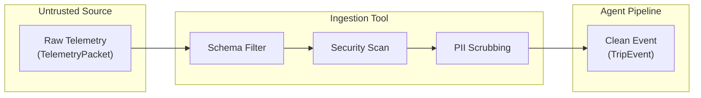
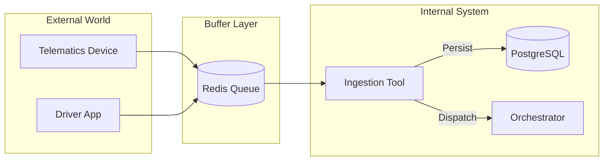
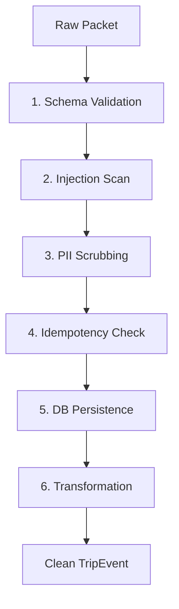
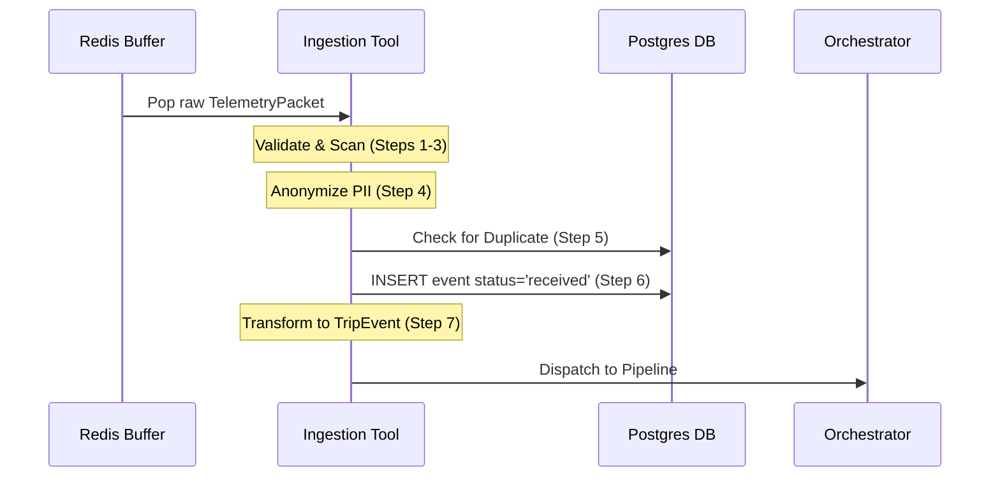
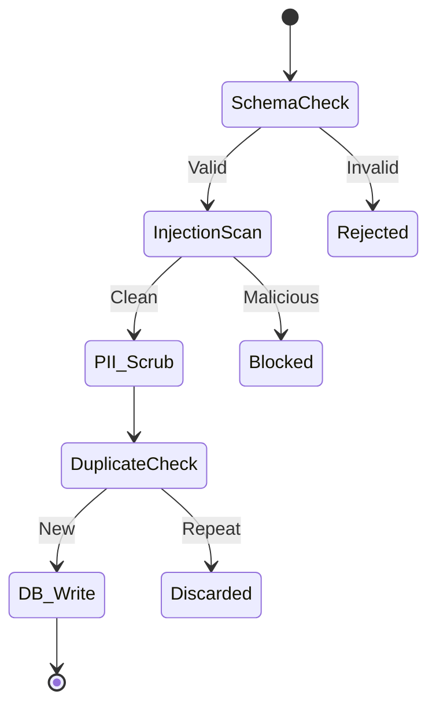

# 30,000 ft — The Water Filtration Plant
The Ingestion Tool is the "first line of defence" that ensures only pure, validated data enters the system.

Imagine TraceData as a precision-calibrated engine. If you put contaminated fuel (bad data) into it, it crashes. The Ingestion Tool is the **Water Filtration Plant** of the architecture. It takes in raw, untrusted telemetry "water"—which might contain sludge (malformed schemas), toxins (injection attacks), or pollutants (PII)—and passes it through a series of filters until it is "potable" (TripEvents) and safe for the AI Agents to consume.

### Diagram: The Filtration Analogy


| Mistake | Why people make it | What to do instead |
|---|---|---|
| Thinking it's an Agent | It's in the `backend` folder | Treat it as a deterministic function with zero LLM dependency. |
| Adding logic here | It seems like a good place for business rules | Keep logic in Agents; keep Ingestion strictly about validation and safety. |

**Learning Checkpoint:** If you can explain why we don't let raw GPS data reach the agents directly, you are ready to descend.

---

# 20,000 ft — Context & Boundary
The Ingestion Tool sits at the absolute edge of the system, acting as the security gatekeeper for all incoming telemetry.

In the TraceData stack, data flows from hardware devices (MQTT) or mobile apps (REST) into a Redis buffer. The Ingestion Tool is the component that pulls from this buffer and decides whether a packet is allowed into the "inner sanctum" (PostgreSQL and the Agent Pipeline). It is the only component that ever sees the raw, unscrubbed identity of a driver.

### Diagram: The Ingestion Ecosystem


**Learning Checkpoint:** If you understand that the Ingestion Tool is the *only* thing that "talks" to both the untrusted Redis buffer and the trusted Postgres DB, you are ready to descend.

---

# 10,000 ft — The Core Idea
The insight: Ingestion is a **deterministic security boundary** designed to prevent GIGO (Garbage In, Garbage Out).

The core mechanism is a **7-Step Unidirectional Pipeline**. Every packet must pass every test. If it fails a schema check, it's rejected. If it fails a security scan, it's blocked. If it's a duplicate, it's discarded. Only after it is persisted to the database and anonymised does it become a `TripEvent`.

### Diagram: Sequential Filtering


**Learning Checkpoint:** Why is the database write (Step 5) *before* the transformation (Step 6)? (Hint: Data durability).

---

# 5,000 ft — The Mechanism
Step-by-step, here is how the "Filtration Plant" processes a single `TelemetryPacket`.

1.  **Schema Validation**: Uses Pydantic to ensure the JSON matches the expected structure.
2.  **Governance Check**: Consults the `EVENT_MATRIX` to verify the `event_type` exists and correct the priority if the device "lied."
3.  **Injection Scan**: Scans text for prompt injection (e.g., "Ignore previous instructions") to protect downstream LLMs.
4.  **PII Scrubbing**: Hashes the `driver_id` and rounds GPS coordinates to 2 decimal places to preserve privacy.
5.  **Idempotency Check**: Checks the DB for the `device_event_id` to ensure we don't process retries.
6.  **Postgres Write**: Saves the raw data to the `events` table with `status='received'`.
7.  **Final Transformation**: Flattens the nested structure into a clean `TripEvent`.

### Diagram: Logic Flow


---

# 2,000 ft — The Details
Failure modes and edge cases that trip up developers.

-   **Priority Overrides**: Even if a device claims an event is `URGENT`, the `EVENT_MATRIX` might override it to `LOW`. The Ingestion Tool enforces the server's truth.
-   **PII Salt**: The `driver_id` is hashed using a salt. This is deterministic (same driver = same token) but irreversible without the salt.
-   **GPS Rounding**: 2 decimal places provides ~1.1km accuracy. This is enough for mapping but not enough to "stalk" a driver to their front door.

### Diagram: Decision Tree


---

# 1,000 ft — The Code
The actual implementation of the sidecar processing loop.

```python
# common/tools/ingestion/sidecar.py

def process(self, raw: dict) -> TripEvent | None:
    # 1. Pydantic enforces the "Standard Factory Spec"
    packet = self._validate_schema(raw) # TelemetryPacket(**raw)
    if not packet: return None

    # 2. Injection Scan (LLM01 Mitigation)
    # Prevents "Ignore previous instructions" from entering the prompt pipeline
    if not self._scan_for_injection(packet):
        return None

    # 3. PII Scrubbing
    # Deterministic hashing + GPS rounding (2dp)
    packet = self._scrub_pii(packet)

    # 4. Persistence & Idempotency
    # Ensure a 'device_event_id' is only processed ONCE
    if not self._check_idempotency(packet):
        return None
    
    # 5. DB Write (Data Durability)
    self._write_to_postgres(packet)

    return self._transform(packet) # TelemetryPacket -> TripEvent
```

---

# Ground — Worked Example
**Scenario:** A driver performs a harsh braking maneuver (Event ID: `BRAKE-456`).

1.  **Input**: Raw JSON arrives with `g_force: 1.2` and `driver_id: "Sree123"`.
2.  **Filter 1 (Schema)**: Pydantic confirms `g_force` is a float. **PASS**.
3.  **Filter 2 (Security)**: Scanner finds no prompt injection text. **PASS**.
4.  **Filter 3 (PII)**: `Sree123` becomes `DRV-ANON-A8B2`. GPS `1.23456, 103.45678` becomes `1.23, 103.46`.
5.  **Filter 4 (DB)**: `device_event_id` is new. **PASS**.
6.  **Persist**: The DB now contains the raw evidence and the anon ID.
7.  **Output**: A clean `TripEvent` is handed to the Orchestrator.

---

# What This Connects To
- **Redis Architecture**: Defines where the "unfiltered water" comes from.
- **Input Data Architecture**: Defines the exact "Filter Specifications" (BOM).
- **Security Agents**: Relies on the "Potable Data" produced here to function without bias or attack.
- **SWE5008 Rubric**: Serves the **Data Governance** and **Self-Healing Architecture** dimensions.
idence,
            source          = packet.source,
            ping_type       = packet.ping_type,
            is_emergency    = packet.is_emergency,
        )
```

---

## 6. Distributed Trace IDs — What Gets Logged

Every log line carries both correlation IDs:

```python
# Three IDs — three different scopes

device_event_id  → "DEV-BRAKE-002"
  Stamped by device at detection. Never changes across retries.
  Used for: idempotency check, deduplication

event_id         → "EV-HIGH-T12345-002"
  Generated on receipt. One per ingestion attempt.
  Used for: span-level tracing through pipeline

trip_id          → "TRIP-T12345-2026-03-07-08:00"
  Links all events in a trip. Cross-service trace ID.
  Used for: filtering all agents + Redis keys + Postgres rows
            for one complete trip

# Example structured log
{
    "timestamp":       "2026-03-07T09:10:01Z",
    "service":         "ingestion_sidecar",
    "action":          "event_ingested",
    "trip_id":         "TRIP-T12345-2026-03-07-08:00",  ← trace ID
    "event_id":        "EV-HIGH-T12345-002",              ← span ID
    "device_event_id": "DEV-BRAKE-002",                   ← idempotency key
    "event_type":      "harsh_brake",
    "priority":        3,
    "source":          "telematics_device",
}
```

---

## 7. OWASP Coverage

| Risk | Standard | How Ingestion Tool Addresses It |
|---|---|---|
| Prompt Injection | LLM01:2025 | Step 3 — regex injection scan on all string fields |
| Sensitive Information Disclosure | LLM02:2025 | Step 4 — PII scrub before TripEvent enters pipeline |
| Data and Model Poisoning | LLM04:2025 | Steps 1+2 — schema + EVENT_MATRIX reject malformed/manipulated data |
| Improper Output Handling | LLM05:2025 | Step 7 — Pydantic TripEvent model strips unexpected fields |
| Sensitive Data in Pipelines | ASI06 | Step 4 — real driver_id never enters agent pipeline |

---

## 8. What Is Stubbed In Phase 3

| Concern | Phase 3 | Full Implementation |
|---|---|---|
| Postgres write | TODO comment | Phase 8 |
| Idempotency check | Not implemented — always passes | Phase 8 |
| PII scrub — NER model | Hash-based only | Phase 6 — add NER for name detection |
| Injection scan | Basic regex | Phase 6 — expand pattern library |
| GPS rounding | Implemented | Done |
| Schema validation | Implemented | Done |
| EVENT_MATRIX check | Implemented | Done |
| Priority override logging | Implemented | Done |s