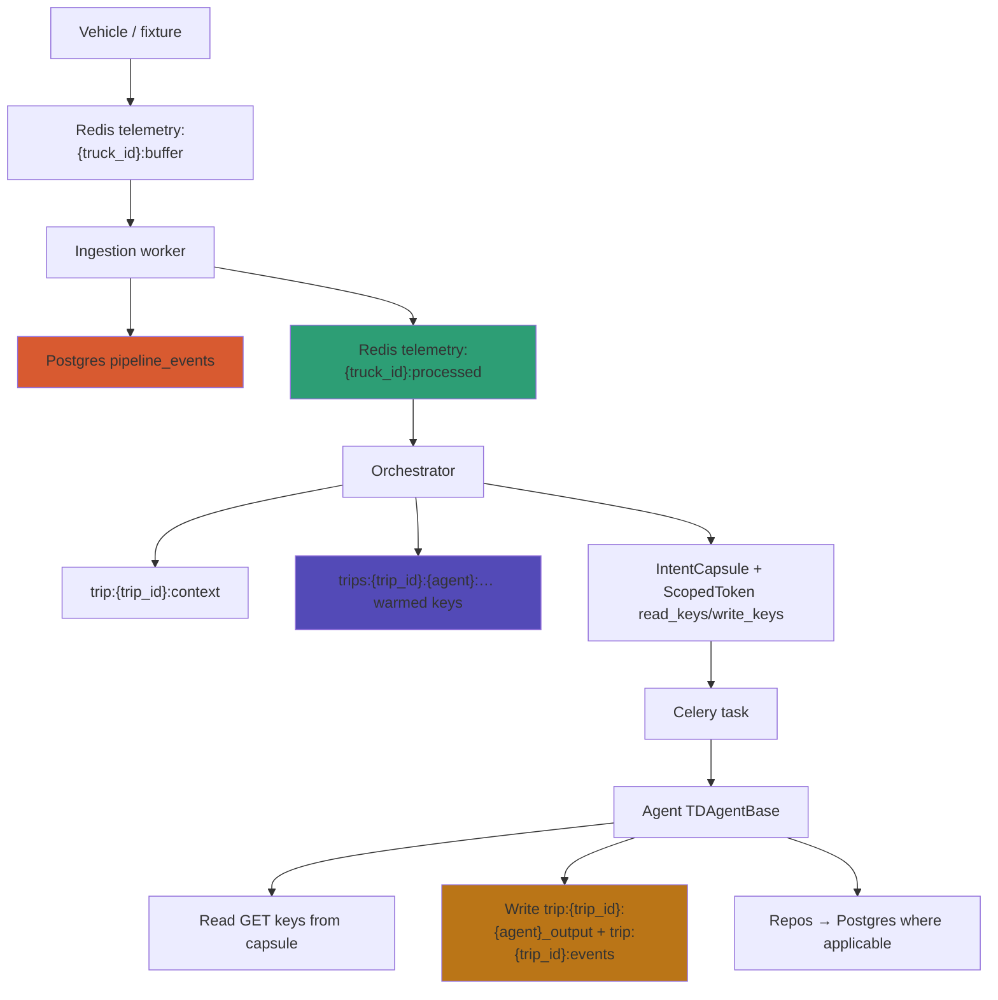
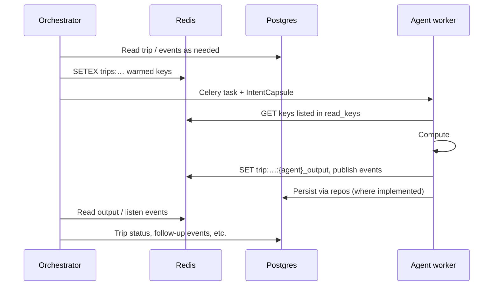

# TraceData: Redis + Postgres Dual-Storage Architecture

This document describes **how the repo is wired today** (`backend/common/redis/keys.py`, ingestion, orchestrator, agents). It also calls out a few **naming traps** (especially `trip:` vs `trips:`) so the mental model matches production keys.

---

## Overview

- **PostgreSQL** — Source of truth for pipeline events (`pipeline_events`), trips (`pipeline_trips`), scoring tables, locks, and idempotency (`device_event_id`).
- **Redis** — Truck-scoped telemetry queues, trip-scoped working cache, per-agent **warmed inputs**, agent outputs, and completion signaling. TTLs are per-key (`SETEX`), not a single glob pattern.
- **ScopedToken** (inside **IntentCapsule**) — Explicit **lists of Redis key strings** the worker may read/write for that dispatch (`read_keys`, `write_keys`).
- **Intent Gate** — Verifies capsule integrity and policy before tool-style Redis access (HMAC sealing is staged; see `backend/security/intent_gate.py` and `common/models/security.py`).

Agents typically **hydrate from Redis using keys on the capsule**; many agents still **persist domain results via repositories** that talk to Postgres (not “Redis-only writes”).

---

## PostgreSQL master, Redis transient

| Layer | Role | Persistence | Typical TTL / lifetime |
|-------|------|-------------|-------------------------|
| **PostgreSQL** | Source of truth, audit, replay | Permanent | Survives restarts |
| **Redis Pub/Sub** | Fire-and-forget notifications | Message not stored | Subscribers see it once |
| **Redis strings / lists / zsets** | Queues, cache, warmed agent inputs | Until `EXPIRE` / delete | See [TTLs](#redis-ttl-reference) below |
| **Celery** | Task delivery | Broker-backed | Until consumed / acked |

**Recovery:** If Redis is flushed, **events remain in Postgres**; the pipeline can be reasoned about from `pipeline_events` (replay / re-warm is orchestration policy, not automatic magic).

---

## The naming trap: `trip:` vs `trips:`

Both prefixes use the **same** `trip_id`. The plural **`trips`** does **not** mean “multiple trips.”

### `trip:{trip_id}:…` — shared trip lane + outputs + events

| Key (pattern) | Content | Main writers | Main readers |
|---------------|---------|--------------|--------------|
| `trip:{trip_id}:context` | Trip-level runtime JSON (metadata, flagged events, etc.) | Orchestrator | Orchestrator, support flows |
| `trip:{trip_id}:smoothness_logs` | List of smoothness windows (when populated) | Intended for pipeline / ingestion | Consumers of smoothness |
| `trip:{trip_id}:{agent}_output` | **Finished result** for that agent (e.g. `scoring_output`) | Agent | Orchestrator, downstream agents |
| `trip:{trip_id}:events` | Completion / coordination channel | Agents (publish) | Orchestrator / listeners |

**Mnemonic:** **`trip:` = “this trip’s shared drawer” + “each agent’s report card” + events.**

### `trips:{trip_id}:{agent}:{data_type}` — per-agent **input** package (warmed cache)

Built by **`RedisSchema.Trip.agent_data`** in `backend/common/redis/keys.py`. Examples:

| Key | Content |
|-----|---------|
| `trips:{id}:safety:current_event` | DB snapshot of the triggering event (+ related fields) for Safety |
| `trips:{id}:safety:trip_context` | Metadata bundle for Safety |
| `trips:{id}:scoring:all_pings` | Large JSON list of trip events/pings (from Postgres) for Scoring |
| `trips:{id}:scoring:trip_context` | Metadata for Scoring |
| `trips:{id}:scoring:historical_avg` | Rolling / historical averages |
| `trips:{id}:support:trip_context` | Support context (may embed snapshots from agent outputs) |
| `trips:{id}:support:coaching_history` | Recent coaching rows |

**Mnemonic:** **`trips:` = orchestrator-filled “inbox” for one agent** so workers do not all read the same giant blob. Safety gets small keys; Scoring gets `all_pings`.

**Why two families?** Same trip, different jobs: shared state and **final outputs** under `trip:…`, **prefetched inputs** under `trips:…:{agent}:…`. The capsule’s `read_keys` list the **exact** strings for that run.

---

## Data flow (as implemented)



**Not in the codebase today:** ingestion does **not** dual-write full “raw ping lists” into a `trip:{id}:store:raw_pings` namespace. Telemetry enters **truck** queues first; events land in **Postgres**; the orchestrator **warms** trip/agent keys from DB when routing.

---

## Ingestion (actual write pattern)

1. **Redis:** packets are scored into `telemetry:{truck_id}:buffer` (e.g. from devices or `play_workflow.py`).
2. **Ingestion:** validates, inserts **`pipeline_events`** (and related fields), then moves the packet to **`telemetry:{truck_id}:processed`** (or rejection / DLQ paths).
3. **No** wholesale `redis.expire("trip:{id}:*")` — Redis **does not** support applying TTL to keys matching a glob; each key uses **`SETEX`** / **`EXPIRE`** on the **concrete** key name.

---

## Orchestrator: warming and capsules

After lock acquisition and routing, the orchestrator:

1. **Warms** Redis keys under `trips:{trip_id}:{agent}:{data_type}` (and updates `trip:{trip_id}:context` where needed).
2. **Seals** an **IntentCapsule** whose **`ScopedToken.read_keys`** / **`write_keys`** match those warmed keys plus outputs/events.

Event-driven agents (e.g. Safety) typically receive:

- `trips:{trip_id}:{agent}:current_event`
- `trips:{trip_id}:{agent}:trip_context`

Aggregation-driven Scoring on `end_of_trip` typically receives:

- `trips:{trip_id}:scoring:all_pings`
- `trips:{trip_id}:scoring:historical_avg`
- `trips:{trip_id}:scoring:trip_context`

**Write keys** on the token are aligned with:

- `trip:{trip_id}:{agent}_output`
- `trip:{trip_id}:events`

(See `_seal_capsule` in `backend/agents/orchestrator/agent.py`.)

---

## Redis TTL reference (from `RedisSchema.Trip`)

| Key family | Typical TTL | Notes |
|------------|-------------|--------|
| `trip:{id}:context` | Up to **48h** (`CONTEXT_TTL_HIGH`) or shorter by priority | Orchestrator `store_trip_context` |
| Event-driven `trips:…` | **300s** | `_warm_event_driven` |
| Scoring / support warm keys | **3600s** | `_warm_aggregation_driven` |
| `trip:{id}:{agent}_output` | **600s** (`OUTPUT_TTL`) | Agent base |

Adjustments should stay in **`RedisSchema`** so orchestrator, agents, and docs stay aligned.

---

## ScopedToken and IntentCapsule (code-accurate)

Defined in `backend/common/models/security.py`.

**ScopedToken**

- `agent`, `trip_id`, `expires_at`
- `read_keys: list[str]` — full Redis key strings
- `write_keys: list[str]`

There is **no** `step_index` on `ScopedToken`; mutable step state belongs on **`ExecutionContext`**, not the immutable capsule.

**IntentCapsule**

- Mission fields: `trip_id`, `agent`, `device_event_id`, `priority`, tool allowlists, TTL, etc.
- `token: ScopedToken | None`
- `hmac_seal` on the **capsule** (signing lifecycle is documented in code comments)

---

## Intent Gate (behavior)

Before a gated Redis operation:

1. Capsule / token integrity policy (e.g. HMAC when enabled).
2. **Expiry** (`expires_at`).
3. **Key allowlist** — the requested Redis key must appear in `read_keys` or `write_keys` as appropriate.

The gate **authorizes**; the agent or client still performs the Redis call unless your wrapper executes it centrally.

---

## Agent execution lifecycle (simplified)



---

## Example: Scoring keys **as implemented**

**Read keys** (illustrative — real list is built in `_seal_capsule`):

```text
trips:{trip_id}:scoring:all_pings
trips:{trip_id}:scoring:historical_avg
trips:{trip_id}:scoring:trip_context
```

**Write keys:**

```text
trip:{trip_id}:scoring_output
trip:{trip_id}:events
```

Support on `coaching_ready` merges prior agent outputs into **`trips:{trip_id}:support:trip_context`** while reading latest **`trip:{trip_id}:scoring_output`** and **`trip:{trip_id}:safety_output`** — see `docs/03-agents/1_orchestrator_agent.md`.

---

## Summary

| Aspect | Redis | Postgres | Capsule / gate |
|--------|-------|----------|----------------|
| **Role** | Queues, shared trip state, warmed per-agent inputs, outputs | Durable events, trips, scoring | Lists allowed Redis keys |
| **Ingestion** | Truck buffers + processed zset | `pipeline_events` rows | — |
| **Warm path** | `trips:…` + `trip:context` | Queries for warm payloads | `read_keys` |
| **Agent writes** | `trip:…:{agent}_output`, `trip:…:events` | Via repos in code today | `write_keys` |
| **TTL** | Per-key `SETEX` | N/A | Token `expires_at` |

---

## Guarantees and non-goals

1. **Postgres is authoritative** for ingested events and trip lifecycle fields agents depend on for replay semantics.
2. **Least privilege** for Redis is expressed as **explicit key lists** on `ScopedToken`; expand lists only when orchestrator warming adds keys.
3. **No Redis glob TTL** — document and code must use **concrete keys**.
4. **Agents may use Postgres via repositories** in the current codebase; stating “agents never touch Postgres” would be inaccurate unless you refactor to orchestrator-only persistence.

---

## See also

- `backend/common/redis/keys.py` — canonical key constructors (`RedisSchema`).
- `backend/common/redis/README.md` — queue and cache patterns.
- `docs/03-agents/1_orchestrator_agent.md` — warming, capsules, coaching chain.
- `docs/03-agents/5_scoring_agent.md` — Scoring Redis inputs.
