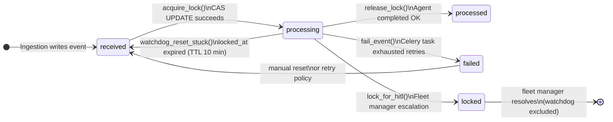
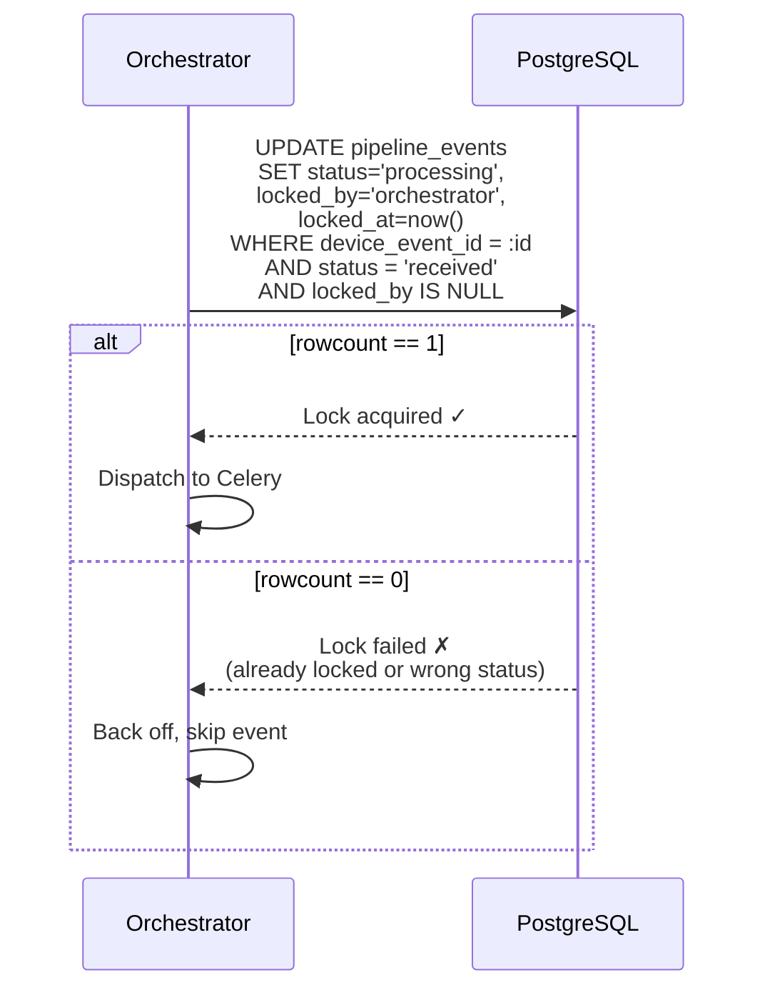
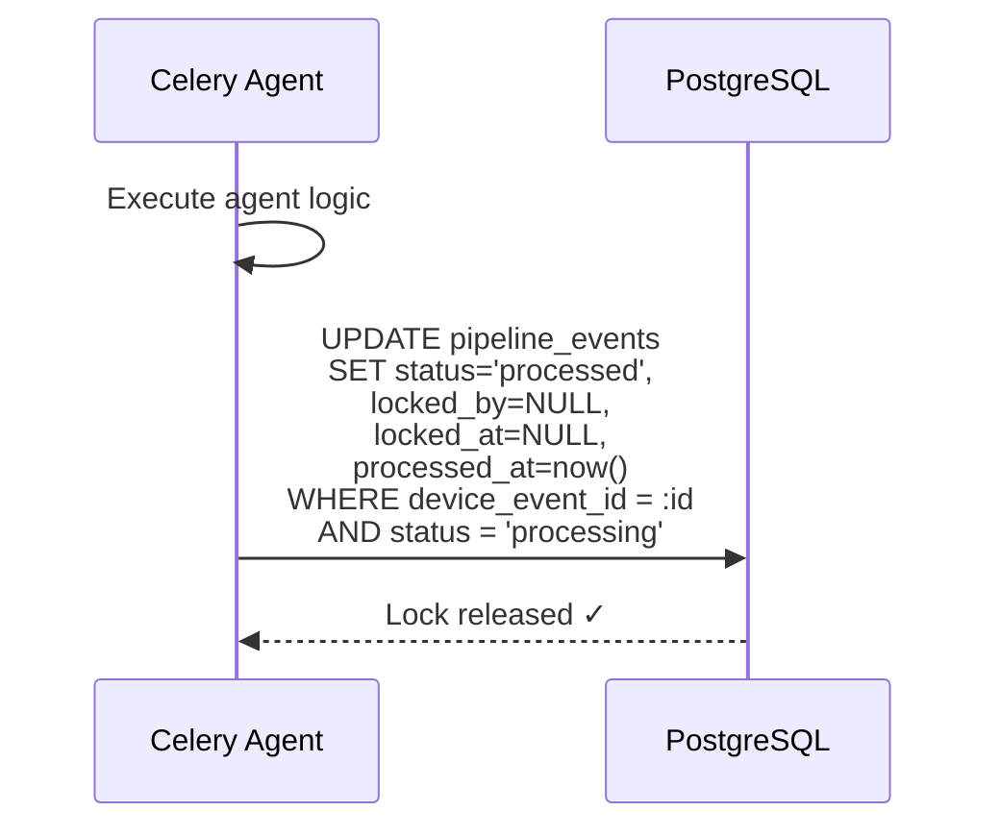
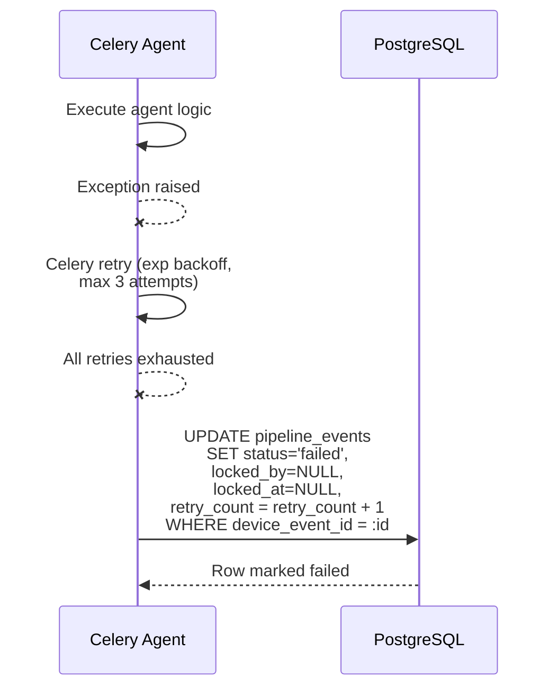
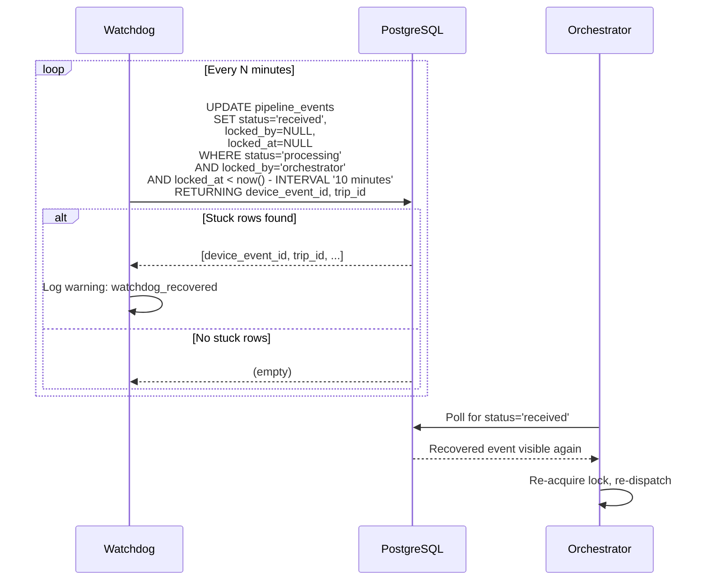
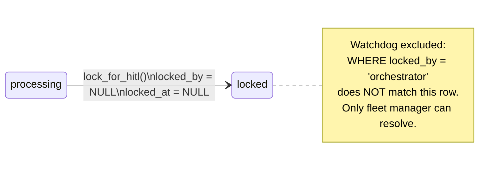
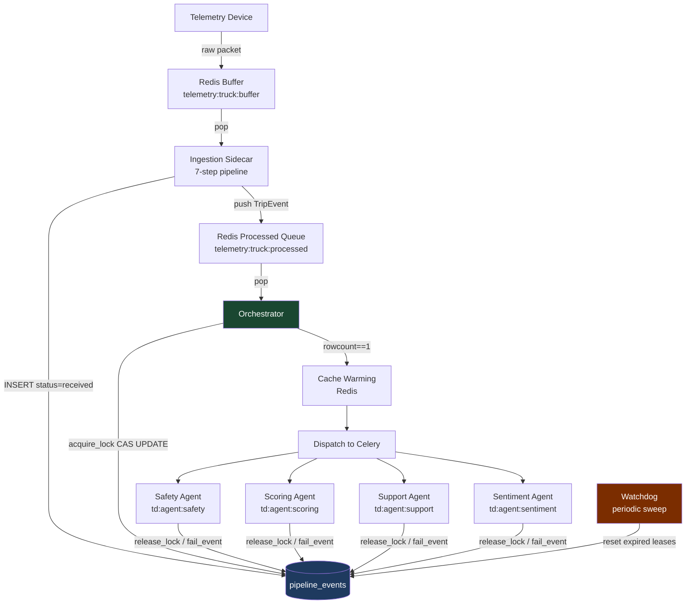
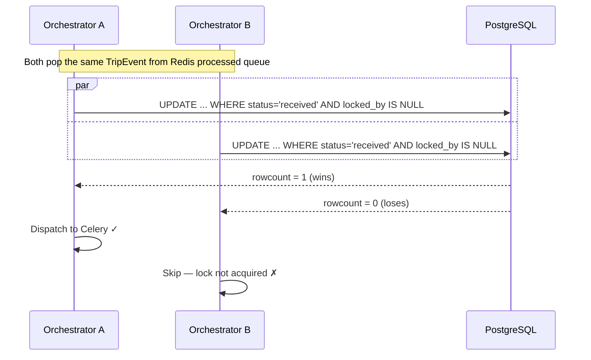
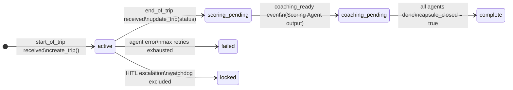

# Pipeline Event Locking — Optimistic-Lease Hybrid

**Table:** `pipeline_events`  
**Implemented in:** [`common/db/repositories/events_repo.py`](../../backend/common/db/repositories/events_repo.py)  
**ORM model:** [`common/models/orm.py · EventORM`](../../backend/common/models/orm.py)

---

## Overview

`pipeline_events` uses an **optimistic-lease hybrid** locking strategy to coordinate work between the Orchestrator and Celery agents without holding long-lived database locks.

| Property | Value |
|---|---|
| Lock type | Conditional UPDATE (compare-and-swap) |
| Lock holder | `locked_by VARCHAR(50)` |
| Lease timer | `locked_at TIMESTAMP` |
| Retry tracking | `retry_count INTEGER` |
| State machine | `status VARCHAR(20)` |
| Watchdog TTL | 10 minutes (configurable) |

### Why a hybrid?

A pure **pessimistic** lock (`SELECT FOR UPDATE`) holds a Postgres row lock for the entire agent runtime — seconds to minutes. Under load this serialises the entire pipeline.

A pure **optimistic** lock (version counter + retry-on-conflict) has no safety net: if the agent crashes mid-flight the version is never incremented and the row is stuck forever.

The hybrid takes the best of both:

- **Optimistic acquire** — a single conditional `UPDATE` acts as a compare-and-swap. No row lock is held while the agent runs. Two concurrent orchestrators racing on the same row: exactly one gets `rowcount == 1`.
- **Pessimistic hold** — once acquired, the row is exclusively marked `status='processing'`. Nothing else can pick it up during agent execution.
- **Watchdog safety net** — a background sweep resets any `status='processing'` row whose `locked_at` has expired, covering crashes and hangs.

---

## Row Schema (locking fields only)

```sql
status       VARCHAR(20)  DEFAULT 'received'   -- state machine key
locked_by    VARCHAR(50)  NULLABLE             -- who holds the lease
locked_at    TIMESTAMP    NULLABLE             -- when the lease was taken
retry_count  INTEGER      DEFAULT 0            -- incremented on each failure
processed_at TIMESTAMP    NULLABLE             -- set on successful completion
```

---

## State Machine



> **`locked` is a terminal escalation state.** The watchdog explicitly excludes it — only a human fleet manager action can exit HITL.

---

## Lock Acquire — Optimistic CAS

The acquire is a single atomic `UPDATE` with a `WHERE` guard. No `SELECT FOR UPDATE`, no advisory lock.



**Why this is safe under concurrency:** PostgreSQL executes the conditional `UPDATE` atomically within its MVCC engine. Even if two orchestrator processes submit the identical statement at the same millisecond, the database guarantees exactly one wins — the other sees `rowcount == 0`.

---

## Lock Release — Happy Path



The `AND status = 'processing'` guard prevents a late-arriving release from accidentally re-processing an event the watchdog already reset.

---

## Failure Path — Agent Exhausted Retries



`status='failed'` is **not** automatically retried. It requires a manual reset or an explicit retry policy. This prevents poison-pill events from looping indefinitely.

---

## Watchdog — Crash Recovery

The watchdog runs periodically. It finds any `status='processing'` row whose lease has expired and resets it back to `received` so the orchestrator can re-acquire it on the next poll cycle.



> **HITL exclusion:** The watchdog `WHERE` clause only targets `locked_by='orchestrator'`. Rows in `status='locked'` (HITL) have `locked_by=NULL` and are therefore invisible to the watchdog — they can never be silently reset.

---

## HITL Escalation

When a fleet manager escalates an event for human review, `lock_for_hitl()` sets a special terminal state.



Setting `locked_by=NULL` on a `locked` row is intentional — it makes the watchdog's `AND locked_by='orchestrator'` guard fail, creating a hard exclusion with no special-case code in the watchdog itself.

---

## End-to-End Pipeline Flow



---

## Concurrency Guarantee — Two Orchestrators Racing



Postgres serialises the two `UPDATE` statements at the storage level. The race is resolved inside the database engine — no application-level mutex, no advisory lock, no retries needed.

---

## `pipeline_trips` State Machine

`pipeline_trips` tracks the higher-level trip lifecycle. It is updated by the Orchestrator as key events arrive, independently of the per-event row locking above.



---

## Key Invariants

| Invariant | Enforced by |
|---|---|
| Only one agent runs per event at a time | CAS `UPDATE` — `rowcount == 1` |
| Crashed agents don't leave rows stuck forever | Watchdog TTL reset |
| HITL rows are never silently reset | `locked_by=NULL` excludes watchdog |
| Late release can't re-process a watchdog-reset row | `AND status='processing'` guard on release |
| Poison-pill events don't loop indefinitely | `status='failed'` requires manual intervention |
| Duplicate events are idempotent | `device_event_id UNIQUE` constraint + sidecar dedup check |
