# TraceData AI - Comprehensive Project Presentation Documentation

## How to Use This Document
This document is written for your project presentation. It uses simple language and a clear flow. You can:
- Present from this document directly.
- Convert each main section into 1-3 slides.
- Reuse the Mermaid diagrams in your final deck.

---

## 1. Introduction and Solution Overview

### 1.1 Project Objective
TraceData AI is a multi-agent AI system for fleet safety and driver performance operations.

The objective is to:
- Ingest real-time trip telemetry.
- Detect and triage risky driving events quickly.
- Compute explainable trip and driver behavior scores.
- Analyze sentiment from driver feedback.
- Generate practical coaching for safer future driving.

### 1.2 Scope (Current)
In scope:
- Multi-agent orchestration (Orchestrator + specialist agents).
- End-to-end event pipeline from ingestion to agent actions.
- API and UI for visibility and operations.
- Explainability outputs and fairness-aware scoring support.
- AI security controls and CI security checks.

Out of scope (current phase):
- Fully automated online retraining with approval workflow.
- Enterprise-grade IAM/SSO integration across all services.
- Full production SOC integration and 24/7 IR automation.

### 1.3 Why This Project Matters
Current fleet workflows are usually:
- Reactive, not proactive.
- Hard to scale for many concurrent trips.
- Weak in explainability and auditability.

TraceData AI addresses this by combining event-driven processing with specialized agents.

### 1.4 High-Level Solution Workflow

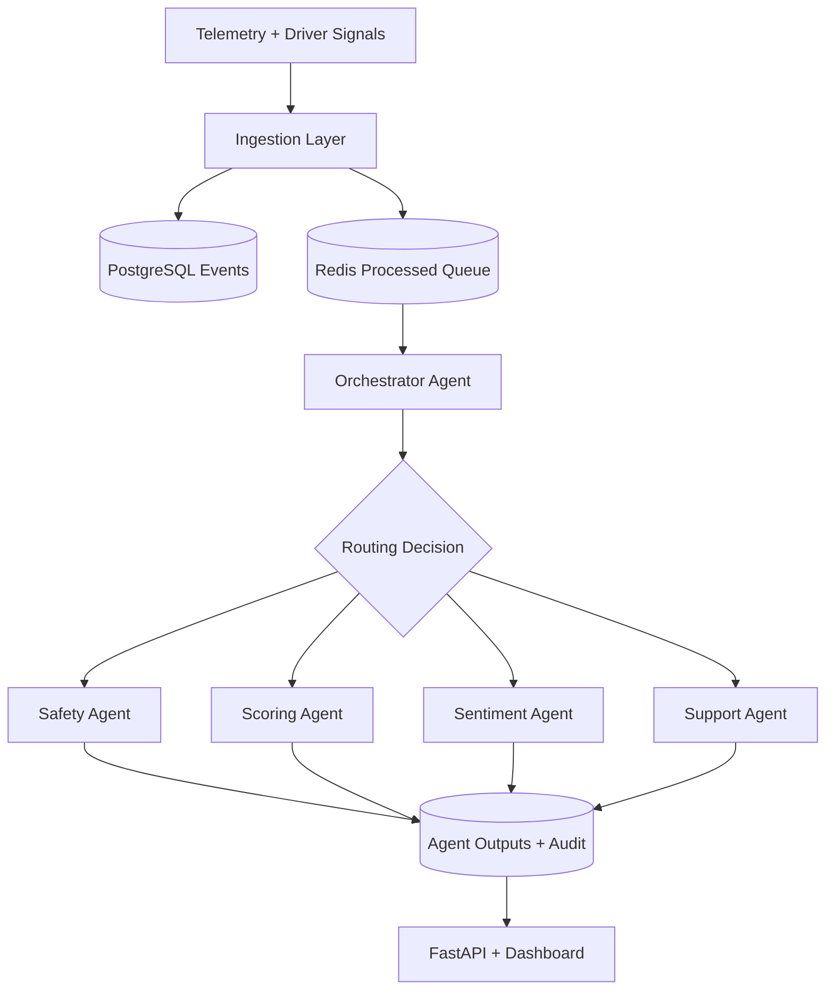

### 1.5 What We Actually Built (Plain Explanation)
In simple terms, we built a pipeline where different AI agents each do one job well, instead of one large agent trying to do everything.

What this means in practice:
- We first collect raw telemetry and normalize it in the ingestion layer.
- We push normalized events to a queue so processing can scale and recover from temporary failures.
- The Orchestrator decides which specialist agent should handle each event.
- Each specialist writes structured outputs (not free-form text only), so results are traceable and easier to test.
- We expose final outputs through API/UI for operational decisions and post-trip review.

Why this matters:
- If one part is slow or fails, the rest of the system can continue.
- We can improve one agent without rewriting the whole platform.
- We can provide audit evidence for why a decision was produced.

---

## 2. Key Pain Points and Value-Creation Opportunities

### 2.1 Pain Points in Current Workflow
- Safety events can be delayed in manual triage.
- Event review quality varies by operator.
- Driver coaching may be generic and not context-aware.
- Data is split across systems and hard to trace.
- Traditional automation cannot handle nuanced event context.

### 2.2 Additional Value from a Multi-Agent System
Beyond fixing current gaps, multi-agent AI enables:
- Proactive risk surfacing before severe incidents.
- Continuous coaching loop (scoring -> support follow-up).
- Context-enriched decisions across safety, sentiment, and history.
- Better explainability for each recommendation.
- Better operational resilience via modular worker scaling.

### 2.3 Pros and Cons of Adoption
Pros:
- Better modularity and maintainability.
- Clearer reasoning boundaries per agent.
- Better reuse and extensibility.
- Stronger traceability versus monolithic chat logic.

Cons:
- More architecture complexity.
- More moving parts to monitor.
- Additional security surface (tool calls, prompts, routing).
- Requires robust observability and discipline in testing.

---

## 3. Stakeholders and Success Metrics

### 3.1 Key Stakeholders
- Fleet managers and operations team.
- Drivers.
- Safety/compliance teams.
- Product owners and business sponsors.
- Data/ML engineers and platform engineers.
- Security and governance reviewers.

### 3.2 Success Metrics
Suggested presentation KPIs:
- Mean time to triage critical safety events.
- Coaching relevance acceptance rate.
- Trip scoring coverage and latency.
- Number of explainability artifacts generated per scored trip.
- Security test pass rate in CI.

---

## 4. System Architecture

## 4.1 Logical Architecture

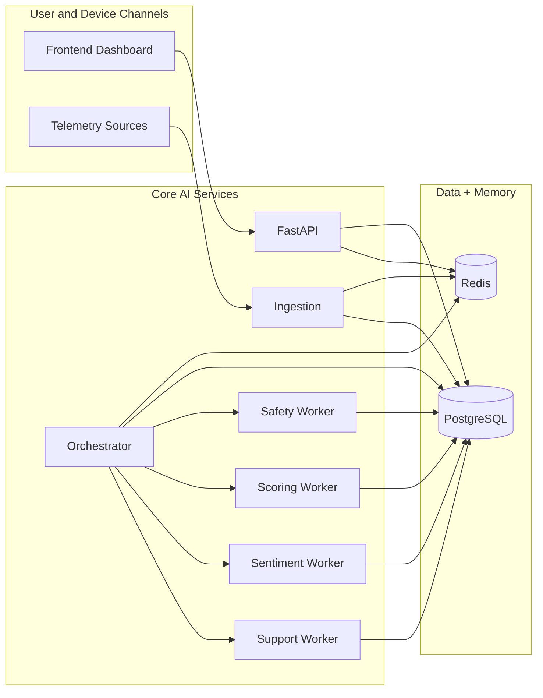

Justification:
- Clear separation of responsibilities.
- Better scaling by independent worker queues.
- Easier governance because each agent has a bounded role.

## 4.2 Physical Architecture

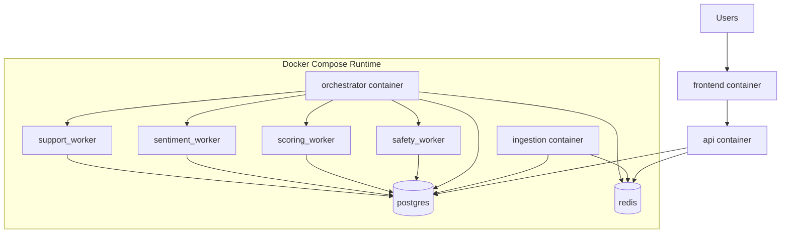

Justification:
- Fast local reproducibility for team collaboration.
- Operational simplicity for academic/demo lifecycle.
- Strong baseline for migration to Kubernetes.

## 4.3 Event Lifecycle and Coordination

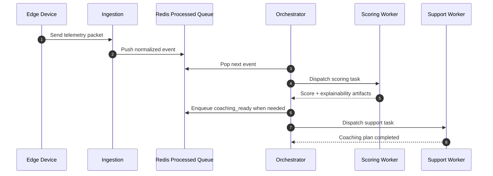

### 4.4 What We Did in Architecture Decisions
We made architecture choices to balance simplicity, reliability, and extensibility:
- Redis is used as a shared operational backbone for queueing and trip-scoped context.
- PostgreSQL stores durable domain data and agent outputs for audit and analytics.
- Worker services are separated by function (safety, scoring, sentiment, support), so each can scale independently.
- The orchestrator layer centralizes routing policy, reducing duplicated logic across workers.

In presentation language: we chose a modular service design because it gives clearer ownership boundaries, easier scaling, and stronger operational control than a single monolithic AI service.

---

## 5. Agent Design Documentation

This section can be reused as your "Agent Design" slides.

## 5.1 Orchestrator Agent
Purpose and responsibilities:
- Main coordinator.
- Decides which specialist agents should run.
- Manages dispatch policy and context warming.

Input:
- Normalized trip event.
- Current trip context from Redis/DB.

Output:
- Task dispatch instructions.
- Intent capsule with route and controls.

Planning/reasoning approach:
- Hybrid: deterministic event matrix + LLM-assisted routing fallback.
- Prioritizes predictable behavior for known event types.

Memory:
- Uses trip-scoped runtime context in Redis.
- Tracks event progression and follow-up triggers.

Tools:
- Redis, PostgreSQL, task queue APIs.

Interaction:
- Sends to Safety, Scoring, Sentiment, and Support workers.

## 5.2 Safety Agent
Purpose:
- Analyze risky driving events and provide actionable safety decisions.

Input:
- Event payload and trip context.

Output:
- Safety decision, risk category, recommended action.

Reasoning:
- Rule-grounded + LLM structured reasoning where needed.

Memory:
- Reads trip context and recent event data.

Tools:
- Safety data repositories, context store.

Interaction:
- Feeds outputs to shared trip state and dashboard views.

## 5.3 Scoring Agent
Purpose:
- Compute behavior score and explanation artifacts.

Input:
- Aggregated trip signals and historical context.

Output:
- Behavior score, label, score breakdown, explainability bundle.

Reasoning:
- Deterministic features + ML model path + explainability overlays.

Memory:
- Uses historical average and current trip feature bundle.

Tools:
- Feature extractors, model bundle, explainability components.

Interaction:
- Can trigger support follow-up via `coaching_ready` event.

## 5.4 Sentiment Agent
Purpose:
- Analyze feedback sentiment for context-aware support.

Input:
- Driver feedback text and trip metadata.

Output:
- Sentiment score/label, rationale, summary.

Reasoning:
- LLM-driven classification with structured output controls.

Memory:
- Reads relevant trip context and historical feedback summary.

Tools:
- LLM provider, retrieval/scoped context.

Interaction:
- Can trigger `sentiment_ready` follow-up for support.

## 5.5 Support Agent
Purpose:
- Generate practical coaching recommendations and closure actions.

Input:
- Scoring, safety, and sentiment outputs.

Output:
- Coaching plan, action priorities, follow-up summary.

Reasoning:
- Contextual synthesis + policy constraints.

Memory:
- Uses trip context and coaching history for personalization.

Tools:
- Prompt templates, repository access, trip output context.

Interaction:
- Final end-user guidance stage in workflow.

## 5.6 Agent Communication and Shared Services

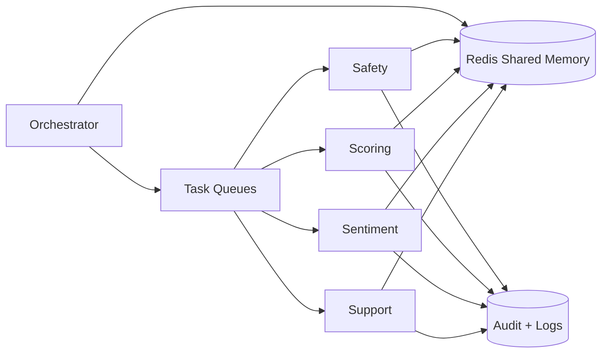

Shared services required:
- Trip-scoped memory store.
- Event and completion messaging.
- Structured logs and tracing.
- Model/tool invocation policy controls.

### 5.7 What We Did in Agent Implementation
For implementation, we did not just define agents conceptually. We wired real runtime behavior:
- The orchestrator dispatches tasks through queue-based workers.
- Agents exchange state through shared trip context and completion events.
- Follow-up coordination is event-driven (`coaching_ready`, `sentiment_ready`) so support actions happen at the right stage.
- Each agent produces structured outputs so downstream services can consume them safely.

This demonstrates true agent coordination, not only independent model calls.

---

## 6. Explainable and Responsible AI Report

## 6.1 XRAI Principles Applied
- Explainability: score breakdowns, reason fields, traceable outputs.
- Fairness: bias checks in scoring path and design-time controls.
- Accountability: auditable events and agent output records.
- Robustness: deterministic fallbacks and validation paths.
- Human oversight: ability to review and override downstream actions.

## 6.2 Fairness and Bias Mitigation
- Sensitive data minimization at ingestion and feature stages.
- Fairness checks integrated around scoring artifacts.
- Explicit monitoring for drift and subgroup anomalies.
- Human review checkpoints for high-impact recommendations.

## 6.3 Explainability Flow

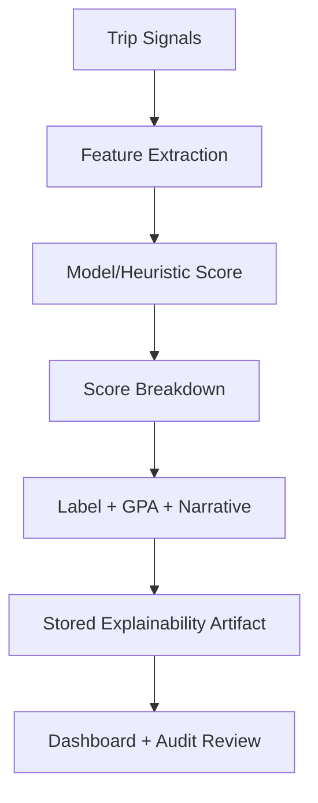

## 6.4 Governance Alignment (IMDA Model AI Governance Framework)

| Governance principle | TraceData implementation |
|---|---|
| Internal governance | Defined ownership by service/agent and CI quality gates |
| Human involvement | Operator review and escalation pathway for critical outputs |
| Operations management | Monitoring, logs, retries, queue-based resilience |
| Stakeholder communication | Explainable outputs in UI/API and technical docs |

### 6.5 What We Did for XRAI in Practice
We implemented responsible AI as engineering controls, not only policy statements:
- Explainability: score breakdowns and reason fields are produced and persisted.
- Fairness: scoring path supports fairness checks and monitoring hooks.
- Accountability: outputs and events are logged with traceable trip context.
- Human oversight: workflow allows operator review for uncertain or high-impact situations.

So the system is designed to be explainable by default, not explainable only after manual analysis.

---

## 7. AI Security Risk Register

| ID | Risk | Example impact | Mitigation/controls | Residual risk |
|---|---|---|---|---|
| R1 | Prompt injection | Agent takes unsafe action | Input sanitation, structured prompting, output checks, policy guardrails | Medium |
| R2 | Hallucinated recommendation | Wrong operational decision | Grounding from trusted data, deterministic checks, confidence thresholds | Medium |
| R3 | Tool misuse | Unauthorized external action | Tool allowlist, scoped tokens, least privilege, strict schemas | Low-Medium |
| R4 | Data leakage | Exposure of sensitive trip/driver info | PII filtering, scoped memory keys, secured transport/storage | Low-Medium |
| R5 | Queue poisoning/replay | Wrong event sequence or duplicate actions | Event validation, deduping, lock/lease controls, idempotent handlers | Low |
| R6 | Dependency vulnerability | Compromise via package CVE | SCA scans (pip-audit/npm audit), lockfile updates, CI enforcement | Low |

## 7.1 Defense-in-Depth View

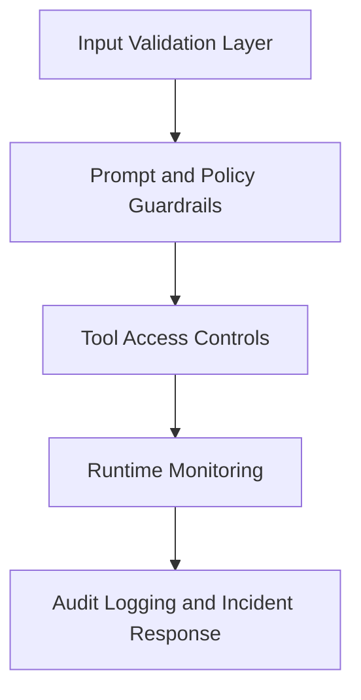

## 7.2 Safe Behavior Under Malicious Inputs
- Reject malformed events at ingestion.
- Constrain model outputs to known schema.
- Apply deterministic checks before high-impact actions.
- Escalate uncertain outcomes to review path.

### 7.3 What We Did for AI Security
We treated AI security as part of day-to-day engineering:
- Added dependency scanning and remediation workflow (for example, `pip-audit` updates).
- Included static checks and security tests in CI, not only before release.
- Reduced unsafe execution paths by constraining tool use and validating structured outputs.
- Designed queue/event handling with deduplication and control points for safer orchestration.

This shifts security left and reduces late-stage surprises.

---

## 8. MLSecOps / LLMSecOps Pipeline Design

## 8.1 Pipeline Stages
- Source control and branch checks.
- Static analysis and style/type checks.
- Unit/integration/security test execution.
- SCA, SAST, container/image scans.
- Build and deployment workflow.
- Post-deploy monitoring and alerting.

## 8.2 Pipeline Diagram


## 8.3 Tooling Mapping (Current)
- Python quality/security: mypy, pytest, bandit, pip-audit.
- Frontend quality/security: lint/test/audit (npm ecosystem).
- Container security: Trivy.
- DAST baseline: OWASP ZAP baseline workflow.

## 8.4 Lifecycle Automation Opportunities
Automatable lifecycle parts:
- Dependency patch checks and lockfile refresh.
- Regression suites for scoring/orchestration paths.
- Prompt and security test packs.
- Drift checks and threshold-based alerts.

Benefits:
- Lower manual effort.
- Faster and safer release cycles.
- Better repeatability and compliance evidence.

### 8.5 What We Automated vs What Is Still Manual
Automated today:
- Type checks, tests, and security scans in CI.
- Dependency vulnerability detection and lockfile-driven updates.
- Container/image security scanning steps.

Still partially manual (next maturity step):
- Formal go/no-go approval gates for high-risk model changes.
- Full drift-triggered retraining with governance sign-off.
- Centralized policy dashboard with automated exception workflows.

This makes the roadmap realistic and shows clear engineering maturity progression.

---

## 9. Evaluation and Testing Summary

## 9.1 Testing Types
- Unit tests for core logic and utilities.
- Integration tests for orchestrator-agent handoff.
- API route tests for endpoint correctness.
- AI-security checks (prompt/input guard conditions, dependency scans).
- Type and quality gates in CI.

## 9.2 Testing Pyramid

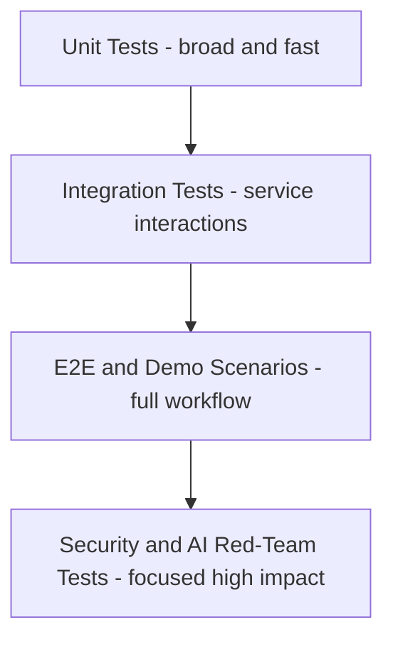

## 9.3 Example Result Highlights for Presentation
- Strong unit + integration pass rates in backend pipeline.
- CI catches type, security, and dependency issues early.
- Continuous security scanning finds and guides CVE remediation.

### 9.4 What We Did to Validate Quality
We validated both code quality and AI-system quality:
- Code-level reliability through unit/integration coverage for orchestration and scoring paths.
- Contract reliability through typed schemas and mypy checks.
- AI safety posture through SAST/SCA and risk-focused checks.
- Operational confidence through end-to-end demo scenarios that show multi-agent handoffs.

In short, we tested not only model outputs, but the full system behavior.

---

## 10. Required Deliverables Checklist (Mapped)

| Required deliverable | Status guidance in this project |
|---|---|
| Presentation slides | Build from sections 1-10 + diagrams in this document |
| Simple UI prototype | Frontend dashboard demonstrates multi-agent orchestration outputs |
| System architecture document | Sections 4.1 and 4.2 with justification and diagrams |
| Agent design documentation | Section 5 with each key agent template |
| Explainable and Responsible AI report | Section 6 |
| AI security risk register | Section 7 |
| MLSecOps/LLMSecOps pipeline design | Section 8 |
| Well-structured source repo | Monorepo with backend/frontend/docs/tests/infrastructure folders |
| Testing artifacts | Section 9 + CI outputs |

---

## 11. Direct Answers to "Questions to Consider"

## 11.1 What key pain points are addressed?
The system reduces delayed manual triage, fragmented data context, and inconsistent decision quality by using event-driven specialized agents.

## 11.2 What extra value is created beyond current gaps?
It enables proactive risk pattern detection, continuous personalized coaching loops, and explainable decision traceability at scale.

## 11.3 Pros and cons of adoption?
Pros: modularity, scalability, explainability, better traceability. Cons: higher system complexity and stronger operational discipline required.

## 11.4 Who are key stakeholders?
Fleet managers, drivers, safety/compliance teams, engineering teams, business owners, and security/governance reviewers.

## 11.5 How should agents coordinate for seamless UX?
Use orchestrator-led routing, shared trip memory, event-based follow-ups, and strict output contracts so users see one coherent journey.

## 11.6 Why modular agentic architecture over monolithic chatbot/rules?
Each agent specializes in one domain, which improves reliability, testability, independent scaling, and clear accountability.

## 11.7 How to demonstrate these benefits in demo?
Show a complete trip flow:
- Ingestion and event detection.
- Scoring + explainability output.
- Sentiment signal and coaching trigger.
- Final support recommendation with traceable evidence.

## 11.8 What scale is the solution designed to support?
Architecture is designed for horizontal scaling through queue-based workers. For presentation, define and test a target throughput scenario (for example, tens to low hundreds of concurrent active trip sessions per environment).

## 11.9 How to justify scalability claim?
Use load tests with controlled event rates, queue lag metrics, worker utilization, and service latency distributions.

## 11.10 How is explainability and traceability ensured?
Structured outputs include breakdown/reason fields, with persisted artifacts and event logs per trip and agent.

## 11.11 What safeguards ensure fairness, accountability, trust, assurance?
Fairness checks in scoring path, policy constraints, audit logs, operator review paths, and CI governance gates.

## 11.12 What common services are needed?
Shared trip memory, queueing/messaging, centralized logging/trace IDs, policy controls, and artifact persistence.

## 11.13 What reusable frameworks are leveraged?
LangChain/LangGraph patterns for orchestration, Celery for distributed workers, FastAPI for service interfaces.

## 11.14 What AI-specific risks and mitigations are used?
Prompt injection, hallucination, tool misuse, and data leakage are addressed with guardrails, grounding, allowlists, validation, and monitoring.

## 11.15 How is safe behavior maintained under malicious inputs?
Strict schema validation, policy checks before action, bounded tool access, and escalation paths for uncertain outputs.

## 11.16 What lifecycle parts can be automated?
Testing, vulnerability scans, type checks, image scans, and release gates. This reduces effort while improving quality and security.

## 11.17 Is implementation effort within guideline?
Yes. The modular architecture allows staged delivery and incremental hardening while keeping scope manageable for a practice module.

---

## 12. Demo Script (Practical and Slide-Friendly)

Use this flow during presentation:
1. Start with architecture slide and explain data flow in 30-45 seconds.
2. Show a sample event entering ingestion.
3. Show orchestrator routing decision.
4. Show scoring output with explainability fields.
5. Show sentiment/coaching follow-up trigger.
6. Show final support recommendation in UI.
7. Show one security and one CI artifact slide.

### Demo Storyboard Diagram


---

## 13. Suggested Slide Deck Structure (Quick Mapping)

- Slide 1: Problem, objective, scope.
- Slide 2: High-level workflow diagram.
- Slide 3: Logical architecture.
- Slide 4: Physical architecture and deployment rationale.
- Slide 5-7: Agent design (Orchestrator, Scoring, Safety/Sentiment/Support).
- Slide 8: Explainable and responsible AI practices.
- Slide 9: Security risk register.
- Slide 10: MLSecOps/LLMSecOps pipeline.
- Slide 11: Testing and evaluation summary.
- Slide 12: Live demo flow and key outcomes.
- Slide 13: Questions and future roadmap.

---

## 14. Final Presentation Tips
- Keep language simple and outcome-focused.
- Explain one idea per slide.
- Use diagrams first, then details.
- Always connect technical design to stakeholder value.
- Show both strengths and limits honestly.

This gives reviewers confidence in both architecture thinking and responsible AI practice.

---

## 15. Presenter Notes (30-60 Second Script Per Section)

Use these notes while presenting. You can read them directly or adapt to your style.

### 15.1 Section 1 - Introduction and Solution Overview
Speaker script:
Today, we are presenting TraceData AI, a multi-agent system for fleet safety and driver performance. The core problem is that traditional workflows are reactive, fragmented, and hard to scale. Our solution uses specialized agents coordinated by an orchestrator, so each task is handled by the best component. This gives us faster triage, better explainability, and stronger operational traceability.

### 15.2 Section 2 - Pain Points and Value Creation
Speaker script:
The biggest pain points are delayed manual triage, inconsistent decision quality, and poor context sharing across tools. Our agentic architecture solves these and also creates new value: proactive risk discovery, personalized coaching loops, and better auditability. So we are not only fixing old problems, we are enabling new capabilities that were difficult with monolithic systems.

### 15.3 Section 3 - Stakeholders and Success Metrics
Speaker script:
This system serves multiple stakeholders, including fleet managers, drivers, safety teams, and engineering teams. We measure impact through operational and trust metrics, such as triage latency, coaching relevance, explainability coverage, and security gate pass rates. These metrics help us show both business value and responsible AI quality.

### 15.4 Section 4 - System Architecture
Speaker script:
Our architecture separates ingestion, orchestration, specialist workers, and storage layers. Redis supports queueing and shared context, while PostgreSQL provides durable and auditable records. This design is modular and scalable because each worker type can be scaled independently. It is also maintainable because the orchestrator centralizes routing policy instead of duplicating it across services.

### 15.5 Section 5 - Agent Design
Speaker script:
Each agent has a clear boundary. The Orchestrator coordinates. Safety handles risk events. Scoring computes behavior score and explanations. Sentiment interprets driver feedback. Support produces coaching recommendations. We implemented real runtime coordination using queue dispatch, shared memory, and follow-up events like coaching_ready and sentiment_ready, so this is a working multi-agent system, not just a conceptual diagram.

### 15.6 Section 6 - Explainable and Responsible AI
Speaker script:
We apply responsible AI as engineering controls, not only policy statements. Explainability is built in through score breakdowns and reason fields. Accountability is supported through persisted logs and traceable outputs. Fairness is addressed through scoring checks and monitoring hooks. Human oversight is available for uncertain or high-impact outcomes.

### 15.7 Section 7 - AI Security Risk Register
Speaker script:
We identified key AI-specific risks such as prompt injection, hallucination, tool misuse, and data leakage. For each risk, we mapped practical controls including validation, guardrails, allowlists, and deterministic checks. We also integrated dependency and security scanning in CI. This gives us defense in depth and a continuous security posture instead of one-time checks.

### 15.8 Section 8 - MLSecOps and LLMSecOps Pipeline
Speaker script:
Our pipeline covers code quality, testing, SAST, SCA, container scanning, and deployment readiness. This automates much of the lifecycle and improves release confidence. We also clearly state what is still manual, such as formal model-governance approval and advanced drift-triggered retraining. This demonstrates both current maturity and a realistic roadmap.

### 15.9 Section 9 - Evaluation and Testing Summary
Speaker script:
We validated both software reliability and AI-system behavior. Unit and integration tests cover orchestration and scoring logic. Type checks enforce contract quality. Security checks catch vulnerabilities early. We also validate end-to-end flows to ensure agent handoffs are correct in real scenarios. So our testing strategy covers correctness, safety, and operational confidence.

### 15.10 Section 10 and 11 - Deliverables and Questions to Consider
Speaker script:
We mapped all required deliverables directly to implemented artifacts in this repository. We also answered all guiding questions around value, scalability, explainability, fairness, and security. This section is our proof of completeness: we are showing not only technical implementation, but also architectural reasoning and governance readiness.

### 15.11 Section 12 - Demo Script
Speaker script:
During the demo, we will show one complete journey: event ingestion, orchestration, specialist outputs, follow-up trigger, and final coaching recommendation. While demonstrating, we will highlight explainability fields and trace logs to prove decision transparency. We will end by showing CI or security evidence to connect the live flow to engineering quality controls.

### 15.12 Section 13 and 14 - Slide Plan and Final Tips
Speaker script:
Our slide sequence follows a problem-to-proof narrative. We begin with objective and architecture, then show agent design and responsible AI controls, then validate with testing and demo evidence. This ensures reviewers can clearly see the chain from design decisions to implementation outcomes. The result is a balanced presentation of innovation, safety, and engineering rigor.

### 15.13 Short Closing Statement
Speaker script:
To conclude, TraceData AI demonstrates how a modular multi-agent system can deliver practical operational value while remaining explainable, secure, and governable. We combined architecture, implementation, testing, and risk controls into one coherent system. Our next step is scaling this foundation with deeper automation and production governance maturity.

---

## 16. Deep Dive: Intent Capsule, Scoped Token, Intent Gate, MLSecOps/LLMSecOps, AI Verify and Project Moonshot

This section explains the internal security and operations model in plain language, with implementation-accurate details.

### 16.1 Intent Capsule Explained

What it is:
- Intent Capsule is the mission package created by the Orchestrator for one agent run.
- It carries execution intent, constraints, and security context.
- It is designed as an immutable contract during execution.

What it contains (simplified):
- Trip identity and target agent.
- Priority and allowed execution window.
- Tool constraints (`tool_whitelist`, `step_to_tools`).
- Optional security seal (`hmac_seal`).
- Embedded scoped access token (`token`).

Why it exists:
- Prevents agents from running with open-ended permissions.
- Makes each run auditable and reproducible.
- Lets the platform enforce least privilege by default.

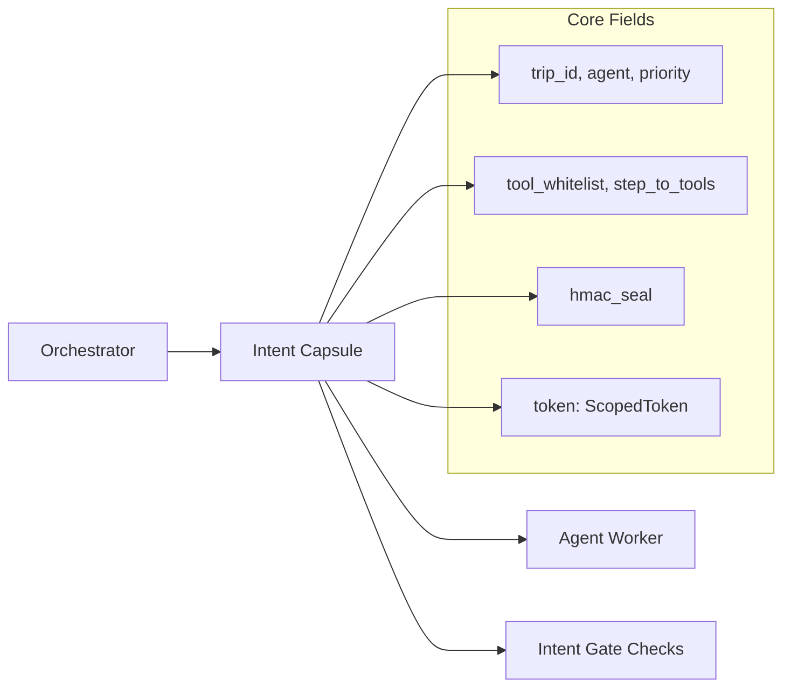

### 16.2 Scoped Token Explained

What it is:
- Scoped Token is a key-level permission object embedded inside the Intent Capsule.
- It defines exactly what Redis keys a worker can read and write for this dispatch.

Core fields:
- `read_keys`: explicit allowed reads.
- `write_keys`: explicit allowed writes.
- `expires_at`: token TTL and validity boundary.

Why it matters:
- If a key is not listed, access should be denied by policy.
- This limits blast radius during model/tool misuse.
- It also supports fairness-through-access-control, because sensitive keys can be excluded at source.

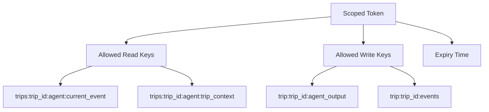

### 16.3 Intent Gate Explained

What it is:
- Intent Gate is the security gateway for tool calls.
- In current repo state, it is implemented as a decorator with enforcement switch.

Current implementation status (important for presentation honesty):
- Logging and pass-through behavior is active by default (stub mode).
- Full blocking enforcement path is scaffolded and documented in code comments.

Policy checks in full mode (design intent):
- Capsule integrity verification.
- Tool whitelist validation.
- Step sequence validation.
- PII scrubbing guard checks.
- HITL escalation threshold checks.
- Execution log emission.

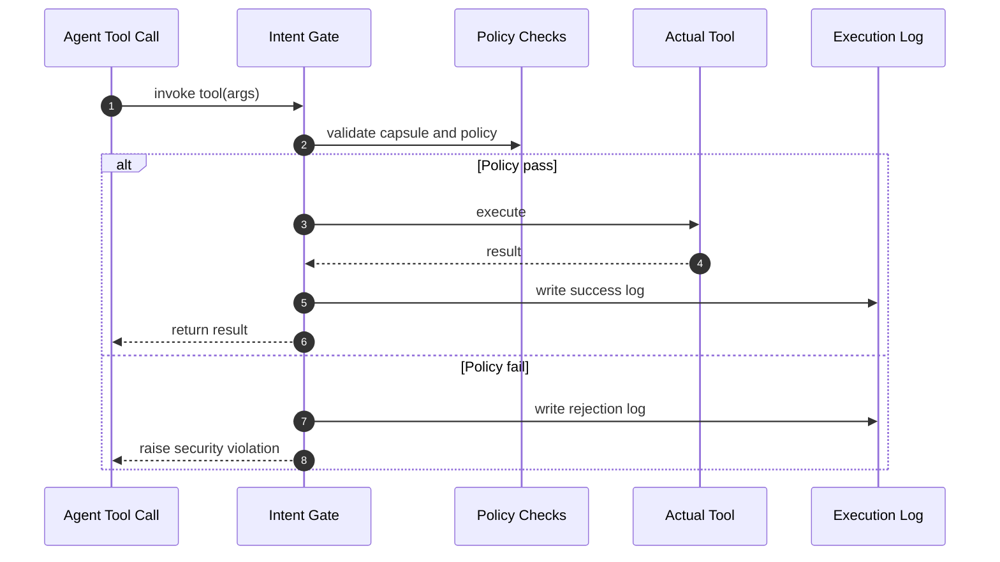

### 16.4 How Capsule, Token, and Gate Work Together

Practical end-to-end flow:
1. Orchestrator warms trip-scoped keys in Redis.
2. Orchestrator seals and dispatches Intent Capsule with Scoped Token.
3. Worker loads capsule and tries to run tools.
4. Intent Gate checks policy before tool execution.
5. Worker reads and writes only within token scope.
6. Outputs and audit events are emitted.

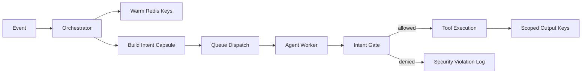

### 16.5 MLSecOps and LLMSecOps We Have Implemented

Implemented controls from current CI and test setup:
- Code quality and safety gates: lint, type check, test suites.
- SAST for backend Python (`bandit`).
- SCA for dependencies (`pip-audit`, lockfile updates).
- Container vulnerability scan (`Trivy`).
- Explainability/fairness rubric smoke tests (SHAP/LIME/AIF360-style contract tests).
- Prompt-safety adversarial suite (Promptfoo-style deterministic pytest tests).

What this gives us:
- Faster vulnerability detection.
- Reproducible quality gates per PR.
- AI quality evidence (not only code quality evidence).

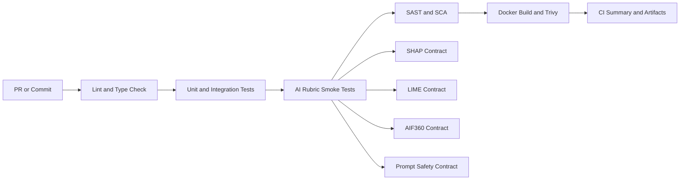

### 16.6 AI Verify Toolkit: How It Fits This Project

How to explain in your presentation:
- We have already implemented AI Verify-aligned evidence categories:
  - Fairness evidence (AIF360-style contract tests).
  - Explainability evidence (SHAP and LIME contract tests).
  - Robustness/safety evidence (prompt-safety and adversarial prompt tests).
- These outputs can be packaged as structured evidence for AI governance review.

Important wording for accuracy:
- Current repo contains AI Verify-aligned test evidence.
- Full direct integration with official AI Verify Toolkit reporting can be presented as the next integration step if required by assessors.

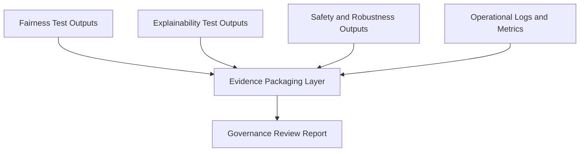

### 16.7 Project Moonshot: How to Position and Use It

How to explain in your presentation:
- Project Moonshot focuses on systematic adversarial evaluation of GenAI risks.
- In this project, we already run Moonshot-style adversarial behavior checks through Promptfoo-inspired pytest suites (offline and deterministic in CI).
- This gives a practical red-team baseline today, while keeping cost and external dependency low.

If asked about direct Project Moonshot integration:
- Position as Phase-2 extension where Moonshot benchmark packs can be added as scheduled evaluation jobs.
- Keep current deterministic tests as fast guardrails, and run heavier benchmark suites nightly.


### 16.8 One-Slide Summary Script for Viva

Speaker script:
We secure agent execution using three layers: Intent Capsule as mission contract, Scoped Token as least-privilege key access, and Intent Gate as policy checkpoint for tool calls. On operations, our MLSecOps and LLMSecOps pipeline already includes quality, security, and AI-evaluation gates in CI. For governance, we produce AI Verify-aligned fairness, explainability, and safety evidence from our AIF360, SHAP, LIME, and prompt-safety tests. For adversarial evaluation, we currently run Promptfoo-style Moonshot-aligned checks and can extend to full Project Moonshot benchmark packs as a scheduled phase.

---

## 17. TraceData: Input Data Architecture

### 17.1 Executive Summary
This section defines the input boundary architecture used by TraceData for high-availability ingestion and priority-aware event processing.

The goal is to solve a common industry gap: systems that only punish unsafe behavior but fail to capture fair context and positive driving quality.

Core architecture decisions:
- Generic flat event schema for all event types.
- Two-minute priority ceiling for MEDIUM/HIGH signals.
- 1Hz smoothness sampling with edge aggregation.
- Universal spatio-temporal anchors for fairness and chronology.

### 17.2 Data Acquisition and Transmission
TraceData ingests from two acquisition vectors:
- Telematics Device: MQTT over UDP (efficient under variable network quality).
- Driver Application: REST API over FastAPI (reliable transactional context input).

After ingestion, both sources are normalized into one common event pipeline.

| Source | Transport Protocol | Entry Point | Example Events |
|---|---|---|---|
| Telematics Device | MQTT over UDP | Redis Sorted Set | Collision, Harsh Braking, Smoothness Logs |
| Driver Application | REST API (FastAPI) | Redis Sorted Set | SOS, Disputes, Sentiment Feedback |

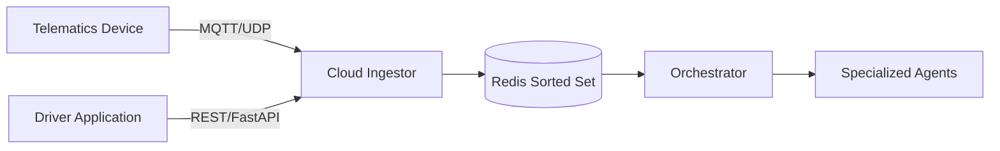

### 17.3 Universal Spatio-Temporal Reference Fields
Every event should carry these anchor fields:
- `timestamp`: absolute UTC event time.
- `offset_seconds`: elapsed seconds from trip start.
- `trip_meter_km`: distance traveled in current trip.
- `odometer_km`: vehicle lifetime distance.

Why this is important:
- Enables exact event sequence reconstruction.
- Enables distance-normalized fairness across driver profiles.
- Supports cross-reference with external context (traffic, weather).

### 17.4 Priority-Based Transmission Framework

#### 17.4.1 Transmission and Sampling Strategy
TraceData separates transmission frequency from sampling frequency.

| Transmission Type | Trigger | Transmission Window | Sampling Rate | Priority | Objective |
|---|---|---|---|---|---|
| Emergency Ping | Airbag / extreme G-force | Immediate | 100Hz burst | CRITICAL | Life-safety response |
| High-Speed Send | Harsh event detected | 30 seconds | 10Hz event | HIGH | Real-time alerting |
| Medium-Speed Send | Compliance violation | 2 minutes | 1Hz log | MEDIUM | Compliance visibility |
| Batch Ping | Interval timer | 10 minutes | 1Hz continuous | LOW | Smoothness and rewards |
| Trip Boundary | Ignition state change | Immediate | N/A | LOW | Lifecycle trigger |

#### 17.4.2 The Two-Minute Priority Ceiling
Architectural guarantee:
- No MEDIUM or HIGH event waits more than 120 seconds to reach cloud processing.

Impact:
- Reduces risk of losing meaningful behavior context during network loss.
- Keeps orchestrator awareness near real-time for high-value events.

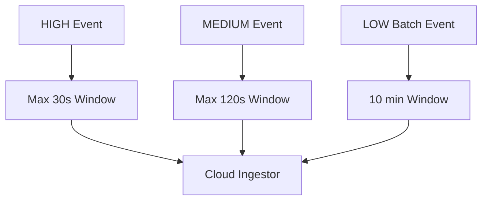

#### 17.4.3 Device-Side Deduplication and Reliability
Reliability pattern:
- Each event gets a unique `device_event_id` at detection.
- Event is transmitted in earliest allowed priority window.
- Duplicate arrivals are treated idempotently at ingestion.

Outcome:
- Prevents repeated event storms.
- Preserves coherent timeline before and after incidents.

### 17.5 Critical, High, and Medium Events
Key classes used in event governance:

| Event Type | Category | Priority | Typical Action |
|---|---|---|---|
| collision | critical | CRITICAL | Emergency dispatch and safety escalation |
| rollover | critical | CRITICAL | Emergency dispatch and safety escalation |
| speeding | speed_compliance | MEDIUM | Compliance tracking and review |
| hard_accel / harsh_accel | harsh_events | HIGH | Real-time coaching and risk handling |
| hard_brake / harsh_brake | harsh_events | HIGH | Real-time coaching and risk handling |

#### 17.5.1 Collision
Representative signals:
- `g_force_magnitude`, `airbag_triggered`, `impact_direction`, `injury_severity_estimate`.

#### 17.5.2 Rollover
Representative signals:
- `g_force_magnitude`, `roll_angle_degrees`, `impact_direction`, `confidence`.

#### 17.5.3 Speeding
Representative signals:
- `speed_kmh`, `speed_limit_kmh`, `duration_seconds`, `confidence`.

#### 17.5.4 Harsh Acceleration
Representative signals:
- Positive longitudinal `g_force_x`, speed context, duration, confidence.

#### 17.5.5 Harsh Braking
Representative signals:
- Negative longitudinal `g_force_x`, speed context, duration, confidence.

### 17.6 1Hz Smoothness Sampling: The Positive Reinforcement Layer

#### 17.6.1 Architecture: Edge vs Cloud Responsibilities
Edge responsibilities:
- Sample at 1Hz continuously.
- Compute statistical aggregates every batch window.
- Upload raw binary evidence for compliance/disputes.

Cloud responsibilities:
- Consume compact smoothness statistics.
- Apply scoring model and explainability logic.
- Join with incident IDs for richer context when needed.

Compliance layer responsibilities:
- Preserve high-resolution raw logs for post-incident audit and dispute resolution.

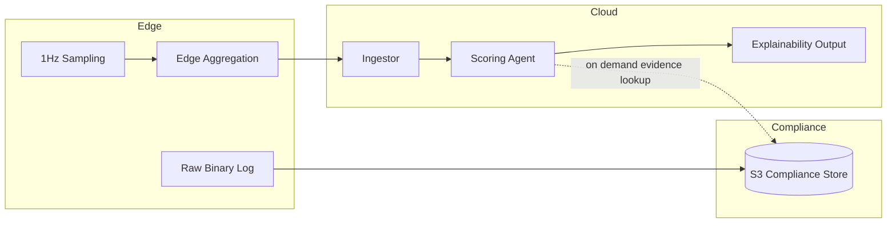

#### 17.6.2 Physics-Based Smoothness Metrics
Core metrics include:
- Jerk mean/max/std-dev.
- Speed mean/std-dev/variance.
- Longitudinal and lateral stability indicators.
- Engine behavior (idle, over-rev, RPM patterns).

Why this supports fairness:
- High-resolution data helps separate one-off defensive actions from repeated risky patterns.
- This supports context-aware scoring instead of simplistic event counting.

### 17.7 Externalized Engine Thresholds and Governance
Engine behavior thresholds are externalized as policy/config values, not hardcoded firmware constants.

Benefits:
- Faster policy adaptation without OTA update for every adjustment.
- Clearer governance and auditability of threshold changes.

Example threshold policy structure:
- Idle warning and excessive idle boundaries.
- Over-rev limits.
- Operational action for each threshold state.

### 17.8 The Event Matrix Governance Engine
`EVENT_MATRIX` acts as the central governance table for:
- Event category.
- Priority.
- ML weight (reward or penalty effect).
- System action and routing policy.

This avoids hardcoding routing logic across multiple services.

```mermaid
flowchart TD
        E[Incoming Event Type] --> M[EVENT_MATRIX Lookup]
        M --> P[Priority]
        M --> W[ML Weight]
        M --> R[Routing Policy]
        P --> Q[Queue Score]
        Q --> O[Orchestrator Dispatch]
        R --> O
        W --> S[Scoring Agent Influence]
```

### 17.9 Operational Workflow Visualization
The full operational input workflow can be explained as:
1. Edge and app events are ingested through protocol-specific entry paths.
2. Events are normalized into one schema.
3. Priority score determines queue order.
4. Orchestrator dispatches specialist agents.
5. Agents publish outputs and completion events.
6. Results are surfaced in API/UI and retained for audit.

```mermaid
flowchart TB
        subgraph Edge[Edge Device]
            C1[1Hz Continuous Sampling]
            C2[10min Local Buffer]
            C3[smoothness_log]
            C4[Critical Incident]
            C5[High or Medium Event]
        end

        C1 --> C2
        C2 --> C3
        C2 --> C4
        C2 --> C5

        C3 --> IN[Cloud Ingestor]
        C4 --> IN
        C5 --> IN

        IN --> Z[(Redis Sorted Set)]
        Z --> ORC[Orchestrator Agent]
        ORC --> SA[Specialized Agents]
```

### 17.10 Design Principles Summary
- One unified event schema after ingestion boundary.
- Universal spatio-temporal anchors on every event.
- EVENT_MATRIX as centralized governance engine.
- Externalized thresholds for policy agility.
- Two-minute ceiling for MEDIUM/HIGH event delivery.
- Edge aggregation + cloud intelligence separation.
- 1Hz smoothness supports positive reinforcement.
- Distance normalization supports cross-driver fairness.
- Priority-aware sorted-set queueing.
- Device-side deduplication + idempotent ingestion.
- Ingestion boundary acts as security and quality gate.
