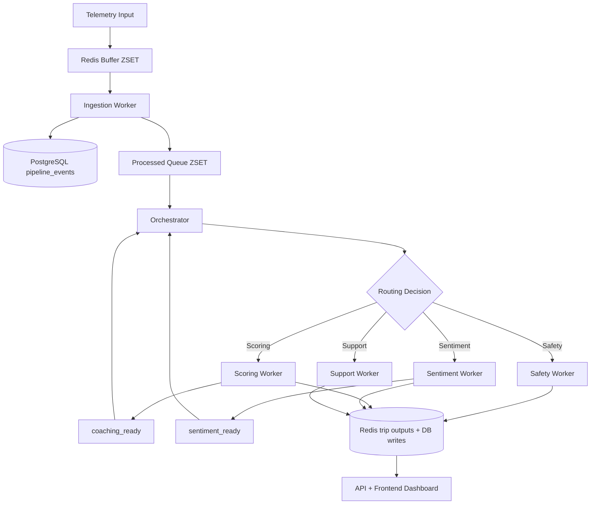
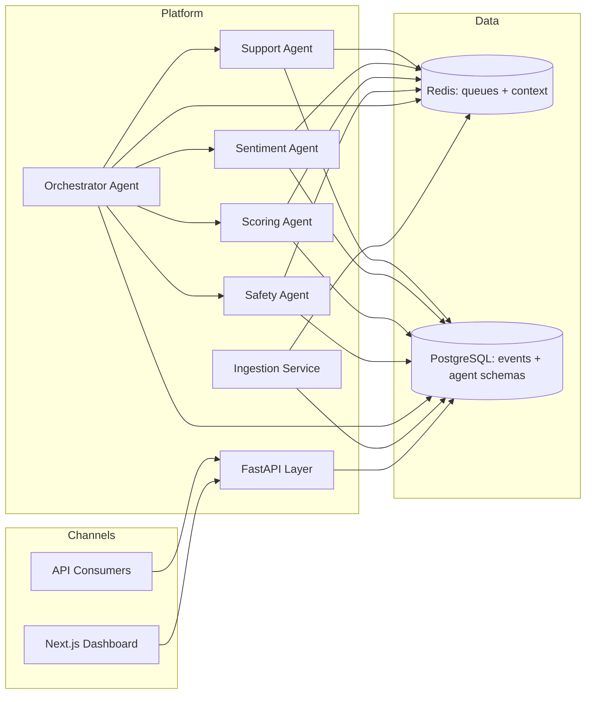
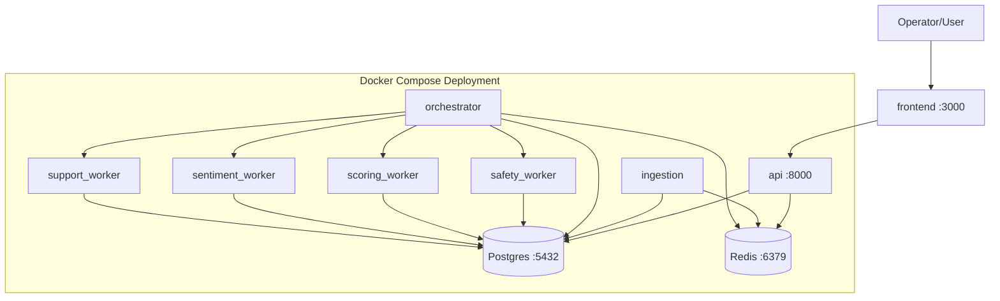
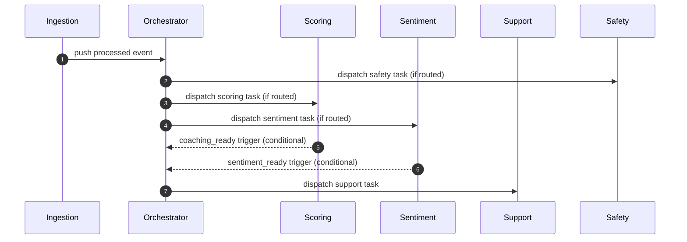
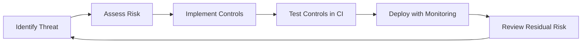
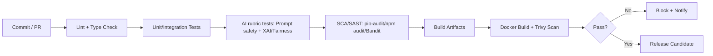

# TraceData AAS Presentation

## 1. Introduction and Solution Overview

### Project objective and scope
TraceData is an Autonomous AI System (AAS) for fleet operations. It ingests real-time truck telemetry, classifies safety-relevant events, computes trip behavior scores, analyzes qualitative driver sentiment, and generates coaching recommendations for post-trip interventions.

**In scope (current implementation):**
- Real-time ingestion pipeline from telemetry buffers to validated events
- Multi-agent orchestration (Orchestrator, Safety, Scoring, Sentiment, Support)
- FastAPI backend APIs and Next.js operational dashboard
- Redis-backed agent context and Celery task dispatch
- CI-integrated quality and security controls (lint/test/SCA/container scan)

**Out of scope (current phase):**
- Full enterprise IAM/SIEM integration
- Formal production governance board workflows
- Advanced online model retraining with automated approval gates

### Overall solution
The system processes telemetry in a staged flow:
1. Telemetry packets enter a Redis buffer.
2. Ingestion validates payloads and writes structured events to PostgreSQL.
3. Valid events are pushed to processed Redis queues.
4. Orchestrator routes each event to the right specialist agents.
5. Worker agents write outputs to Redis + schema-scoped database tables.
6. Frontend/API surfaces outcomes for monitoring and operator action.

### Agent roles and coordination
- **Orchestrator Agent**: event routing, lock management, cache warming, secure dispatch.
- **Safety Agent**: event-level safety triage and recommended action.
- **Scoring Agent**: trip behavior scoring with explainability and fairness audit payload.
- **Sentiment Agent**: driver text sentiment/emotion signal extraction and explanation.
- **Support Agent**: coaching generation using scoring/safety/sentiment context.

Coordination is hybrid:
- Deterministic fast-path routing for known event types (EventMatrix logic)
- LLM-assisted routing for dynamic cases
- Event-based follow-up triggers (`coaching_ready`, `sentiment_ready`) for staged support actions

### High-level workflow

---

## 2. System Architecture

### 2.1 Logical architecture and justification

**Why this architecture:**
- Separates ingestion, orchestration, and specialist reasoning for modularity.
- Keeps event flow resilient via Redis decoupling between services.
- Uses schema-scoped writes and agent-specific repositories for bounded responsibility.
- Supports incremental scaling by adding worker replicas per queue.

### 2.2 Physical architecture and justification

**Infrastructure rationale:**
- Docker Compose gives reproducible local/staging deployment for team delivery.
- Redis serves both broker/context patterns, minimizing operational overhead in MVP.
- PostgreSQL centralizes transactional integrity and auditable persistence.

### 2.3 Technology stack

| Layer | Technology | Purpose |
|---|---|---|
| Frontend | Next.js 16, React 19, TypeScript | Operations dashboard and workflows |
| API | FastAPI, Uvicorn, Pydantic | REST endpoints, validation, OpenAPI |
| Agent runtime | Celery, LangGraph, LangChain | Task dispatch and agent reasoning loops |
| LLM providers | OpenAI (`gpt-4o-mini`), Anthropic fallback path | Routing and text-generation tasks |
| Data | PostgreSQL (pgvector image), Redis | Durable storage + queue/context store |
| CI/CD | GitHub Actions, Docker Buildx | Build/test/release automation |
| Security scans | Bandit, pip-audit, npm audit, Trivy, ZAP baseline | SAST/SCA/container/DAST controls |

---

## 3. Agent Design

### 3.1 Orchestrator Agent
- **Purpose and responsibilities:** discovers active truck queues, pops processed events, acquires DB lease, computes routing, warms context keys, seals intent capsules, dispatches Celery tasks.
- **Input:** processed telemetry event + trip context + event policy matrix.
- **Output:** queued tasks per agent, updated trip state/context, event-flow telemetry.
- **Planning/reasoning approach:** deterministic EventMatrix fast-path for common event types and LLM router for non-fast-path scenarios.
- **Memory:** short-term trip runtime context in Redis (`trip:{trip_id}:context`) and warmed per-agent keys with TTL.
- **Tools used:** Redis client, DB manager/repositories, Celery send_task, routing tools, Slack notifier.
- **Interaction with others:** upstream from ingestion; downstream to Safety/Scoring/Sentiment/Support workers.

### 3.2 Safety Agent
- **Purpose:** classify severity and response action for safety incidents.
- **Input:** warmed `current_event` and `trip_context`.
- **Output:** safety decision payload (`severity`, `decision`, `action`) + persisted incident analysis.
- **Planning/reasoning:** deterministic safety baseline merged with optional LangGraph tool-loop output.
- **Memory:** writes latest safety summary back into trip context for downstream support.
- **Tools/APIs:** safety tools, safety repository, scoped Redis access.
- **Interactions:** receives capsule from orchestrator; contributes to support/coaching context.

### 3.3 Scoring Agent
- **Purpose:** compute trip and driver behavior scores with explainability/fairness artifacts.
- **Input:** `all_pings`, `historical_avg`, `trip_context`.
- **Output:** `trip_score`, `driver_score`, score breakdown, SHAP explanation object, fairness audit object.
- **Planning/reasoning:** LangGraph tool loop + deterministic baseline merge and post-processing checks.
- **Memory:** reads historical context and emits outputs used by support follow-up.
- **Tools/APIs:** scoring feature tools, scoring repository, follow-up scheduler.
- **Interactions:** can schedule `coaching_ready` for delayed support dispatch.

### 3.4 Sentiment Agent
- **Purpose:** analyze free-text driver feedback for sentiment and emotion signals.
- **Input:** `trip_context` and feedback-bearing event data.
- **Output:** sentiment label, score, emotion weights, explanation text.
- **Planning/reasoning:** anchor-based deterministic scoring with optional LLM explanation constrained by safety prompt rules.
- **Memory:** writes sentiment output and can trigger `sentiment_ready`.
- **Tools/APIs:** sentiment repository, optional LLM invocation, scoped Redis.
- **Interactions:** downstream dependency for support in post-sentiment path.

### 3.5 Support Agent
- **Purpose:** generate practical coaching guidance using multi-agent context.
- **Input:** trip context, coaching history, optional event snapshot, scoring/safety/sentiment outputs.
- **Output:** coaching category, prioritized message, persistence record.
- **Planning/reasoning:** deterministic baseline recommendation + optional LangGraph refinement.
- **Memory:** updates latest support output in trip context.
- **Tools/APIs:** support tools, support repository, Redis.
- **Interactions:** triggered directly for critical events or indirectly via `coaching_ready` / `sentiment_ready`.

### Agent interaction sequence (request-level)

---

## 4. Explainable and Responsible AI Practices

### Lifecycle alignment
- **Design:** bounded agent responsibilities and explicit data contracts.
- **Build:** schema validation, typed models, deterministic fallbacks where LLMs may fail.
- **Test:** explainability/fairness/safety contract tests (SHAP/LIME/AIF360 + prompt constraints).
- **Deploy:** CI gates for lint, type checks, tests, dependency scans, image scans.
- **Operate:** health endpoint, structured logs, event-flow telemetry and pipeline summaries.

### Fairness, bias mitigation, explainability
- Scoring pipeline produces explicit fairness audit fields (`demographic_parity`, `equalized_odds`, `bias_detected`, `recommendation`).
- Explainability is enforced through structured score breakdown and SHAP-style outputs.
- Sentiment explanations are constrained with prompt rules disallowing diagnosis and unsafe claims.
- Deterministic fallback responses reduce unsafe behavior under model/API failure conditions.

### Governance framework alignment (IMDA-style mapping)

| Governance principle | Current implementation | Next improvement |
|---|---|---|
| Internal governance | Agent/module ownership boundaries + CI policy checks | Formal RACI and release sign-off board |
| Human involvement | Design supports escalation for low-confidence/high-impact outputs | Implement explicit HITL queue + SOP |
| Operations management | Health checks, CI summaries, test artifacts | Add runtime SLO dashboard and incident drills |
| Stakeholder communication | OpenAPI docs and explainability payloads | Add user-facing transparency statements |

---

## 5. AI Security Risk Register

| ID | Risk | Likelihood | Impact | Risk Level | Mitigation and controls | Residual Risk |
|---|---|---|---|---|---|---|
| R-01 | Prompt injection influences model behavior | Medium | High | High | Prompt constraints, deterministic fallback paths, scoped tools | Medium |
| R-02 | Unauthorized cross-agent data access | Low | High | Medium | Scoped read/write key controls in intent capsule token | Low |
| R-03 | Tampered task/capsule payload | Low | High | Medium | Capsule validation model + HMAC-seal design intent + policy enforcement points | Low-Med |
| R-04 | Dependency and container vulnerabilities | Medium | Medium | Medium | pip-audit, npm audit, Bandit, Trivy in CI | Low-Med |
| R-05 | Unsafe or hallucinated coaching output | Medium | Medium | Medium | Baseline deterministic checks, constrained prompts, regression tests, human escalation path | Medium |
| R-06 | Sensitive information leakage via outputs/logs | Low | High | Medium | Structured logging practices, validation, anonymization tests | Low-Med |

Security lifecycle:

---

## 6. Application Demo

### Demo scenario
Show end-to-end handling of a trip containing harsh events and trip closure:
- Ingestion of telemetry
- Orchestrator routing
- Safety/scoring/sentiment outputs
- Post-scoring support via `coaching_ready`

### Demo runbook
1. Start stack with Docker Compose.
2. Open API docs (`/docs`) and frontend dashboard (`:3000`).
3. Seed telemetry batch to generate realistic events.
4. Show orchestrator dispatch logs and worker completions.
5. Show persisted outputs in API/database and contextual support recommendation.

### Expected outcome
- Routing appears in agent flow events.
- Score and fairness/explainability payloads are generated.
- Coaching message is produced with traceable reason context.

---

## 7. MLSecOps / LLMSecOps Pipeline and Demo

### CI/CD pipeline

### Implemented controls in repository
- **Backend API workflow:** lint, type-check, pytest + rubric smoke tests, SCA, docker + Trivy.
- **Backend agents workflow:** lint/type/unit/SCA/build + matrix image scans across orchestrator/workers.
- **Frontend workflow:** lint/type/Vitest/npm-audit/build/docker+Trivy + ZAP baseline scan.
- **Notification:** CI summary + Slack notifier job.

### Pipeline demo
Demonstrate a PR where:
1. A quality/security gate fails.
2. Fix is pushed.
3. Pipeline passes and artifacts are generated.

---

## 8. Evaluation and Testing Summary

### Test types performed
- **Unit tests:** agent logic, utilities, API schemas, frontend components.
- **Integration tests:** ingestion pipeline, orchestrator/queue behavior, repository integration.
- **Security tests:** Bandit, dependency audits, container CVE scans, frontend DAST baseline.
- **Explainability/fairness tests:** SHAP/LIME/AIF360 and prompt safety contract suites.
- **Operational tests:** full pipeline integration and cache-warming behavior tests.

### Summary table

| Category | Scope | Current status |
|---|---|---|
| Unit | Backend + frontend modules | Implemented in CI |
| Integration | Ingestion/orchestrator/repository flows | Implemented in CI |
| Security | SAST/SCA/container/DAST baseline | Implemented in CI |
| Explainability & Fairness | SHAP/LIME/AIF360 + prompt tests | Implemented in CI |

### Known gaps and next actions
- Add formal runtime evaluation dashboard (latency, drift, confidence, escalation rates).
- Define production pass/fail thresholds for fairness and safety policy gates.
- Formalize governance artifacts (RACI, model card, incident playbook) for audit submission.

---

## Appendix: Quick Talk Track (Optional)

- **Why AAS here?** Manual fleet review does not scale for event volume or response speed.
- **Why multi-agent?** Clear specialization improves maintainability and allows targeted controls.
- **Why this architecture?** Queue decoupling + schema-bound writes provide reliability and clear ownership.
- **Why trust outputs?** Explainability/fairness contracts, deterministic fallbacks, and security controls reduce risk.
