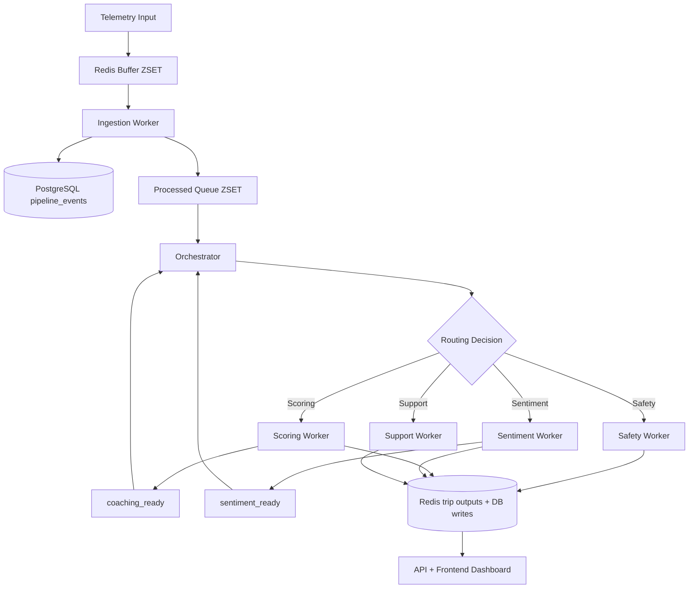
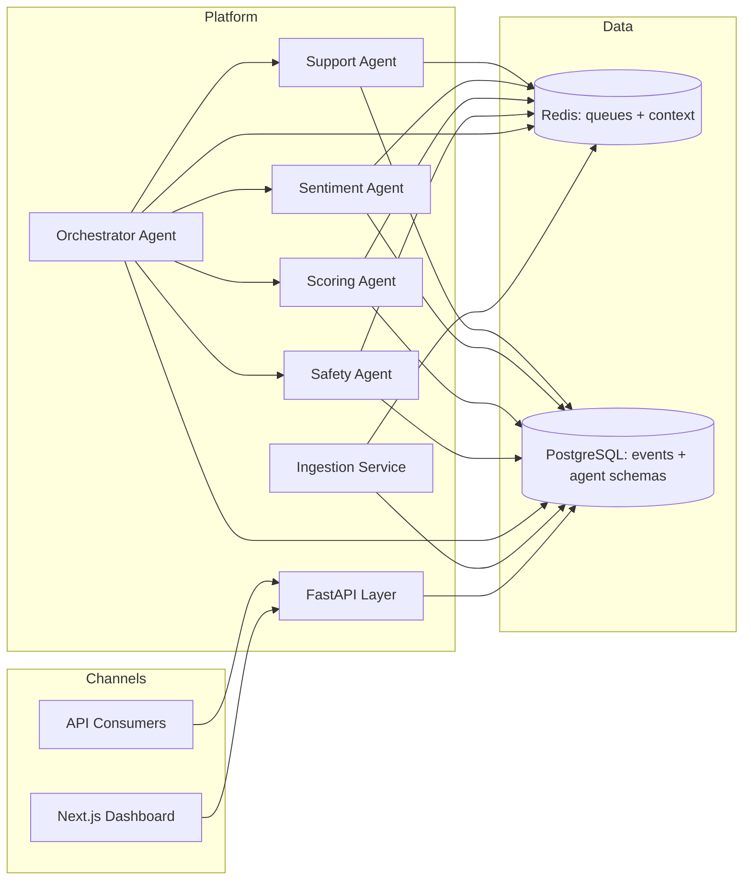
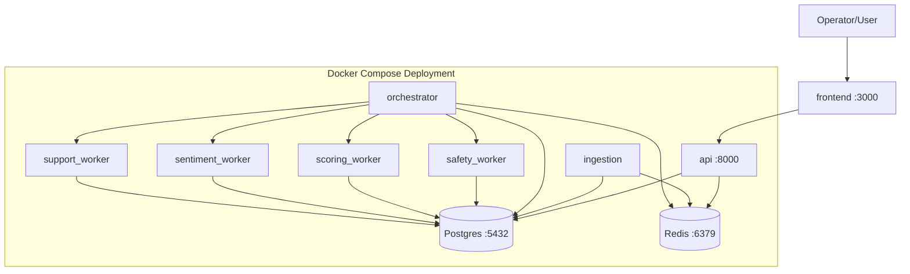
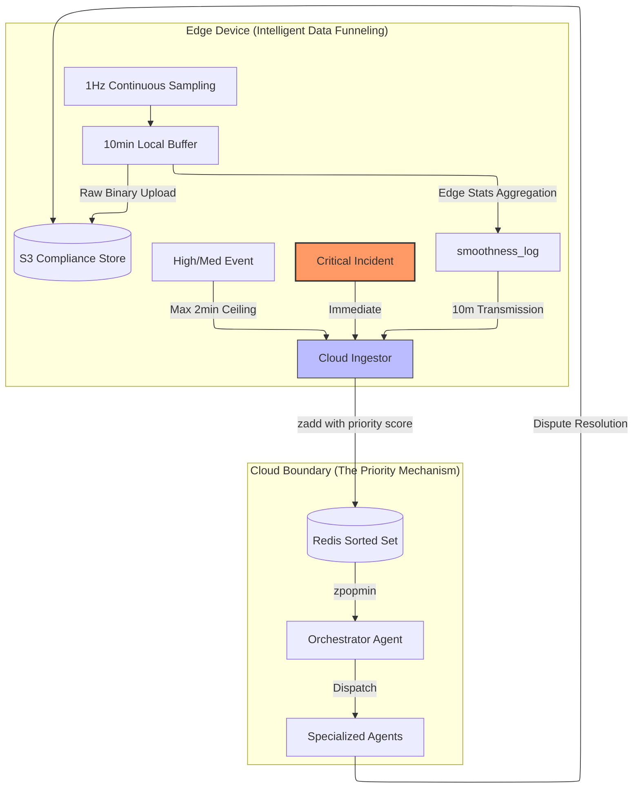
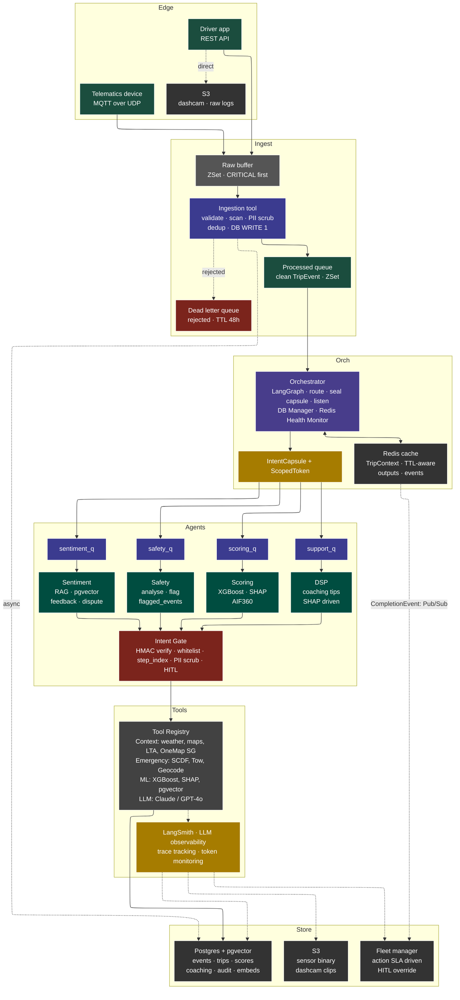
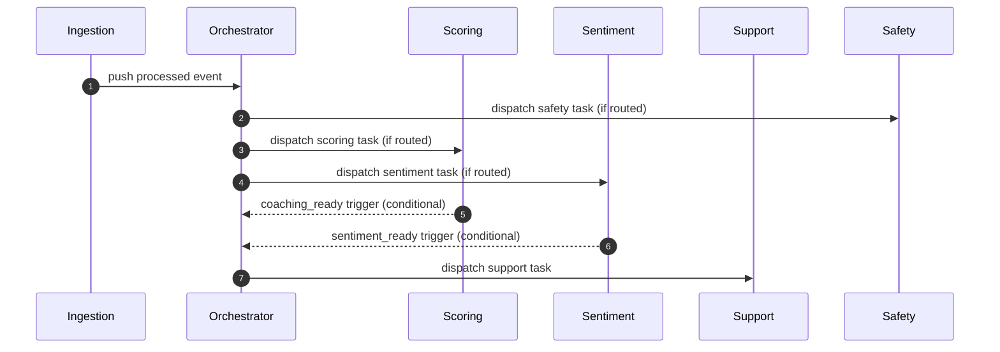
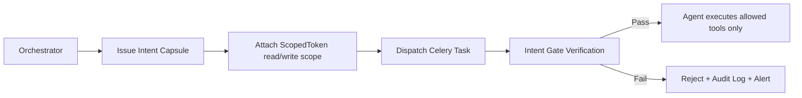
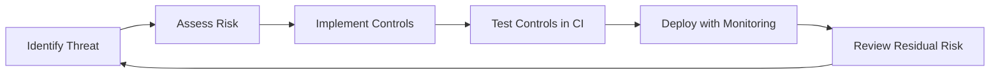
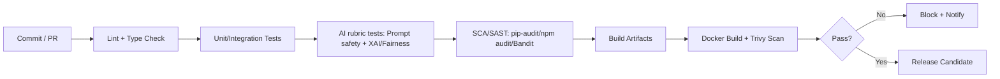

# TraceData AAS Presentation

## 1. Introduction and Solution Overview

### Project objective and scope
TraceData is an Autonomous AI System (AAS) for fleet operations. It ingests real-time truck telemetry, classifies safety-relevant events, computes trip behavior scores, analyzes qualitative driver sentiment, and generates coaching recommendations for post-trip interventions.

**In scope (current implementation):**
- Real-time ingestion pipeline from telemetry buffers to validated events
- Multi-agent orchestration (Orchestrator, Safety, Scoring, Sentiment, Support)
- FastAPI backend APIs and Next.js operational dashboard
- Redis-backed agent context and Celery task dispatch
- CI-integrated quality and security controls (lint/test/SCA/container scan)

**Out of scope (current phase):**
- Full enterprise IAM/SIEM integration
- Formal production governance board workflows
- Advanced online model retraining with automated approval gates

### Overall solution
The system processes telemetry in a staged flow:
1. Telemetry packets enter a Redis buffer.
2. Ingestion validates payloads and writes structured events to PostgreSQL.
3. Valid events are pushed to processed Redis queues.
4. Orchestrator routes each event to the right specialist agents.
5. Worker agents write outputs to Redis + schema-scoped database tables.
6. Frontend/API surfaces outcomes for monitoring and operator action.

### Agent roles and coordination
- **Orchestrator Agent**: event routing, lock management, cache warming, secure dispatch.
- **Safety Agent**: event-level safety triage and recommended action.
- **Scoring Agent**: trip behavior scoring with explainability and fairness audit payload.
- **Sentiment Agent**: driver text sentiment/emotion signal extraction and explanation.
- **Support Agent**: coaching generation using scoring/safety/sentiment context.

Coordination is hybrid:
- Deterministic fast-path routing for known event types (EventMatrix logic)
- LLM-assisted routing for dynamic cases
- Event-based follow-up triggers (`coaching_ready`, `sentiment_ready`) for staged support actions

### High-level workflow

---

## 2. System Architecture

### 2.1 Logical architecture and justification

**Why this architecture:**
- Separates ingestion, orchestration, and specialist reasoning for modularity.
- Keeps event flow resilient via Redis decoupling between services.
- Uses schema-scoped writes and agent-specific repositories for bounded responsibility.
- Supports incremental scaling by adding worker replicas per queue.

### 2.2 Physical architecture and justification

**Infrastructure rationale:**
- Docker Compose gives reproducible local/staging deployment for team delivery.
- Redis serves both broker/context patterns, minimizing operational overhead in MVP.
- PostgreSQL centralizes transactional integrity and auditable persistence.

### 2.3 Technology stack

| Layer | Technology | Purpose |
|---|---|---|
| Frontend | Next.js 16, React 19, TypeScript | Operations dashboard and workflows |
| API | FastAPI, Uvicorn, Pydantic | REST endpoints, validation, OpenAPI |
| Agent runtime | Celery, LangGraph, LangChain | Task dispatch and agent reasoning loops |
| LLM providers | OpenAI (`gpt-4o-mini`), Anthropic fallback path | Routing and text-generation tasks |
| Data | PostgreSQL (pgvector image), Redis | Durable storage + queue/context store |
| CI/CD | GitHub Actions, Docker Buildx | Build/test/release automation |
| Security scans | Bandit, pip-audit, npm audit, Trivy, ZAP baseline | SAST/SCA/container/DAST controls |

### 2.4 Edge-to-Cloud Priority Mechanism (Data Funneling)

**What this diagram communicates**
- **Edge buffering strategy:** continuous sampling is locally buffered, then compressed into periodic logs (`smoothness_log`) to control bandwidth.
- **Priority-aware uplink:** critical incidents bypass batching for immediate transmission; high/medium events are sent under bounded delay.
- **Compliance trail:** raw binary artifacts can be written to object storage for post-incident audit/dispute handling.
- **Cloud priority queue:** ingestor writes to Redis Sorted Set with priority scoring; orchestrator drains by ordered pop for urgency-aware dispatch.
- **Security implication:** this ordering reduces delayed handling risk for severe incidents and supports auditability of event provenance.

**Detailed component-by-component description**
- **`1Hz Continuous Sampling`**
  - Edge sensors collect high-frequency telemetry continuously (speed, jerk, cornering, braking, acceleration, location).
  - This raw feed is too dense and costly to transmit unfiltered in real time across all trips.
- **`10min Local Buffer`**
  - A local ring/buffer stores recent high-frequency data to absorb connectivity jitter and avoid data loss during temporary network disruptions.
  - The buffer acts as both a resilience mechanism and a pre-processing window for edge-side aggregation.
- **`smoothness_log`**
  - Edge-side aggregation periodically summarizes micro-signals into compact statistics for cloud analytics.
  - This reduces bandwidth and cloud ingestion load while preserving operationally meaningful signals.
- **`Critical Incident` vs `High/Med Event`**
  - Critical events are transmitted immediately to reduce response latency.
  - High/medium events can tolerate bounded delay (for example, max 2-minute ceiling), balancing urgency and network efficiency.
- **`Cloud Ingestor`**
  - Receives packets/events, applies normalization/validation logic, and assigns priority-aware queue scores.
  - Converts heterogeneous edge payloads into canonical event records for downstream routing.
- **`Redis Sorted Set` priority queue**
  - Priority score encodes urgency and event time; lower score is consumed earlier via `zpopmin`.
  - Enables deterministic ordering with explicit fairness between urgency and recency.
- **`Orchestrator Agent`**
  - Pulls next event by priority, applies routing policy, and dispatches specialized workers.
  - Maintains event lifecycle integrity and handoff observability.
- **`Specialized Agents`**
  - Perform domain-specific analysis (safety/scoring/sentiment/support) based on routed event context.
  - May write artifacts needed for downstream action or post-incident review.
- **`S3 Compliance Store`**
  - Stores raw or binary evidence (e.g., dashcam or sensor snapshots) needed for audit, disputes, and regulatory traceability.

**Detailed end-to-end flow narrative (speaker-ready)**
1. Edge device samples continuously at high frequency and buffers data locally.
2. Periodic summarization emits `smoothness_log` payloads every fixed interval to reduce transmission overhead.
3. Critical incidents bypass periodic batching and are pushed immediately to cloud ingestion.
4. Ingestor validates and scores events, then inserts them into a Redis Sorted Set with priority score.
5. Orchestrator pops the most urgent event first and dispatches to the required specialist agents.
6. Agent outputs and evidence links can be associated back to compliance storage for review and dispute handling.

**Why this matters (architecture justification)**
- **Operational timeliness:** urgent safety signals are not delayed behind bulk telemetry.
- **Scalability:** aggregation at edge reduces cloud compute and queue pressure.
- **Reliability:** local buffering protects against intermittent connectivity.
- **Governance:** retention of raw evidence supports defensible post-incident analysis.

### 2.5 Full Operational Architecture (with Security Controls)

**How to present this architecture**
- **Edge and ingest resilience:** raw buffer and DLQ isolate malformed or untrusted payloads before orchestration.
- **Priority dispatch model:** processed ZSet ensures urgent events reach orchestration and workers first.
- **Secure orchestration boundary:** orchestrator seals `IntentCapsule` and `ScopedToken` before queue dispatch.
- **Runtime gatekeeping:** `Intent Gate` validates integrity (HMAC), enforces tool allowlist and step sequencing, applies PII/HITL controls.
- **Traceability and operations:** outputs/events feed fleet-manager workflows with SLA-aware human override and observability hooks.

**Security feature emphasis in this diagram**
- `IntentCapsule + ScopedToken`: execution contract + least-privilege data scope.
- `Intent Gate`: runtime policy enforcement point before tool/resource access.
- `DLQ + PII scrub + dedup`: upstream defensive controls to reduce poisoned or duplicate input propagation.

**Detailed layer-by-layer description**

**1) Edge layer (`Edge`)**
- **Telematics device (MQTT/UDP):** emits high-volume machine telemetry.
- **Driver app (REST API):** contributes human-entered or app-generated operational events.
- **Raw S3 path:** allows direct retention of original evidence artifacts where required for forensic or regulatory review.

**2) Ingest layer (`Ingest`)**
- **Raw buffer ZSet (`RB`):** first durable queue for incoming events, ordered to prioritize critical signals.
- **Ingestion tool (`IT`):** applies input validation, schema checks, security scans, PII scrubbing, and deduplication prior to business processing.
- **Processed queue (`PQ`):** only normalized/clean TripEvent objects are forwarded to orchestration.
- **Dead-letter queue (`DLQ`):** invalid/rejected events are isolated with TTL for debugging, replay analysis, and abuse forensics.

**3) Orchestration layer (`Orch`)**
- **Orchestrator (`ORC`):** route planning, capsule issuance, queue dispatch, completion listening, and runtime monitoring.
- **Redis cache (`RC`):** stores trip context, intermediate outputs, and pub/sub completion events with TTL-aware lifecycle.
- **Intent Capsule + ScopedToken (`IC`):** secure delegation artifact carrying who-can-do-what and what data can be accessed.

**4) Agent execution layer (`Agents`)**
- Dedicated queues isolate workload classes (`safety_q`, `scoring_q`, `support_q`, `sentiment_q`) to prevent one pipeline from starving others.
- Domain agents execute only their bounded responsibilities and emit structured outputs.
- `Intent Gate` acts as guardrail middleware to verify capsule integrity and enforce runtime policy before any sensitive tool interaction.

**5) Tools and observability layer (`Tools`)**
- **Tool Registry (`TR`):** central contract for external data/tools and ML/LLM capabilities.
- **LangSmith (`LS`):** captures LLM traces, token usage, and model-call observability for debugging and optimization.

**6) Storage and action layer (`Store`)**
- **Postgres + pgvector (`PG`):** durable event, scoring, coaching, audit, and embedding persistence.
- **Final S3 (`S3_Fin`):** persistent binary storage for evidence artifacts.
- **Fleet manager interface (`FM`):** human decision point for SLA-bound actions and overrides.

**Detailed security control mapping**
- **Input boundary controls**
  - Validation, dedup, and PII scrub in ingestion reduce malicious/low-quality event propagation.
  - DLQ quarantines suspicious payloads to avoid poisoning operational queues.
- **Execution boundary controls**
  - Orchestrator issues Intent Capsule as immutable execution intent.
  - ScopedToken enforces least privilege over Redis keys (per trip, per agent).
  - Intent Gate performs runtime checks (integrity, whitelist, sequence, privacy checks, HITL gate).
- **Tool boundary controls**
  - Tool Registry centralizes approved integrations and narrows unauthorized call surfaces.
  - Gate + registry together provide policy-driven tool invocation.
- **Data boundary controls**
  - Agent outputs and audit artifacts are persisted in structured stores for traceability.
  - Evidence in S3 supports post-hoc verification and dispute workflows.
- **Human governance controls**
  - Fleet manager receives actionable outputs with SLA framing.
  - HITL override path prevents full automation in sensitive or ambiguous cases.

**Trust and auditability narrative (for reviewers)**
- Every event has a controlled path: ingest -> normalize -> prioritize -> authorize -> execute -> persist -> review.
- Security is not a single control; it is layered:
  - preventative (validation/scrub),
  - restrictive (capsule/token/gate),
  - detective (logs/traces),
  - corrective (HITL override, dispute workflow).
- This layered model supports both reliability in operations and defensibility in governance audits.

**Speaker notes (optional copy-ready script)**
- “At the edge, we intentionally separate high-frequency telemetry from high-priority incidents so we do not saturate cloud ingestion with low-urgency traffic.”
- “Only clean events enter the processed queue; malformed or suspicious payloads are quarantined in the DLQ.”
- “Before any worker runs, orchestration seals an Intent Capsule and ScopedToken. This is our contract for least-privilege execution.”
- “Intent Gate is our runtime enforcement point: if integrity, whitelist, step-order, or privacy checks fail, execution is blocked and auditable.”
- “Finally, we maintain a human override path through fleet manager actions, which is critical for responsible AI operations.”

---

## 3. Agent Design

### 3.1 Orchestrator Agent
- **Purpose and responsibilities:** discovers active truck queues, pops processed events, acquires DB lease, computes routing, warms context keys, seals intent capsules, dispatches Celery tasks.
- **Input:** processed telemetry event + trip context + event policy matrix.
- **Output:** queued tasks per agent, updated trip state/context, event-flow telemetry.
- **Planning/reasoning approach:** deterministic EventMatrix fast-path for common event types and LLM router for non-fast-path scenarios.
- **Memory:** short-term trip runtime context in Redis (`trip:{trip_id}:context`) and warmed per-agent keys with TTL.
- **Tools used:** Redis client, DB manager/repositories, Celery send_task, routing tools, Slack notifier.
- **Interaction with others:** upstream from ingestion; downstream to Safety/Scoring/Sentiment/Support workers.

### 3.2 Safety Agent
- **Purpose:** classify severity and response action for safety incidents.
- **Input:** warmed `current_event` and `trip_context`.
- **Output:** safety decision payload (`severity`, `decision`, `action`) + persisted incident analysis.
- **Planning/reasoning:** deterministic safety baseline merged with optional LangGraph tool-loop output.
- **Memory:** writes latest safety summary back into trip context for downstream support.
- **Tools/APIs:** safety tools, safety repository, scoped Redis access.
- **Interactions:** receives capsule from orchestrator; contributes to support/coaching context.

### 3.3 Scoring Agent
- **Purpose:** compute trip and driver behavior scores with explainability/fairness artifacts.
- **Input:** `all_pings`, `historical_avg`, `trip_context`.
- **Output:** `trip_score`, `driver_score`, score breakdown, SHAP explanation object, fairness audit object.
- **Planning/reasoning:** LangGraph tool loop + deterministic baseline merge and post-processing checks.
- **Memory:** reads historical context and emits outputs used by support follow-up.
- **Tools/APIs:** scoring feature tools, scoring repository, follow-up scheduler.
- **Interactions:** can schedule `coaching_ready` for delayed support dispatch.

### 3.4 Sentiment Agent
- **Purpose:** analyze free-text driver feedback for sentiment and emotion signals.
- **Input:** `trip_context` and feedback-bearing event data.
- **Output:** sentiment label, score, emotion weights, explanation text.
- **Planning/reasoning:** anchor-based deterministic scoring with optional LLM explanation constrained by safety prompt rules.
- **Memory:** writes sentiment output and can trigger `sentiment_ready`.
- **Tools/APIs:** sentiment repository, optional LLM invocation, scoped Redis.
- **Interactions:** downstream dependency for support in post-sentiment path.

### 3.5 Support Agent
- **Purpose:** generate practical coaching guidance using multi-agent context.
- **Input:** trip context, coaching history, optional event snapshot, scoring/safety/sentiment outputs.
- **Output:** coaching category, prioritized message, persistence record.
- **Planning/reasoning:** deterministic baseline recommendation + optional LangGraph refinement.
- **Memory:** updates latest support output in trip context.
- **Tools/APIs:** support tools, support repository, Redis.
- **Interactions:** triggered directly for critical events or indirectly via `coaching_ready` / `sentiment_ready`.

### Agent interaction sequence (request-level)

---

## 4. Explainable and Responsible AI Practices

### Lifecycle alignment
- **Design:** bounded agent responsibilities and explicit data contracts.
- **Build:** schema validation, typed models, deterministic fallbacks where LLMs may fail.
- **Test:** explainability/fairness/safety contract tests (SHAP/LIME/AIF360 + prompt constraints).
- **Deploy:** CI gates for lint, type checks, tests, dependency scans, image scans.
- **Operate:** health endpoint, structured logs, event-flow telemetry and pipeline summaries.

### Security-by-design highlights (Intent Gate, Intent Capsule, ScopedToken)

These are core security controls in TraceData and should be called out explicitly during presentation:

- **Intent Capsule (control plane contract):**
  - Immutable mission payload issued by orchestrator per agent execution.
  - Carries agent identity, trip/event scope, allowed tools, TTL, and scoped token.
  - Reduces arbitrary task execution by binding workers to approved execution context.

- **ScopedToken (least-privilege data access):**
  - Defines explicit Redis `read_keys` and `write_keys` per agent and trip.
  - Enforces data isolation between agents and prevents unauthorized cross-agent reads/writes.
  - Supports privacy-by-design by constraining access to only required context keys.

- **Intent Gate (runtime enforcement and audit guard):**
  - Validates capsule integrity and allowed operations before tool execution.
  - Acts as policy enforcement point for sequence/whitelist/authorization checks.
  - Produces rejection paths and audit-ready traces for blocked operations.

Control interaction model:

### Fairness, bias mitigation, explainability
- Scoring pipeline produces explicit fairness audit fields (`demographic_parity`, `equalized_odds`, `bias_detected`, `recommendation`).
- Explainability is enforced through structured score breakdown and SHAP-style outputs.
- Sentiment explanations are constrained with prompt rules disallowing diagnosis and unsafe claims.
- Deterministic fallback responses reduce unsafe behavior under model/API failure conditions.

### Governance framework alignment (IMDA-style mapping)

| Governance principle | Current implementation | Next improvement |
|---|---|---|
| Internal governance | Agent/module ownership boundaries + CI policy checks | Formal RACI and release sign-off board |
| Human involvement | Design supports escalation for low-confidence/high-impact outputs | Implement explicit HITL queue + SOP |
| Operations management | Health checks, CI summaries, test artifacts | Add runtime SLO dashboard and incident drills |
| Stakeholder communication | OpenAPI docs and explainability payloads | Add user-facing transparency statements |

---

## 5. AI Security Risk Register

| ID | Risk | Likelihood | Impact | Risk Level | Mitigation and controls | Residual Risk |
|---|---|---|---|---|---|---|
| R-01 | Prompt injection influences model behavior | Medium | High | High | Prompt constraints, deterministic fallback paths, scoped tools | Medium |
| R-02 | Unauthorized cross-agent data access | Low | High | Medium | `ScopedToken` least-privilege `read_keys`/`write_keys` enforced per trip + agent | Low |
| R-03 | Tampered task/capsule payload | Low | High | Medium | `Intent Capsule` integrity checks and `Intent Gate` runtime verification before tool use | Low-Med |
| R-04 | Dependency and container vulnerabilities | Medium | Medium | Medium | pip-audit, npm audit, Bandit, Trivy in CI | Low-Med |
| R-05 | Unsafe or hallucinated coaching output | Medium | Medium | Medium | Baseline deterministic checks, constrained prompts, regression tests, human escalation path via gate decisions | Medium |
| R-06 | Sensitive information leakage via outputs/logs | Low | High | Medium | Structured logging practices, validation, anonymization tests | Low-Med |

Security lifecycle:

---

## 6. Application Demo

### Demo scenario
Show end-to-end handling of a trip containing harsh events and trip closure:
- Ingestion of telemetry
- Orchestrator routing
- Safety/scoring/sentiment outputs
- Post-scoring support via `coaching_ready`

### Demo runbook
1. Start stack with Docker Compose.
2. Open API docs (`/docs`) and frontend dashboard (`:3000`).
3. Seed telemetry batch to generate realistic events.
4. Show orchestrator dispatch logs and worker completions.
5. Show persisted outputs in API/database and contextual support recommendation.

### Expected outcome
- Routing appears in agent flow events.
- Score and fairness/explainability payloads are generated.
- Coaching message is produced with traceable reason context.

---

## 7. MLSecOps / LLMSecOps Pipeline and Demo

### CI/CD pipeline

### Implemented controls in repository
- **Backend API workflow:** lint, type-check, pytest + rubric smoke tests, SCA, docker + Trivy.
- **Backend agents workflow:** lint/type/unit/SCA/build + matrix image scans across orchestrator/workers.
- **Frontend workflow:** lint/type/Vitest/npm-audit/build/docker+Trivy + ZAP baseline scan.
- **Notification:** CI summary + Slack notifier job.

### Pipeline demo
Demonstrate a PR where:
1. A quality/security gate fails.
2. Fix is pushed.
3. Pipeline passes and artifacts are generated.

---

## 8. Evaluation and Testing Summary

### Test types performed
- **Unit tests:** agent logic, utilities, API schemas, frontend components.
- **Integration tests:** ingestion pipeline, orchestrator/queue behavior, repository integration.
- **Security tests:** Bandit, dependency audits, container CVE scans, frontend DAST baseline.
- **Explainability/fairness tests:** SHAP/LIME/AIF360 and prompt safety contract suites.
- **Operational tests:** full pipeline integration and cache-warming behavior tests.

### Summary table

| Category | Scope | Current status |
|---|---|---|
| Unit | Backend + frontend modules | Implemented in CI |
| Integration | Ingestion/orchestrator/repository flows | Implemented in CI |
| Security | SAST/SCA/container/DAST baseline | Implemented in CI |
| Explainability & Fairness | SHAP/LIME/AIF360 + prompt tests | Implemented in CI |

### Known gaps and next actions
- Add formal runtime evaluation dashboard (latency, drift, confidence, escalation rates).
- Define production pass/fail thresholds for fairness and safety policy gates.
- Formalize governance artifacts (RACI, model card, incident playbook) for audit submission.

---

## Appendix: Quick Talk Track (Optional)

- **Why AAS here?** Manual fleet review does not scale for event volume or response speed.
- **Why multi-agent?** Clear specialization improves maintainability and allows targeted controls.
- **Why this architecture?** Queue decoupling + schema-bound writes provide reliability and clear ownership.
- **Why trust outputs?** Explainability/fairness contracts, deterministic fallbacks, and security controls reduce risk.
