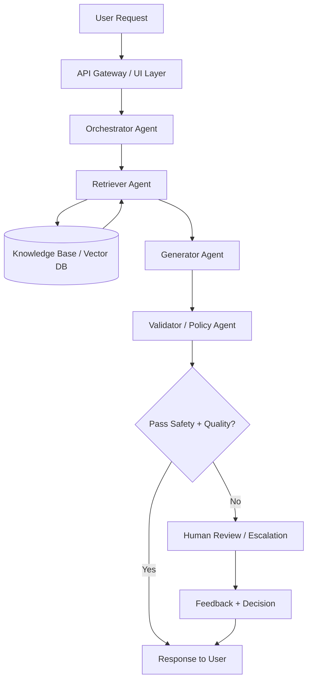
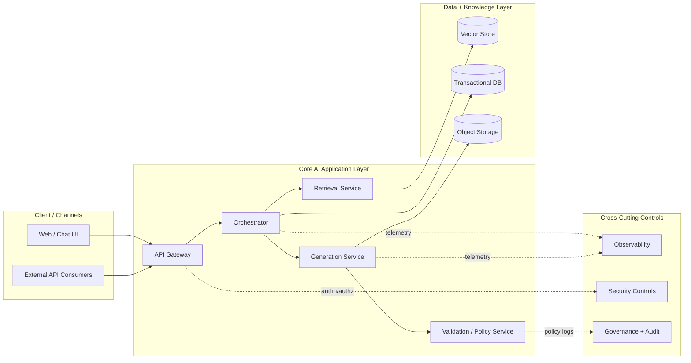
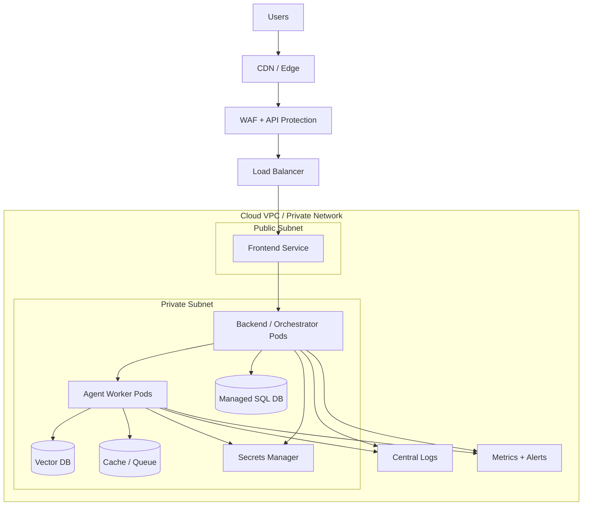
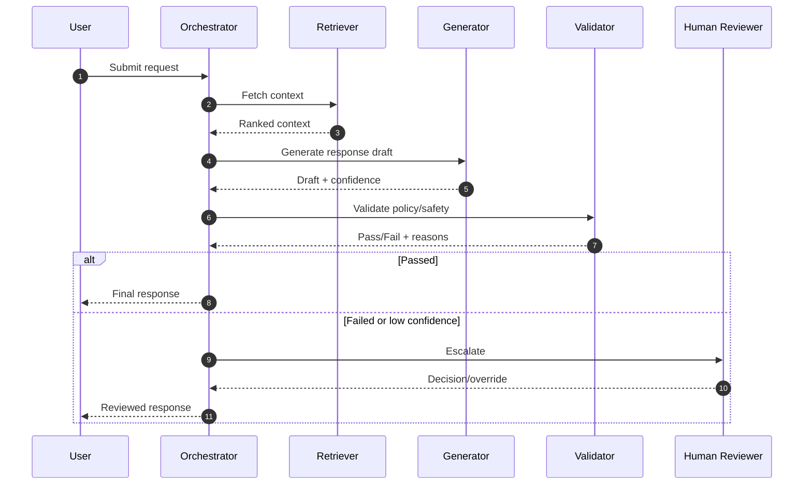
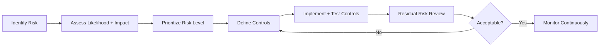

# AAS Presentation Guideline (Comprehensive Template)

Use this document as a presentation-ready structure for your **Autonomous AI System (AAS)** showcase.  
It is designed for both technical and governance reviewers, with enough depth for architecture, agent design, security, and testing.

---

## 0) Recommended Presentation Flow and Timing

- `1. Introduction and Solution Overview` (2-3 min)
- `2. System Architecture` (3-4 min)
- `3. Agent Design` (4-6 min)
- `4. Explainable and Responsible AI Practices` (2-3 min)
- `5. AI Security Risk Register` (2-3 min)
- `6. Application Demo` (3-5 min)
- `7. MLSecOps / LLMSecOps Pipeline + Demo` (3-5 min)
- `8. Evaluation and Testing Summary` (2-3 min)
- `Q&A` (remaining time)

Tip: keep each section to **one key message**, then support with evidence (diagram, table, metric, or demo).

---

## 1) Introduction and Solution Overview

### 1.1 Project Objective and Scope

State clearly:
- **Problem statement**: What user/business problem is being solved?
- **Primary users/stakeholders**: Who uses or is impacted by the solution?
- **Scope in**: What capabilities are included in this release?
- **Scope out**: What is intentionally excluded (future work)?
- **Success criteria**: How success is measured (e.g., accuracy, latency, adoption, risk reduction)?

Suggested slide content:
- 1 sentence problem statement
- 3-5 bullet scope points
- 2-3 measurable success KPIs

### 1.2 Overall Solution Description

Summarize:
- End-to-end user journey from input to decision/output
- Where AI is used and where deterministic logic is used
- How the system delivers value compared to baseline/manual approach

Include:
- A simple “before vs after” value table
- One illustrative use case

### 1.3 Agent Roles and Coordination

Describe:
- Core agents and their responsibilities
- Orchestration pattern used (central orchestrator, event-driven, peer-to-peer, hierarchical)
- Why this coordination model was selected (scalability, modularity, control, auditability)

### 1.4 High-Level Agent Interaction Workflow

Provide:
- A high-level workflow diagram (sequence or activity diagram)
- Trigger events, decision points, and handoff points
- Failure/retry path and escalation path (if agent confidence is low)

Example Mermaid (high-level agent workflow):

Checklist:
- [ ] Entry and exit points are clear
- [ ] Human-in-the-loop points are shown
- [ ] Safety/guardrail checks are visible

---

## 2) System Architecture

### 2.1 Logical Architecture Diagram + Description + Justification

Show conceptual components:
- Channels/interfaces (web app, API, chat, batch)
- Core services (orchestrator, agent services, retrieval layer, policy engine)
- Data flow (input -> processing -> output -> monitoring)
- Cross-cutting concerns (security, observability, governance)

Justify design choices:
- Why this decomposition?
- Why service boundaries are defined this way?
- How this supports maintainability and future extensibility

Example Mermaid (logical architecture):

### 2.2 Physical Architecture Diagram + Infrastructure + Justification

Show deployment/runtime details:
- Cloud/on-prem environment
- Compute layers (containers, VMs, serverless, GPU nodes if any)
- Storage and databases
- Network segmentation and trust boundaries
- Secrets, IAM, and key management components
- Monitoring and logging infrastructure

Justify:
- Reliability and scaling approach
- Cost/performance trade-offs
- Security and compliance rationale

Example Mermaid (physical architecture):

### 2.3 Technology Stack

Provide a table such as:

| Layer | Technology | Purpose | Rationale |
|---|---|---|---|
| Frontend | `<React / Next.js / etc.>` | User interaction | Ecosystem maturity, developer velocity |
| Backend/API | `<FastAPI / Node / etc.>` | Orchestration & business logic | Performance, maintainability |
| LLM/Models | `<Model names>` | Reasoning / generation / classification | Quality, cost, latency |
| Vector/DB | `<Pinecone / pgvector / etc.>` | Retrieval/memory | Query performance |
| Infra | `<Docker / K8s / CI platform>` | Deployment and ops | Scalability and automation |
| Security | `<WAF, IAM, secrets manager>` | Risk control | Governance alignment |

---

## 3) Agent Design (Key Agents)

Document each key agent in a consistent format.

### 3.1 Agent Template (Use for each key agent)

#### Agent: `<Agent Name>`

- **Purpose and responsibilities**
  - What this agent owns
  - Clear boundaries (what it does *not* do)
  - No overlap with other agents

- **Input and output**
  - Inputs: message schema, context, metadata, constraints
  - Outputs: structured response, action, confidence score, logs/events

- **Planning / reasoning approach**
  - Model(s) used: `<model name + version>`
  - Decision method: rule-based, prompt-based reasoning, hybrid
  - Why this approach fits the task

- **Memory (if applicable)**
  - Memory type: short-term / long-term / episodic / vector retrieval
  - Retention strategy and expiry
  - How memory improves performance/safety

- **Tools used**
  - APIs, search, database, external systems, internal tools
  - Guardrails around tool invocation and output validation

- **Interaction with other agents**
  - Upstream dependencies (who sends to this agent)
  - Downstream consumers (who receives this agent output)
  - Contract: expected schema and error handling behavior

### 3.2 Example Agent Catalog Table

| Agent | Primary Role | Inputs | Outputs | Model/Reasoning | Memory | Tools | Upstream/Downstream |
|---|---|---|---|---|---|---|---|
| `<Orchestrator>` | Route and coordinate tasks | User request, policies | Routing decision, task plan | Rules + LLM validation | Short-term session | Policy engine, task queue | User/API -> Worker agents |
| `<Retriever>` | Fetch relevant context | Query, metadata filters | Ranked context chunks | Embedding similarity + rerank | Long-term vector index | Vector DB, search API | Orchestrator -> Generator |
| `<Generator>` | Produce final response | Prompt + retrieved context | Draft output + confidence | LLM reasoning + structured output | Session memory | LLM API, formatting tools | Retriever -> Validator |
| `<Validator>` | Safety, quality, policy checks | Draft response | Approved response or rejection reason | Rules + lightweight model | Minimal audit memory | Safety filters, policy DB | Generator -> User/Orchestrator |

Optional Mermaid (agent sequence for one request):

---

## 4) Explainable and Responsible AI Practices

### 4.1 Alignment Across Development and Deployment Lifecycle

Map practices to lifecycle stages:
- **Design**: risk assessment, intended use, misuse scenarios
- **Data**: data lineage, quality checks, minimization, consent/privacy controls
- **Model**: benchmark selection, explainability approach, red-teaming
- **Deployment**: access control, monitoring, rollback criteria
- **Operations**: drift detection, periodic audits, incident response, retraining governance

### 4.2 Fairness, Bias Mitigation, and Explainability

Describe:
- Sensitive attributes considered and handling approach
- Bias detection tests and thresholds
- Mitigation methods (rebalancing, prompt constraints, post-processing rules)
- Explainability outputs (rationale, citation, confidence, feature importance where applicable)
- User-facing disclosures and escalation path

### 4.3 Governance Framework Alignment (e.g., IMDA Model AI Governance Framework)

Create a compliance mapping table:

| Governance Principle | Implementation in System | Evidence Artifact |
|---|---|---|
| Internal Governance | Defined RACI, approval workflows | Governance SOP, review logs |
| Human Involvement | Human override on low-confidence cases | Escalation workflow records |
| Operations Management | Monitoring, incident handling, rollback | Runbooks, alert logs |
| Stakeholder Communication | Explainability statements, limitation disclosure | UI notices, documentation |

---

## 5) AI Security Risk Register

Use a structured risk register with ownership and status.

### 5.1 Risk Register Table (Example)

| ID | Risk Scenario | Likelihood | Impact | Risk Level | Control/Mitigation | Owner | Residual Risk | Status |
|---|---|---|---|---|---|---|---|---|
| R-01 | Prompt injection manipulates system behavior | Medium | High | High | Input sanitization, context isolation, policy validator, allowlisted tools | Security Lead | Medium | Active |
| R-02 | Data leakage via model output | Low | High | Medium | PII redaction, output filters, retrieval access controls | AI Lead | Low | Active |
| R-03 | Model hallucination causes unsafe decision | Medium | Medium | Medium | Grounding via RAG, confidence thresholds, human review for critical paths | Product Owner | Low | Active |
| R-04 | Supply-chain compromise in model/tool dependency | Low | High | Medium | SBOM, dependency scanning, signed artifacts, pinned CI checks | DevSecOps | Low | Active |
| R-05 | Unauthorized access to prompts/secrets | Low | High | Medium | IAM least privilege, secret vault, key rotation, audit logs | Platform Lead | Low | Active |

### 5.2 Required Security Controls to Present

- Prompt-injection defenses
- Output filtering and sensitive data handling
- Tool-use restrictions and sandboxing
- Authentication, authorization, secrets management
- Logging, traceability, forensic readiness
- Incident response playbook for AI-specific threats

Optional Mermaid (risk treatment lifecycle):

---

## 6) Application Demo

### 6.1 Demo Narrative

Structure:
1. User problem context (30 sec)
2. Input and expected outcome (30 sec)
3. Live walk-through of core flow (2-3 min)
4. Show guardrails and fallback behavior (1 min)
5. Business/operational value (30 sec)

### 6.2 Demo Checklist

- [ ] Demo environment pre-validated
- [ ] Stable internet/API keys and backup path
- [ ] Prepared sample inputs (normal + edge case + adversarial)
- [ ] Monitoring/dashboard view ready
- [ ] Clear “what success looks like” statement
- [ ] Time-boxed script with fallback screenshots/video

---

## 7) MLSecOps / LLMSecOps Pipeline and Demo

### 7.1 CI/CD Pipeline Diagram Requirements

Include stages:
- Source control and branch protections
- Static analysis and dependency scanning
- Unit/integration/security tests
- Prompt and policy regression tests
- Model evaluation gates (quality, safety, latency)
- Artifact signing and deployment promotion
- Runtime monitoring and automated rollback triggers

Example Mermaid (MLSecOps / LLMSecOps pipeline):

```mermaid
flowchart LR
    A[Developer Commit / PR] --> B[Branch Protection + Review]
    B --> C[CI Build]
    C --> D[SAST + Secrets Scan + Dependency Scan]
    D --> E[Unit + Integration + Security Tests]
    E --> F[Prompt/Policy Regression Tests]
    F --> G[Model Eval Gates: Quality/Safety/Latency]
    G --> H{All Gates Passed?}
    H -- No --> I[Block Release + Notify Team]
    H -- Yes --> J[Sign Artifacts + Create Release]
    J --> K[Deploy to Staging]
    K --> L[Canary / Approval Gate]
    L --> M[Deploy to Production]
    M --> N[Runtime Monitoring + Drift/Abuse Alerts]
    N --> O{Incident Detected?}
    O -- Yes --> P[Auto Rollback / Containment]
    O -- No --> Q[Normal Operations]
```

### 7.2 Pipeline Control Points (What to Explain)

- **Build-time controls**: SAST, secrets scanning, dependency checks
- **Model/prompt controls**: prompt linting, jailbreak tests, policy compliance tests
- **Release controls**: approval gates, canary rollout, rollback conditions
- **Runtime controls**: anomaly detection, abuse monitoring, drift alerts

### 7.3 Pipeline Demo Script

Demonstrate:
- Commit -> pipeline trigger
- Quality/security gate pass/fail behavior
- Deployment to target environment
- Monitoring signal after deployment
- Rollback or mitigation path for failed checks

---

## 8) Evaluation and Testing Summary

### 8.1 Test Types and Coverage

Report at minimum:
- Unit tests (agent logic, utility modules)
- Integration tests (agent-to-agent and service contracts)
- End-to-end tests (user workflow)
- Security tests (prompt injection, data exfiltration, auth controls)
- Performance tests (latency, throughput, concurrency)
- Robustness tests (out-of-distribution inputs, malformed prompts)

### 8.2 Results Summary Table (Template)

| Test Category | Scope | Pass Rate | Key Findings | Actions Taken |
|---|---|---|---|---|
| Unit | Core modules | `<xx%>` | `<finding>` | `<fix or acceptance>` |
| Integration | Agent orchestration | `<xx%>` | `<finding>` | `<fix or acceptance>` |
| Security | LLM abuse + platform risks | `<xx%>` | `<finding>` | `<mitigation>` |
| Performance | API + model inference | `<xx%>` | `<finding>` | `<optimization>` |

### 8.3 What Reviewers Usually Expect

- Clear pass/fail criteria
- Traceability from risk register to test cases
- Evidence of regression prevention
- Known limitations and compensating controls
- Prioritized roadmap for unresolved gaps

---

## 9) Suggested Appendix (Optional but Strongly Recommended)

- Prompt design and versioning strategy
- Data dictionaries and schema contracts
- Model cards / system cards
- RACI for governance and operations
- Incident response flow for AI incidents
- Audit log examples

---

## 10) Ready-to-Fill Slide/Report Skeleton

Copy this section into your slide notes/report and replace placeholders.

### Slide 1: Title and Context
- Project name: `<name>`
- Team: `<members>`
- Objective: `<1 sentence>`

### Slide 2: Problem and Scope
- Problem: `<statement>`
- In-scope: `<items>`
- Out-of-scope: `<items>`

### Slide 3: Solution Overview
- Overall flow: `
`
- Value delivered: `<metrics>`

### Slide 4: Agent Coordination Workflow
- Agents: `<list>`
- Handoffs: `
`
- Guardrails: `
`

### Slide 5: Logical Architecture
- Diagram + 3 design justifications

### Slide 6: Physical Architecture
- Infrastructure + security boundaries + rationale

### Slide 7-8: Agent Design (Key Agents)
- One slide per major agent using template in Section 3

### Slide 9: Responsible AI
- Fairness, explainability, governance mapping

### Slide 10: Security Risk Register
- Top 5 risks, controls, residual risks

### Slide 11: Application Demo
- Scenario, walkthrough, expected output, fallback

### Slide 12: MLSecOps/LLMSecOps Pipeline
- Diagram + gates + deployment controls

### Slide 13: Testing and Evaluation
- Test matrix + key outcomes + unresolved gaps

### Slide 14: Conclusion and Next Steps
- What is production-ready
- What is next
- Ask from reviewers/stakeholders

---

## 11) Final Quality Checklist Before Submission

- [ ] Architecture diagrams are readable and consistent with implementation
- [ ] Agent responsibilities are non-overlapping and unambiguous
- [ ] Responsible AI claims are backed by evidence/artifacts
- [ ] Security risks include owner, control, and residual risk
- [ ] Pipeline controls are explicit, not generic
- [ ] Testing results include quantitative metrics
- [ ] Demo includes both successful and failure-handling scenarios
- [ ] Limitations and future work are transparently stated

---

## 12) TraceData Repo-Based Filled Draft (Editable)

This section is prefilled from the current codebase and CI configuration in this repository.  
Edit wording, scope, and numbers as needed for your final submission.

### 12.1 Introduction and Solution Overview

**Project objective and scope**
- Build a near-real-time fleet telemetry intelligence platform that ingests truck events, orchestrates specialized AI agents, and returns safety/coaching outcomes for fleet operations.
- In scope: telemetry ingestion, event routing, safety triage, trip scoring, sentiment analysis, coaching recommendation, API + frontend monitoring views.
- Out of scope (current state): fully productionized cloud-native deployment, enterprise IAM integration, formalized governance documentation package.

**Overall solution**
- Telemetry events are buffered in Redis, validated/persisted by ingestion, then pushed to a processed queue.
- Orchestrator pulls processed events, decides which agent(s) to dispatch (deterministic EventMatrix fast-path + LLM routing path), warms scoped Redis context, and dispatches Celery tasks.
- Worker agents (Safety, Scoring, Sentiment, Support) read only capsule-approved keys, write outputs to scoped Redis keys and schema-specific DB tables, then publish completion events.

**Agent roles and coordination**
- `orchestrator`: routing, lock acquisition, context warming, capsule sealing, task dispatch.
- `safety`: event-level incident severity and recommended operational action.
- `scoring`: trip-level behavior scoring with explainability and fairness audit payload.
- `sentiment`: driver feedback sentiment/emotion signal extraction + explanation.
- `support`: post-event / post-trip coaching message generation.

**High-level workflow**
- Orchestrator uses event type + policy to route quickly for known events, otherwise invokes LLM router.
- Support dispatch is delayed for `end_of_trip` paths via `coaching_ready` and similarly after sentiment via `sentiment_ready`.
- Human review is expected as a policy extension for low-confidence/high-impact outputs.

### 12.2 System Architecture

**Logical architecture (current implementation)**
- Channels: Next.js frontend dashboard + FastAPI backend API.
- Core backend services: ingestion worker, orchestrator worker, Celery workers (safety/scoring/sentiment/support).
- Data stores: PostgreSQL (with pgvector image), Redis (broker, result backend, queue/context store).
- Cross-cutting: structured logging, request ID middleware, CI security scanning, Slack CI notifications.

**Physical architecture (current implementation)**
- Docker Compose local/multi-container deployment.
- Core containers: `api`, `ingestion`, `orchestrator`, `safety_worker`, `scoring_worker`, `support_worker`, `sentiment_worker`, `frontend`, `db`, `redis`.
- Ports: frontend `3000`, API `8000`, Postgres `5432`, Redis `6379`.
- API service starts with baseline bootstrap script and exposes `/docs`, `/redoc`, `/health`.

**Tech stack**

| Layer | Technology in Repo | Purpose | Why It Fits |
|---|---|---|---|
| Frontend | Next.js 16, React 19, TypeScript, Tailwind | Fleet operations UI, agent-flow visualization | Fast iteration, component ecosystem |
| Backend API | FastAPI, Uvicorn, Pydantic | REST APIs and orchestration endpoints | Async-first, strong schema validation |
| Agent Runtime | Celery + LangGraph + LangChain | Agent task orchestration + tool loops | Modular worker separation |
| LLM Providers | OpenAI (`gpt-4o-mini`) + Anthropic fallback path | Routing, coaching/safety language reasoning | Model/provider flexibility |
| Data | PostgreSQL (pgvector image), Redis | Persistence + queues/context/cache | Operational simplicity for MVP |
| DevOps | GitHub Actions, Docker Buildx, Trivy, pip-audit, npm audit, Bandit | CI quality/security gates | Practical MLSecOps baseline |

### 12.3 Agent Design (Key Agents)

#### Agent: Orchestrator
- **Purpose/responsibilities:** discovers processed truck queues, acquires DB locks, routes events, warms cache, seals capsules, dispatches Celery tasks.
- **Input/output:** reads `telemetry:{truck_id}:processed`; outputs Celery tasks + warmed Redis keys + trip lifecycle updates + flow events.
- **Planning/reasoning:** hybrid routing: deterministic EventMatrix fast-path for key event types; otherwise LLM routing (`gpt-4o-mini` or Anthropic fallback path).
- **Memory:** uses short-term trip runtime context in Redis (`trip:{trip_id}:context`) and event-scoped warm keys with TTL.
- **Tools/APIs:** Redis client, DB manager/repositories, LangChain tools for routing, Slack notifier, Celery app.
- **Interactions:** upstream from ingestion queue; downstream to Safety/Scoring/Sentiment/Support workers.

#### Agent: Safety
- **Purpose/responsibilities:** classify incident severity and recommended safety action for event-level safety-related signals.
- **Input/output:** reads warmed `current_event` + `trip_context`; outputs decision payload (`severity`, `decision`, `action`) and writes to safety schema repo.
- **Planning/reasoning:** baseline deterministic safety assessment merged with optional LangGraph tool-loop LLM result.
- **Memory:** writes latest safety summary into trip runtime context for downstream support usage.
- **Tools/APIs:** safety tools, SafetyRepository, Redis scoped read/write keys.
- **Interactions:** receives capsule from orchestrator; may influence support coaching context.

#### Agent: Scoring
- **Purpose/responsibilities:** compute trip behavior score and driver score with explainability/fairness fields.
- **Input/output:** reads `all_pings`, `historical_avg`, `trip_context`; outputs `trip_score`, `driver_score`, score breakdown, SHAP explanation, fairness audit.
- **Planning/reasoning:** LangGraph tool loop + deterministic baseline merge; writes canonical records via ScoringRepository.
- **Memory:** uses historical average and runtime context; writes output to Redis and DB schemas.
- **Tools/APIs:** scoring feature tools, scoring repo, follow-up scheduler for `coaching_ready`.
- **Interactions:** downstream trigger for support by scheduling post-scoring coaching when pending.

#### Agent: Sentiment
- **Purpose/responsibilities:** analyze qualitative driver feedback for sentiment and emotion signals.
- **Input/output:** reads `trip_context` + `current_event`; outputs `sentiment`, `sentiment_score`, emotion map, explanation.
- **Planning/reasoning:** deterministic anchor heuristic + optional LLM explanation prompt with safety constraints.
- **Memory:** writes sentiment output and can trigger sentiment follow-up for support.
- **Tools/APIs:** sentiment repo, optional LLM call, Redis.
- **Interactions:** schedules `sentiment_ready` to orchestrator path for support follow-on.

#### Agent: Support
- **Purpose/responsibilities:** generate practical driver coaching interventions based on safety/scoring/sentiment context.
- **Input/output:** reads `trip_context`, `coaching_history`, optional `current_event`; outputs coaching category/message/priority.
- **Planning/reasoning:** deterministic baseline + optional LangGraph tool loop to refine coaching copy/priority.
- **Memory:** appends latest support output into trip runtime context for visibility.
- **Tools/APIs:** support tools + SupportRepository + Redis context.
- **Interactions:** receives immediate critical support dispatch or delayed post-scoring/post-sentiment dispatch.

### 12.4 Explainable and Responsible AI Practices

**Lifecycle alignment (current evidence)**
- Design/implementation separates agent responsibilities and enforces scoped data access through `IntentCapsule` + `ScopedToken`.
- Development uses typed tests for explainability/fairness/safety contracts (`SHAP`, `LIME`, `AIF360`, prompt safety tests).
- Deployment quality gates include lint/type/test/security scans and container CVE scans in CI.

**Fairness and bias mitigation**
- Scoring payload includes `fairness_audit` structure (`demographic_parity`, `equalized_odds`, bias flags, recommendation).
- Driver-related fairness cohort appears in API metadata (`experience_level` mention in OpenAPI tag description).
- Current recommendation: formalize threshold policy and acceptance criteria into governance docs for production audit-readiness.

**Explainability**
- Scoring output includes SHAP-style explanation contract and score breakdown.
- Sentiment explanation is constrained by explicit prompt safety clauses (no diagnosis, no score manipulation, no JSON leakage).
- Deterministic fallback behavior exists when LLM is unavailable.

**Governance framework alignment (draft mapping to IMDA-style principles)**

| Governance Principle | Current Implementation Evidence | Gap / Next Step |
|---|---|---|
| Internal Governance | Clear agent boundaries + CI controls | Add formal RACI and approval charter |
| Human Involvement | Architecture supports escalation points | Implement explicit HITL workflow UI/policy |
| Operations Management | Health endpoint, logs, CI pipeline checks | Add SLO/SLA dashboard and on-call playbook |
| Stakeholder Communication | API docs + explainability fields | Add end-user transparency notices in UI |

### 12.5 AI Security Risk Register (Prefilled)

| ID | Risk Scenario | Likelihood | Impact | Risk Level | Current Mitigation in Repo | Residual Risk | Owner (Draft) |
|---|---|---|---|---|---|---|---|
| R-01 | Prompt injection affects agent behavior | Medium | High | High | Prompt constraints, deterministic fallback paths, scoped capsule tools | Medium | AI Engineering Lead |
| R-02 | Unauthorized Redis key access across agents | Low | High | Medium | `ScopedToken` read/write key allowlisting, per-agent output keys | Low | Platform Security |
| R-03 | Tampered task payload / capsule | Low | High | Medium | Intent capsule model + HMAC seal design intent, validation gates | Low-Med | Backend Lead |
| R-04 | Dependency vulnerability in API/worker/frontend | Medium | Medium | Medium | `pip-audit`, `npm audit`, Trivy image scans, Bandit | Low-Med | DevSecOps |
| R-05 | Hallucinated/unsafe coaching text | Medium | Medium | Medium | Baseline deterministic coaching + validator/test contracts + human escalation path (to enforce) | Medium | Product + AI Lead |
| R-06 | Sensitive data leakage via logs/output | Low | High | Medium | Structured logging patterns + schema validation + anonymization tests | Low-Med | Security + Data Governance |

### 12.6 Application Demo (Prefilled Script)

**Demo scenario**
- Use a simulated truck trip with safety events (`harsh_brake`/`collision`) and an `end_of_trip` event.
- Show ingestion -> processed queue -> orchestrator dispatch -> worker outputs in UI/API.

**Suggested live sequence**
1. Open frontend dashboard (`:3000`) and API docs (`:8000/docs`).
2. Seed telemetry batch via backend script.
3. Tail orchestrator/worker logs to show dispatch decisions.
4. Show Redis/DB output artifacts (`trip:*_output`, score/coaching records).
5. Demonstrate post-trip support handoff (`coaching_ready` after scoring) and sentiment follow-up path.

### 12.7 MLSecOps / LLMSecOps Pipeline (Prefilled)

**Backend API pipeline (`ci-backend-api.yaml`)**
- Lint (`black`, `ruff`), SAST (`bandit`), type check (`mypy`), unit/integration test with coverage, rubric smoke tests (prompt safety, LIME, SHAP, AIF360), SCA (`pip-audit`), Docker build + Trivy scan, summary + Slack.

**Backend agents pipeline (`ci-backend-agents.yaml`)**
- Similar quality/security chain with agent-focused tests and matrix Docker scans for orchestrator + worker images.

**Frontend pipeline (`ci-frontend.yaml`)**
- Lint, TypeScript checks, Vitest unit tests, `npm audit`, build, Docker + Trivy, optional ZAP baseline DAST (non-blocking), summary + Slack.

**Pipeline demo path**
- Trigger PR -> show failed quality gate example -> fix -> rerun -> successful build + scan + summary artifacts.

### 12.8 Evaluation and Testing Summary (Repo-Aligned Draft)

**Test types present**
- Unit tests: backend agents/common/core + frontend component/unit tests.
- Integration tests: ingestion and full pipeline style tests with mocked/real dependencies.
- Security tests: Bandit, dependency audits, Trivy scans, frontend ZAP baseline, prompt safety contracts.
- Explainability/fairness tests: LIME/SHAP/AIF360 contract suites and prompt constraints.

**Current evidence-oriented summary**

| Test Category | Evidence in Repo | Result State to Report |
|---|---|---|
| Unit | `backend/tests/*`, frontend vitest setup | Fill from latest CI run |
| Integration | ingestion/orchestrator/pipeline integration tests | Fill from latest CI run |
| Security | Bandit + pip-audit + npm audit + Trivy + ZAP baseline | Fill from latest CI run |
| XAI/Fairness | SHAP/LIME/AIF360 contract tests + prompt safety tests | Fill from latest CI run |

**Recommended metrics to fill before final submission**
- PR pass rate for last 2 weeks
- Mean backend API test duration
- Number of blocked releases by security gates
- Mean orchestrator dispatch latency and worker completion latency

