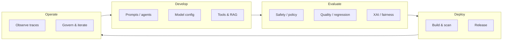
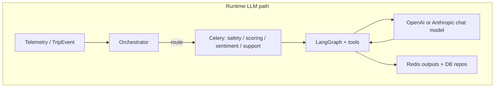
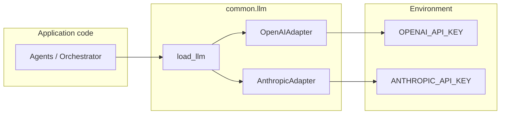
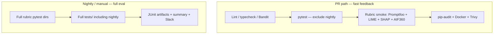
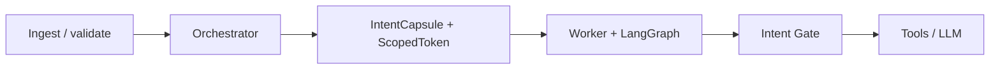
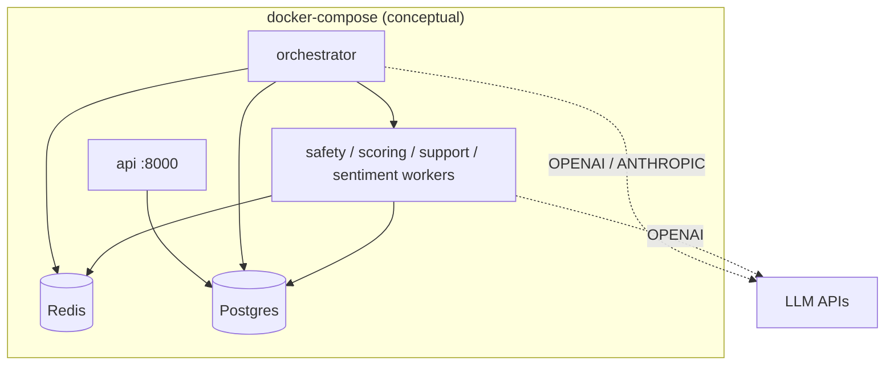
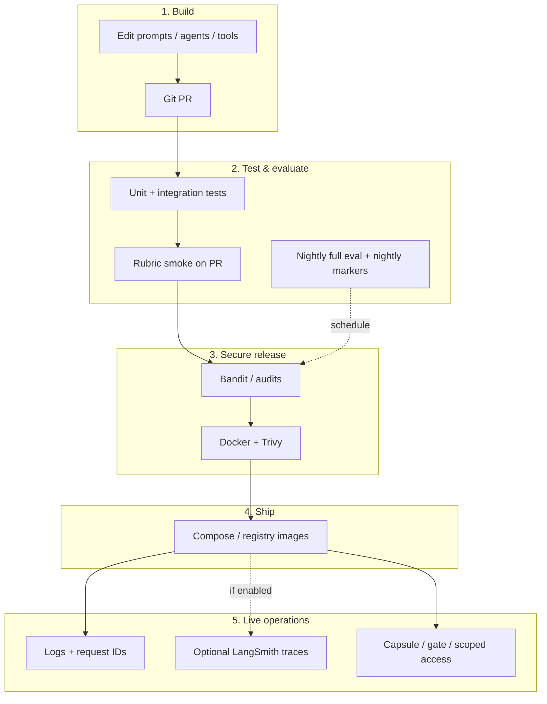

# LLMOps: Concepts and TraceData Implementation

This document explains what **LLMOps** means in practice, then maps it to how **TraceData** implements LLM lifecycle, quality gates, and operations. You can lift sections for presentations, runbooks, or design reviews.

---

## 1. What is LLMOps?

**LLMOps** is the set of practices and tooling used to **build, evaluate, deploy, monitor, and govern** applications that depend on large language models (LLMs). It extends familiar MLOps ideas with LLM-specific concerns:

| Concern | What it covers |
|--------|----------------|
| **Prompts & agents** | Versioning prompts, system instructions, tool definitions, orchestration graphs |
| **Models** | Provider choice, model IDs, fallbacks, temperature and other parameters |
| **Evaluation** | Safety, quality, fairness, explainability, regression tests on outputs |
| **Runtime** | Routing, caching, rate limits, timeouts, retries, deterministic fallbacks |
| **Security** | Secrets, least-privilege execution (capsules/tokens), output filtering, abuse resistance |
| **Observability** | Traces, token/cost metrics, drift and incident response |
| **Delivery** | CI/CD gates that block bad prompt/model/config changes |

---

## 2. TraceData at a glance (LLM usage)

TraceData uses LLMs in several places:

| Area | Role | Typical stack in repo |
|------|------|------------------------|
| **Orchestrator** | Event routing (LLM + tools + EventMatrix); deterministic fast-path for known event types | `langchain-openai` / `langchain-anthropic`, `gpt-4o-mini` or Claude Sonnet when keys are set |
| **Safety / Scoring / Support** | LangGraph tool loops with optional LLM; deterministic baselines when LLM unavailable | `load_llm(OpenAIModel.GPT_4O_MINI)` via `common.llm` |
| **Sentiment** | Heuristic scoring + optional LLM for explanations | Same factory pattern |

Non-LLM logic (rules, repositories, Redis cache warming, Celery queues) remains the backbone; LLMs augment routing and language-heavy steps.

---

## 3. How LLMOps is implemented in TraceData

### 3.1 Model access and configuration (development artifact)

- **Factory:** `common.llm.load_llm()` selects provider from model enum and returns `LLMConfig` with an adapter (`OpenAIAdapter` / `AnthropicAdapter`).
- **Secrets:** `OPENAI_API_KEY`, `ANTHROPIC_API_KEY` (and optional `OPENAI_MODEL`) come from environment / `.env`; never committed.
- **Settings:** `backend/common/config/settings.py` holds app-level AI flags (e.g. orchestrator routing fallback mode) and optional **LangSmith** fields (`langsmith_api_key`, `langsmith_project`, `langsmith_tracing` — tracing defaults to **off** until enabled).

**LLMOps takeaway:** Treat model enums, env vars, and settings as part of your **configuration surface**; document which services need which keys for staging vs production.

---

### 3.2 Prompts and agent logic (versioned with code)

- System prompts and user message builders live alongside agents (e.g. orchestrator, safety, scoring, support, sentiment).
- **LangGraph** compiles tool-loop graphs for agents that need structured tool use.
- **Orchestrator** combines **deterministic EventMatrix routing** with **LLM routing** for flexibility and testability.

**LLMOps takeaway:** Prompts are **code artifacts**; PR review and CI are the primary “prompt review” process unless you add a separate prompt registry.

---

### 3.3 Evaluation and quality gates (CI = LLMOps control plane)

TraceData uses **pytest** with markers (`xai`, `eval`, `nightly`, etc.) defined in `backend/pyproject.toml`.

**On pull requests (fast path)** — `ci-backend-api.yaml`:

- Full backend tests with **`-m "not nightly"`** so heavy matrices do not block every PR.
- **Rubric smoke** step runs a focused set:
  - Prompt / safety contracts (`tests/Promptfoo/...`)
  - LIME-style explainability (`tests/LIME/...`)
  - SHAP scoring explainability contract (`tests/SHAP/...`)
  - Fairness audit shape / AIF360-related contracts (`tests/AIF360/...`)

**On schedule / manual (deep eval)** — `ci-backend-eval-nightly.yaml`:

- Cron (e.g. nightly on `main`) + `workflow_dispatch`.
- Runs **full rubric suites** under `tests/Promptfoo`, `tests/LIME`, `tests/SHAP`, `tests/AIF360`.
- Runs **full** `pytest tests/` (includes `nightly`-marked tests).
- Uploads JUnit XML artifacts and posts a GitHub Actions summary; optional Slack notification.

**Agents pipeline** — `ci-backend-agents.yaml`:

- Lint, type-check, agent-focused tests, SCA (`pip-audit`), Docker build + **Trivy** for worker/orchestrator images.

**LLMOps takeaway:** TraceData implements a **two-tier eval strategy**: regression smoke on every API-affecting PR, and **full eval + nightly markers** for deeper fairness/XAI/prompt scale without slowing all merges.

---

### 3.4 Security within LLMOps (TraceData-specific)

LLMOps is not only “model quality”; it includes **safe execution**:

- **Intent Capsule + ScopedToken:** Orchestrator issues scoped execution contracts for Celery workers (least-privilege Redis keys, bounded tools).
- **Intent Gate:** Runtime verification (integrity, allowlists, sequencing, PII-related checks — as implemented in `backend/security/`).
- **Ingestion:** Validation, dedup, PII handling on the path **before** LLM-heavy stages.

These controls reduce prompt-injection impact and unauthorized data access even when the model misbehaves.

---

### 3.5 Observability (current and optional)

- **Structured logging** and request correlation (`RequestIdMiddleware`, typed log tokens) support operational debugging across API and agents.
- **LangSmith** settings exist in `Settings` for future or opt-in **LLM trace** export (project name default `tracedata`). Enable when you set `langsmith_tracing` and API key in deployment environments.

**LLMOps takeaway:** Full “LLM trace in production” is a **deployment choice**; the codebase is prepared via settings, but tracing is not forced on by default.

---

### 3.6 Deployment shape (Docker + Compose)

- **Local/staging:** `docker-compose.yml` runs `api`, `ingestion`, `orchestrator`, Celery workers, `frontend`, `db`, `redis`. Orchestrator and scoring worker receive LLM API keys via environment.
- **CI:** Images are built and scanned (Trivy); workflows align with **LLMSecOps** (dependency audit + container CVE gates).

---

## 4. End-to-end LLMOps story for TraceData (one diagram)

---

## 5. File and workflow reference (quick index)

| Topic | Where to look |
|-------|----------------|
| LLM factory | `backend/common/llm/factory.py`, `openai_adapter.py`, `anthropic_adapter.py` |
| Settings / LangSmith flags | `backend/common/config/settings.py` |
| PR test policy | `.github/workflows/ci-backend-api.yaml` (`-m "not nightly"`, rubric smoke step) |
| Nightly eval | `.github/workflows/ci-backend-eval-nightly.yaml` |
| Agent tests | `.github/workflows/ci-backend-agents.yaml` |
| Pytest markers | `backend/pyproject.toml` `[tool.pytest.ini_options]` |
| Prompt / XAI / fairness tests | `backend/tests/Promptfoo`, `LIME`, `SHAP`, `AIF360` |
| Orchestrator LLM routing | `backend/agents/orchestrator/agent.py` |

---

## 6. Suggested improvements (if you extend LLMOps maturity)

These are optional next steps, not current requirements:

- Turn on **LangSmith** (or equivalent) in staging/production for trace and token dashboards.
- Add explicit **prompt/version tags** in logs or metadata for replay debugging.
- Define **SLOs** for LLM latency and fallback rate (orchestrator already distinguishes deterministic vs LLM routing counts).
- Store **evaluation result baselines** in CI (compare nightly JUnit trends over time).

---

*Document generated to reflect the repository layout and workflows as of the authoring date; adjust paths if the repo structure changes.*
