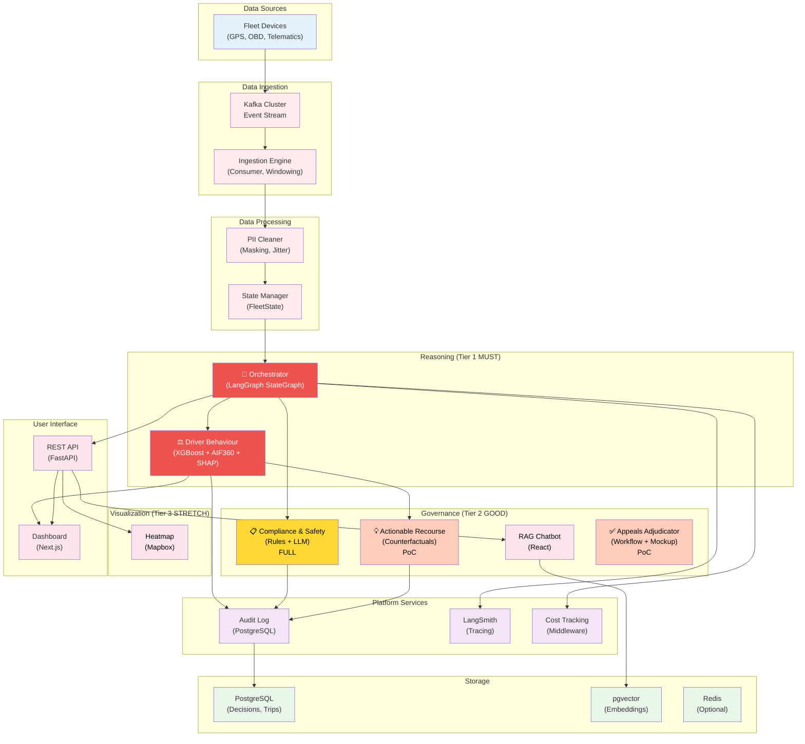
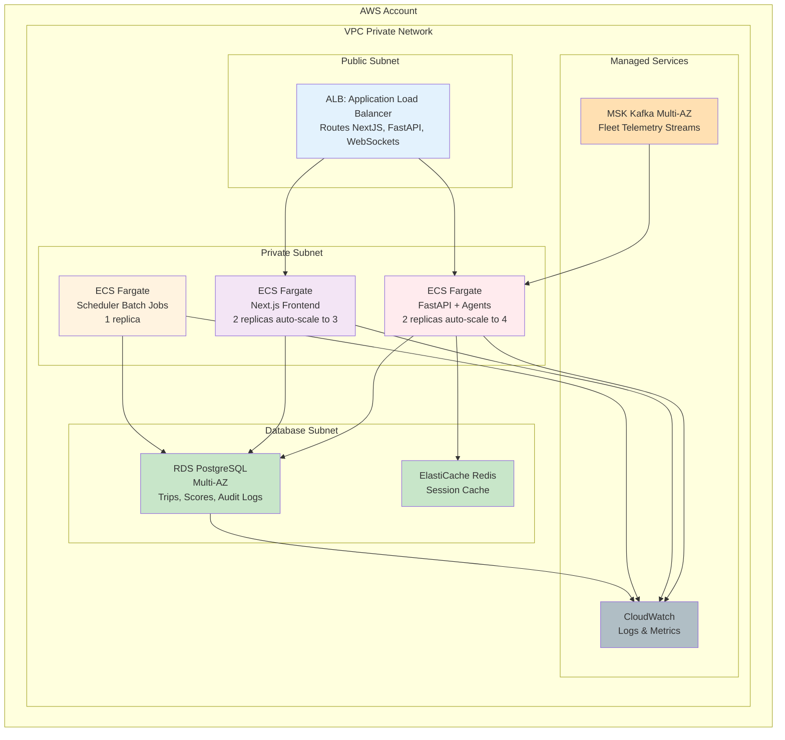

# TraceData System Architecture

Designed to support execution of the [Master Plan v2.1](master_plan.md): 7 agents across 3 tiers, ~45 person-days effort, 4-week timeline.

## Overview

TraceData is a multi-agent AI intelligence middleware system designed to attach to existing truck fleet management infrastructure. This document provides a comprehensive overview of the system architecture, technology stack, and design patterns.

## Table of Contents

1. [Architecture Layers](#architecture-layers)
2. [Technology Stack](#technology-stack)
3. [System Components](#system-components)
4. [Data Flow](#data-flow)
5. [Agent Tier Structure](#agent-tier-structure)
6. [Deployment Architecture](#deployment-architecture)
7. [Security & Observability](#security--observability)
8. [Performance Considerations](#performance-considerations)

## Architecture Layers

TraceData follows a layered architecture with clear separation of concerns:

```
┌─────────────────────────────────────────────────────────────┐
│                     USER INTERFACE LAYER                    │
│  (Web Dashboard, RAG Chat, Geo-Spatial Heatmaps, APIs)      │
├─────────────────────────────────────────────────────────────┤
│                   REASONING LAYER                           │
│  (Driver Behaviour, Compliance, Recourse, Orchestrator)     │
├─────────────────────────────────────────────────────────────┤
│                 PROCESSING LAYER                            │
│     (Ingestion, PII Cleaner, State Management)              │
├─────────────────────────────────────────────────────────────┤
│              PLATFORM INFRASTRUCTURE LAYER                  │
│     (Observability, Audit Logs, Cost Tracking, Health)      │
├─────────────────────────────────────────────────────────────┤
│                      DATA LAYER                             │
│        (Kafka, PostgreSQL, pgvector, Cache)                 │
└─────────────────────────────────────────────────────────────┘
```

### 1. Data Layer

**Purpose:** Persistent and streaming data storage

| Component        | Technology       | Purpose                                   |
| ---------------- | ---------------- | ----------------------------------------- |
| **Event Stream** | Apache Kafka     | Real-time telemetry from fleet devices    |
| **Analytics DB** | PostgreSQL       | Structured data: trips, scores, decisions |
| **Vector Store** | pgvector         | Embeddings for RAG semantic search        |
| **Cache**        | Redis (optional) | Session state, model cache                |

**Key Design Decisions:**

- Kafka for high-throughput, low-latency telemetry (IoT-style data)
- PostgreSQL for ACID compliance and audit trail immutability
- pgvector for semantic search in RAG without external dependencies

### 2. Processing Layer

**Purpose:** Ingest, validate, and prepare data for reasoning agents

| Component            | Technology              | Purpose                                          |
| -------------------- | ----------------------- | ------------------------------------------------ |
| **Ingestion Engine** | Python + Kafka Consumer | Subscribe to telemetry, batch into trip segments |
| **PII Cleaner**      | Python + Regex          | Deterministic masking before ML pipeline         |
| **State Manager**    | LangGraph               | Manage FleetState across agents                  |

**Data Flow:**

```
Kafka Stream → Validation → PII Masking → Trip Batching → FleetState
```

### 3. Reasoning Layer

**Purpose:** Multi-agent AI reasoning with coordinated inference

| Component                  | Technology              | Purpose                              |
| -------------------------- | ----------------------- | ------------------------------------ |
| **Orchestrator**           | LangGraph StateGraph    | Route requests to specialized agents |
| **Driver Behaviour Agent** | XGBoost + AIF360 + SHAP | Risk scoring + fairness correction   |
| **Compliance Agent**       | LLM + Rule Engine       | Regulatory reasoning + edge cases    |
| **Recourse Agent (PoC)**   | Python Counterfactuals  | "What-if" explanations               |

**LLM Choice:** OpenAI GPT-4o-mini

- Cost-optimized (lower token pricing)
- Fast inference (critical for real-time flows)
- Strong reasoning capability for hybrid logic

### 4. Platform Infrastructure Layer

**Purpose:** Observability, auditing, and system health

| Service           | Technology        | Purpose                                |
| ----------------- | ----------------- | -------------------------------------- |
| **Tracing**       | LangSmith         | LLM call instrumentation + debugging   |
| **Audit Logging** | PostgreSQL        | Immutable decision logs for compliance |
| **Cost Tracking** | Custom Middleware | Token usage + latency per agent        |
| **Health Checks** | Prometheus        | Alert if agents unhealthy or degraded  |

**Why Not A Separate Agent?**
These are platform-level concerns, not domain-specific reasoning. Implemented as cross-cutting middleware to avoid bloating agent count.

### 5. User Interface Layer

**Purpose:** Surface insights to fleet managers and operators

| Component               | Technology  | Purpose                                     |
| ----------------------- | ----------- | ------------------------------------------- |
| **Web Dashboard**       | Next.js     | XAI visualizations (SHAP, LIME waterfall)   |
| **RAG Chatbot**         | React       | "Why did Driver X get score Y?" Q&A         |
| **Geo-Spatial Heatmap** | Mapbox + D3 | Harsh-braking hotspots (privacy-preserving) |
| **REST API**            | FastAPI     | Third-party integrations                    |

## Technology Stack

### Backend

| Layer                  | Tool             | Justification                               |
| ---------------------- | ---------------- | ------------------------------------------- |
| **Framework**          | FastAPI (Python) | Async-first, auto-docs, minimal boilerplate |
| **Agent Coordination** | LangGraph        | StateGraph for deterministic routing        |
| **LLM Abstraction**    | LangChain        | Model-agnostic interface                    |
| **ML Model**           | XGBoost          | Interpretable, SHAP support, fast training  |
| **Fairness**           | AIF360           | Industry-standard bias detection/correction |
| **Explainability**     | SHAP + LIME      | Course-aligned, production-proven           |
| **Security Testing**   | Promptfoo        | 100+ adversarial tests for LLM injection    |
| **Code Security**      | Bandit           | Static analysis for Python vulnerabilities  |

### Database & Storage

| Tool                 | Purpose                                     | Rationale                                              |
| -------------------- | ------------------------------------------- | ------------------------------------------------------ |
| **PostgreSQL**       | Structured data (trips, scores, audit logs) | ACID compliance, JSON support, window functions        |
| **pgvector**         | Semantic search for RAG                     | Eliminates external vector DB dependency               |
| **Kafka**            | Event streaming (fleet telemetry)           | High throughput, partitioned topics, replay capability |
| **Redis (Optional)** | Session cache + model weights               | Fast in-memory access for real-time scoring            |

### Frontend

| Tool          | Purpose                                                  |
| ------------- | -------------------------------------------------------- |
| **Next.js**   | Server-side rendering, API routes, deployment simplicity |
| **React**     | Interactive dashboards, real-time updates                |
| **Plotly/D3** | SHAP waterfall, LIME local explanations                  |
| **Mapbox**    | Geographic heatmap rendering                             |

### DevOps & Deployment

| Tool                   | Purpose                            |
| ---------------------- | ---------------------------------- |
| **Docker**             | Containerized agents + services    |
| **AWS ECS Fargate**    | Serverless container orchestration |
| **GitHub Actions**     | CI/CD: lint → test → deploy        |
| **Terraform (Future)** | Infrastructure as Code             |

## Agent Tier Structure

TraceData is built on **7 agents across 3 tiers**, strictly aligned with execution credibility and realistic scope.

### Tier 1: MUST (Core Backbone — 4 Agents)

**Status:** Fully committed implementation  
**Effort:** ~15-20 person-days (~4-5 days per person)  
**Success Criteria:** Pipeline operational, fairness detected, system stable

| Agent                | Technology              | Module Alignment                         | Risk   | Purpose                                                           |
| -------------------- | ----------------------- | ---------------------------------------- | ------ | ----------------------------------------------------------------- |
| **Ingestion Engine** | Kafka Consumer (Python) | Module 4: MLSecOps                       | 6.0/10 | Subscribe to live fleet telemetry, batch into trip segments       |
| **PII Cleaner**      | Python Regex + Jitter   | Module 2: Cybersecurity                  | 3.0/10 | Deterministic masking (zero-LLM), spatial jittering               |
| **Driver Behaviour** | XGBoost + AIF360 + SHAP | Module 1: XRAI/Fairness                  | 6.5/10 | Risk scoring, bias detection & correction, feature importance     |
| **Orchestrator**     | LangGraph StateGraph    | Module 3: Agentic AI, Module 4: MLSecOps | 7.5/10 | Multi-agent coordination, deterministic routing, state management |

**Platform Observability (Infrastructure, Not An Agent)**

- LangSmith: LLM call instrumentation
- Audit Logging: Immutable decision logs (PostgreSQL)
- Cost Tracking: Token usage + latency per agent
- Health Checks: System alerts on degradation

### Tier 2: GOOD (Governance & Excellence — 2 Full + 2 PoCs)

**Status:** Full implementations + conceptual proofs  
**Effort:** ~20-26 person-days (~5-7 days per person additional)

#### 2a. Full Implementations (16-20 days)

| Agent                   | Technology                    | Module Alignment                                             | Risk   | Purpose                                                            |
| ----------------------- | ----------------------------- | ------------------------------------------------------------ | ------ | ------------------------------------------------------------------ |
| **Compliance & Safety** | Rule Engine + LLM + STRIDE    | Module 2: Cybersecurity, Module 3: Hybrid Reasoning          | 6.5/10 | HOS rules, LLM edge-case reasoning, threat modeling                |
| **RAG Assistant**       | LangChain + pgvector + OpenAI | Module 2: Prompt Security, Module 4: Stakeholder Interaction | 5.5/10 | Fleet manager Q&A, 3-layer security (regex → LLM → Moderation API) |

#### 2b. Proof-of-Concept Implementations (4-6 days)

| Agent (PoC)             | Technology                         | Module Alignment            | Risk   | Purpose                                                                               |
| ----------------------- | ---------------------------------- | --------------------------- | ------ | ------------------------------------------------------------------------------------- |
| **Actionable Recourse** | Python Counterfactuals             | Module 1: Fairness Recourse | 4.0/10 | Simple counterfactual: "If harsh_braking -2, score crosses threshold" (NOT full DiCE) |
| **Appeals Adjudicator** | Workflow Documentation + UI Mockup | Module 1: HITL Governance   | 3.0/10 | Document HITL workflow, basic mockup for decision review                              |

### Tier 3: NICE (Stretch Goal — 1 Agent)

**Status:** Optional, if time/energy permits  
**Effort:** ~3-4 person-days (deferred)

| Agent                        | Technology                   | Module Alignment      | Purpose                                                              |
| ---------------------------- | ---------------------------- | --------------------- | -------------------------------------------------------------------- |
| **Geo-Spatial Intelligence** | Mapbox + D3 + Privacy Jitter | Module 1: Spatial XAI | Heatmaps of harsh-braking hotspots, privacy-preserving visualization |

## System Components

### Component Interaction Diagram



### Tier Execution Strategy

**Week 1 Critical Path:** Ingestion → PII → Orchestrator (12 days)  
**Week 2-3 Block:** Driver Behaviour + Compliance + RAG (22-25 days)  
**Week 3 Stretch:** PoCs + Geo-Spatial if time permits (7-8 days)  
**Week 4 Validation:** Testing + individual reports (8 days)

---

## Data Flow

### Critical Path: Trip Scoring

```
1. Telemetry Event (from device)
   └─ GPS, RPM, braking force, HOS time, etc.

2. Ingest & Batch (Ingestion Engine)
   └─ Kafka consumer aggregates into trip_segment

3. PII Masking (PII Cleaner)
   └─ Regex: strip driver name/ID
   └─ Jitter: reduce GPS precision to ±100m

4. Orchestrator Routes
   └─ Receives cleaned trip_data
   └─ Dispatches to Driver Behaviour Agent

5. Driver Behaviour Scores
   └─ XGBoost model: harsh_braking, speed_variance, hos_compliance
   └─ AIF360 fairness check: detect demographic bias
   └─ SHAP explains why score = 0.68

6. Store Results
   └─ PostgreSQL: trip record + score + audit log
   └─ Kafka: publish risk_event for downstream consumers

7. RAG Chatbot Answers
   └─ Semantic search in pgvector: find similar trips
   └─ LLM generates: "Driver scored low due to speed variance"
```

### Module Alignment (SWE5008 Rubric)

| Module                     | Implementation Evidence                                                 | Agents                                          |
| -------------------------- | ----------------------------------------------------------------------- | ----------------------------------------------- |
| **Mod 1: XRAI & Fairness** | AIF360 bias detection + SHAP explanations + counterfactual recourse PoC | Driver Behaviour, Actionable Recourse, Appeals  |
| **Mod 2: Cybersecurity**   | PII masking (PDPA) + STRIDE threat modeling + prompt injection defense  | PII Cleaner, Compliance & Safety, RAG Assistant |
| **Mod 3: Agentic AI**      | LangGraph coordination + hybrid rules+LLM reasoning                     | Orchestrator, Compliance & Safety               |
| **Mod 4: MLSecOps**        | Kafka streaming + LangSmith tracing + audit logging + cost tracking     | Ingestion Engine, Platform Observability        |

| Operation             | Latency Budget | Reason                         |
| --------------------- | -------------- | ------------------------------ |
| **Ingestion → Score** | < 2 sec        | Near real-time for dashboards  |
| **PII Masking**       | < 100 ms       | High throughput, deterministic |
| **XGBoost Inference** | < 500 ms       | Batched predictions            |
| **SHAP Explanation**  | < 1 sec        | Background job acceptable      |
| **Compliance Rules**  | < 200 ms       | Blocking decision path         |

## Agent Tier Structure

### Tier 1: Core Backbone (MUST)

- **Ingestion Engine** → data pipeline foundation
- **PII Cleaner** → security checkpoint
- **Driver Behaviour** → core ML reasoning
- **Orchestrator** → multi-agent coordinator

**Effort:** ~15-20 person-days  
**Blockers:** None (independent implementation)

### Tier 2: Governance & Excellence (GOOD)

- **Compliance & Safety** (Full) → regulatory reasoning
- **RAG Assistant** (Full) → stakeholder communication
- **Actionable Recourse** (PoC) → fairness recourse demo
- **Appeals Adjudicator** (PoC) → HITL workflow

**Effort:** ~20-26 person-days  
**Blockers:** Depends on Tier 1 outputs

### Tier 3: Stretch Goal (NICE)

- **Geo-Spatial Intelligence** → heatmap visualization

**Effort:** ~3-4 person-days if time permits

## Deployment Architecture



### Local Development

```bash
docker-compose up

# Brings up:
# - PostgreSQL (localhost:5432)
# - Redis (localhost:6379)
# - Kafka (localhost:9092)
# - FastAPI (localhost:8000)
# - Next.js (localhost:3000)
# - Minio (localhost:9000, S3-compatible storage)
```

## Security & Observability

### Security Layers

1. **Data Privacy (PII Cleaner)**
   - Regex masking: driver names, IDs
   - Spatial jittering: GPS ±100m
   - Deterministic (zero-LLM): reproducible masking

2. **Prompt Security (RAG)**
   - Layer 1: Input regex (block known injection patterns)
   - Layer 2: LLM guardrails (system prompt constraints)
   - Layer 3: Moderation API (OpenAI Moderation)

3. **Access Control**
   - API key authentication (for third-party integrations)
   - JWT for web dashboard (future: OAuth2)
   - Database-level row-level security (future)

### Observability Stack

| Concern           | Tool              | Implementation                                 |
| ----------------- | ----------------- | ---------------------------------------------- |
| **LLM Tracing**   | LangSmith         | Every LLM call logged with inputs/outputs/cost |
| **Audit Trail**   | PostgreSQL        | Immutable append-only decision log             |
| **Cost Tracking** | Custom Middleware | Token usage, latency P95 per agent             |
| **Logs**          | CloudWatch        | Structured JSON logs from all services         |
| **Metrics**       | Prometheus        | Agent latency, cache hit rates, error rates    |
| **Alerts**        | SNS/Email         | Trips > 10min latency, fairness metrics drift  |

### Monitoring Dashboard (Future)

- Fairness metrics (demographic parity, equalized odds) trend over time
- Model performance (AUC, recall, precision) for drift detection
- Cost breakdown: tokens/dollar per agent per month
- Error rate: deployment rollback triggers on >5% failure rate

## Performance Considerations

### Scalability

| Component     | Throughput                      | Scaling Strategy                                |
| ------------- | ------------------------------- | ----------------------------------------------- |
| **Kafka**     | 100K+ msgs/sec                  | Multiple partitions = parallel consumers        |
| **Ingestion** | ~500 trips/sec (batched)        | Horizontal: run multiple consumer replicas      |
| **XGBoost**   | ~10K inferences/sec (batch 100) | GPU acceleration (optional), model quantization |
| **LLM API**   | Rate limited by OpenAI          | Request queuing + exponential backoff           |
| **DB**        | RDS t3.medium ~ 500 TPS         | Upgrade to t3.large if CPU > 80%                |

### Optimization Techniques

1. **Model Caching**
   - XGBoost model loaded once at startup
   - SHAP explanations cached for 1 hour

2. **Batch Processing**
   - Kafka consumer batches 100 trips every 30 sec
   - SHAP batch mode (simultaneous feature importance)

3. **Async Processing**
   - RAG embeddings computed async after trip stored
   - Compliance checks don't block main scoring pipeline

4. **Connection Pooling**
   - FastAPI: SQLAlchemy connection pool (min=5, max=20)
   - Kafka producer: batch.size=1024 bytes

### Resource Allocation (ECS Fargate)

| Service           | CPU (vCPU) | Memory (GB) | Replicas           |
| ----------------- | ---------- | ----------- | ------------------ |
| FastAPI + Agents  | 2          | 4           | 2 (autoscale to 4) |
| Next.js Frontend  | 1          | 2           | 2 (autoscale to 3) |
| Scheduler (batch) | 0.5        | 1           | 1                  |

## Future Architecture Improvements

1. **Model Training Pipeline**
   - Weekly retraining of XGBoost with new labels
   - A/B testing framework for model versions

2. **Distributed Tracing**
   - OpenTelemetry + Jaeger for cross-service spans

3. **Feature Store**
   - Tecton or Feast for feature versioning & serving

4. **Canary Deployments**
   - Route 5% traffic to new agent version, monitor metrics

5. **Kubernetes Migration**
   - ECS → EKS for multi-region deployment

---

**Document Version:** 1.0  
**Last Updated:** March 2026  
**Maintained By:** TraceData Architecture Team
