# 🚛 TraceData — Master Plan v2

**AI Intelligence Middleware for Fleet Management**

**SWE5008 Capstone Project | NUS-ISS Graduate Certificate in Architecting AI Systems**

**Team Size:** 4 members  
**Duration:** 4 weeks (26 Aug – 24 Oct)  
**Total Effort:** 50-55 person-days (~12-14 days per person)  
**Target Grade:** A+

---

## 1. Executive Summary

TraceData is an AI intelligence middleware system that attaches to existing fleet management infrastructure (TMS/FMS/ELD) to deliver **predictive, explainable, and fair decision-making capabilities** without requiring a rip-and-replace migration.

**The Problem:** Fleet systems handle operational logging (GPS, hours, fuel) but lack semantic reasoning, actionable explainability, and governance mechanisms.

**The Solution:** A multi-agent LangGraph system ingesting Kafka telemetry, detecting driver bias, predicting vehicle failures, ensuring regulatory compliance, and providing stakeholder-facing explanations—all with strict MLSecOps observability and IMDA MAIGF alignment.

**Key Differentiators Over EchoChamber:**

- ✅ **Actionable fairness recourse** (counterfactual coaching, not just detection)
- ✅ **Explicit HITL appeals process** (procedural fairness governance)
- ✅ **User-facing XAI** (LIME/SHAP in dashboards, not just tests)
- ✅ **3-framework governance** (IMDA MAIGF + GenAI Framework + FEAT)
- ✅ **Real ML model + MLOps** (XGBoost + MLflow, not pure LLM wrappers)

---

## 2. Agent Architecture — Tiered Prioritization

Based on the Architecturally Significant Requirements (ASR) framework, agents are prioritized by **operational credibility** (Tier 1), **excellence depth** (Tier 2), and **optional features** (Tier 3).

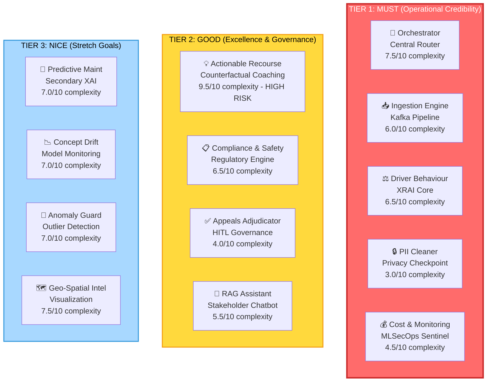

### 2.1 Tier 1: MUST (5 Agents)

**Non-negotiable operational backbone. Satisfies baseline SWE5008 rubric.**

| Agent                 | Owner | Function                                                | ASR Impact      | Tech Diff | Notes                                                 |
| --------------------- | ----- | ------------------------------------------------------- | --------------- | --------- | ----------------------------------------------------- |
| **Orchestrator**      | Sree  | Multi-agent coordination via LangGraph StateGraph       | F🔴 Q🔴 C🔴 R🔴 | 7.5/10    | Central hub. Deterministic routing (no LLM overhead). |
| **Ingestion Engine**  | P2    | Kafka consumer + trip segment batching                  | F🔴 Q🔴 C🔴 R🟠 | 6.0/10    | Real-time streaming (Module 4 baseline).              |
| **Driver Behaviour**  | Sree  | XGBoost scoring + AIF360 fairness + SHAP explainability | F🔴 Q🔴 C🔴 R🔴 | 6.5/10    | Core XRAI engine (Module 1 proof point).              |
| **PII Cleaner**       | P3    | Deterministic regex masking + GPS jittering             | F🔴 Q🔴 C🔴 R🟡 | 3.0/10    | Privacy-first checkpoint (IMDA mandate).              |
| **Cost & Monitoring** | P4    | LangSmith tracing + audit logging + token cost tracking | F🔴 Q🔴 C🔴 R🟡 | 4.5/10    | MLSecOps observability (Module 4 core).               |

**Effort:** ~23 days (~6 days per person)  
**Critical Path:** Ingestion → PII → Orchestrator (5-6 days blocking)

---

### 2.2 Tier 2: GOOD (4 Agents)

**Excellence proof points. A+ differentiators. Safe to pick (depend on Tier 1).**

| Agent                   | Owner | Function                                                      | ASR Impact      | Tech Diff | Notes                                                                                      |
| ----------------------- | ----- | ------------------------------------------------------------- | --------------- | --------- | ------------------------------------------------------------------------------------------ |
| **Actionable Recourse** | Sree  | Counterfactual "what-if" coaching via Alibi/DiCE              | F🟠 Q🔴 C🟠 R🔴 | 9.5/10    | **HIGH RISK.** Week 1-2 prototype, go/no-go call. Fallback: deeper Driver Behaviour + RAG. |
| **Compliance & Safety** | P3    | Hybrid rules + LLM reasoning + STRIDE threat model            | F🟠 Q🔴 C🔴 R🟠 | 6.5/10    | Module 2 (cybersecurity) + Module 3 (hybrid agentic).                                      |
| **Appeals Adjudicator** | P4    | HITL workflow for disputed scores. Audit trail.               | F🟠 Q🔴 C🔴 R🟡 | 4.0/10    | IMDA procedural fairness pillar. Module 1 governance.                                      |
| **RAG Assistant**       | P4    | Conversational Q&A with source attribution + 3-layer security | F🟠 Q🟡 C🔴 R🟠 | 5.5/10    | IMDA Stakeholder Interaction pillar. User-facing XAI.                                      |

**Effort:** ~24 days (~6-7 additional days per person)  
**Dependency:** All safe to pick (depend only on Tier 1, which is guaranteed)

---

### 2.3 Tier 3: NICE (4 Agents)

**Secondary features. Stretch goals. Deferred without penalty.**

| Agent                 | Owner | Function                                          | Complexity | Notes                                                                |
| --------------------- | ----- | ------------------------------------------------- | ---------- | -------------------------------------------------------------------- |
| **Predictive Maint**  | P2    | ML failure prediction + SHAP explanations         | 7.0/10     | Redundant for rubric (XAI already in Driver Behaviour). Week 3 only. |
| **Concept Drift**     | P3    | Distribution shift monitoring + retraining alerts | 7.0/10     | Complementary to Cost & Monitoring. Optional.                        |
| **Anomaly Guard**     | P2    | Isolation Forest outlier detection                | 7.0/10     | Secondary defense. Optional.                                         |
| **Geo-Spatial Intel** | P4    | Heatmaps + privacy-preserving GPS aggregation     | 7.5/10     | Visualization polish. Optional.                                      |

**Effort:** ~28 days if all built (pick 0-1 max)

---

## 3. Agent Dependency Graph

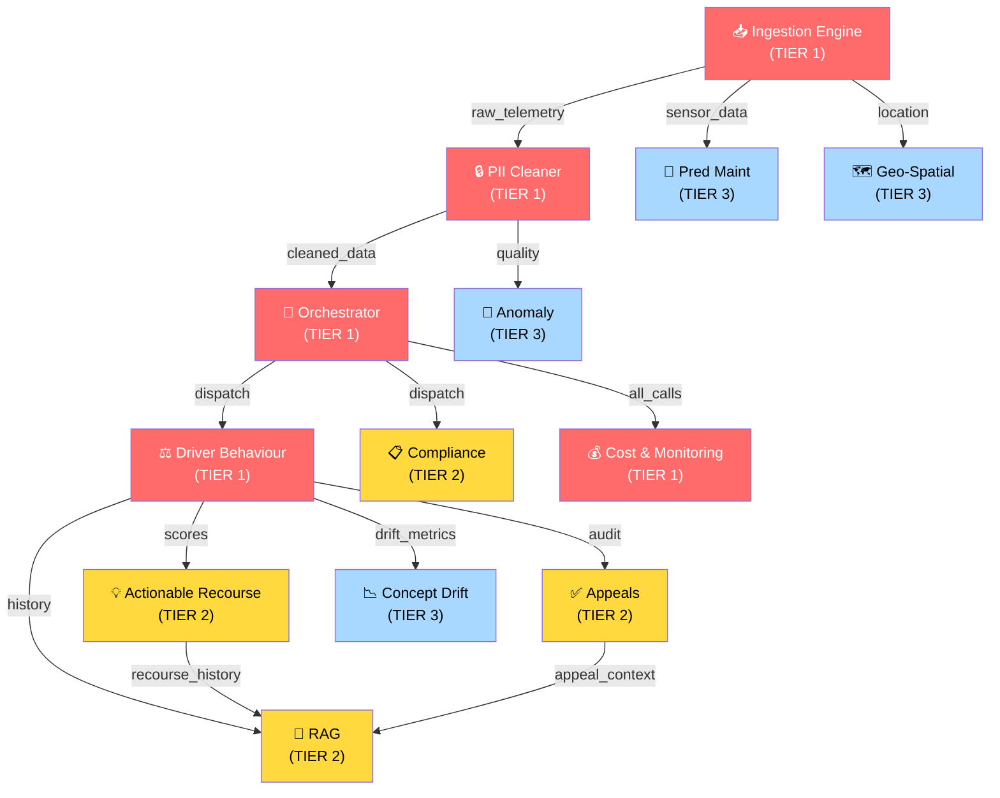

### Key Insights

- **Hard dependencies:** Ingestion → PII → Orchestrator only
- **All other agents** depend on Tier 1 (safe to parallelize Week 2)
- **Tier 3 agents** have zero downstream dependencies (can be deferred)
- **Driver Behaviour** is the bottleneck (5 agents depend on it, but it only depends on Orchestrator)

---

## 4. Implementation Timeline

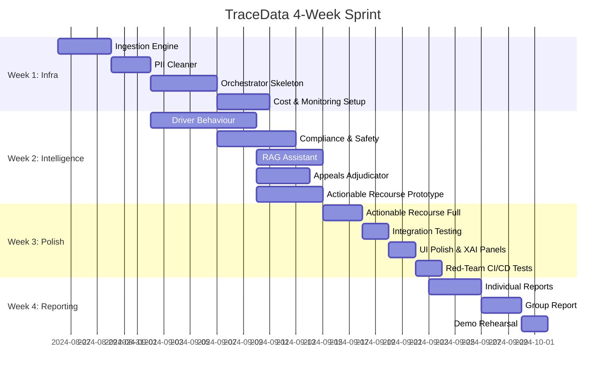

### Phase Breakdown

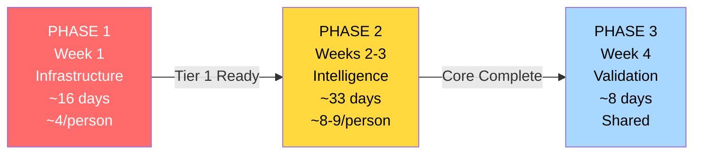

---

## 5. Team Ownership & Individual Reports

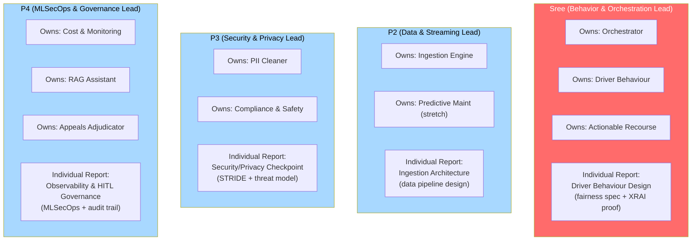

| Owner    | Primary Agent     | Secondary Agents                  | Effort   | Individual Report Focus                                 |
| -------- | ----------------- | --------------------------------- | -------- | ------------------------------------------------------- |
| **Sree** | Driver Behaviour  | Orchestrator, Actionable Recourse | ~18 days | Fairness specification (AIF360 + SHAP + Module 1 proof) |
| **P2**   | Ingestion Engine  | Predictive Maint (stretch)        | ~9 days  | Data pipeline architecture (streaming + schema)         |
| **P3**   | PII Cleaner       | Compliance & Safety               | ~9 days  | Security checkpoint design (STRIDE threat model)        |
| **P4**   | Cost & Monitoring | RAG, Appeals                      | ~13 days | Observability & governance (audit logging + HITL)       |

---

## 6. SWE5008 Rubric Coverage (Per Module)

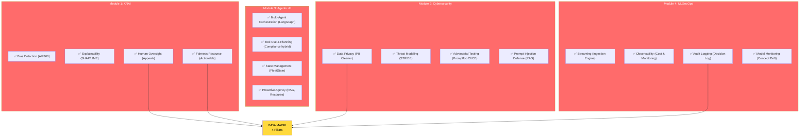

**Coverage:** All 4 modules fully satisfied by Tier 1 + Tier 2 agents. Tier 3 adds optional depth.

---

## 7. Risk Mitigation

### Actionable Recourse (The Wild Card)

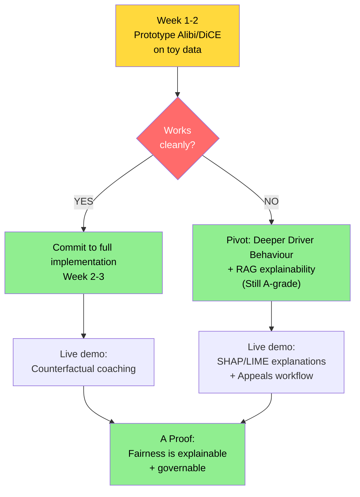

**Execution Strategy:**

1. **Week 1 Day 4-5:** Sree prototypes Alibi/DiCE with 3-5 toy drivers
2. **Week 2 Day 1:** Go/no-go decision call (team sync)
3. **If GO:** Full implementation Week 2-3
4. **If NO-GO:** Sree pivots to deepening Driver Behaviour + RAG (test contrastive explanations, fairness sandboxes)

**Outcome:** Either way, A-grade minimum guaranteed.

---

### Other Risks

| Risk                                | Severity | Mitigation                                                                                                   |
| ----------------------------------- | -------- | ------------------------------------------------------------------------------------------------------------ |
| Scope creep (8→13 agents feels big) | HIGH     | Each agent has MVP scope. Cut fancy features, keep core logic. Tier 1 is non-negotiable; Tier 2/3 are picks. |
| LLM API costs                       | MEDIUM   | Aggressive mocking in tests. Cost caps per agent. Use GPT-4o-mini where possible.                            |
| Team member falls behind            | HIGH     | Bi-weekly progress reports. Clear ownership. Agents are loosely coupled (can be built independently).        |
| AWS deployment issues               | MEDIUM   | Docker Compose local fallback for demo. Deploy early (Week 3), not last minute.                              |
| ML model doesn't perform well       | MEDIUM   | Focus on XAI (SHAP/LIME), not accuracy. The proof point is interpretability, not Kaggle medals.              |

---

## 8. Pre-Deployment Adversarial Testing (CI/CD)

Adversarial testing is handled in GitHub Actions, **not as a runtime agent**, to reduce architectural complexity while proving Module 2 competency.

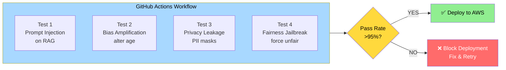

**Acceptance Criteria:** >95% pass rate (matches EchoChamber baseline)

---

## 9. Live Demo Scenario (Week 4, ~5 Minutes)

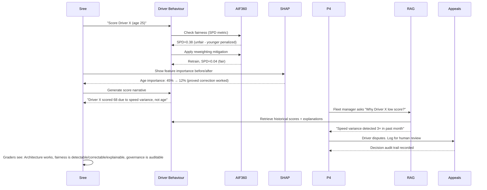

**Talking Points:**

- Statistical Parity Difference metric (Module 1)
- AIF360 reweighting (fairness correction, not just detection)
- SHAP validation (explainability proves correction worked)
- User-facing RAG explanation (IMDA Stakeholder Interaction)
- Appeals audit trail (procedural fairness governance)

---

## 10. Deliverables Checklist

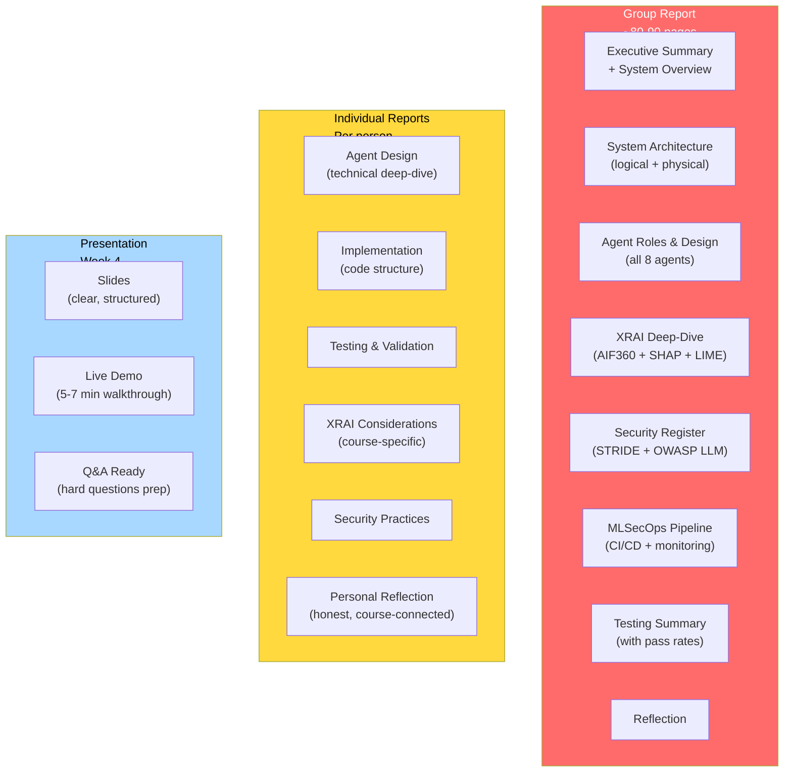

---

## 11. Assessment Weight & Grade Mapping

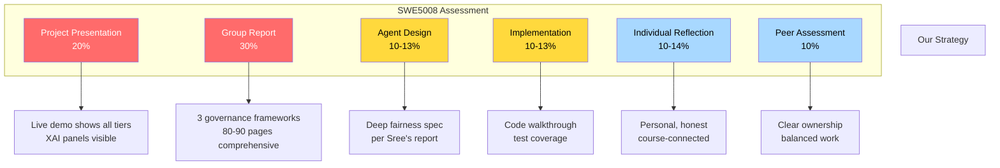

**Mapping:** Every assessment component has a clear TraceData proof point.

---

## 12. The EchoChamber Comparison

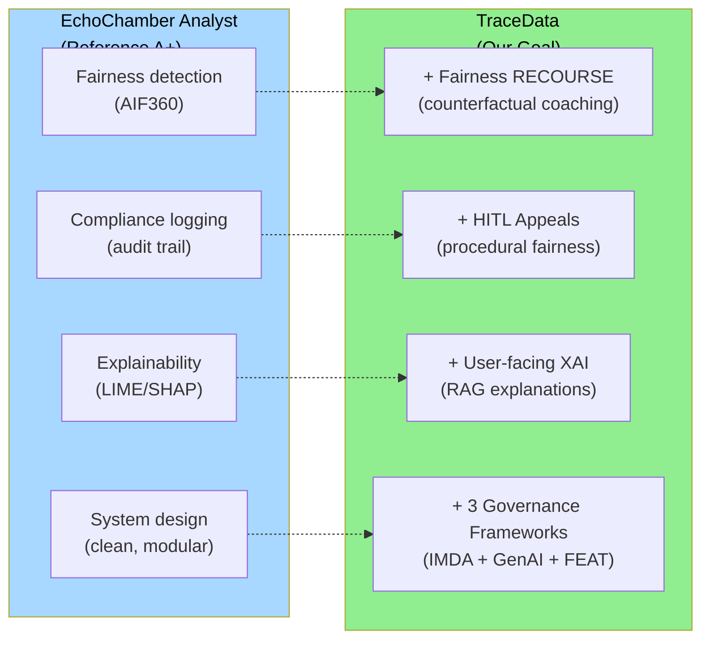

**Key Improvement:** We don't just detect bias; we help drivers improve.

---

## 13. Key Dates & Milestones

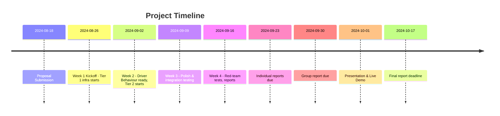

---

## 14. Success Criteria (A+ Outcome)

| Dimension               | A+ Proof                                    | Our Strategy                                                 |
| ----------------------- | ------------------------------------------- | ------------------------------------------------------------ |
| **Rubric Mastery**      | All 4 modules + IMDA covered                | Explicit mapping table. Every agent touches 1-2 modules.     |
| **System Quality**      | Working end-to-end pipeline                 | Tier 1 guaranteed; Tier 2 optional but likely.               |
| **XRAI Excellence**     | Fairness is actionable, not just detectable | Actionable Recourse (if viable) or Appeals + RAG (fallback). |
| **Security Rigor**      | STRIDE + OWASP systematically addressed     | Risk register. CI/CD red-team tests >95% pass.               |
| **Governance Maturity** | Audit trail, HITL, source attribution       | Appeals + Cost & Monitoring + RAG source links.              |
| **XAI in Practice**     | Users see explanations in real time         | LIME/SHAP panels in dashboards. RAG cites sources.           |
| **Honest Reflection**   | Learning, not just technical output         | Individual reports name specific lectures + concepts.        |

---

## 15. Quick Start (Week 1 Day 1)

1. **GitHub repo setup** (fork template, folder structure)
2. **Dev environment** (Python 3.11, PostgreSQL 15, Redis, Docker Compose)
3. **Kafka simulator** (Python producer, toy telemetry generator)
4. **LangGraph skeleton** (StateGraph with 3 nodes: dispatch, orchestrate, aggregate)
5. **Shared state schema** (FleetState, AgentMessage protocol)
6. **First commit:** "Infrastructure ready. All agents can start building."

---

## 16. The Pitch to Your Team

> "We're building 9-11 agents across 3 tiers. Tier 1 (5 agents) is infrastructure—we all own it together. Tier 2 (4 agents) is excellence—you pick your specialty (fairness, security, governance, or UI). Tier 3 (4 agents) is bonus if we have energy.
>
> Each person has 1 primary agent for the individual report. Clear ownership. Parallel execution. No bottlenecks.
>
> The difference between A and A+? We don't just detect fairness; we help drivers improve. We don't just log decisions; we explain them to stakeholders. We don't just follow frameworks; we map all 3 (IMDA + GenAI + FEAT).
>
> Let's build an A+."

---

**This is your master plan. Everything is decided. You're ready to execute.**
