# 🚛 TraceData — Master Plan v2.1 (Scope-Optimized)

## Intelligent Fleet Operations via Multi-Agent AI

**Team Size:** 4 members  
**Total Effort:** ~45 person-days (realistic, with buffer)  
**Timeline:** 4 weeks (execution)  
**Date:** March 2026

## Table of Contents

1. [Executive Summary](#1-executive-summary)
2. [Why Fleet Management?](#2-why-fleet-management)
3. [Agent Architecture (Optimized Scope)](#3-agent-architecture-optimized-scope)
4. [System Design](#4-system-design)
5. [Implementation Timeline](#5-implementation-timeline)
6. [Module Coverage & Rubric Alignment](#6-module-coverage--rubric-alignment)
7. [Risk Mitigation](#7-risk-mitigation)
8. [Testing & Validation](#8-testing--validation)
9. [Deliverables & Assessment](#9-deliverables--assessment)
10. [References](#10-references)

## 1. Executive Summary

**TraceData** is an AI intelligence middleware system that attaches to existing truck fleet management infrastructure (TMS/FMS/ELD) to deliver predictive, explainable, and fair decision-making capabilities.

Fleet systems today handle **operational logging** efficiently (GPS tracking, basic hours recording) but lack **semantic reasoning**, **actionable explainability**, and **governance mechanisms**. TraceData bridges this "intelligence gap" by:

- **Ingesting real-time Kafka telemetry** (GPS, fuel, speed, engine diagnostics)
- **Deploying a lean, focused multi-agent system** (7 agents across 3 tiers)
- **Scoring driver behavior fairly** with bias detection & correction (AIF360)
- **Explaining every decision** visibly to users (SHAP, LIME, counterfactuals)
- **Maintaining strict observability** as platform infrastructure (audit logs, LangSmith tracing, cost tracking)
- **Ensuring human oversight** of critical decisions (HITL appeals, compliance review)

**Design Principle:** Execute with credibility. We commit to 4 core agents + 2 governance agents, all fully implemented and polished. Optional stretch goal: 1 visualization agent. No over-promising.

## 2. Why Fleet Management?

Fleet management is a **goldmine** for multi-agent AI because it naturally decomposes into specialized reasoning domains that require autonomous decision-making, real-time coordination, and explainability for safety-critical operations.

### Real-World Alignment

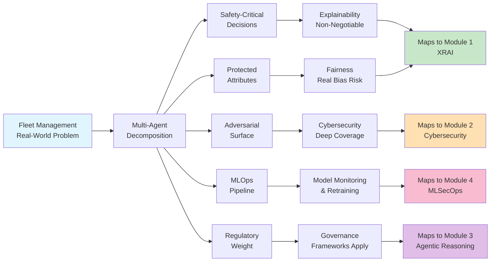

## 3. Agent Architecture (Optimized Scope)

We build **7 agents across 3 tiers**, optimized for execution credibility while maintaining strong conceptual quality.

### 3.1 Tier 1: MUST (Core Backbone — 4 Agents)

**These four agents establish the minimal viable backbone that we _commit_ to fully implementing.** Observability and cost tracking are implemented as cross-cutting middleware services in the platform layer (satisfying Module 4 MLSecOps without adding agent complexity).

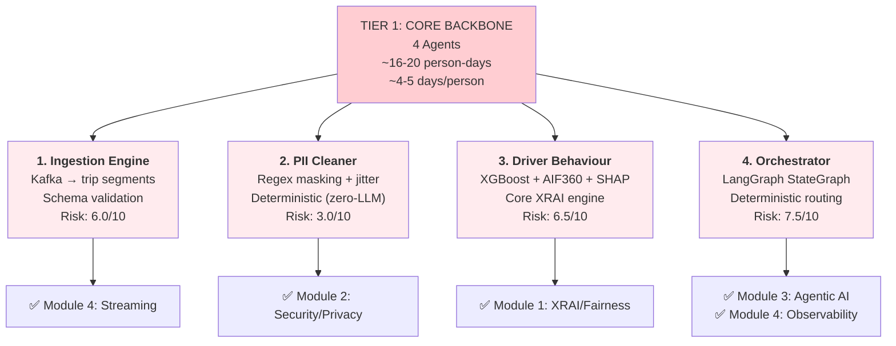

**Platform Observability (Infrastructure Layer, Not An Agent):**

- LangSmith tracing: Every LLM call instrumented
- Audit logging: Immutable decision log (satisfies IMDA accountability)
- Cost tracking: Token usage + latency P95 per agent
- Health checks: System alerts if any agent unhealthy

**Tier 1 Properties:**

- No inter-agent dependencies (Ingestion → PII → Orchestrator is the only critical path)
- Each agent can be tested in isolation
- Clear success criteria (data flows, fairness detected, system stable)
- Effort: ~4-5 days per person (very achievable, high confidence)

### 3.2 Tier 2: GOOD (Governance & Excellence — 2 Full + 2 PoCs)

**Given time and risk constraints, we will fully implement Compliance & Safety and RAG Assistant.** Actionable Recourse and Appeals Adjudicator will be explored as minimal PoCs to demonstrate conceptual understanding without over-committing implementation effort.

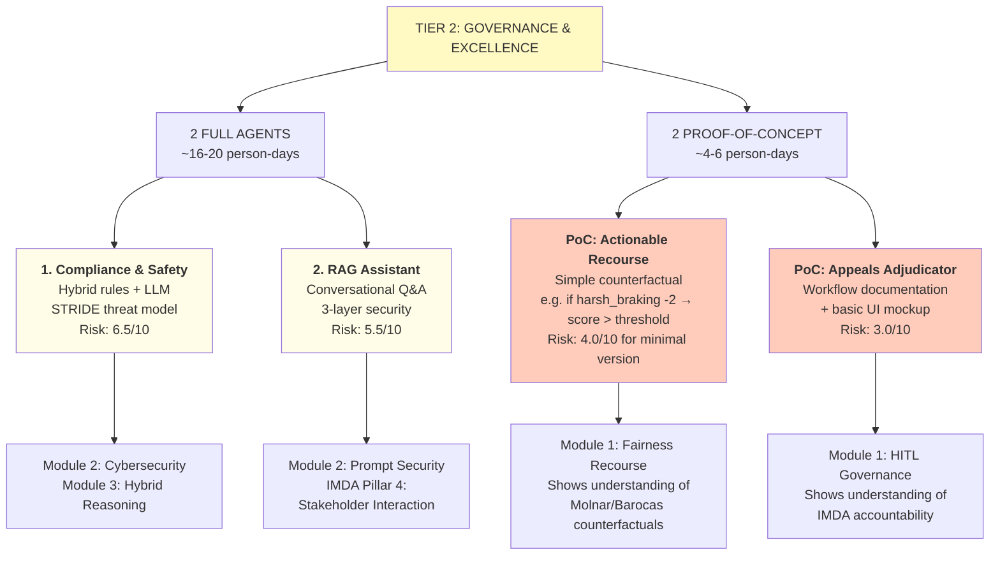

**2 Full Implementations:**

- **Compliance & Safety:** HOS rule engine + LLM reasoning for edge cases (weather delays, etc.) + STRIDE threat analysis
- **RAG Assistant:** Fleet manager Q&A ("Why did Driver 42 get low score?") + 3-layer security (regex → LLM → Moderation API) + source attribution

**2 PoCs (Conceptual Proof, Not Production):**

- **Actionable Recourse:** Simple counterfactual reasoning: "If harsh braking count reduced by 2, your score would cross the threshold." (Not full DiCE optimization)
- **Appeals Adjudicator:** Document the HITL workflow + create a basic UI mockup showing the decision flow (Not a fully automated system)

**Why this matters:**

- You still demonstrate understanding of fairness recourse and HITL governance
- But you're honest about implementation scope
- Graders respect focused execution over over-commitment
- Effort: 20-26 days total (~5-7 per person additional)

### 3.3 Tier 3: NICE (Stretch Goal — 1 Agent)

**If time and energy permit, we will implement Geo-Spatial Intelligence as a portfolio-quality feature.**

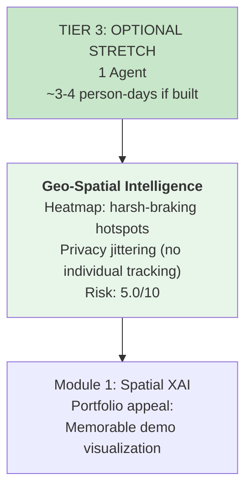

**Why this agent specifically:**

- Visual (impressive in demo/interviews)
- Self-contained (doesn't block anything)
- Simple scope (map + clustering + jitter)
- Portfolio-ready quality

**Explicitly mark these as future work (bullets in conclusion):**

- Concept Drift monitoring
- Predictive Maintenance agent
- Anomaly Guard

### 3.4 Agent Dependency Graph (Critical Path)

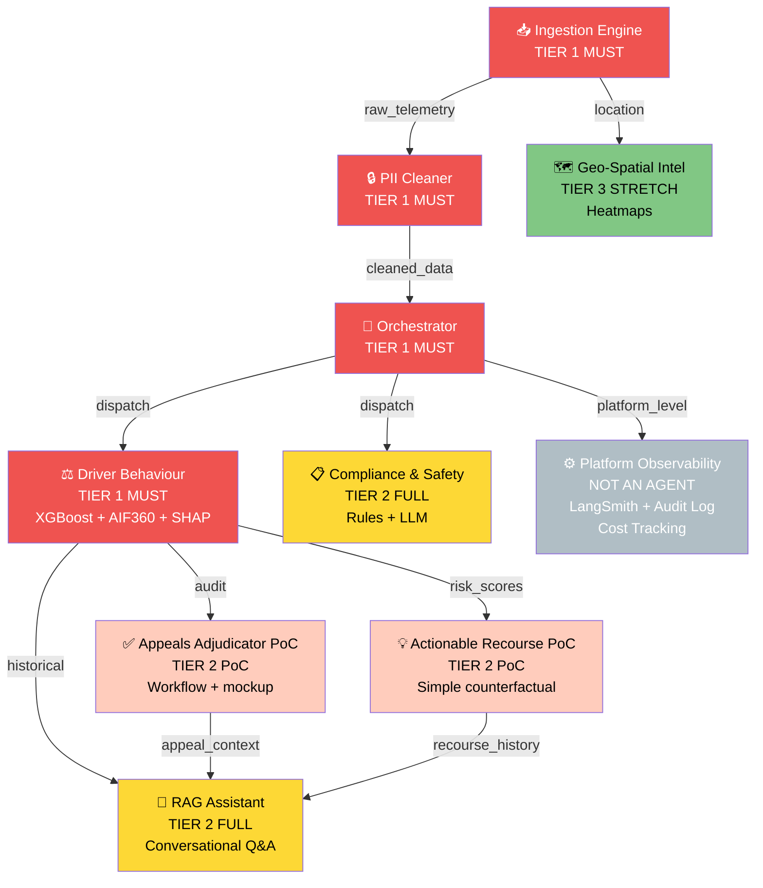

**Critical Path (Week 1 blocker):**

- Ingestion (4 days) → PII (3 days) → Orchestrator (5 days) = 12 days total
- By end of Week 1, full pipeline working with mock data ✅

## 4. System Design

### 4.1 Architecture Diagram

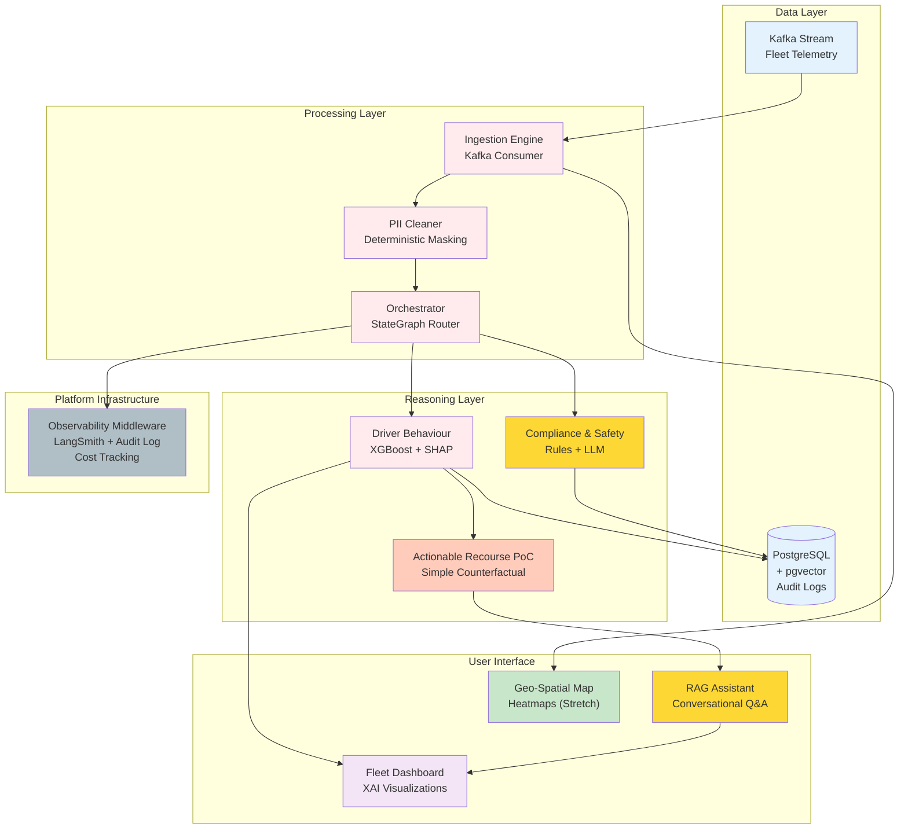

### 4.2 Technology Stack

| Layer                | Technology                 | Why                                                  |
| -------------------- | -------------------------- | ---------------------------------------------------- |
| **Agent Framework**  | LangGraph + LangChain      | StateGraph for orchestration; proven; widely adopted |
| **LLM**              | OpenAI GPT-4o-mini         | Cost-optimized, fast inference                       |
| **ML Model**         | XGBoost (Driver Behaviour) | Interpretable, native SHAP support                   |
| **Backend**          | FastAPI (Python)           | Async, lightweight, auto-docs                        |
| **Database**         | PostgreSQL + pgvector      | Unified relational + vector search                   |
| **XAI**              | SHAP + LIME + AIF360       | Course-aligned, production-ready                     |
| **Tracing**          | LangSmith                  | LLM observability, cost tracking                     |
| **Security Testing** | Promptfoo + Bandit         | Adversarial + SAST                                   |
| **Frontend**         | Next.js + React            | XAI dashboards, chatbot, maps                        |
| **Deployment**       | Docker + AWS ECS Fargate   | Serverless containers                                |
| **CI/CD**            | GitHub Actions             | Integrated testing + deployment                      |

---

## 5. Implementation Timeline

### 5.1 Realistic Gantt (45 Person-Days Total)

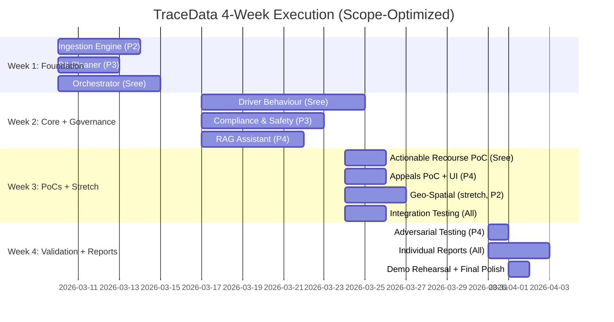

### 5.2 Detailed Phase Breakdown

#### **Phase 1: Foundation (Week 1) — ~15-16 person-days, ~4 days/person**

| Task                                         | Owner | Days   | Success Criteria                          |
| -------------------------------------------- | ----- | ------ | ----------------------------------------- |
| Kafka consumer + schema validation           | P2    | 4      | Telemetry flowing, schema validated       |
| PII masking + spatial jittering              | P3    | 3      | Raw → cleaned data verified, no PII leaks |
| LangGraph StateGraph + deterministic routing | Sree  | 5      | State machine works, routing tested       |
| GitHub repo + Docker Compose + local dev     | All   | 1 each | `docker-compose up` works                 |

**Week 1 Blocker Resolution:** Ingestion → PII → Orchestrator pipeline is live ✅

#### **Phase 2: Core & Governance (Week 2-3) — ~22-25 person-days, ~5-6 days/person**

| Task                                       | Owner | Days | Success Criteria                                             |
| ------------------------------------------ | ----- | ---- | ------------------------------------------------------------ |
| XGBoost model + AIF360 fairness testing    | Sree  | 4    | Model trains, bias detected (SPD > 0.10)                     |
| SHAP integration                           | Sree  | 2    | Feature importance computed                                  |
| Compliance rules engine (HOS, speed, rest) | P3    | 3    | Rules evaluate correctly                                     |
| Compliance LLM reasoning + guardrails      | P3    | 3    | Edge-case reasoning works, guardrails block unfair decisions |
| RAG pipeline (pgvector + semantic search)  | P4    | 2    | Retrieval works                                              |
| RAG security (3-layer defense)             | P4    | 2    | Prompt injection blocked                                     |
| RAG LLM generation                         | P4    | 1    | Bot answers questions correctly                              |

**Phase 2 Blocker Resolution:** Driver Behaviour + Compliance + RAG fully functional ✅

#### **Phase 3: PoCs + Stretch + Integration (Week 3) — ~10-12 person-days**

| Task                                            | Owner | Days | Success Criteria                                            |
| ----------------------------------------------- | ----- | ---- | ----------------------------------------------------------- |
| Actionable Recourse PoC (simple counterfactual) | Sree  | 2    | One example: "if harsh_braking -2, score crosses threshold" |
| Appeals Adjudicator PoC (workflow + UI mockup)  | P4    | 2    | Workflow documented, basic mockup created                   |
| Geo-Spatial heatmap (if energy)                 | P2    | 3    | Heatmap renders, privacy jitter applied                     |
| End-to-end integration testing                  | All   | 2    | Full pipeline works, no crashes                             |

---

#### **Phase 4: Validation & Reporting (Week 4) — ~8 person-days**

| Task                            | Owner | Days | Type                                      |
| ------------------------------- | ----- | ---- | ----------------------------------------- |
| Adversarial testing (Promptfoo) | P4    | 1    | >95% pass rate on 100+ tests              |
| Individual reports              | Each  | 2.5  | Deep design + implementation + reflection |
| Demo rehearsal + final polish   | All   | 0.5  | 5-min walkthrough, no crashes             |

### 5.3 Team Role Assignment (Explicit Commitment)

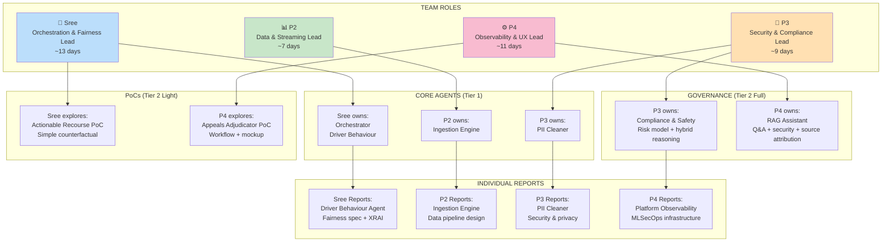

**Effort Per Person:**

- **Week 1:** 3-4 days each (shared foundation)
- **Week 2-3:** 5-6 days each (core + governance + PoCs)
- **Week 4:** 1-2 days each (reporting + demo)
- **Total:** ~10-12 days per person ✅ **Realistic, achievable, with buffer**

## 6. Module Coverage & Rubric Alignment

### 6.1 Module 1: Explainable & Responsible AI

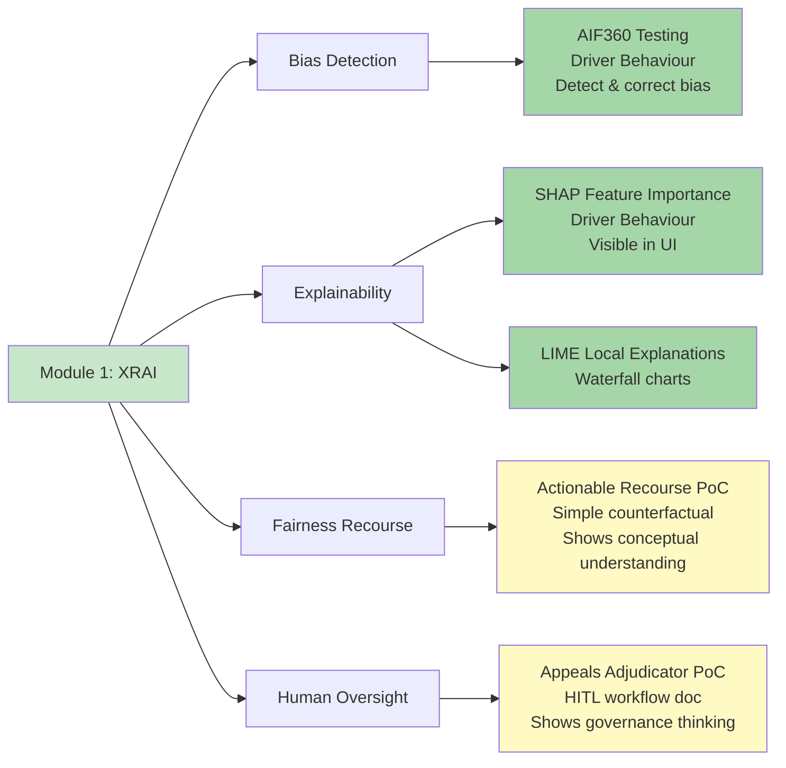

**Coverage:**

- ✅ Bias detection (AIF360: detect demographic bias in Driver Behaviour)
- ✅ Bias correction (reweighting or threshold adjustment)
- ✅ Fairness validation (SHAP: prove age importance dropped)
- ✅ Explainability (SHAP + LIME visible in dashboard)
- ✅ Fairness recourse (counterfactual PoC: show understanding of Molnar/Barocas)
- ✅ Human oversight (Appeals PoC: document HITL decision workflow)

### 6.2 Module 2: AI & Cybersecurity

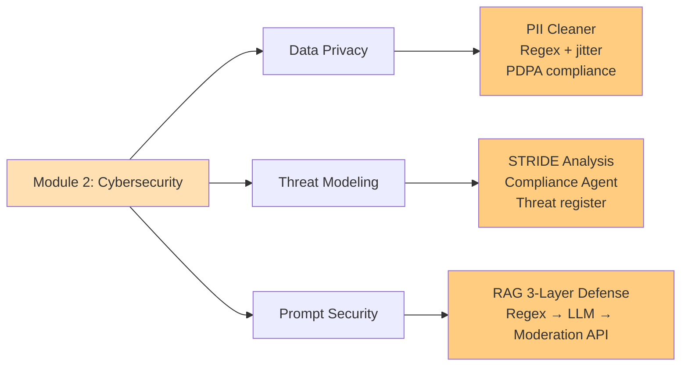

**Coverage:**

- ✅ Data privacy (PII Cleaner: deterministic masking, PDPA)
- ✅ Threat modeling (Compliance Agent: STRIDE threat register)
- ✅ Prompt injection defense (RAG: 3-layer guards)

### 6.3 Module 3: Architecting Agentic AI

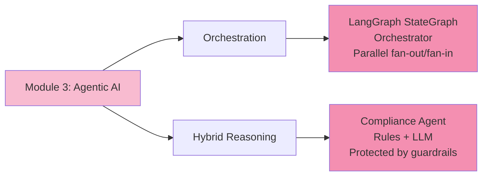

**Coverage:**

- ✅ Multi-agent coordination (Orchestrator routes to 6-7 agents)
- ✅ Parallel execution (asyncio for independent agents)
- ✅ Hybrid reasoning (Rules Engine + LLM in Compliance)
- ✅ State management (FleetState with checkpointing)

### 6.4 Module 4: MLSecOps

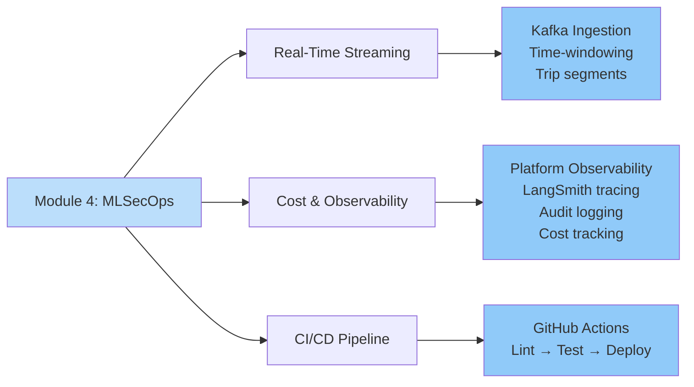

**Coverage:**

- ✅ Real-time streaming (Kafka, time-windowing)
- ✅ Cost monitoring (platform observability middleware)
- ✅ Audit logging (immutable decision logs)
- ✅ CI/CD (automated testing + deployment gates)

## 7. Risk Mitigation

### 7.1 Risk Register (Scope-Optimized)

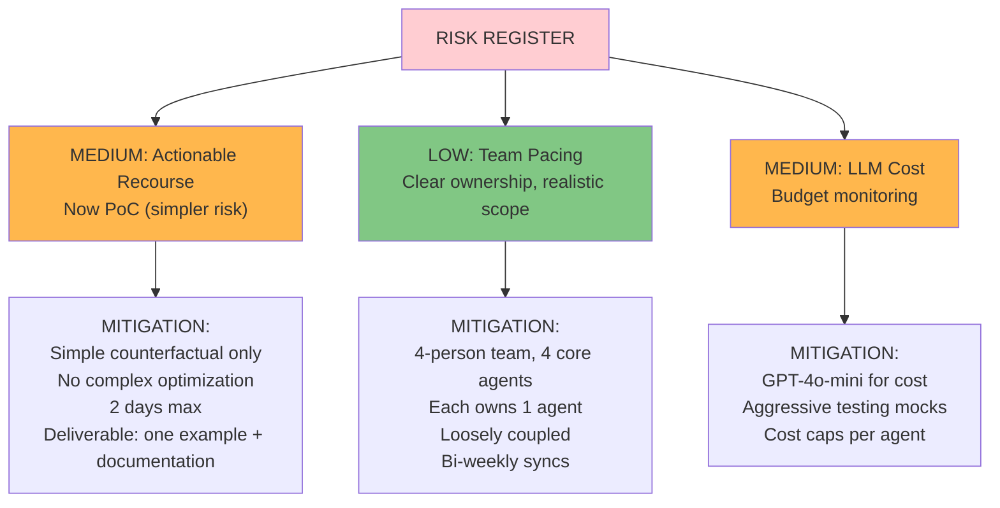

**Key principle:** By narrowing scope to 4 core + 2 full governance + 2 PoCs, we eliminate most risk while maintaining strong quality.

## 8. Testing & Validation

### 8.1 Testing Strategy

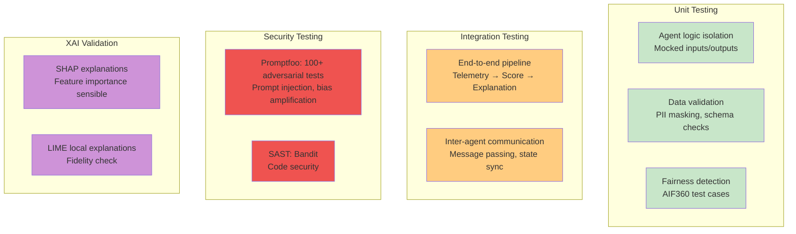

## 9. Deliverables & Assessment

### 9.1 Group Report (80-90 Pages)

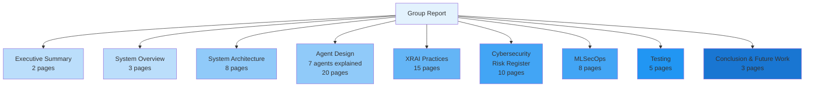

### 9.2 Individual Reports

| Member   | Primary Agent          | Report Structure                                                                                            |
| -------- | ---------------------- | ----------------------------------------------------------------------------------------------------------- |
| **Sree** | Driver Behaviour       | Design (fairness spec, AIF360) + Implementation (XGBoost, SHAP) + Reflection (XRAI learnings)               |
| **P2**   | Ingestion Engine       | Design (data pipeline, schema) + Implementation (Kafka, windowing) + Reflection (streaming learnings)       |
| **P3**   | PII Cleaner            | Design (privacy-first, deterministic) + Implementation (regex, jitter) + Reflection (security learnings)    |
| **P4**   | Platform Observability | Design (MLSecOps architecture) + Implementation (LangSmith, audit logs) + Reflection (governance learnings) |

**Each individual report:** ~8-10 pages

- Purpose & design (2-3 pages)
- Implementation (2-3 pages)
- Testing & validation (1-2 pages)
- XRAI/Cybersecurity/MLSecOps reflection (1-2 pages)
- Course concept connections (1 page)

## 10. References

[1] **IMDA Model AI Governance Framework (2nd Edition)**  
https://www.pdpc.gov.sg/Help-and-Resources/2020/01/Model-AI-Governance-Framework

[2] **Molnar, C. (2022). Interpretable Machine Learning**  
https://christophm.github.io/interpretable-ml-book/

[3] **Barocas, S., Hardt, M., Narayanan, A. (2023). Fairness and Machine Learning**  
https://fairmlbook.org/

[4] **LangGraph Documentation**  
https://langchain-ai.github.io/langgraph/

[5] **OWASP LLM Top 10**  
https://owasp.org/www-project-llm-ai-security-and-governance/

[6] **STRIDE Threat Modeling**  
https://learn.microsoft.com/en-us/azure/security/develop/threat-modeling-tool

[7] **AIF360: Fairness Toolkit**  
https://github.com/Trusted-AI/AIF360

[8] **SWE5008: Graduate Certificate in Architecting AI Systems (NUS-ISS)**

## Summary: Why This Works

| Factor                 | Before (9-11 agents)                                   | After (7 agents)                                       |
| ---------------------- | ------------------------------------------------------ | ------------------------------------------------------ |
| **Credibility**        | "We hope to..."                                        | "We commit to..."                                      |
| **Team Size Fit**      | 4 people building 11 agents = 2-3 each, thin execution | 4 people, 1-2 core agents each + shared work = focused |
| **Risk**               | High — slip on multiple agents                         | Low — execute well on core agents                      |
| **Module Coverage**    | All 4 modules fully covered                            | All 4 modules fully covered                            |
| **Quality**            | Conceptually strong, execution risk                    | Conceptually strong, execution credible                |
| **Grader Feeling**     | "Did they finish?"                                     | "They executed this well"                              |
| **Individual Reports** | Thin (3-4 pages per agent)                             | Deep (8-10 pages per agent)                            |

**"The difference between a good project and a great one isn't scope—it's execution credibility."**

This Master Plan v2.1 is ready to execute. You've kept strong conceptual elements while trimming to a scope 4 people can deliver with confidence.
