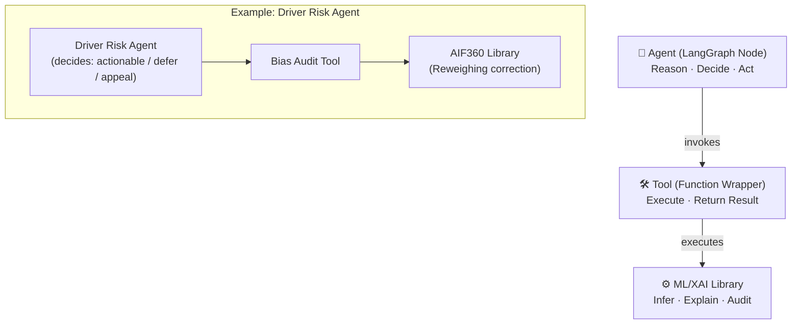
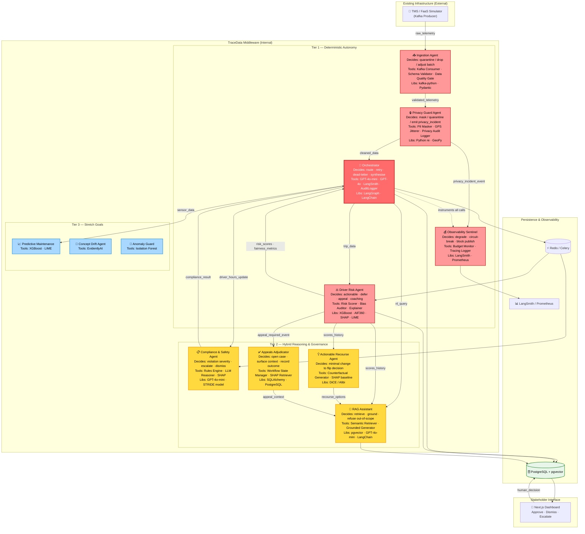

# TraceData: AI Intelligence Middleware for Fleet Management

Project Proposal | NUS-ISS Graduate Certificate in Architecting AI Systems (SWE5008)

---

## 1. Executive Summary

TraceData is an AI intelligence middleware system designed to attach to existing
truck fleet management infrastructure (TMS/FMS/ELD) to deliver predictive,
explainable, and fair decision-making capabilities — without requiring
rip-and-replace of legacy systems.

Current fleet systems handle operational logging efficiently (GPS tracking, basic
hours recording) but lack semantic reasoning, actionable explainability, and
governance mechanisms. TraceData bridges this "intelligence gap" by ingesting
Kafka event streams and deploying a multi-agent reasoning layer that scores
driver behaviour, enforces data privacy, provides fairness recourse, and
maintains strict MLSecOps observability.

TraceData is fundamentally designed around the Singapore IMDA Model AI
Governance Framework (MAIGF) and the SWE5008 rubric, prioritising operational
credibility, fairness-by-design, and adversarial robustness.

---

## 2. Agent & Tool Taxonomy

### 2.0 Definitions

> **Agent:** An autonomous LangGraph node that (a) monitors an input stream or
> trigger condition, (b) maintains a bounded local state or memory window,
> (c) makes explicit decisions with observable consequences, and (d) emits
> structured outputs or events downstream. Agents reason at the appropriate
> level of determinism for their risk profile — fully deterministic where
> auditability and latency are critical, LLM-hybrid where contextual
> interpretation is required. **Not all agents use LLMs.**
>
> **Tool:** A callable function invoked by an agent to perform a specific
> computation. Tools do not reason or decide — they execute and return
> structured results (e.g., XGBoost scoring pipeline, AIF360 fairness auditor,
> SHAP explainer).
>
> **ML/XAI Library:** The underlying engine executed by a tool. Libraries
> perform mathematical inference or explainability computation
> (e.g., XGBoost, AIF360, SHAP, LIME, DiCE).

This taxonomy satisfies the LangGraph architectural model and the SWE5008
Module 3 requirement that agents demonstrate "autonomy through reasoning,
planning, and tool use."

### 2.1 Capability Stack



---

## 3. Architecturally Significant Requirements (ASR) Prioritisation

Requirements are prioritised based on four drivers:

- **F** — Critical Functionality
- **Q** — Critical Quality (performance, security, fairness)
- **C** — Critical Constraint (IMDA, rubric)
- **R** — Technical / Architectural Risk

_(🔴 High | 🟠 Medium | 🟡 Low)_

### 3.1 ASR Prioritisation Matrix

| Agent                         | F   | Q   | C   | R   | Tier        | Reasoning Type      | Difficulty |
| ----------------------------- | --- | --- | --- | --- | ----------- | ------------------- | ---------- |
| **Orchestrator**              | 🔴  | 🔴  | 🔴  | 🔴  | Tier 1 MUST | LLM + Deterministic | 7.5/10     |
| **Ingestion Agent**           | 🔴  | 🔴  | 🔴  | 🟠  | Tier 1 MUST | Deterministic       | 6.0/10     |
| **Driver Risk Agent**         | 🔴  | 🔴  | 🔴  | 🔴  | Tier 1 MUST | Deterministic ML    | 6.5/10     |
| **Privacy Guard Agent**       | 🟠  | 🔴  | 🔴  | 🟡  | Tier 1 MUST | Deterministic       | 3.0/10     |
| **Observability Sentinel**    | 🟡  | 🔴  | 🔴  | 🟡  | Tier 1 MUST | Deterministic       | 4.5/10     |
| **Actionable Recourse Agent** | 🟠  | 🔴  | 🔴  | 🔴  | Tier 2 GOOD | Counterfactual      | 9.5/10     |
| **Compliance & Safety Agent** | 🟠  | 🔴  | 🔴  | 🟠  | Tier 2 GOOD | Rules + LLM Hybrid  | 6.5/10     |
| **Appeals Adjudicator**       | 🟠  | 🟠  | 🔴  | 🟡  | Tier 2 GOOD | Deterministic HITL  | 4.0/10     |
| **RAG Assistant**             | 🟠  | 🟡  | 🔴  | 🟠  | Tier 2 GOOD | LLM + Retrieval     | 5.5/10     |

---

## 4. System Architecture & Agent Scope

### 4.0 Reasoning Spectrum

TraceData agents reason at the appropriate level of determinism for their
risk profile:

```
Deterministic              Hybrid                    LLM
─────────────────────────────────────────────────────────
Ingestion Agent        Compliance & Safety       RAG Assistant
Privacy Guard          (Rules + GPT-4o-mini)     Orchestrator
Driver Risk Agent                                (synthesis mode)
Observability Sentinel
```

Deterministic agents are preferred for safety-critical, high-frequency, and
auditable decisions. LLM reasoning is reserved for bounded contextual
interpretation where rules alone are insufficient.

### 4.1 Master Architecture Diagram



### 4.2 Tier 1 — Deterministic Autonomy Backbone (MUST)

**Orchestrator**

- Reasoning: LLM intent classification (GPT-4o-mini) for routing; GPT-4o for
  cross-agent synthesis
- Autonomous decisions: route event to correct agent; retry failed calls;
  dead-letter unresolvable events; escalate to human when confidence is low;
  synthesise multi-agent responses into unified fleet manager alert
- Tools: GPT-4o-mini (intent), GPT-4o (synthesis), LangSmith Tracer, AuditLogger
- Libraries: LangGraph, LangChain

**Ingestion Agent**

- Reasoning: Deterministic data quality policy
- Autonomous decisions: schema drift → quarantine to dead-letter topic; impossible
  sensor values (speed < 0, GPS jump > 50km) → tag and drop; downstream failure
  → pause and rewind Kafka offsets; backpressure → adjust batch window size
- Tools: Kafka Consumer Wrapper, Schema Validator, Data Quality Gate
- Libraries: kafka-python, Pydantic

**Privacy Guard Agent**

- Reasoning: Deterministic PII enforcement
- Autonomous decisions: PII confidence > threshold → mask/hash/drop field;
  repeated violations in session → emit `privacy_incident_event`; high-risk
  payload → quarantine topic; every masking action → append to privacy audit log
- Tools: PII Masker (regex, 5 categories), GPS Spatial Jitterer, Privacy Audit Logger
- Libraries: Python `re`, GeoPy

**Driver Risk Agent**

- Reasoning: Deterministic ML inference + fairness pipeline
- Autonomous decisions: trip score actionable or defer (insufficient data);
  Disparate Impact Ratio < 0.8 → invoke Reweighing correction via AIF360;
  corrected DIR still outside [0.8–1.2] → emit `appeal_required_event`;
  coaching threshold crossed → emit `coaching_recommendation_event`
- Tools: Risk Scorer (XGBoost), Bias Auditor (AIF360), Explainer (SHAP global +
  LIME local)
- Libraries: XGBoost, AIF360, SHAP, LIME

**Observability Sentinel**

- Reasoning: Deterministic SLO enforcement and circuit breaking
- Autonomous decisions: token cost > budget SLO → degrade non-critical features
  (disable RAG temporarily); retry storm detected → trip circuit breaker;
  missing required audit record → block downstream publish; latency spike →
  emit `slo_violation_event`
- Tools: Budget Monitor, Tracing Logger, Circuit Breaker
- Libraries: LangSmith, Prometheus

### 4.3 Tier 2 — Hybrid Reasoning & Governance (GOOD TO HAVE)

**Actionable Recourse Agent**

- Reasoning: Counterfactual optimisation
- Autonomous decisions: given an unfair driver score, find the minimal feature
  changes that would flip the decision; rank recourse options by driver
  feasibility; surface top 3 options to fleet manager
- Tools: Counterfactual Generator, SHAP baseline
- Libraries: DiCE / Alibi
- Technical Risk: 9.5/10. **Contingency:** if counterfactual optimisation
  proves too complex by Week 2, pivot to deeper SHAP/LIME narrative in Driver
  Risk Agent — still A-grade XRAI coverage.

**Compliance & Safety Agent**

- Reasoning: Deterministic rules engine for clear violations; GPT-4o-mini
  chain-of-thought for edge cases requiring regulatory context
- Autonomous decisions: HOS limit clearly exceeded → deterministic flag + severity
  score; ambiguous context (weather delay, multi-jurisdiction) → LLM reasons
  step-by-step; reasoning chain stored as explainability artefact in AuditLog
- Tools: Rules Engine (HOS checker), LLM Reasoner (GPT-4o-mini), SHAP (risk XAI)
- Libraries: GPT-4o-mini, STRIDE threat model (design artefact)

**Appeals Adjudicator**

- Reasoning: Deterministic HITL workflow
- Autonomous decisions: open appeal case on `appeal_required_event`; retrieve
  full AI context (score history, SHAP chart, AIF360 metrics); surface to
  fleet manager; record `approve / dismiss / escalate` outcome to AuditLog
- Tools: Workflow State Manager, SHAP Explanation Retriever
- Libraries: SQLAlchemy, PostgreSQL

**RAG Assistant**

- Reasoning: LLM grounded in retrieved fleet data
- Autonomous decisions: rewrite ambiguous query for retrieval; retrieve top-k
  records via hybrid semantic + keyword search; ground response strictly in
  retrieved context; refuse and acknowledge out-of-scope queries
- Tools: Semantic Retriever (pgvector), Grounded Generator (GPT-4o-mini),
  Keyword Filter, Source Attribution Logger
- Libraries: pgvector, LangChain, GPT-4o-mini

### 4.4 Tier 3 — Stretch Goals (NICE TO HAVE)

| Agent                  | Decision                            | Tools                          | Libraries        |
| ---------------------- | ----------------------------------- | ------------------------------ | ---------------- |
| Predictive Maintenance | Failure urgent / schedule / monitor | XGBoost scorer, LIME explainer | XGBoost, LIME    |
| Concept Drift Agent    | Fairness drift → retrain alert      | Drift monitor                  | EvidentlyAI      |
| Anomaly Guard          | Outlier → quarantine / flag         | Anomaly detector               | Isolation Forest |

---

## 5. Team Roles & Deliverables

| Member        | Primary Agent (Individual Report) | Secondary Scope                                      | Module Coverage                     |
| ------------- | --------------------------------- | ---------------------------------------------------- | ----------------------------------- |
| **Sree (P1)** | Orchestrator                      | Driver Risk Agent, Actionable Recourse (contingency) | Mod 1 (XRAI), Mod 3 (Agentic)       |
| **P2**        | Ingestion Agent                   | Predictive Maintenance (stretch)                     | Mod 4 (MLSecOps, streaming)         |
| **P3**        | Privacy Guard Agent               | Compliance & Safety Agent                            | Mod 2 (Security, STRIDE)            |
| **P4**        | Observability Sentinel            | RAG Assistant, Appeals Adjudicator                   | Mod 4 (Observability), Mod 1 (HITL) |

> **Note on P4 scope:** Observability Sentinel is P4's primary individual report
> anchor. RAG Assistant and Appeals Adjudicator are secondary contributions to
> the group report. P4 does not need to go deep on all three for the individual
> report — Sentinel alone provides sufficient depth.

---

## 6. Demo Scenario — Cross-Agent Intelligence

The primary demo proves TraceData is a genuine multi-agent system, not a
linear pipeline:

1. **Ingestion Agent** receives telemetry — Vehicle 07 brake wear + engine
   temperature spike
2. **Driver Risk Agent** flags Driver 23 — fatigue score 0.78, night shift
   pattern, 3 harsh braking events
3. **Orchestrator** detects Vehicle 07 + Driver 23 correlation — cross-queries
   Compliance & Safety Agent
4. **Compliance & Safety Agent** returns — Driver 23 is 2 hours over weekly
   HOS limit
5. **Orchestrator** synthesises unified alert with SHAP traces from each agent
   → surfaces approval card to fleet manager
6. **Fleet manager** selects Approve — outcome recorded to AuditLog via
   `human_decision` field

No single agent produces this. No deterministic pipeline produces this.
No traditional TMS produces this.

---

## 7. Adversarial Testing

- **Promptfoo** red-team testing automated in GitHub Actions CI/CD pipeline
- 350+ adversarial test cases across 35 security plugin categories
- Targets: Orchestrator RAG endpoint, Compliance Agent LLM reasoning endpoint
- OWASP LLM Top 10 2025 full mapping documented in Group Report Section 6

---

## 8. SWE5008 Rubric & IMDA Alignment

| Module / Standard                       | Agent Responsible                                           | Tools & Libraries Demonstrating Competency                                                             |
| --------------------------------------- | ----------------------------------------------------------- | ------------------------------------------------------------------------------------------------------ |
| **Mod 1: Explainable & Responsible AI** | Driver Risk Agent, Actionable Recourse                      | AIF360 (bias detection + Reweighing), SHAP (global XAI), LIME (local XAI), DiCE/Alibi (counterfactual) |
| **Mod 2: AI & Cybersecurity**           | Privacy Guard, Compliance & Safety, Observability Sentinel  | PII Regex Masker, GPS Jitterer, STRIDE Threat Model, Promptfoo (red-team), Circuit Breaker             |
| **Mod 3: Architecting Agentic AI**      | Orchestrator, Compliance & Safety, RAG Assistant            | LangGraph StateGraph, GPT-4o-mini (hybrid reasoning), pgvector (retrieval), LangChain                  |
| **Mod 4: Integrating & Deploying AI**   | Ingestion Agent, Observability Sentinel                     | Kafka Consumer, LangSmith, AuditLogger, GitHub Actions CI/CD, Docker, DigitalOcean                     |
| **IMDA MAIGF**                          | Appeals Adjudicator, RAG Assistant, All agents via AuditLog | AuditLogger (human_decision), SHAP Retriever, Source Attribution Logger                                |

---

## 9. Conclusion

TraceData is architected as a production-grade, highly observable, and
rigorously fair fleet intelligence middleware. Agents are autonomous LangGraph
nodes that reason at the appropriate level of determinism for their risk
profile — deterministic for speed and auditability, LLM-hybrid for contextual
interpretation. Each agent is backed by a clearly documented tool chain covering
ML inference, fairness auditing, XAI generation, and security enforcement.

By tightly scoping Tier 1 (operational backbone) and strategically implementing
Tier 2 (governance differentiators), TraceData explicitly satisfies all four
SWE5008 module competencies and IMDA regulatory alignment requirements.

---

## 10. References

- **[1]** IMDA Model AI Governance Framework (2nd Edition).
  https://www.pdpc.gov.sg/Help-and-Resources/2020/01/Model-AI-Governance-Framework
- **[2]** Molnar, C. (2022). Interpretable Machine Learning.
  https://christophm.github.io/interpretable-ml-book/
- **[3]** Barocas, S., Hardt, M., Narayanan, A. (2023). Fairness and Machine
  Learning. https://fairmlbook.org/
- **[4]** SWE5008: Graduate Certificate in Architecting AI Systems. NUS-ISS.
- **[5]** OWASP LLM Top 10 2025.
  https://owasp.org/www-project-top-10-for-large-language-model-applications/
- **[6]** LangGraph Documentation. https://langchain-ai.github.io/langgraph/
