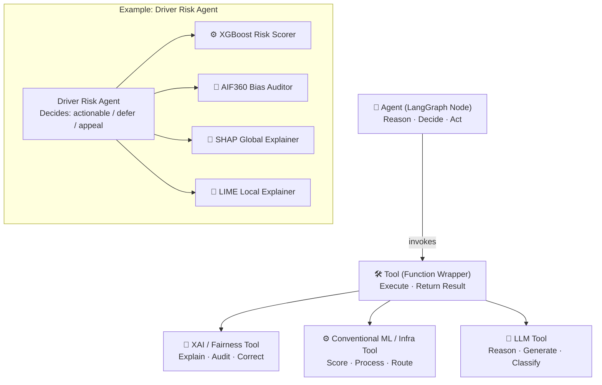
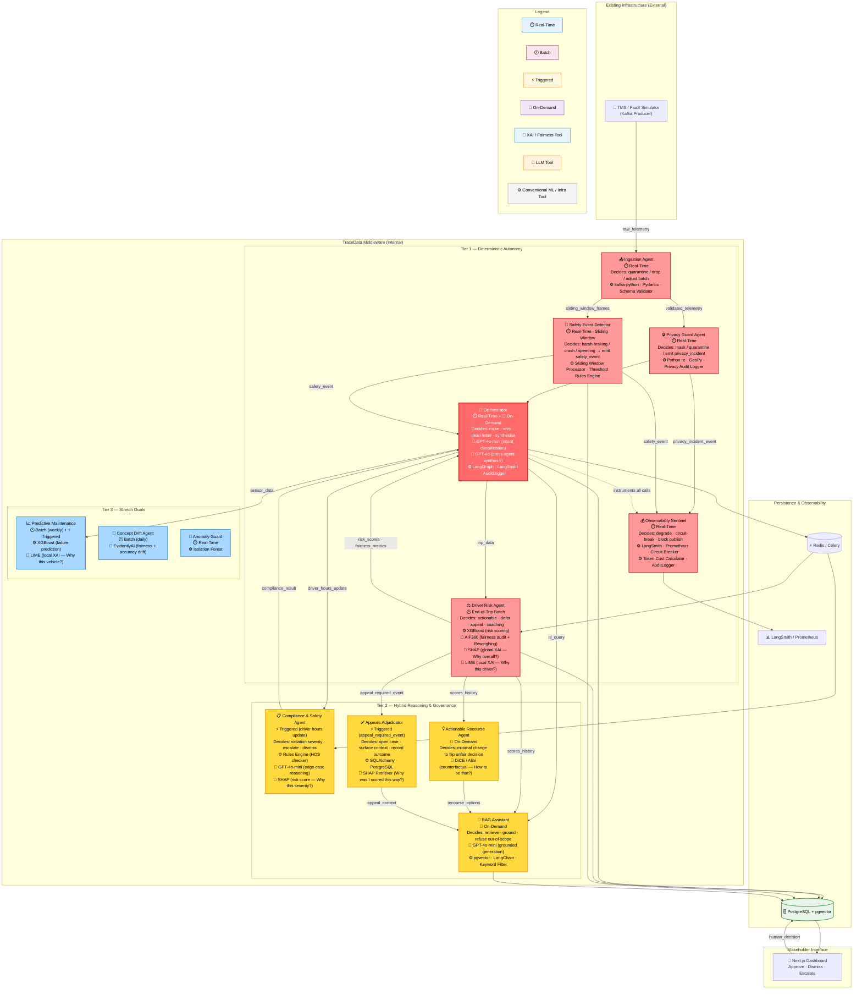

# TraceData: AI Intelligence Middleware for Fleet Management

Project Proposal | NUS-ISS Graduate Certificate in Architecting AI Systems (SWE5008)

---

## 1. Executive Summary

TraceData is an AI intelligence middleware system designed to attach to existing
truck fleet management infrastructure (TMS/FMS/ELD) to deliver predictive,
explainable, and fair decision-making capabilities — without requiring
rip-and-replace of legacy systems.

Current fleet systems handle operational logging efficiently (GPS tracking, basic
hours recording) but lack semantic reasoning, actionable explainability, and
governance mechanisms. TraceData bridges this "intelligence gap" by ingesting
Kafka event streams and deploying a multi-agent reasoning layer that scores
driver behaviour, enforces data privacy, provides fairness recourse, and
maintains strict MLSecOps observability.

TraceData is fundamentally designed around the Singapore IMDA Model AI
Governance Framework (MAIGF) and the SWE5008 rubric, prioritising operational
credibility, fairness-by-design, and adversarial robustness.

---

## 2. Agent & Tool Taxonomy

### 2.0 Definitions

> **Agent:** An autonomous LangGraph node that (a) monitors an input stream or
> trigger condition, (b) maintains a bounded local state or memory window,
> (c) makes explicit decisions with observable consequences, and (d) emits
> structured outputs or events downstream. Agents reason at the appropriate
> level of determinism for their risk profile — fully deterministic where
> auditability and latency are critical, LLM-hybrid where contextual
> interpretation is required. **Not all agents use LLMs.**
>
> **Tool:** A callable function invoked by an agent to perform a specific
> computation. Tools do not reason or decide — they execute and return
> structured results.
>
> **XAI / Fairness Tool:** A specialised tool that produces human-interpretable
> explanations or fairness metrics. Outputs surface directly in the fleet
> manager dashboard, answering questions from the XAI Question Bank
> (Why / Why Not / How to be that / What if).
>
> **Conventional ML / Infra Tool:** A tool that performs standard ML inference,
> data processing, or infrastructure operations without producing explanations
> (e.g., XGBoost scoring, Kafka consumption, regex masking).
>
> **LLM Tool:** A tool that invokes a large language model for natural language
> reasoning, classification, or generation within a bounded scope.

**Execution Modes:**

- ⏱️ **Real-Time** — continuous, event-driven, sub-second response
- 🕐 **Batch** — scheduled periodic processing (end-of-trip, daily, weekly)
- ⚡ **Triggered** — fires on a specific system event
- 🔁 **On-Demand** — invoked by fleet manager query

**Tool Categories:**

- 🔬 XAI / Fairness Tool
- 🧠 LLM Tool
- ⚙️ Conventional ML / Infra Tool

---

## 3. Architecturally Significant Requirements (ASR) Prioritisation

Requirements are prioritised based on four drivers:

- **F** — Critical Functionality
- **Q** — Critical Quality (performance, security, fairness)
- **C** — Critical Constraint (IMDA, rubric)
- **R** — Technical / Architectural Risk

_(🔴 High | 🟠 Medium | 🟡 Low)_

### 3.1 ASR Prioritisation Matrix

| Agent                         | Mode                        | F   | Q   | C   | R   | Tier        | Reasoning Type      | Difficulty |
| ----------------------------- | --------------------------- | --- | --- | --- | --- | ----------- | ------------------- | ---------- |
| **Orchestrator**              | ⏱️ Real-Time + 🔁 On-Demand | 🔴  | 🔴  | 🔴  | 🔴  | Tier 1 MUST | LLM + Deterministic | 7.5/10     |
| **Ingestion Agent**           | ⏱️ Real-Time                | 🔴  | 🔴  | 🔴  | 🟠  | Tier 1 MUST | Deterministic       | 6.0/10     |
| **Safety Event Detector**     | ⏱️ Real-Time                | 🔴  | 🔴  | 🔴  | 🟠  | Tier 1 MUST | Deterministic       | 5.0/10     |
| **Privacy Guard Agent**       | ⏱️ Real-Time                | 🟠  | 🔴  | 🔴  | 🟡  | Tier 1 MUST | Deterministic       | 3.0/10     |
| **Driver Risk Agent**         | 🕐 End-of-Trip              | 🔴  | 🔴  | 🔴  | 🔴  | Tier 1 MUST | Deterministic ML    | 6.5/10     |
| **Observability Sentinel**    | ⏱️ Real-Time                | 🟡  | 🔴  | 🔴  | 🟡  | Tier 1 MUST | Deterministic       | 4.5/10     |
| **Actionable Recourse Agent** | 🔁 On-Demand                | 🟠  | 🔴  | 🔴  | 🔴  | Tier 2 GOOD | Counterfactual      | 9.5/10     |
| **Compliance & Safety Agent** | ⚡ Triggered                | 🟠  | 🔴  | 🔴  | 🟠  | Tier 2 GOOD | Rules + LLM Hybrid  | 6.5/10     |
| **Appeals Adjudicator**       | ⚡ Triggered                | 🟠  | 🟠  | 🔴  | 🟡  | Tier 2 GOOD | Deterministic HITL  | 4.0/10     |
| **RAG Assistant**             | 🔁 On-Demand                | 🟠  | 🟡  | 🔴  | 🟠  | Tier 2 GOOD | LLM + Retrieval     | 5.5/10     |
| **Predictive Maintenance**    | 🕐 Batch + ⚡ Triggered     | 🟠  | 🟠  | 🟡  | 🟠  | Tier 3 NICE | Deterministic ML    | 7.0/10     |
| **Concept Drift Agent**       | 🕐 Batch (daily)            | 🟡  | 🔴  | 🟠  | 🟠  | Tier 3 NICE | Statistical         | 7.0/10     |
| **Anomaly Guard**             | ⏱️ Real-Time                | 🟡  | 🟠  | 🟡  | 🟠  | Tier 3 NICE | Deterministic       | 7.0/10     |

---

## 4. System Architecture & Agent Scope

### 4.1 Capability Stack

### 4.2 Master Architecture Diagram

---

## 5. Agent Detail Specifications

### 5.1 Tier 1 — Deterministic Autonomy Backbone (MUST)

---

**Orchestrator** | ⏱️ Real-Time + 🔁 On-Demand | Reasoning: LLM + Deterministic

Autonomous decisions:

- Route incoming event to correct agent based on GPT-4o-mini intent classification
- Retry failed agent calls (up to 3 attempts with exponential backoff)
- Dead-letter unresolvable events to quarantine queue
- Escalate to human when agent confidence is below threshold
- Synthesise multi-agent outputs into unified fleet manager alert via GPT-4o

Tools:

- 🧠 GPT-4o-mini — intent classification and routing decisions
- 🧠 GPT-4o — cross-agent synthesis and conversational response generation
- ⚙️ LangGraph StateGraph — agent workflow orchestration
- ⚙️ LangSmith Tracer — distributed tracing of all node executions
- ⚙️ AuditLogger — structured decision records to PostgreSQL

---

**Ingestion Agent** | ⏱️ Real-Time | Reasoning: Deterministic policy rules

Autonomous decisions:

- Schema drift detected → route to quarantine Kafka topic, emit schema_drift_event
- Impossible sensor values (speed < 0, GPS jump > 50km in 2s) → tag and drop
- Downstream consumer lag > threshold → adjust batch window size
- Downstream failure → pause and rewind Kafka offsets within safe bound

Tools:

- ⚙️ Kafka Consumer Wrapper — topic subscription and offset management
- ⚙️ Schema Validator (Pydantic) — field type and range enforcement
- ⚙️ Data Quality Gate — impossible value detection and tagging

---

**Safety Event Detector** | ⏱️ Real-Time · Sliding Window | Reasoning: Deterministic

Autonomous decisions:

- Harsh braking burst (deceleration > threshold in window) → emit safety_event
- Crash pattern detected (sudden speed → 0 + impact signature) → emit safety_event
- Sustained speeding (> limit for > 30s) → emit safety_event
- All safety events → write evidence window to PostgreSQL for audit

Tools:

- ⚙️ Sliding Window Processor — maintains rolling telemetry buffer per vehicle
- ⚙️ Threshold Rules Engine — configurable per-event detection thresholds

---

**Privacy Guard Agent** | ⏱️ Real-Time | Reasoning: Deterministic enforcement

Autonomous decisions:

- PII confidence > threshold → mask / hash / drop field
- Repeated violations in session → emit privacy_incident_event to Sentinel
- High-risk payload → route to quarantine topic for offline review
- Every masking action → append to privacy audit log

Tools:

- ⚙️ PII Regex Masker — 5 PII categories (name, vehicle reg, licence, phone, email)
- ⚙️ GPS Spatial Jitterer — adds calibrated noise to exact coordinates
- ⚙️ Privacy Audit Logger — immutable PDPA accountability trail

---

**Driver Risk Agent** | 🕐 End-of-Trip Batch | Reasoning: Deterministic ML

Autonomous decisions:

- Trip score actionable or defer (insufficient data — < 5 events in trip)
- Disparate Impact Ratio < 0.8 → invoke AIF360 Reweighing correction
- Corrected DIR still outside [0.8–1.2] → emit appeal_required_event
- Coaching threshold crossed → emit coaching_recommendation_event

Tools:

- ⚙️ XGBoost Risk Scorer — trains on speed variance, harsh braking, acceleration,
  cornering, night shift indicator; outputs risk score 0–1
- 🔬 AIF360 Bias Auditor — computes Disparate Impact Ratio and Statistical
  Parity Difference across age demographic groups; applies Reweighing
  pre-processing correction
- 🔬 SHAP Global Explainer — answers: _"Why does the model score drivers
  this way overall?"_ (feature importance chart, dashboard-rendered)
- 🔬 LIME Local Explainer — answers: _"Why was this specific driver flagged?"_
  (per-driver explanation, rendered in alert card)

---

**Observability Sentinel** | ⏱️ Real-Time | Reasoning: Deterministic SLO enforcement

Autonomous decisions:

- Token cost > budget SLO → degrade non-critical features (disable RAG temporarily)
- Retry storm detected → trip circuit breaker, throttle noisy producer
- Missing required audit record → block downstream publish
- Latency spike > p99 threshold → emit slo_violation_event

Tools:

- ⚙️ LangSmith Tracer — distributed tracing for all LangGraph node executions
- ⚙️ Prometheus — metrics collection (latency, error rate, token cost)
- ⚙️ Token Cost Calculator — per-call cost tracking, cumulative budget monitoring
- ⚙️ Circuit Breaker — automatic feature degradation under SLO breach
- ⚙️ AuditLogger — Ethical AI Decision Log (immutable, required for IMDA audit)

---

### 5.2 Tier 2 — Hybrid Reasoning & Governance (GOOD TO HAVE)

---

**Actionable Recourse Agent** | 🔁 On-Demand | Reasoning: Counterfactual optimisation

Autonomous decisions:

- Given unfair driver score, find minimal feature changes to flip decision
- Rank recourse options by driver feasibility (controllable vs uncontrollable features)
- Surface top 3 recourse options to fleet manager and driver

Tools:

- 🔬 DiCE / Alibi Counterfactual Generator — answers: _"What would Driver X
  need to change to improve their score?"_ (How to be that — XAI Question Bank)

Technical Risk: 9.5/10. **Contingency:** if counterfactual optimisation proves
too complex by Week 2, pivot to deeper SHAP/LIME narrative in Driver Risk Agent.

---

**Compliance & Safety Agent** | ⚡ Triggered | Reasoning: Rules + LLM Hybrid

Autonomous decisions:

- HOS limit clearly exceeded → deterministic flag, severity score via XGBoost
- Ambiguous regulatory context (weather delay, multi-jurisdiction) →
  GPT-4o-mini reasons step-by-step, stores chain-of-thought as XAI artefact
- Severity score → prioritise compliance queue

Tools:

- ⚙️ Rules Engine — deterministic HOS violation checker
- 🧠 GPT-4o-mini — bounded edge-case reasoning with chain-of-thought logging
- 🔬 SHAP — answers: _"Why was this violation scored at this severity?"_

Security: Full STRIDE threat model documented as design artefact.

---

**Appeals Adjudicator** | ⚡ Triggered (appeal_required_event) | Reasoning: Deterministic HITL

Autonomous decisions:

- Open appeal case on receipt of appeal_required_event
- Retrieve full AI context: score history, SHAP chart, AIF360 fairness metrics
- Surface to fleet manager as structured review card
- Record approve / dismiss / escalate outcome to AuditLog human_decision field

Tools:

- ⚙️ Workflow State Manager (SQLAlchemy + PostgreSQL) — appeal case lifecycle
- 🔬 SHAP Explanation Retriever — answers: _"Why was I scored this way?"_
  (surfaces historical SHAP output for disputed trip)

---

**RAG Assistant** | 🔁 On-Demand | Reasoning: LLM grounded in retrieved fleet data

Autonomous decisions:

- Rewrite ambiguous query for better retrieval
- Retrieve top-k records via hybrid semantic + keyword search
- Ground response strictly in retrieved context; cite sources
- Refuse and acknowledge out-of-scope queries

Tools:

- 🧠 GPT-4o-mini — grounded response generation
- ⚙️ pgvector Semantic Retriever — cosine similarity search over fleet embeddings
- ⚙️ Keyword Filter — exact vehicle/driver ID matching (prevents wrong-vehicle context)
- ⚙️ Source Attribution Logger — records which documents grounded each response

---

### 5.3 Tier 3 — Stretch Goals (NICE TO HAVE)

| Agent                      | Mode                    | Autonomous Decision                                 | Tools                                     |
| -------------------------- | ----------------------- | --------------------------------------------------- | ----------------------------------------- |
| **Predictive Maintenance** | 🕐 Batch + ⚡ Triggered | Failure urgent / schedule / monitor                 | ⚙️ XGBoost, 🔬 LIME (_Why this vehicle?_) |
| **Concept Drift Agent**    | 🕐 Batch daily          | Fairness/accuracy drift > threshold → retrain alert | 🔬 EvidentlyAI                            |
| **Anomaly Guard**          | ⏱️ Real-Time            | Outlier score > threshold → quarantine + flag       | ⚙️ Isolation Forest                       |

---

## 6. Team Roles & Deliverables

| Member        | Primary Agent (Individual Report)       | Secondary Scope                                      | Module Coverage                     |
| ------------- | --------------------------------------- | ---------------------------------------------------- | ----------------------------------- |
| **Sree (P1)** | Orchestrator                            | Driver Risk Agent, Actionable Recourse (contingency) | Mod 1 (XRAI), Mod 3 (Agentic)       |
| **P2**        | Ingestion Agent + Safety Event Detector | Predictive Maintenance (stretch)                     | Mod 4 (MLSecOps, streaming)         |
| **P3**        | Privacy Guard Agent                     | Compliance & Safety Agent                            | Mod 2 (Security, STRIDE)            |
| **P4**        | Observability Sentinel                  | RAG Assistant, Appeals Adjudicator                   | Mod 4 (Observability), Mod 1 (HITL) |

> **Note on P4 scope:** Observability Sentinel is P4's individual report anchor.
> RAG Assistant and Appeals Adjudicator are secondary group report contributions.
>
> **Note on P2 scope:** Safety Event Detector is co-owned with Ingestion Agent
> as they share the same real-time telemetry pipeline. P2 picks one as their
> individual report anchor.

---

## 7. Demo Scenario — Cross-Agent Intelligence

The primary demo proves TraceData is a genuine multi-agent system:

1. **Ingestion Agent** receives telemetry — Vehicle 07 brake wear + engine temp spike
2. **Safety Event Detector** fires — harsh braking burst detected, emits safety_event
3. **Driver Risk Agent** flags Driver 23 — fatigue score 0.78, night shift, 3 harsh braking events
4. **Orchestrator** detects Vehicle 07 + Driver 23 correlation — cross-queries Compliance Agent
5. **Compliance & Safety Agent** returns — Driver 23 is 2 hours over weekly HOS limit
6. **Orchestrator** synthesises unified alert with SHAP traces from each agent → surfaces approval card
7. **Fleet manager** selects Approve — outcome recorded to AuditLog via human_decision field

No single agent produces this. No deterministic pipeline produces this.
No traditional TMS produces this.

---

## 8. Adversarial Testing

- **Promptfoo** red-team testing automated in GitHub Actions CI/CD pipeline
- 350+ adversarial test cases across 35 security plugin categories
- Targets: Orchestrator RAG endpoint, Compliance Agent LLM reasoning endpoint
- OWASP LLM Top 10 2025 full mapping documented in Group Report Section 6

---

## 9. SWE5008 Rubric & IMDA Alignment

| Module / Standard                       | Agent Responsible                                    | XAI / Fairness Tools                                                                             | Other Tools                                                            |
| --------------------------------------- | ---------------------------------------------------- | ------------------------------------------------------------------------------------------------ | ---------------------------------------------------------------------- |
| **Mod 1: Explainable & Responsible AI** | Driver Risk Agent, Actionable Recourse               | 🔬 AIF360 (bias + Reweighing), 🔬 SHAP (global), 🔬 LIME (local), 🔬 DiCE/Alibi (counterfactual) | ⚙️ XGBoost                                                             |
| **Mod 2: AI & Cybersecurity**           | Privacy Guard, Compliance & Safety, Sentinel         | 🔬 SHAP (compliance severity XAI)                                                                | ⚙️ PII Masker, GPS Jitterer, STRIDE Model, Promptfoo, Circuit Breaker  |
| **Mod 3: Architecting Agentic AI**      | Orchestrator, Compliance & Safety, RAG Assistant     | —                                                                                                | 🧠 GPT-4o-mini, GPT-4o, ⚙️ LangGraph, pgvector, LangChain              |
| **Mod 4: Integrating & Deploying AI**   | Ingestion Agent, Safety Event Detector, Sentinel     | 🔬 EvidentlyAI (drift — stretch)                                                                 | ⚙️ Kafka, LangSmith, AuditLogger, GitHub Actions, Docker, DigitalOcean |
| **IMDA MAIGF**                          | Appeals Adjudicator, RAG Assistant, All via AuditLog | 🔬 SHAP Retriever (appeals XAI)                                                                  | ⚙️ AuditLogger (human_decision field), Source Attribution Logger       |

---

## 10. References

- **[1]** IMDA Model AI Governance Framework (2nd Edition).
  https://www.pdpc.gov.sg/Help-and-Resources/2020/01/Model-AI-Governance-Framework
- **[2]** Molnar, C. (2022). Interpretable Machine Learning.
  https://christophm.github.io/interpretable-ml-book/
- **[3]** Barocas, S., Hardt, M., Narayanan, A. (2023). Fairness and Machine
  Learning. https://fairmlbook.org/
- **[4]** SWE5008: Graduate Certificate in Architecting AI Systems. NUS-ISS.
- **[5]** OWASP LLM Top 10 2025.
  https://owasp.org/www-project-top-10-for-large-language-model-applications/
- **[6]** LangGraph Documentation.
  https://langchain-ai.github.io/langgraph/
