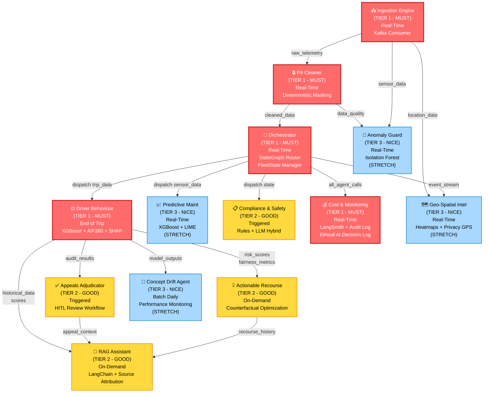

# TraceData: AI Intelligence Middleware for Fleet Management

Project Proposal | NUS-ISS Graduate Certificate in Architecting AI Systems (SWE5008)

## 1. Executive Summary

TraceData is an AI intelligence middleware system designed to attach to existing truck fleet management infrastructure (TMS/FMS/ELD) to deliver predictive, explainable, and fair decision-making capabilities.

Current fleet systems handle operational logging efficiently (e.g., GPS tracking, basic hours recording) but lack semantic reasoning, actionable explainability, and governance mechanisms. TraceData bridges this "intelligence gap" without requiring a rip-and-replace of existing infrastructure. By ingesting Kafka event streams, TraceData deploys a multi-agent reasoning layer that scores driver behavior, masks sensitive PII deterministically, provides actionable fairness recourse, and maintains strict MLSecOps observability.

TraceData is fundamentally designed around the Singapore IMDA Model AI Governance Framework (MAIGF) and the SWE5008 Rubric, prioritizing operational credibility, fairness-by-design, and adversarial robustness.

## 2. Agent Analysis

## 2. Final ASR Prioritization (EchoChamber-Aligned)

To build a successful system efficiently, requirements are prioritized based on their architectural significance. An agent is evaluated against the following drivers:

- **F (Critical Functionality):** Essential for the system's core purpose.
- **Q (Critical Quality):** Tied to crucial attributes like performance, security, or fairness.
- **C (Critical Constraint):** Imposes limitations, such as regulatory compliance (IMDA) or academic rubric requirements.
- **R (Technical / Arch. Risk):** High complexity or uncertainty requiring early validation.

_(🔴 High Impact | 🟠 Medium Impact | 🟡 Low Impact)_

### 2.1 Tier 1: MUST (Operational Credibility Backbone)

_These five agents establish the core pipeline, satisfy baseline rubric requirements, and prove the system is buildable, observable, and governable. Non-negotiable._

| Agent Name            | Function                      | Type            | F   | Q   | C   | R   | Rubric Alignment                             | Tech Difficulty | Rationale                                                                                                     |
| --------------------- | ----------------------------- | --------------- | --- | --- | --- | --- | -------------------------------------------- | --------------- | ------------------------------------------------------------------------------------------------------------- |
| **Orchestrator**      | Multi-agent coordination      | **Real-Time**   | 🔴  | 🔴  | 🔴  | 🔴  | **High (Mod 3/4):** Agentic logic & MLSecOps | **7.5/10**      | Central hub for all routing. Deterministic decision trees (no LLM overhead for routing). Foundational.        |
| **Ingestion Engine**  | Kafka data pipeline           | **Real-Time**   | 🔴  | 🔴  | 🔴  | 🟠  | **High (Mod 4):** Streaming backbone         | **6.0/10**      | Kafka subscription + time-windowing. Non-negotiable for a real-time system.                                   |
| **Driver Behaviour**  | Risk scoring + fairness audit | **End of Trip** | 🔴  | 🔴  | 🔴  | 🔴  | **High (Mod 1):** Bias correction & XRAI     | **6.5/10**      | Core XRAI engine. Detects bias, corrects via AIF360, explains via SHAP. Satisfies Mod 1 baseline.             |
| **PII Cleaner**       | In-stream data privacy        | **Real-Time**   | 🔴  | 🔴  | 🔴  | 🟡  | **High (Mod 2):** Security/Privacy (IMDA)    | **3.0/10**      | Regex masking + spatial jittering. Zero LLM usage. Mandatory checkpoint before any ML.                        |
| **Cost & Monitoring** | MLSecOps observability        | **Real-Time**   | 🔴  | 🔴  | 🔴  | 🟡  | **High (Mod 4):** Observability & IMDA audit | **4.5/10**      | Instruments agent calls (tokens/latency). Generates Ethical AI Decision Log. Promoted to Tier 1 per critique. |

### 2.2 Tier 2: GOOD TO HAVE (Excellence & Governance Depth)

_These agents prove advanced mastery: fairness recourse, stakeholder communication, hybrid reasoning, and governance procedures. A+ differentiators._

| Agent Name              | Function                          | Type          | F   | Q   | C   | R   | Rubric Alignment                            | Tech Difficulty | Rationale                                                                                                   |
| ----------------------- | --------------------------------- | ------------- | --- | --- | --- | --- | ------------------------------------------- | --------------- | ----------------------------------------------------------------------------------------------------------- |
| **Actionable Recourse** | Counterfactual "what-if" coaching | **On-Demand** | 🟠  | 🔴  | 🟠  | 🔴  | **High (Mod 1/3):** Fairness recourse       | **9.5/10**      | Finds minimal feature changes to flip unfair decisions. Proves fairness is actionable, not just detectable. |
| **Compliance & Safety** | Regulatory edge-case reasoning    | **Triggered** | 🟠  | 🔴  | 🔴  | 🟠  | **High (Mod 2/3):** STRIDE + Hybrid logic   | **6.5/10**      | HOS rules + LLM for context (e.g., weather delays). STRIDE threat model proves cybersecurity thinking.      |
| **Appeals Adjudicator** | HITL governance workflow          | **Triggered** | 🟠  | 🔴  | 🔴  | 🟡  | **High (Mod 1):** IMDA HITL                 | **4.0/10**      | Human reviews disputed scores with AI context. Demonstrates procedural fairness & accountability.           |
| **RAG Assistant**       | Conversational Q&A interface      | **On-Demand** | 🟠  | 🟡  | 🔴  | 🟠  | **High (Mod 2/3):** Stakeholder Interaction | **5.5/10**      | Answers "Why did Driver X get a low score?". Essential for user-facing responsible AI (IMDA Pillar 4).      |

### 2.3 Tier 3: NICE TO HAVE (Secondary Features & Depth)

_These agents provide secondary observability and visualization. Can be deferred without losing rubric competency._

| Agent Name            | Function                          | Type          | F   | Q   | C   | R   | Rubric Alignment                        | Tech Difficulty | Rationale                                                                           |
| --------------------- | --------------------------------- | ------------- | --- | --- | --- | --- | --------------------------------------- | --------------- | ----------------------------------------------------------------------------------- |
| **Concept Drift**     | Accuracy/fairness drift detection | **Batch**     | 🟡  | 🔴  | 🟠  | 🟠  | **Medium (Mod 4):** MLSecOps            | **7.0/10**      | Detects degrading fairness over time. Complementary to Cost & Monitoring.           |
| **Predictive Maint.** | Failure probability logic         | **Real-Time** | 🟠  | 🟠  | 🟡  | 🟠  | **Medium (Mod 1/4):** Secondary XAI     | **7.0/10**      | Redundant for rubric (XAI already proven by Driver Behaviour). Week 3 stretch goal. |
| **Anomaly Guard**     | Poisoning/outlier detection       | **Real-Time** | 🟡  | 🟠  | 🟡  | 🟠  | **Medium (Mod 2):** Adversarial defense | **7.0/10**      | Secondary defense; PII Cleaner + CI/CD Red-Team handle primary security.            |
| **Geo-Spatial Intel** | Heatmaps + privacy-GPS            | **Real-Time** | 🟡  | 🟡  | 🟡  | 🟠  | **Low (Mod 1/2/4):** Spatial XAI        | **7.5/10**      | UI polish. Non-essential to rubric. Pick for portfolio appeal.                      |

## 2. System Architecture & Finalized Agent Scope

The architecture utilizes a LangGraph-based state machine, treating agents not as autonomous black boxes, but as deterministic nodes operating on a shared FleetState. The system is prioritized using the Architecturally Significant Requirements (ASR) framework.

### 2.1 Tier 1: The Operational Credibility Backbone (MUST)

These five agents form the end-to-end data pipeline, satisfying the baseline criteria for all four SWE5008 modules.

- **The Orchestrator**: The central workflow coordinator managing multi-agent execution via LangGraph. Implements deterministic decision trees for routing to eliminate LLM latency and ensure reproducible behavior.
- **Ingestion Engine (Kafka)**: Subscribes to live Kafka telemetry (GPS, RPM, braking), batching high-throughput data into coherent trip segments.
- **PII Cleaner**: A deterministic, zero-LLM checkpoint. Applies cascaded regex and spatial jittering to mask driver identities and exact locations before data enters the ML pipeline.
- **Driver Behaviour Agent**: The core XRAI engine. Uses XGBoost for risk scoring, actively detects demographic bias, corrects it via AIF360, and explains decisions via SHAP.
- **Cost & Monitoring Sentinel**: The MLSecOps observability layer. Instruments all agent calls to track token usage/latency and generates the "Ethical AI Decision Log" required for IMDA accountability.

### 2.2 Tier 2: Governance & Excellence Differentiators (GOOD TO HAVE)

These agents elevate the project from a functional pipeline to an "A-grade" human-centric AI system.

- **Actionable Recourse Agent**: Provides counterfactual explanations (e.g., "Reduce speed variance by 10% to improve score"). Proves that fairness is actionable, aligning with advanced XRAI theory (Molnar/Barocas).
  - Technical Risk: 9.5/10
  - Contingency: If counterfactual optimization proves too complex by Week 2, Sree pivots to deeper Driver Behaviour + RAG explainability (still A-grade).
  - Proof of Concept: Week 1 prototype with Alibi/DiCE library on toy data.

- **Compliance & Safety Agent**: A hybrid reasoning engine that evaluates edge-case regulatory violations (e.g., hours-of-service limits during weather delays) protected by a STRIDE threat model.

- **Appeals Adjudicator**: Manages the Human-in-the-Loop (HITL) workflow, fulfilling the IMDA mandate for decision review and impartial redress.

- **RAG Assistant**: A conversational interface providing non-technical explanations to stakeholders, fulfilling the IMDA Pillar of "Stakeholder Interaction."

### 2.3 Tier 3: Secondary Features (Optional Stretch)

If team energy permits (Week 3), the following optional agents may be developed to provide UI polish and secondary depth:

- **Predictive Maint**: Redundant XAI; secondary value for failure probability.
- **Concept Drift**: Complementary monitoring for distribution shifts.
- **Anomaly Guard**: Secondary adversarial defense via Isolation Forests.
- **Geo-Spatial Intel**: Visualization polish for heatmaps.

## 3. SWE5008 Rubric & IMDA Alignment

The TraceData architecture is explicitly mapped to the four modules of the Graduate Certificate and the IMDA MAIGF.

| Course Module / Standard                | TraceData Implementation Evidence                                                                                                                                                             |
| --------------------------------------- | --------------------------------------------------------------------------------------------------------------------------------------------------------------------------------------------- |
| **Mod 1: Explainable & Responsible AI** | Bias Detection & Correction: AIF360 reweighing in the Driver Behaviour Agent. Explainability: SHAP feature importance + Counterfactual Actionable Recourse.                               |
| **Mod 2: AI & Cybersecurity**           | Data Privacy (IMDA): Deterministic PII masking and GPS jittering. Adversarial Testing: Pre-deployment CI/CD pipeline using Promptfoo to defend against prompt injection and data leakage. |
| **Mod 3: Agentic AI Solutions**         | Coordination: LangGraph StateGraph routing. Hybrid Logic: Combining deterministic rules (Compliance) with probabilistic LLM reasoning.                                                    |
| **Mod 4: MLSecOps**                     | Streaming: Kafka Ingestion Engine. Observability: Cost & Monitoring Sentinel tracking latency, tokens, and generating immutable audit logs.                                               |
| **IMDA Model AI Governance**            | Human-in-the-Loop: Appeals Adjudicator ensuring procedural fairness. Stakeholder Comm: RAG Assistant translating decisions into natural language.                                         |

## 5. Conclusion

TraceData is architected to be a production-grade, highly observable, and rigorously fair fleet management layer. By tightly scoping the core functional requirements (Tier 1) and strategically implementing advanced AI governance features (Tier 2), the system explicitly satisfies all academic and regulatory constraints required for the SWE5008 capstone.

## 6. References

- **[1]** IMDA Model AI Governance Framework (2nd Edition)  
  https://www.pdpc.gov.sg/Help-and-Resources/2020/01/Model-AI-Governance-Framework

- **[2]** EchoChamber Analyst (Reference A+ Project)  
  Internal SWE5008 reference materials (Team 3)

- **[3]** Molnar, C. (2022). Interpretable Machine Learning: A Guide for Making Black Box Models Explainable.  
  https://christophm.github.io/interpretable-ml-book/

- **[4]** Barocas, S., Hardt, M., Narayanan, A. (2023). Fairness and Machine Learning: Limitations and Opportunities.  
  https://fairmlbook.org/

- **[5]** SWE5008: Graduate Certificate in Architecting AI Systems  
  National University of Singapore, Institute of Systems Science (NUS-ISS)

## 7. System Architecture Diagram

