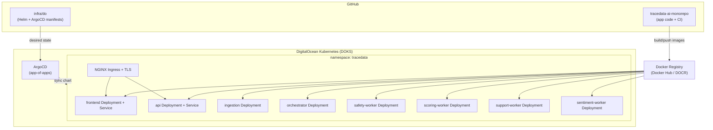
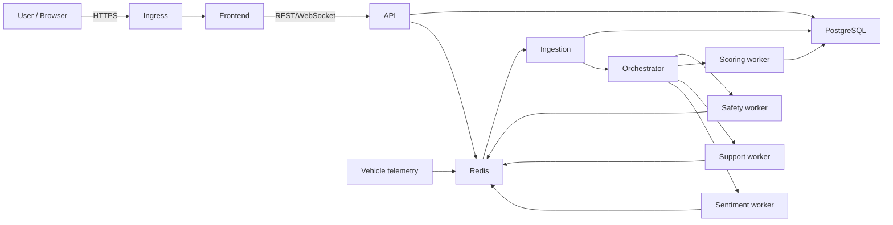
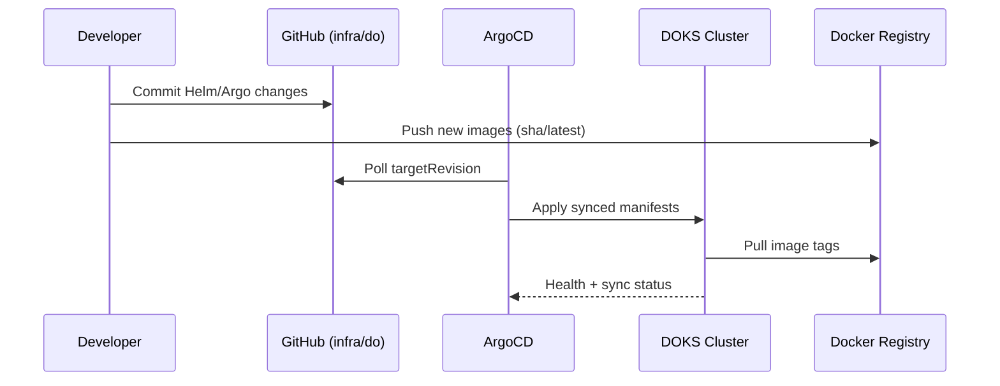
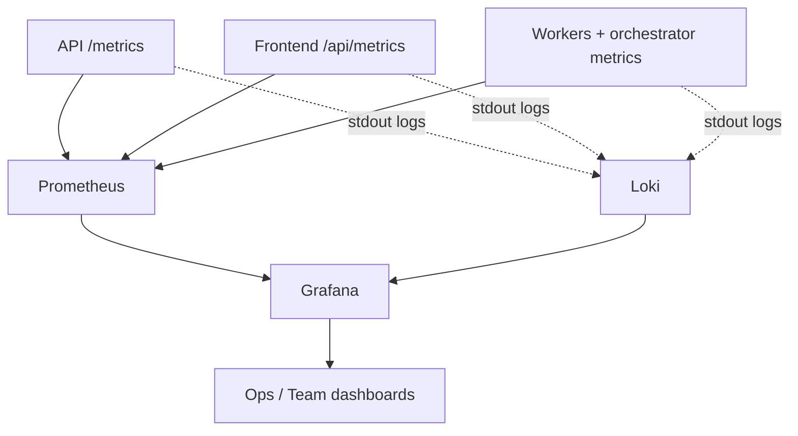

# DigitalOcean Infra (ArgoCD + Helm)

This folder is the deployment scaffold for running TraceData on DOKS with ArgoCD and Helm.

## Structure

- `argocd/root-app.yaml`: app-of-apps root.
- `argocd/apps/`: ArgoCD applications managed by the root app.
- `charts/tracedata/`: umbrella Helm chart (frontend, api, workers, ingress, hpa).
- `secrets/`: example manifests only; never store plaintext secrets in git.
- `SECRETS.md`: canonical secrets handling policy.

## Intended flow

1. CI builds and pushes images:
   - `tracedata-frontend`
   - `tracedata-backend-agent-api`
2. Update image tags in Helm values (or automate via image updater).
3. ArgoCD syncs chart to DOKS.

## ArgoCD apps in this scaffold

Apps are intentionally split to match production dependencies and sync wave order:

- `external-secrets.yaml` (wave 0)
- `monitoring-kube-prometheus-stack.yaml` (wave 1)
- `monitoring-loki.yaml` (wave 1)
- `monitoring-promtail.yaml` (wave 2)
- `tracedata-postgres.yaml` (wave 1)
- `tracedata-redis.yaml` (wave 1)
- `tracedata-platform.yaml` (wave 3)

## DOKS Architecture (self-explanatory)

### 1) Platform overview



### 2) Runtime request and processing flow



### 3) GitOps deployment flow (ArgoCD)



### 4) Observability / PLG-ready flow



## Why this layout

- **App and infra are separated**: app repo builds images; infra folder defines runtime state.
- **ArgoCD is source-of-truth sync**: cluster converges to Git state, reducing drift.
- **Workers are independently scalable**: tune replicas by agent role, not one monolith.
- **Observability is first-class**: metrics endpoints and log streams are ready for PLG in DOKS.

## Quick bootstrap checklist

1. Install ArgoCD in cluster.
2. Apply `infra/do/argocd/root-app.yaml`.
3. Apply one real `ClusterSecretStore` (template in `infra/do/secrets`).
4. Create data-chart auth secrets (`tracedata-postgres-auth`, `tracedata-redis-auth`).
5. Set real ingress DNS names in `charts/tracedata/values.yaml`.
6. Set real image repositories/tags in `charts/tracedata/values.yaml`.
7. Verify:
   - backend metrics: `/metrics`
   - frontend metrics: `/api/metrics`
   - ServiceMonitors discovered by Prometheus
   - logs visible in Loki/Grafana

## Notes

- Current chart templates are intentionally minimal and safe defaults.
- Keep production secrets out of this repo.

## Architecture explained (plain English)

Use this mental model when presenting to reviewers:

1. **Build plane (CI/CD)**  
   GitHub Actions builds and pushes two container images (`tracedata-frontend`, `tracedata-backend-agent-api`) tagged by commit SHA.

2. **Control plane (GitOps)**  
   ArgoCD watches this repo (`infra/do`) and continuously applies the desired Kubernetes state.  
   If the cluster drifts, ArgoCD reconciles it back.

3. **Runtime plane (workloads)**  
   - `frontend` serves UI.  
   - `api` exposes business endpoints and metrics.  
   - `ingestion` consumes telemetry and forwards processed events.  
   - `orchestrator` decides agent routing.  
   - worker deployments execute specialized tasks (safety, scoring, support, sentiment).  
   - `postgres` stores durable data; `redis` stores queue/context state.

4. **Edge and security plane**  
   NGINX Ingress exposes frontend/API over HTTPS with cert-manager TLS.

5. **Observability plane (PLG)**  
   Prometheus scrapes service metrics (`/metrics`, `/api/metrics`), Promtail ships logs to Loki, Grafana visualizes both.

6. **Secrets plane**  
   External Secrets Operator pulls secrets from a secret manager into Kubernetes Secrets; workloads consume only Kubernetes secrets, not plaintext files.

## Go-live TODO checklist (owner execution)

Mark each item complete before declaring online readiness.

### A) Platform prerequisites

- [ ] DOKS cluster is provisioned and reachable (`kubectl get nodes`).
- [ ] NGINX Ingress controller installed and healthy.
- [ ] cert-manager installed and cluster issuer (`letsencrypt-prod`) configured.
- [ ] ArgoCD installed and UI/API reachable.

### B) Secrets and data

- [ ] Real `ClusterSecretStore` applied from your chosen provider.
- [ ] Secret manager entries created:
  - `tracedata/database_url`
  - `tracedata/redis_url`
  - `tracedata/openai_api_key`
  - `tracedata/anthropic_api_key`
  - `tracedata/slack_webhook_url`
- [ ] `tracedata-postgres-auth` secret applied in `tracedata-data`.
- [ ] `tracedata-redis-auth` secret applied in `tracedata-data`.
- [ ] Backup policy for Postgres and Redis agreed and tested.

### C) App config and images

- [ ] `charts/tracedata/values.yaml` updated with real image repositories.
- [ ] Image tags pinned to immutable `sha-*` tags for release deploy.
- [ ] Ingress hosts set to real domains.
- [ ] TLS secret names aligned with your issuer outputs.

### D) ArgoCD sync order and health

- [ ] Apply `infra/do/argocd/root-app.yaml`.
- [ ] Confirm app sync waves execute in expected order:
  1. external-secrets
  2. monitoring + data apps
  3. tracedata-platform
- [ ] All Argo applications show `Synced` and `Healthy`.

### E) Runtime validation

- [ ] Frontend reachable via HTTPS host.
- [ ] API reachable via HTTPS host.
- [ ] Backend `/health` returns `200`.
- [ ] Backend `/metrics` returns Prometheus output.
- [ ] Frontend `/api/metrics` returns Prometheus output.
- [ ] Redis queue keys appear and update under load.
- [ ] Postgres tables are created and writable.

### F) PLG validation

- [ ] Prometheus targets show `UP` for frontend and api.
- [ ] ServiceMonitors discovered in Prometheus.
- [ ] Loki receives logs from api/frontend/workers.
- [ ] Grafana dashboards show both logs and metrics.
- [ ] At least one alert route is configured and tested.

### G) CI/CD and operations

- [ ] Docker publish workflows run successfully on `main`/`release/**`.
- [ ] Slack notifications received for CI and publish workflows.
- [ ] Rollback tested by deploying previous image SHA.
- [ ] `kubectl` runbook for common incidents documented.

### H) Final release gate

- [ ] Nightly eval workflow passes (`ci-backend-eval-nightly`).
- [ ] PR/API CI passes with rubric smoke tests.
- [ ] Known limitations are documented for reviewers.

## Day-1 command cheatsheet (10 commands)

Use these commands in order for first online bring-up.

```bash
# 1) Confirm cluster context
kubectl config current-context

# 2) Check cluster nodes
kubectl get nodes -o wide

# 3) Install/apply Argo root app (from this repo root)
kubectl apply -f infra/do/argocd/root-app.yaml

# 4) Watch Argo apps status
kubectl get applications -n argocd -w

# 5) Verify tracedata workloads
kubectl get deploy,po,svc -n tracedata

# 6) Verify data plane workloads
kubectl get deploy,sts,po,svc -n tracedata-data

# 7) Verify ingress + external IP
kubectl get ingress -A

# 8) Verify Prometheus targets/monitors
kubectl get servicemonitor -A

# 9) Quick backend health + metrics (replace host)
curl -I https://api.tracedata.example.com/health && curl -I https://api.tracedata.example.com/metrics

# 10) Quick frontend + metrics (replace host)
curl -I https://tracedata.example.com && curl -I https://tracedata.example.com/api/metrics
```

### Fast troubleshooting

```bash
# Pods not healthy
kubectl get po -A | grep -E "CrashLoopBackOff|Error|ImagePullBackOff"

# Recent events for tracedata namespace
kubectl get events -n tracedata --sort-by=.lastTimestamp | tail -n 30

# Tail api logs
kubectl logs -n tracedata deploy/api -f --since=10m

# Force Argo sync for one app
kubectl annotate application tracedata-platform -n argocd argocd.argoproj.io/refresh=hard --overwrite
```

## If you forgot everything: exact recovery path

Use this section as a deterministic rebuild guide from scratch.

### 1) Where to go first (external systems)

1. **DigitalOcean Control Panel**
   - Go to **Kubernetes**: confirm cluster exists and node pool is healthy.
   - Go to **Networking / DNS**: note A records for:
     - `tracedata.example.com` (frontend)
     - `api.tracedata.example.com` (backend)
     - `grafana.tracedata.example.com` (optional)
2. **Docker Hub (or DOCR)**
   - Confirm repos/tags exist:
     - `tracedata-frontend`
     - `tracedata-backend-agent-api`
   - Note the SHA tags you want to deploy.
3. **Secret manager** (AWS/GCP/Vault/1Password/Doppler)
   - Confirm these keys exist and have valid values:
     - `tracedata/database_url`
     - `tracedata/redis_url`
     - `tracedata/openai_api_key`
     - `tracedata/anthropic_api_key`
     - `tracedata/slack_webhook_url`

### 2) Files you MUST update in this repo

#### A. Argo source-of-truth

- `infra/do/argocd/root-app.yaml`
  - `spec.source.repoURL` -> your actual git repo URL
  - `spec.source.targetRevision` -> branch to deploy (usually `main`)

- `infra/do/argocd/apps/tracedata-platform.yaml`
  - `spec.source.repoURL` -> same repo URL
  - `spec.source.targetRevision` -> same deploy branch

#### B. Core runtime values

- `infra/do/charts/tracedata/values.yaml`
  - `images.frontend.repository`
  - `images.frontend.tag` (prefer `sha-*`)
  - `images.backend.repository`
  - `images.backend.tag` (prefer `sha-*`)
  - `ingress.frontendHost`
  - `ingress.apiHost`
  - `ingress.tlsSecretFrontend`
  - `ingress.tlsSecretApi`
  - `ingress.annotations.cert-manager.io/cluster-issuer` (if issuer name differs)

#### C. Secrets provider bridge

- `infra/do/secrets/cluster-secret-store.example.yaml`
  - Copy to a real manifest (do not keep secrets in git)
  - Set provider type/region/auth references to your environment
  - Apply it to cluster as `ClusterSecretStore` named `tracedata-cluster-secrets`

#### D. Data chart auth secrets

- `infra/do/secrets/tracedata-postgres-auth.example.yaml`
- `infra/do/secrets/tracedata-redis-auth.example.yaml`
  - Copy to local private files (ignored) and apply to cluster
  - Keep names the same unless you also change Argo chart values

### 3) Optional files if your environment differs

- `infra/do/argocd/apps/monitoring-kube-prometheus-stack.yaml`
  - Grafana ingress host/TLS secret
  - Prometheus release labels if your stack uses different selectors

- `infra/do/argocd/apps/tracedata-postgres.yaml`
  - storage size, resource requests/limits

- `infra/do/argocd/apps/tracedata-redis.yaml`
  - storage size, resource requests/limits

### 4) One-shot bring-up sequence

From repo root:

```bash
# 1) Apply root app
kubectl apply -f infra/do/argocd/root-app.yaml

# 2) Apply secret-store (your real file, not example)
kubectl apply -f infra/do/secrets/cluster-secret-store.local.yaml

# 3) Apply data auth secrets (your local private copies)
kubectl apply -f infra/do/secrets/tracedata-postgres-auth.private.yaml
kubectl apply -f infra/do/secrets/tracedata-redis-auth.private.yaml

# 4) Watch Argo converge
kubectl get applications -n argocd -w
```

### 5) What “done” looks like

- `kubectl get applications -n argocd` -> all `Synced` + `Healthy`
- `kubectl get po -n tracedata` -> no crash loops
- `https://api.<your-domain>/health` -> 200
- `https://api.<your-domain>/metrics` -> Prometheus text
- `https://<your-domain>/api/metrics` -> Prometheus text

### 6) What NOT to do

- Do not commit real `.env` or plaintext secret YAML.
- Do not deploy `latest` tags for final review; pin `sha-*`.
- Do not change secret names casually unless you also update chart/app references.

