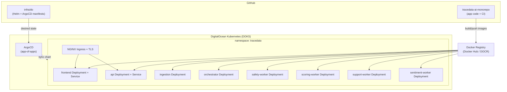
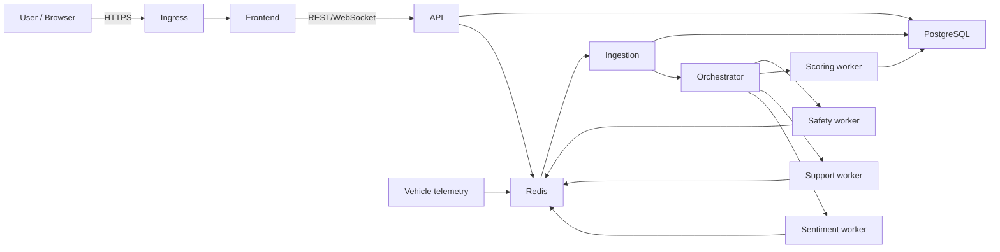
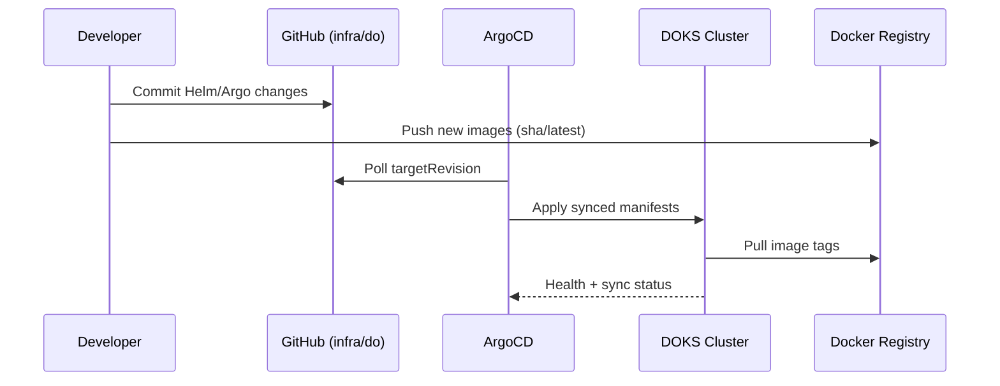
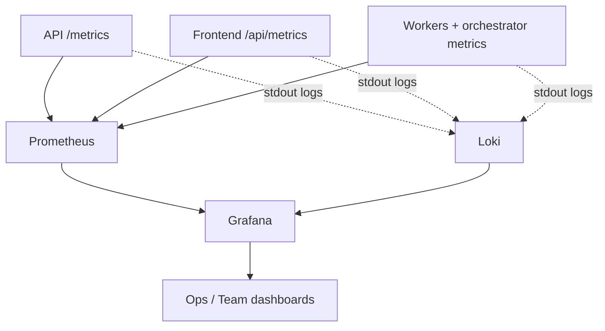

# DigitalOcean Infra (ArgoCD + Helm)

This folder is the deployment scaffold for running TraceData on DOKS with ArgoCD and Helm.

## Structure

- `argocd/root-app.yaml`: app-of-apps root.
- `argocd/apps/`: ArgoCD applications managed by the root app.
- `charts/tracedata/`: umbrella Helm chart (frontend, api, workers, ingress, hpa).
- `secrets/`: example manifests only; never store plaintext secrets in git.
- `SECRETS.md`: canonical secrets handling policy.

## Intended flow

1. CI builds and pushes images:
   - `tracedata-frontend`
   - `tracedata-backend-agent-api`
2. Update image tags in Helm values (or automate via image updater).
3. ArgoCD syncs chart to DOKS.

## ArgoCD apps in this scaffold

Apps are intentionally split to match production dependencies and sync wave order:

- `external-secrets.yaml` (wave 0)
- `monitoring-kube-prometheus-stack.yaml` (wave 1)
- `monitoring-loki.yaml` (wave 1)
- `monitoring-promtail.yaml` (wave 2)
- `tracedata-postgres.yaml` (wave 1)
- `tracedata-redis.yaml` (wave 1)
- `tracedata-platform.yaml` (wave 3)

## DOKS Architecture (self-explanatory)

### 1) Platform overview

### 2) Runtime request and processing flow

### 3) GitOps deployment flow (ArgoCD)

### 4) Observability / PLG-ready flow

## Why this layout

- **App and infra are separated**: app repo builds images; infra folder defines runtime state.
- **ArgoCD is source-of-truth sync**: cluster converges to Git state, reducing drift.
- **Workers are independently scalable**: tune replicas by agent role, not one monolith.
- **Observability is first-class**: metrics endpoints and log streams are ready for PLG in DOKS.

## Quick bootstrap checklist

1. Install ArgoCD in cluster.
2. Apply `infra/do/argocd/root-app.yaml`.
3. Apply one real `ClusterSecretStore` (template in `infra/do/secrets`).
4. Create data-chart auth secrets (`tracedata-postgres-auth`, `tracedata-redis-auth`).
5. Set real ingress DNS names in `charts/tracedata/values.yaml`.
6. Set real image repositories/tags in `charts/tracedata/values.yaml`.
7. Verify:
   - backend metrics: `/metrics`
   - frontend metrics: `/api/metrics`
   - ServiceMonitors discovered by Prometheus
   - logs visible in Loki/Grafana

## Notes

- Current chart templates are intentionally minimal and safe defaults.
- Keep production secrets out of this repo.

