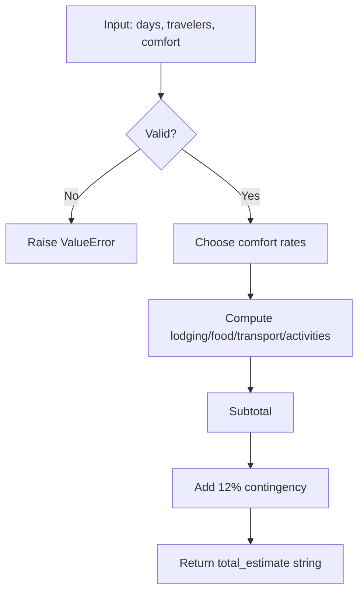
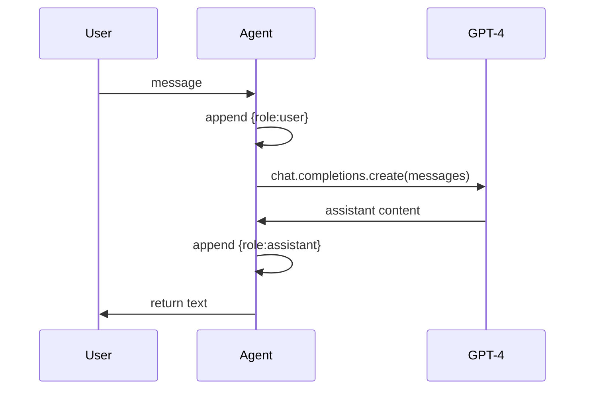
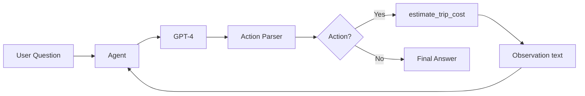

# `0_simple_agent.ipynb` Code Walkthrough

This document explains the code in `0_simple_agent.ipynb` step by step.

## What this notebook demonstrates

It builds a minimal ReAct-style agent loop in plain Python:

- an OpenAI chat client (`gpt-4`),
- one callable action (`estimate_trip_cost`),
- an `Agent` class that stores conversation history,
- manual and automated Thought/Action/Observation execution.

## 0) Setup

The first cell includes an optional install command:

- `#pip install -q openai python-dotenv`

This is commented because it is only needed in a fresh environment.

## 1) Imports

The notebook imports:

- `os` for environment variable access,
- `load_dotenv` from `python-dotenv`,
- `OpenAI` client SDK.

## 2) Environment and client initialization

The notebook supports two ways to provide API keys:

- local: `load_dotenv()` reads `.env`,
- Colab: set `os.environ["OPENAI_API_KEY"]` manually (commented example).

Then it initializes:

- `llm_name = "gpt-4"`
- `openai_key = os.getenv("OPENAI_API_KEY")`
- `client = OpenAI(api_key=openai_key)`

## 3) Tool function: `estimate_trip_cost`

This function is the only executable action available to the agent.

Inputs:

- `days: int`
- `travelers: int`
- `comfort: str = "mid"` where comfort is `budget | mid | premium`

Validation:

- raises `ValueError` if `days <= 0` or `travelers <= 0`
- raises `ValueError` if comfort is not one of allowed values

Budget logic:

- picks per-person-per-day rates for lodging, food, transport, activities based on comfort
- computes totals by multiplying each rate by `travelers * days`
- adds a 12% contingency buffer

Output:

- returns a string: `"total_estimate: <number>"`

Registration:

- `known_actions = {"estimate_trip_cost": estimate_trip_cost}`



## 4) Custom `Agent` class

The `Agent` class wraps chat completion calls and stores full message history.

Key methods:

- `__init__(system="")`
  - initializes `self.messages`
  - if system prompt exists, appends it as the first message
- `__call__(message)`
  - appends user message
  - calls `self.execute()`
  - appends assistant reply
  - returns assistant text
- `execute()`
  - calls `client.chat.completions.create(...)`
  - sends full `self.messages` each time
  - returns `response.choices[0].message.content`



## Prompt design

The prompt instructs the model to follow:

- `Thought`
- `Action`
- `Observation`
- final `Answer`

It also explicitly declares available action syntax:

- `estimate_trip_cost: 2, 2, "mid"`

This is important because downstream parsing expects this format.

## 5) Simple query section

`agent = Agent(system=prompt)` creates an agent instance.

Then one direct question is sent:

- `"a 2-day Tokyo trip for 2 adults..."`

The nearby cells showing manual observation passing are currently commented out. They are examples of how to continue the loop by hand.

## 6) Complex query section

A comparison question is asked:

- Tokyo 2-day mid comfort vs Malaysia 3-day premium comfort.

Some follow-up manual steps are also present but commented out. Those cells are scaffold code for manual tool-observation cycles.

## 7) Automated loop with `query(...)`

This is the core automation part.

Regex parsers:

- `action_re = r"^Action: (\w+): (.*)$"`
- `param_re` validates `days, travelers, comfort`

Loop behavior in `query(question, max_turns=10)`:

1. create fresh `Agent(prompt)`
2. send `next_prompt`
3. parse assistant output for `Action:` line
4. if action found:
   - parse parameters
   - execute `known_actions[action](...)`
   - send next prompt as `Observation: ...`
5. if no action found:
   - stop (final answer reached)

```mermaid
flowchart TD
    S([Start question]) --> I[Create Agent with prompt]
    I --> L{i < max_turns?}
    L -->|No| E([Stop])
    L -->|Yes| C[Call bot(next_prompt)]
    C --> P[Parse Action line]
    P --> A{Action found?}
    A -->|No| R([Return final answer])
    A -->|Yes| V[Validate and parse params]
    V --> X[Execute known action]
    X --> O[Build Observation prompt]
    O --> L
```

## End-to-end architecture



## Notes about current notebook state

- The notebook uses plain OpenAI calls, not LangGraph.
- Tool invocation is text-parsed, so formatting consistency of `Action:` lines matters.
- Several cells in sections 5 and 6 are intentionally commented to show optional manual execution steps.

## Summary

`0_simple_agent.ipynb` is a foundational example of a hand-rolled tool-using agent:

- keep conversation state in Python lists,
- ask model to emit action commands,
- run Python functions,
- feed results back as observations,
- stop when no action remains.
