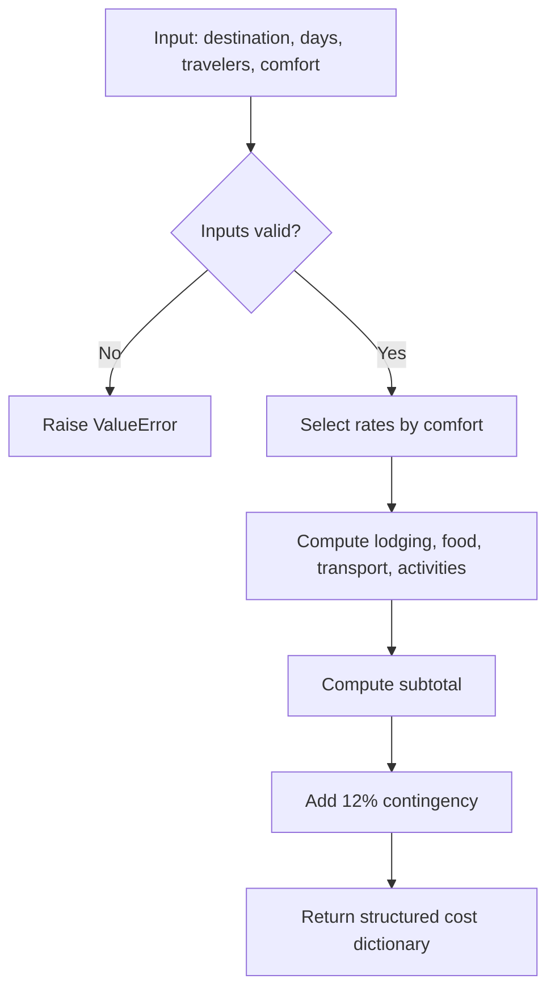
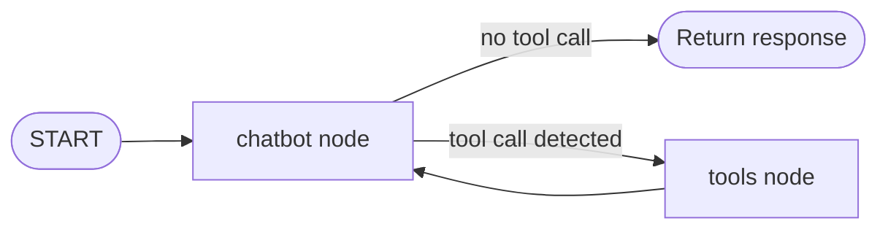
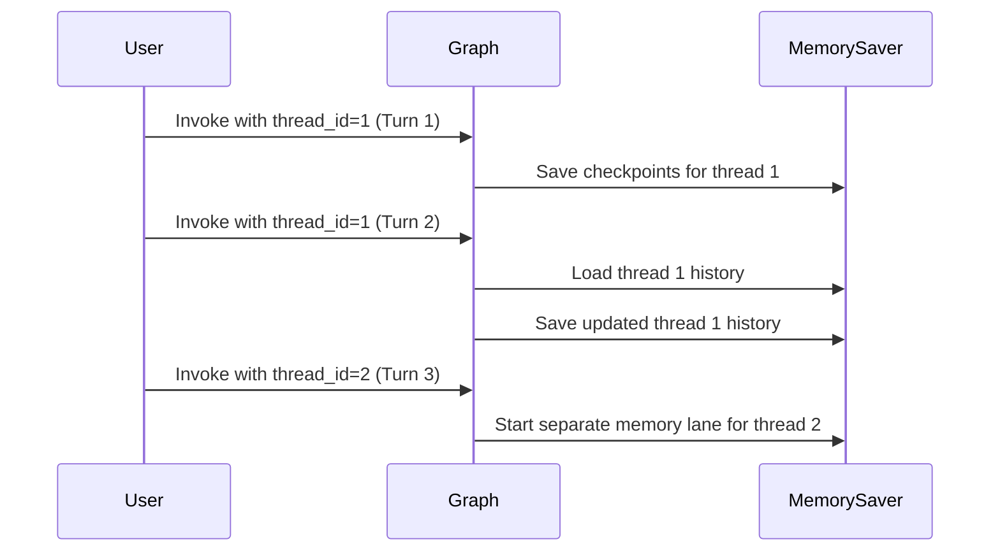
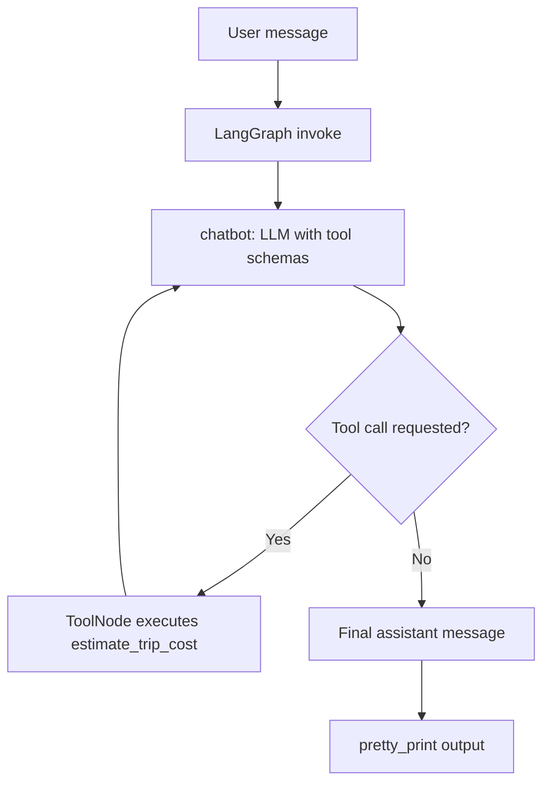

# Stage 1: Single Agent (LLM + Memory + Tools)

This document explains the notebook `1_single_agent_travel.ipynb` section by section.

## What this notebook builds

It builds a single travel-planning agent with:

- an LLM (`ChatOpenAI`) to reason and generate replies,
- a custom tool (`estimate_trip_cost`) to compute trip budgets,
- conversation memory (`MemorySaver`) keyed by `thread_id`,
- a LangGraph loop (`chatbot -> tools -> chatbot`) so the model can call tools and continue reasoning.

---

## 1) Imports

The notebook imports:

- environment helpers: `os`, `load_dotenv`
- typing helpers: `TypedDict`, `Annotated`, `List`, etc.
- LangChain/LangGraph pieces:
  - `ChatOpenAI` for the model
  - `ToolNode`, `tools_condition` for tool execution and routing
  - `StateGraph`, `START` for graph definition
  - `add_messages` for append-only message state
  - `MemorySaver` for checkpointed conversation memory
- `@tool` decorator to turn a Python function into a callable model tool.

---

## 2) Environment setup

`load_dotenv()` loads `OPENAI_API_KEY` from `.env` for local runs.

A commented fallback is included for Colab:

- set `os.environ["OPENAI_API_KEY"] = "Your_API_Key"`

---

## 3) System prompt (`SYSTEM`)

The system prompt defines agent behavior:

- role: travel planning agent
- constraints: do not invent facts; use search when fresh facts are needed
- tool policy: when user asks total cost, always call `estimate_trip_cost`
- special rule: "add additional one day trip" means add +1 day unless user says replacement
- output format: day-by-day plan + total cost with assumptions

This prompt is critical because it controls tool-usage intent and output consistency.

---

## 4) Tool: `estimate_trip_cost`

### Purpose

Computes a heuristic trip budget in SGD from:

- `destination`
- `days`
- `travelers`
- `comfort` (`budget`, `mid`, `premium`)

### Validation

- `days` and `travelers` must be > 0
- `comfort` must be one of allowed values

### Cost model

Per-person-per-day rates are selected by comfort level, then multiplied by:
`rate * travelers * days`

Categories:

- lodging
- food
- local transport
- activities

Then:

- subtotal = sum of categories
- contingency = 12% of subtotal (rounded)
- total = subtotal + contingency

Returns a structured dictionary including full breakdown and note about exclusions.

### Mermaid: tool logic



---

## Helper: `pretty_print(response)`

`graph.invoke(...)` returns a message list. The helper:

- gets the latest message (`response["messages"][-1]`)
- handles either plain string content or block-style list content
- prints only human-readable text

This prevents noisy raw object printing.

---

## 5) Build the LangGraph loop

### State definition

```python
class State(TypedDict):
    messages: Annotated[List[AnyMessage], add_messages]
```

`add_messages` makes message history append-only and compatible with iterative tool loops.

### Model and tools binding

- `tools = [estimate_trip_cost]`
- `web_tool = {"type": "web_search_preview"}`
- `llm = ChatOpenAI(model="gpt-4.1-mini", temperature=0)`
- `llm_with_tools = llm.bind_tools([web_tool] + tools)`

This gives the model access to both web search and your custom trip-cost function.

### Node functions and graph

- `chatbot(state)` calls the model with state messages
- `ToolNode(tools)` executes tool calls emitted by the model

Edges:

- `START -> chatbot`
- `chatbot --(if tool call exists)--> tools`
- `tools -> chatbot` (must be enabled for a complete loop)

Important note from your notebook:

- the line `builder.add_edge("tools", "chatbot")` is currently commented and should be uncommented for proper tool->model round-trips.

### Mermaid: graph routing



---

## Memory and threads

`memory = MemorySaver()` and `graph = builder.compile(checkpointer=memory)` enable per-thread conversation persistence.

The key is `config = {"configurable": {"thread_id": "..."}}`.

- Same `thread_id` => prior conversation context is remembered.
- Different `thread_id` => new conversation context.

### Mermaid: memory behavior



---

## 6) Run section (multi-turn demo)

The notebook demonstrates four turns:

1. Turn 1 (`thread_id = 1`):
   - includes system + user message
   - generates an initial travel plan

2. Turn 2 (`thread_id = 1`):
   - same thread, so prior context is available
   - asks to add one extra day and requests total cost

3. Turn 3 (`thread_id = 2`):
   - new thread, memory from thread 1 is not available
   - no explicit system message provided in this turn

4. Turn 4 (`thread_id = 3`):
   - new thread again
   - includes system message explicitly, so behavior is re-anchored

This section proves the difference between:

- continuity via same thread id
- reset behavior via new thread id.

---

## Practical fixes and best practices

- Uncomment `builder.add_edge("tools", "chatbot")` so tool results can flow back into model reasoning.
- Keep the system prompt on the first message of each new thread.
- Continue using a stable thread id for real chat sessions.
- For reproducibility, keep `temperature=0` (already done).

---

## End-to-end mental model



In short: the notebook is a clean baseline for a tool-augmented, memory-aware single agent using LangGraph.
