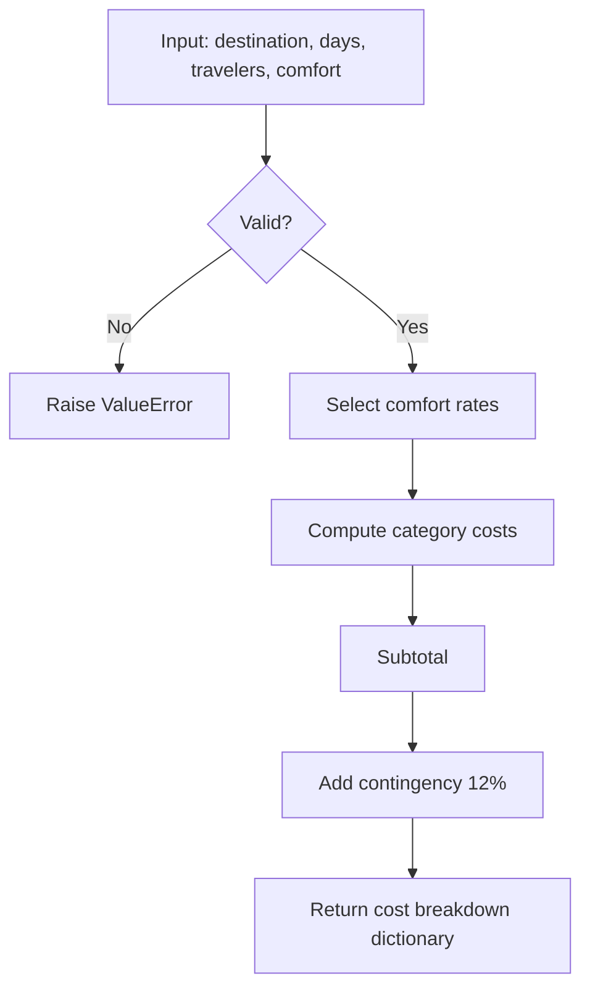
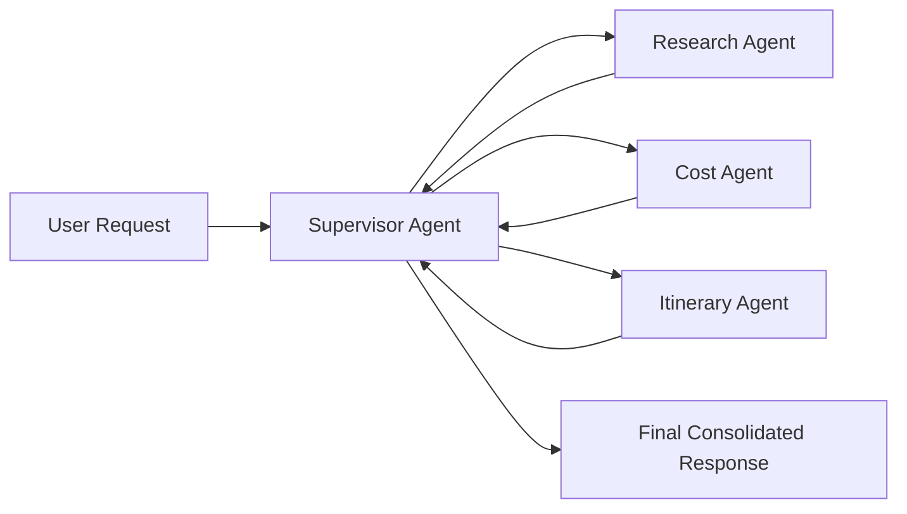
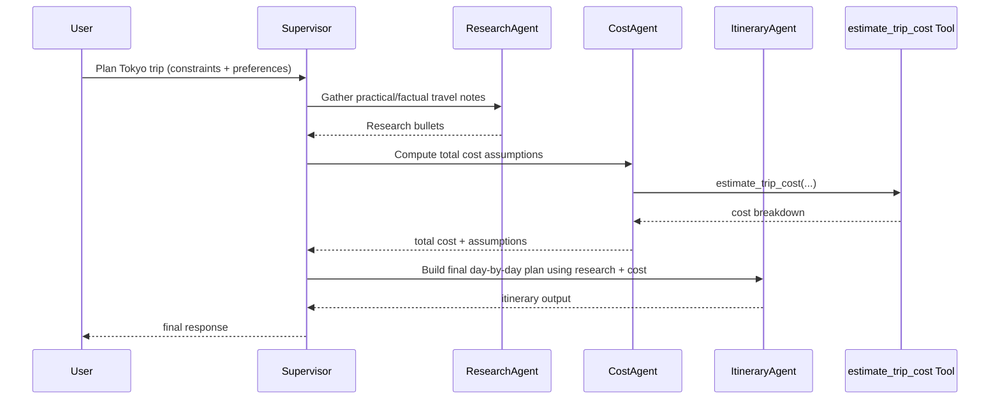

# `2_multi_agent_supervisor.ipynb` Code Walkthrough

This document explains `day-2/2_multi_agent_supervisor.ipynb` section by section.

## What this notebook builds

It builds a multi-agent travel planner using a supervisor pattern:

- specialist agents for research, cost, and itinerary,
- one local pricing tool (`estimate_trip_cost`),
- shared memory via `MemorySaver`,
- a supervisor that routes tasks to the right specialist.

---

## 0) Dependency setup

The first code cell contains a commented install command:

- `#!pip -q install langchain langchain-openai langgraph langgraph-supervisor python-dotenv`

Use it only in a fresh environment.

---

## 1) Imports

Core imports:

- `ChatOpenAI` for LLM calls
- `create_supervisor` from `langgraph_supervisor`
- `create_react_agent` for each specialist agent
- `MemorySaver` for persistent conversation memory/checkpointing
- `@tool` for local callable tools
- `dotenv` and `os` for API key loading

---

## 2) Environment loading

`load_dotenv()` loads `OPENAI_API_KEY` from local `.env`.

A commented Colab fallback is included:

- `#os.environ["OPENAI_API_KEY"] = "Your_API_Key"`

Then:

- `checkpointer = MemorySaver()`

This checkpointer is reused by specialist agents so they can retain thread context.

---

## 3) `pretty_print(response)` helper

The helper prints only the final text response:

- reads the last message in `response["messages"]`
- supports both plain-string and list-of-blocks content
- joins text blocks when needed

This keeps output readable in notebooks.

---

## 4) Local tool: `estimate_trip_cost`

Purpose:

- deterministic heuristic cost estimator in SGD.

Inputs:

- `destination`, `days`, `travelers`, `comfort`

Validation:

- days/travelers must be positive
- comfort must be one of `budget|mid|premium`

Calculation:

- chooses per-person-per-day rates by comfort
- computes category totals: lodging, food, local transport, activities
- adds 12% contingency
- returns a structured dictionary with breakdown and `total_estimate`

---

## 5) Specialist agents

The notebook defines three ReAct agents with narrow responsibilities.

### 5.1 `research_agent`

System prompt goal:

- gather factual, practical travel info using web search
- no cost computation
- output max 5 concise bullets

Configuration:

- model: `gpt-4.1-mini` with `temperature=0.2`
- tools: `[{"type": "web_search_preview"}]`
- uses shared `checkpointer`

### 5.2 `cost_agent`

System prompt goal:

- compute total cost only
- never invent numbers
- ask up to 2 questions if required parameters are missing

Configuration:

- model: `gpt-4.1-mini` with `temperature=0.1`
- tools: `[estimate_trip_cost]`
- uses shared `checkpointer`

### 5.3 `itinerary_agent`

System prompt goal:

- produce final day-by-day itinerary and include cost assumptions
- do not invent numeric costs
- ask up to 2 questions if cost info is missing

Configuration:

- model: `gpt-4.1-mini` with `temperature=0.4`
- tools: `[]`
- uses shared `checkpointer`

Why split agents:

- clear separation of concerns,
- lower chance of mixing research/cost logic,
- easier prompt control and debugging.

---

## 6) Supervisor workflow

`SUPERVISOR_SYSTEM` defines orchestration behavior:

- collect requirements
- delegate research
- delegate cost estimation
- generate final itinerary

Then `create_supervisor(...)` wires all specialists:

- `[research_agent, cost_agent, itinerary_agent]`
- supervisor model: `gpt-4o`
- prompt: `SUPERVISOR_SYSTEM`

Conceptually, the supervisor acts as a router + coordinator.

---

## 7) Demo run

The notebook executes:

1. `app = workflow.compile()`
2. define `user_prompt`
3. `result = app.invoke({"messages": [{"role": "user", "content": user_prompt}]})`
4. `pretty_print(result)`

Expected behavior:

- supervisor receives the request,
- delegates sub-tasks to specialists,
- merges outputs into final response.

---

## End-to-end execution view

---

## Notes and gotchas

- Reusing one `MemorySaver` across agents can help continuity, but thread/config management remains important for predictable context.
- Prompt guardrails are strong, but you still get best reliability when user requests include explicit destination, days, travelers, and comfort.
- Keeping cost logic inside a tool reduces numeric hallucination risk versus free-form model arithmetic.

---

## Summary

`2_multi_agent_supervisor.ipynb` demonstrates a production-like multi-agent orchestration pattern:

- specialist agents with focused prompts,
- deterministic tool-backed costing,
- a supervisor for delegation and synthesis,
- cleaner separation between fact gathering, computation, and final narrative output.
