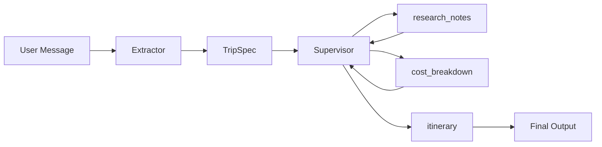
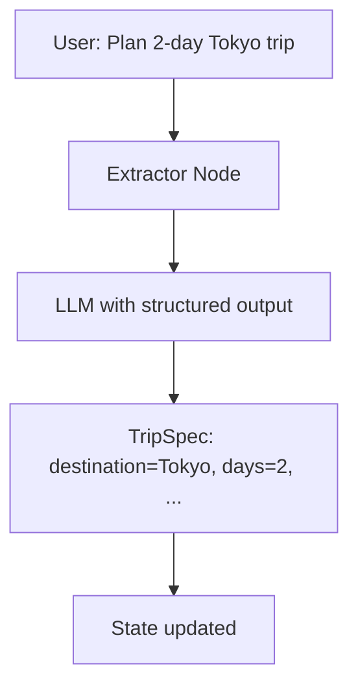
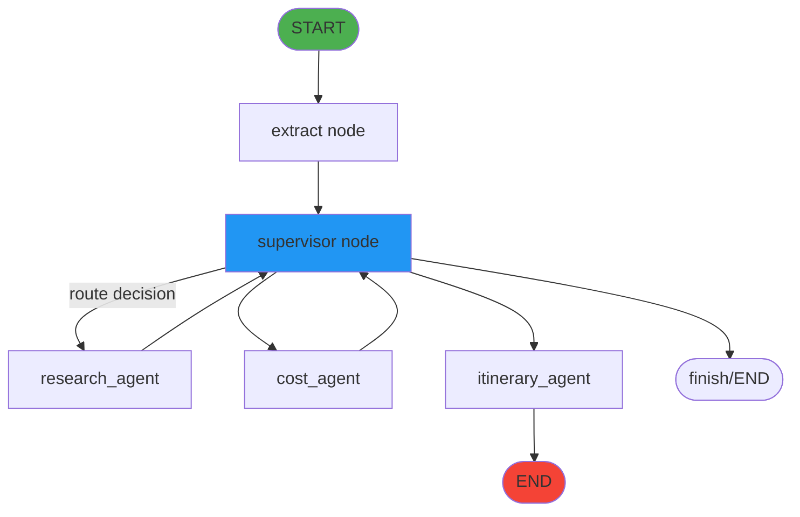
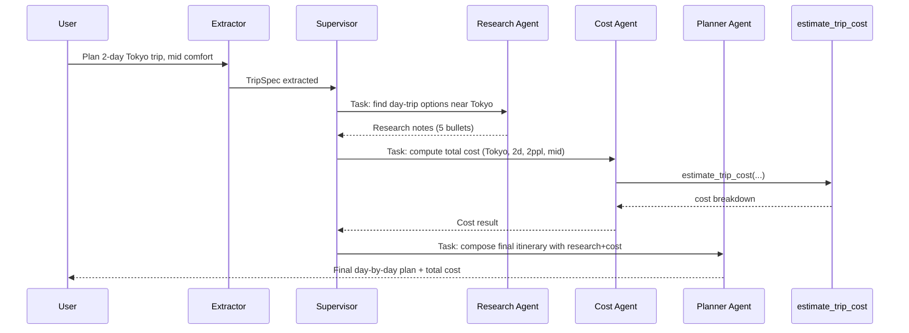

# `2_multi_agent_travel.ipynb` Code Walkthrough

This document explains `day-2/2_multi_agent_travel.ipynb` section by section.

## What this notebook builds

An advanced multi-agent travel planner with:

- custom shared state with structured trip specifications,
- automatic parameter extraction from user messages,
- a supervisor agent that routes tasks dynamically,
- three specialist agents (research, cost, itinerary),
- conditional graph routing with feedback loops,
- persistent memory via checkpointing.

This is a production-grade example showing explicit state management and control flow.

---

## 0) Dependency setup

Commented install command:

- `#!pip -q install langgraph langchain-openai openai python-dotenv pydantic`

Use only in fresh environments.

---

## 1) Imports

Key imports:

- `TypedDict`, `Literal` for state schema definitions
- `ChatOpenAI`, `SystemMessage`, `HumanMessage`, `AIMessage`
- `StateGraph`, `START`, `END` for graph construction
- `create_react_agent` for specialist agent creation
- `MemorySaver` for checkpointing
- `add_messages` for append-only message state
- `@tool` for callable functions

---

## 2) Environment loading

Standard pattern:

- `load_dotenv()` for local `.env` API key
- commented Colab fallback for manual key setting

---

## 3) Shared state and helpers

### State schema

```python
class TripSpec(TypedDict, total=False):
    destination: str
    days: int
    travelers: int
    comfort: str               # budget|mid|premium
    preferences: str
    total_days: int
```

```python
class State(TypedDict):
    messages: Annotated[List[AnyMessage], add_messages]
    trip_spec: TripSpec
    research_notes: str
    cost_breakdown: Dict[str, Any]
    itinerary: str
    task: str                  # message from supervisor to next specialist
    next: Optional[str]        # routing decision
```

Why this matters:

- `trip_spec` is a structured container for extracted parameters
- `research_notes`, `cost_breakdown`, `itinerary` accumulate specialist outputs
- `task` and `next` enable supervisor control flow

### Helper functions

- `pretty_print(response)`: extracts and prints final message
- `msg_text(msg)`: safely extracts text from message content (handles block-style and plain string)



---

## 4) Local tool: `estimate_trip_cost`

Same as previous notebooks:

- inputs: `destination`, `days`, `travelers`, `comfort`
- validation: positive numbers, valid comfort level
- calculation: per-person-per-day rates × travelers × days + 12% contingency
- output: structured dictionary with breakdown

---

## 5) Memory initialization

`checkpointer = MemorySaver()`

This checkpointer is reused across all agents and the graph, enabling multi-turn conversations.

---

## 6) Specialist agents

### `research_agent`

- model: `gpt-4.1-mini`, `temperature=0.2`
- tools: `[{"type": "web_search_preview"}]`
- prompt: gather factual, practical travel info; max 5 bullets; no cost computation

### `cost_agent`

- model: `gpt-4.1-mini`, `temperature=0.1`
- tools: `[estimate_trip_cost]`
- prompt: compute total cost using tool; never invent numbers

### `itinerary_agent` (PlannerAgent)

- model: `gpt-4.1-mini`, `temperature=0.4`
- tools: `[]`
- prompt: produce final day-by-day plan using `trip_spec` + `research_notes` + `cost_breakdown`

All agents use `create_react_agent` and share the checkpointer.

---

## 7) Supervisor agent

`supervisor_agent` is also a ReAct agent but with routing responsibility:

- model: `gpt-4.1-mini`, `temperature=0`
- tools: `[]`
- prompt: coordinator that decides `next` step and crafts `task` messages

Key rules:

- never guess missing numbers
- route to research for day-trip options
- route to cost when params exist
- route to planner when research + cost exist
- output strict JSON: `{"next": ..., "task": ...}`

This is the control brain of the workflow.

---

## 8) Extractor node: `extract_trip_spec_node`

Purpose: parse user message into structured `TripSpec`.

How it works:

1. reads last user message
2. uses `ChatOpenAI(...).with_structured_output(TripSpec)`
3. prompts model to extract destination, days, travelers, comfort, preferences
4. returns updated `trip_spec`

This is a critical step: converting natural language into structured parameters early.



---

## 9) Supervisor node: `supervisor_agent_node`

This node wraps the supervisor agent and interprets its JSON output.

Process:

1. builds context prompt with `trip_spec`, `have_research`, `have_cost`, last user message
2. invokes `supervisor_agent`
3. parses JSON response for `next` and `task`
4. handles JSON parse errors gracefully (fallback to planner)
5. returns `{"next": ..., "task": ...}`

This enables dynamic routing based on current state.

---

## 10) Specialist nodes

### `research_node`

- reads `task` from state
- invokes `research_agent`
- extracts text output
- returns:
  - `research_notes` (overwrites or initializes)
  - appends AI message

### `cost_node`

- checks if required trip_spec fields exist
- if missing, returns error message
- otherwise invokes `cost_agent` with task
- returns:
  - `cost_breakdown`
  - appends AI message

### `itinerary_node`

- enriches `task` with full context: trip_spec, research_notes, cost_breakdown
- invokes `itinerary_agent`
- returns:
  - `itinerary`
  - appends AI message

All nodes append messages for conversation continuity.

---

## 11) Graph construction

```python
builder = StateGraph(State)
builder.add_node("extract", extract_trip_spec_node)
builder.add_node("supervisor", supervisor_agent_node)
builder.add_node("research_agent", research_node)
builder.add_node("cost_agent", cost_node)
builder.add_node("itinerary_agent", itinerary_node)
```

### Edges

- `START -> extract`
- `extract -> supervisor`
- `supervisor -> [research_agent | cost_agent | itinerary_agent | finish]` (conditional)
- `research_agent -> supervisor`
- `cost_agent -> supervisor`
- `itinerary_agent -> END`

Why this structure:

- every request starts with extraction
- supervisor decides next step
- specialists loop back to supervisor for re-evaluation
- planner is terminal (goes to END)



### Routing function

```python
def route(state: State):
    return state.get("next", "itinerary_agent")
```

Reads `next` from state (set by supervisor node) to determine edge.

---

## 12) Demo run

Configuration:

- `config_a = {"configurable": {"thread_id": "A"}}`
- user prompt: plan 2-day Tokyo trip

Execution:

1. `graph.invoke({"messages": [...]}, config=config_a)`
2. flow: extract → supervisor → research/cost → supervisor → planner → END
3. `pretty_print(resp1)` shows final itinerary

---

## End-to-end execution flow



---

## Key design patterns

### 1. Explicit state management

- structured `TripSpec` prevents parameter drift
- separate fields for research, cost, itinerary outputs

### 2. Supervisor-driven routing

- supervisor agent makes routing decisions based on state
- eliminates hardcoded control flow
- flexible: can adapt to multi-turn clarifications

### 3. Feedback loops

- specialists return to supervisor after each task
- supervisor re-evaluates and decides next step
- enables iterative refinement

### 4. Separation of concerns

- extractor: parameter extraction
- supervisor: orchestration
- specialists: focused execution
- graph: wiring and persistence

---

## Comparison with `2_multi_agent_supervisor.ipynb`

| Aspect       | Supervisor (built-in)     | This notebook (custom)            |
| ------------ | ------------------------- | --------------------------------- |
| State        | implicit message history  | explicit TripSpec + fields        |
| Routing      | built-in supervisor logic | custom supervisor agent node      |
| Extraction   | none                      | dedicated extractor node          |
| Control flow | framework-managed         | graph edges + conditional routing |
| Complexity   | simpler setup             | more control, more code           |

---

## Notes and gotchas

- The supervisor must output valid JSON. Parse errors are handled but reduce reliability.
- `with_structured_output(TripSpec)` requires a model that supports structured outputs or function calling.
- Looping back through supervisor means multiple LLM calls, which increases cost but improves flexibility.
- Missing trip_spec fields cause the cost_node to return early, preventing hallucination.

---

## Summary

`2_multi_agent_travel.ipynb` demonstrates:

- production-grade multi-agent orchestration with explicit state,
- dynamic supervisor-driven routing,
- parameter extraction and validation,
- feedback loops for iterative task execution,
- clean separation between coordination and execution logic.

This is a scalable pattern for complex agent workflows where control flow depends on evolving state.
