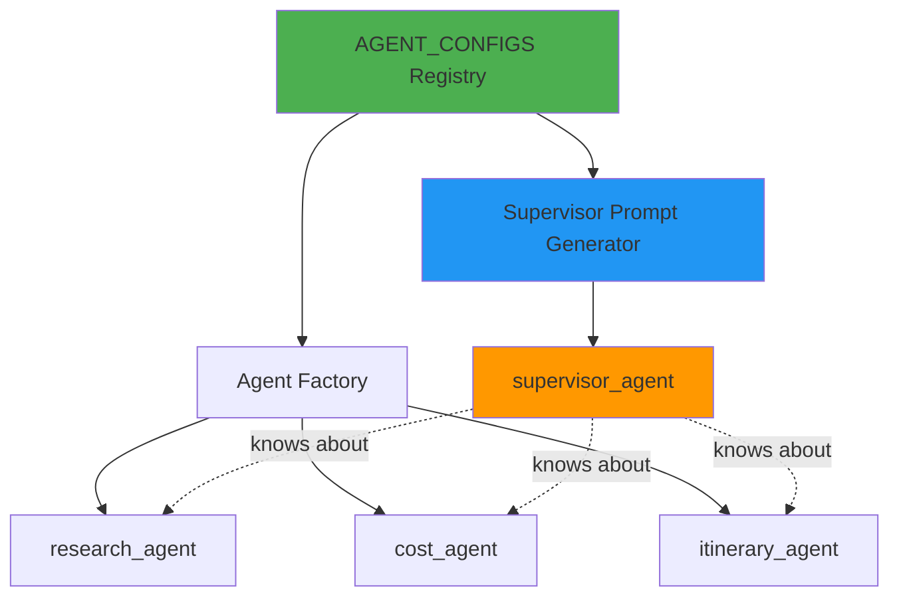

# Configuration-Driven Agent Registry Pattern

This document explains how to refactor a multi-agent system to use a configuration-driven agent registry, where agent capabilities are automatically bubbled up to the supervisor.

## Problem statement

In the original `2_multi_agent_travel.ipynb`, agent capabilities are hardcoded in the supervisor prompt:

- if you add/remove agents, you must update multiple locations,
- agent descriptions can drift between definition and supervisor awareness,
- no runtime discoverability of agents.

## Solution: Agent registry as single source of truth

Create a central registry that drives both:

1. agent instantiation,
2. supervisor prompt generation.

---

## 1) Agent configuration schema

```python
from dataclasses import dataclass
from typing import List, Any, Callable

@dataclass
class AgentConfig:
    """Configuration for a single specialist agent."""
    name: str
    system_prompt: str
    capabilities: str          # human-readable one-liner
    tools: List[Any]
    model_name: str = "gpt-4.1-mini"
    temperature: float = 0.2
```

---

## 2) Define agent registry

```python
from langchain_core.tools import tool
from typing import Dict, Any

# Tool definition (same as before)
@tool
def estimate_trip_cost(
    destination: str,
    days: int,
    travelers: int,
    comfort: str = "mid",
) -> Dict[str, Any]:
    """Estimate trip budget (SGD). Excludes flights/insurance/visa."""
    # ... implementation
    pass

# Agent registry
AGENT_CONFIGS = {
    "research": AgentConfig(
        name="research_agent",
        system_prompt="""You are ResearchAgent.
Your ONLY job: gather factual, practical travel info using web search.
Rules:
- Use web search when needed.
- Do NOT estimate or compute cost.
- Output ONLY 5 bullets max.
- Each bullet: destination + why + travel time + one practical note.""",
        capabilities="Find factual travel info via web search (no cost estimation)",
        tools=[{"type": "web_search_preview"}],
        temperature=0.2
    ),

    "cost": AgentConfig(
        name="cost_agent",
        system_prompt="""You are CostAgent.
Your ONLY job: compute total cost using the estimate_trip_cost tool.
Rules:
- Never invent numbers.
- If destination/days/travelers/comfort are missing, ask for them and stop.""",
        capabilities="Calculate trip costs when destination/days/travelers/comfort known",
        tools=[estimate_trip_cost],
        temperature=0.1
    ),

    "planner": AgentConfig(
        name="itinerary_agent",
        system_prompt="""You are PlannerAgent.
Your job: produce the final itinerary using trip_spec + research_notes + cost_breakdown.
Rules:
- Do NOT invent numeric costs; use cost_breakdown only.
Output format:
1) Day-by-day plan (brief)
2) Total cost (SGD) + assumptions""",
        capabilities="Synthesize final itinerary from research + cost data",
        tools=[],
        temperature=0.4
    )
}
```

---

## 3) Agent factory function

```python
from langgraph.prebuilt import create_react_agent
from langchain_openai import ChatOpenAI
from langgraph.checkpoint.memory import MemorySaver

def create_agent_from_config(
    config: AgentConfig,
    checkpointer: MemorySaver
) -> Any:
    """Create a ReActAgent from configuration."""
    return create_react_agent(
        model=ChatOpenAI(
            model=config.model_name,
            temperature=config.temperature
        ),
        tools=config.tools,
        prompt=config.system_prompt,
        checkpointer=checkpointer,
        name=config.name,
    )
```

---

## 4) Instantiate all agents from registry

```python
checkpointer = MemorySaver()

# Create agents programmatically
agents = {
    key: create_agent_from_config(cfg, checkpointer)
    for key, cfg in AGENT_CONFIGS.items()
}

# Access individual agents
research_agent = agents["research"]
cost_agent = agents["cost"]
itinerary_agent = agents["planner"]
```

---

## 5) Dynamic supervisor prompt generation

```python
def generate_supervisor_prompt() -> str:
    """Generate supervisor system prompt from registry."""
    agent_list = "\n".join(
        f"- {cfg.name}: {cfg.capabilities}"
        for cfg in AGENT_CONFIGS.values()
    )

    return f"""You are SupervisorAgent coordinating specialists.

Available specialists:
{agent_list}

Rules:
- NEVER guess missing numbers.
- Route based on current state and user request.
- task must be concise and include relevant state values.

Return STRICT JSON: {{"next": "...", "task": "..."}}"""

SUPERVISOR_SYSTEM = generate_supervisor_prompt()
```

Output example:

```
You are SupervisorAgent coordinating specialists.

Available specialists:
- research_agent: Find factual travel info via web search (no cost estimation)
- cost_agent: Calculate trip costs when destination/days/travelers/comfort known
- itinerary_agent: Synthesize final itinerary from research + cost data

Rules:
- NEVER guess missing numbers.
- Route based on current state and user request.
- task must be concise and include relevant state values.

Return STRICT JSON: {"next": "...", "task": "..."}
```

---

## 6) Create supervisor with dynamic prompt

```python
supervisor_agent = create_react_agent(
    model=ChatOpenAI(model="gpt-4.1-mini", temperature=0),
    tools=[],
    prompt=SUPERVISOR_SYSTEM,  # <-- generated from registry
    checkpointer=checkpointer,
    name="supervisor_agent",
)
```

---

## 7) Benefits of this pattern

### Single source of truth

- Agent capabilities defined once in `AGENT_CONFIGS`.
- No drift between agent implementation and supervisor awareness.

### Easy to extend

Add a new agent:

```python
AGENT_CONFIGS["translator"] = AgentConfig(
    name="translator_agent",
    system_prompt="Translate itinerary to user's preferred language.",
    capabilities="Translate final output to requested language",
    tools=[],
    temperature=0.3
)
```

Supervisor automatically sees it.

### Runtime discoverability

```python
def list_available_agents():
    """List all registered agents and their capabilities."""
    for key, cfg in AGENT_CONFIGS.items():
        print(f"{cfg.name}: {cfg.capabilities}")

# Output:
# research_agent: Find factual travel info via web search (no cost estimation)
# cost_agent: Calculate trip costs when destination/days/travelers/comfort known
# itinerary_agent: Synthesize final itinerary from research + cost data
# translator_agent: Translate final output to requested language
```

### Testability

Mock or disable agents easily:

```python
# Disable research for testing
test_configs = {k: v for k, v in AGENT_CONFIGS.items() if k != "research"}
test_agents = {
    key: create_agent_from_config(cfg, checkpointer)
    for key, cfg in test_configs.items()
}
```

---

## 8) Advanced: conditional agent loading

Enable/disable agents based on feature flags or user tier:

```python
def load_agents(
    enable_web_search: bool = True,
    enable_translation: bool = False
) -> dict:
    """Load agents conditionally."""
    configs = {}

    if enable_web_search:
        configs["research"] = AGENT_CONFIGS["research"]

    configs["cost"] = AGENT_CONFIGS["cost"]
    configs["planner"] = AGENT_CONFIGS["planner"]

    if enable_translation:
        configs["translator"] = AGENT_CONFIGS.get("translator")

    return {
        key: create_agent_from_config(cfg, checkpointer)
        for key, cfg in configs.items()
        if cfg is not None
    }
```

---

## 9) Complete refactored example

```python
# Full refactored snippet
from dataclasses import dataclass
from typing import Dict, Any, List
from langchain_openai import ChatOpenAI
from langgraph.prebuilt import create_react_agent
from langgraph.checkpoint.memory import MemorySaver

@dataclass
class AgentConfig:
    name: str
    system_prompt: str
    capabilities: str
    tools: List[Any]
    model_name: str = "gpt-4.1-mini"
    temperature: float = 0.2

# Registry
AGENT_CONFIGS = {
    # ... as defined above
}

# Factory
def create_agent_from_config(config: AgentConfig, checkpointer):
    return create_react_agent(
        model=ChatOpenAI(model=config.model_name, temperature=config.temperature),
        tools=config.tools,
        prompt=config.system_prompt,
        checkpointer=checkpointer,
        name=config.name,
    )

# Supervisor prompt generator
def generate_supervisor_prompt() -> str:
    agent_list = "\n".join(
        f"- {cfg.name}: {cfg.capabilities}"
        for cfg in AGENT_CONFIGS.values()
    )
    return f"""You are SupervisorAgent coordinating specialists.

Available specialists:
{agent_list}

Rules:
- Route based on current state and user request.
- Return STRICT JSON: {{"next": "...", "task": "..."}}"""

# Instantiation
checkpointer = MemorySaver()
agents = {
    key: create_agent_from_config(cfg, checkpointer)
    for key, cfg in AGENT_CONFIGS.items()
}

supervisor_agent = create_react_agent(
    model=ChatOpenAI(model="gpt-4.1-mini", temperature=0),
    tools=[],
    prompt=generate_supervisor_prompt(),
    checkpointer=checkpointer,
    name="supervisor_agent",
)
```

---

## 10) Mermaid: architecture view



---

## Summary

Configuration-driven agent registry pattern provides:

- **maintainability**: single source of truth for agent definitions,
- **scalability**: add/remove agents without touching supervisor code,
- **testability**: mock, disable, or swap agents easily,
- **discoverability**: runtime introspection of available agents,
- **consistency**: supervisor always reflects actual agent capabilities.

This is the recommended pattern for production multi-agent systems.
