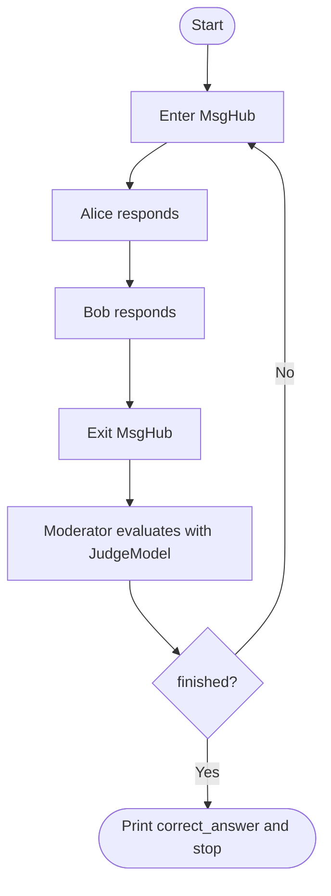
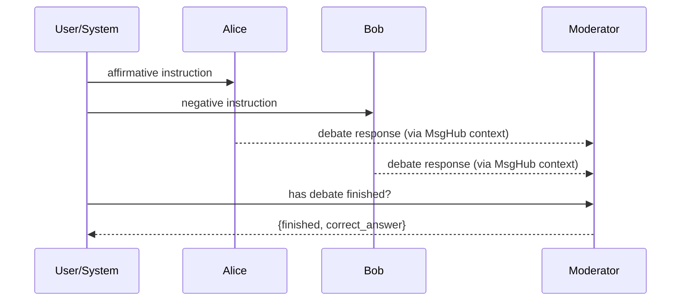

# `debate-agentscope.py` Code Walkthrough

This document explains `day-2/debate-agentscope.py`.

## What this script builds

An AgentScope-based multi-agent debate with:

- two solver/debater agents (`Alice`, `Bob`),
- one moderator/aggregator,
- shared round communication via `MsgHub`,
- structured moderator decision via Pydantic model.

## 1) Setup and topic

- Loads `.env`, reads `DASHSCOPE_KEY`.
- Uses `DashScopeChatModel(model_name="qwen-max")`.
- Defines debate `topic` (currently `one plus one is more than two`).

## 2) Debater creation helper

`create_solver_agent(name)` returns a `ReActAgent` configured with:

- debater persona prompt,
- `DashScopeChatModel`,
- `DashScopeMultiAgentFormatter` (important for multi-party message context).

Two instances are created:

- `alice`
- `bob`

## 3) Moderator agent

`moderator = ReActAgent(...)`:

- name: `Aggregator`
- receives both debaters’ outputs,
- decides if debate is finished and what the correct answer is.

Uses:

- same model (`qwen-max`)
- `DashScopeMultiAgentFormatter` to handle multi-agent message threads.

## 4) Structured moderator output

`JudgeModel` defines expected decision shape:

- `finished: bool`
- `correct_answer: str | None`

The moderator call uses:

- `structured_model=JudgeModel`

This makes moderator output machine-checkable.

## 5) Debate loop

`run_multiagent_debate()`:

1. enters infinite loop.
2. opens `MsgHub(participants=[alice, bob, moderator])`.
3. sends one message to Alice (affirmative side).
4. sends one message to Bob (negative side).
5. exits MsgHub block.
6. calls moderator separately (outside hub) to avoid broadcasting moderator response back.
7. if moderator says `finished`, prints final answer and breaks.

## Mermaid: runtime flow

## Mermaid: participant interaction

## Notes

- Current loop has no `max_rounds`; if moderator never sets `finished=True`, it can run indefinitely.
- `DashScopeChatFormatter` is imported but unused.
- The topic currently is a short statement; replace with richer problems for meaningful debate dynamics.
- Since completion relies entirely on moderator judgment, prompt quality strongly affects termination behavior.
