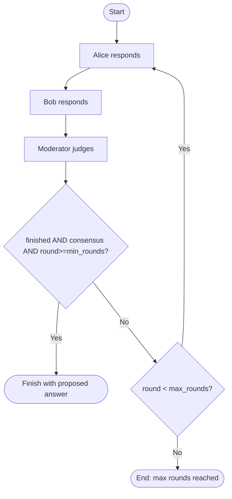
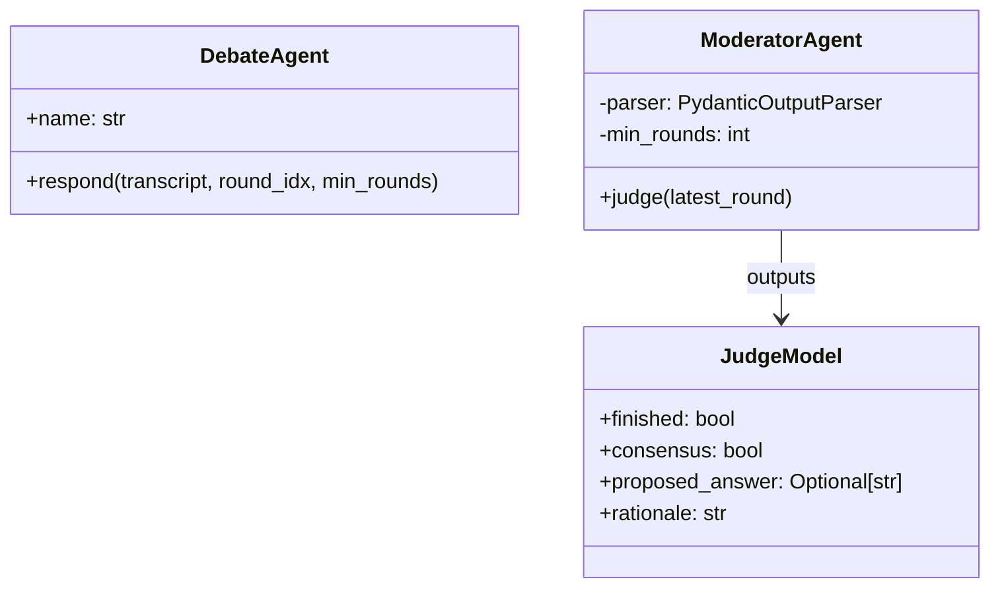

# `debate_latest.py` Code Walkthrough

This document explains `day-2/debate_latest.py`.

## What this script builds

An async, LangChain-based multi-agent debate loop with:

- two debaters (`Alice`, `Bob`),
- one moderator (`ModeratorAgent`) that returns structured JSON,
- round-based orchestration with finish gating (`min_rounds`, `max_rounds`).

## 1) Configuration and setup

- Loads `.env` and reads:
- `OPENAI_API_KEY`
- `OPENAI_MODEL` (default `gpt-4o-mini`)
- `OPENAI_TEMPERATURE` (default `0.4`)
- Defines a `topic` string for the debate prompt.

## 2) `DebateAgent`

`DebateAgent` wraps an LLM with a prompt template that includes:

- debater identity and side brief,
- debate topic,
- full transcript (via `MessagesPlaceholder`),
- current round instruction.

Important behaviors:

- asks for concise answers (6-10 sentences),
- discourages early finalization,
- allows tentative positions before minimum rounds.

Method:

- `respond(transcript, round_idx, min_rounds)` returns `AIMessage` tagged with agent name.

## 3) Moderator structured output

`JudgeModel` (Pydantic):

- `finished: bool`
- `consensus: bool`
- `proposed_answer: Optional[str]`
- `rationale: str`

`ModeratorAgent`:

- uses `temperature=0.0` for deterministic judging,
- enforces “do not finish early” policy in prompt,
- parses strict JSON using `PydanticOutputParser`.

Method:

- `judge(latest_round)` evaluates Alice/Bob messages and returns `JudgeModel`.

## 4) Debate orchestrator

`run_multiagent_debate(max_rounds=4, min_rounds=0)`:

1. creates Alice, Bob, Moderator.
2. loops per round.
3. gets Alice response, then Bob response, appending both to transcript.
4. moderator judges latest round.
5. computes:
   - `should_finish = judge.finished and judge.consensus and (round_idx >= min_rounds)`
6. exits early on consensus, or ends after max rounds.

## 5) Execution entrypoint

Runs with:

- `max_rounds=5`
- `min_rounds=0`

So consensus can happen from round 1 onward unless changed.

## Mermaid: high-level flow

## Mermaid: class interaction

## Notes

- `min_rounds=0` allows immediate finish; raise it (e.g., 2 or 3) to force deeper debate.
- Moderator prompt is advisory; hard gate in Python (`should_finish`) is the real enforcement.
- Transcript includes all prior turns, so later rounds can reference earlier arguments.
