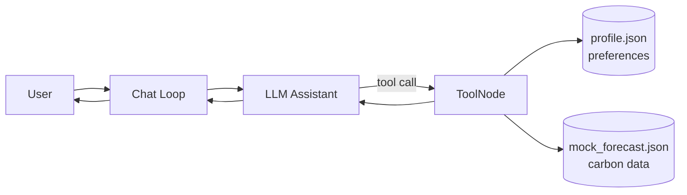
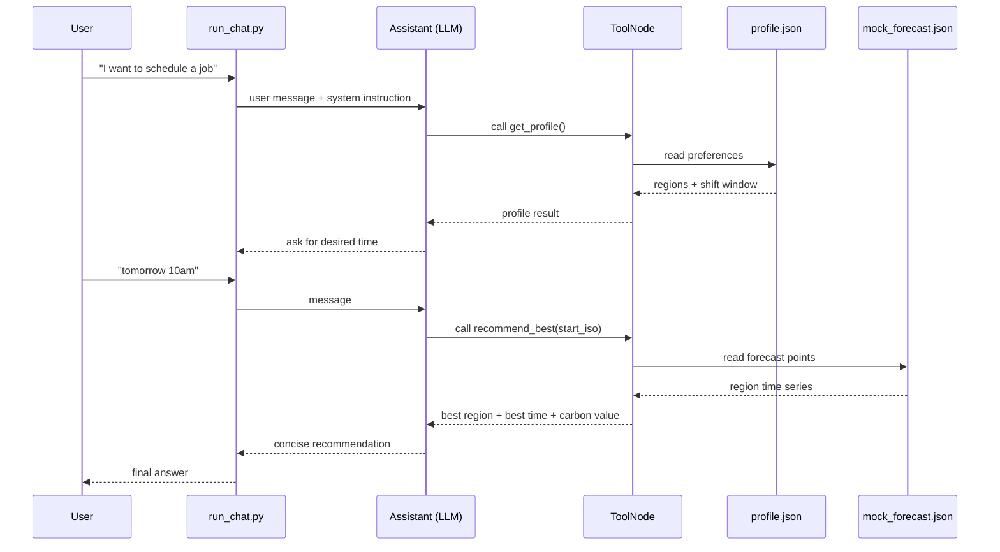
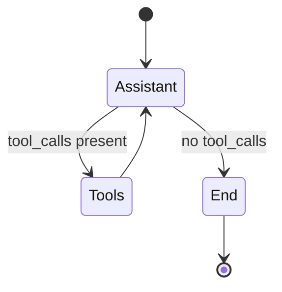
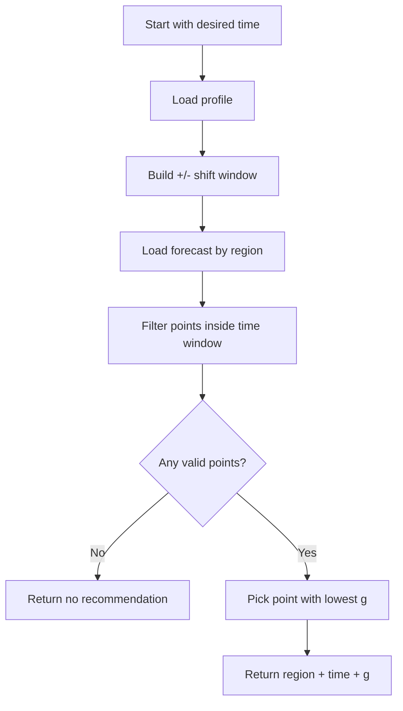
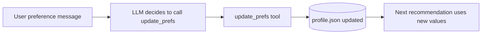

# Day 3 Exercise Explained (Simple Guide)

This Day 3 exercise teaches you how to build a **single AI agent** that helps schedule a job at a lower-carbon time.

In plain words:

- You tell the agent when you want to run a job.
- The agent checks your saved preferences (allowed regions and allowed time shift).
- The agent finds a better time within your allowed window.
- The agent returns the best region and start time with the lowest carbon intensity.

---

## 1) What Problem Are We Solving?

Cloud regions can have different carbon intensity at different times.

Goal:

- Keep your requested time mostly the same.
- Allow a small shift (for example, +/- 60 minutes).
- Pick the cleanest (lowest-carbon) option in that window.

---

## 2) Big Picture Architecture

What each part does:

- `run_chat.py`: runs the conversation loop.
- Assistant node: decides whether to answer directly or call tools.
- ToolNode: executes tools like `get_profile`, `update_prefs`, `recommend_best`.
- `memory/profile.json`: stores your preferences.
- `data/mock_forecast.json`: provides carbon forecast points.

---

## 3) End-to-End Conversation Flow

---

## 4) Graph Logic in the Agent

The LangGraph setup is simple:

- Start at assistant.
- If assistant requests tools, go to tools.
- After tools run, return to assistant.
- End when assistant has no more tool calls.

---

## 5) How Recommendation Works

The `recommend_best` tool does this:

1. Read `regions_allowed` and `allowed_shift_minutes`.
2. Build a time window around desired start.
3. Check forecast points in allowed regions.
4. Keep only points inside the window.
5. Choose the one with smallest `g` (carbon intensity).

---

## 6) Preference Memory (Why It Matters)

If you say:

- "I prefer regions SG, EU_WEST"
- "remember allowed shift 90 minutes"

The agent updates `profile.json`, so later recommendations follow your new preferences automatically.

---

## 7) Files You Should Focus On

- `day-3/carbon-aware-agent-workshop-local/carbon-aware-agent-workshop/solution/src/run_chat.py`
- `day-3/carbon-aware-agent-workshop-local/carbon-aware-agent-workshop/solution/src/tools.py`
- `day-3/carbon-aware-agent-workshop-local/carbon-aware-agent-workshop/solution/src/memory.py`
- `day-3/carbon-aware-agent-workshop-local/carbon-aware-agent-workshop/memory/profile.json`
- `day-3/carbon-aware-agent-workshop-local/carbon-aware-agent-workshop/data/mock_forecast.json`

---

## 8) Mental Model (One-Line Summary)

This is an **autonomous tool-using chat agent**: it understands your intent, reads/writes preference memory, checks forecast data, and returns a low-carbon schedule recommendation within your constraints.
